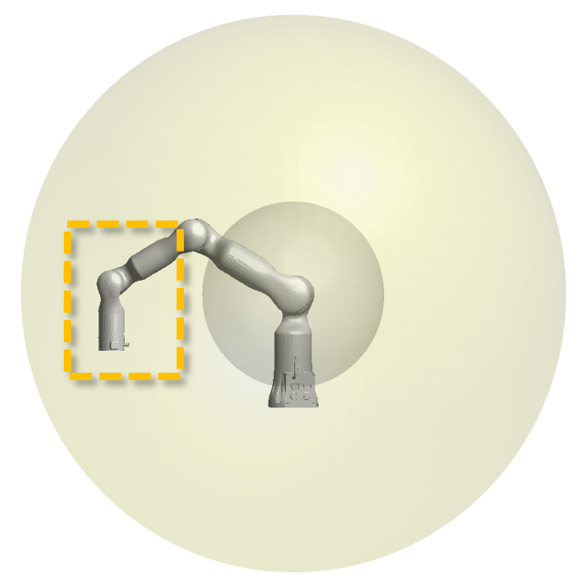
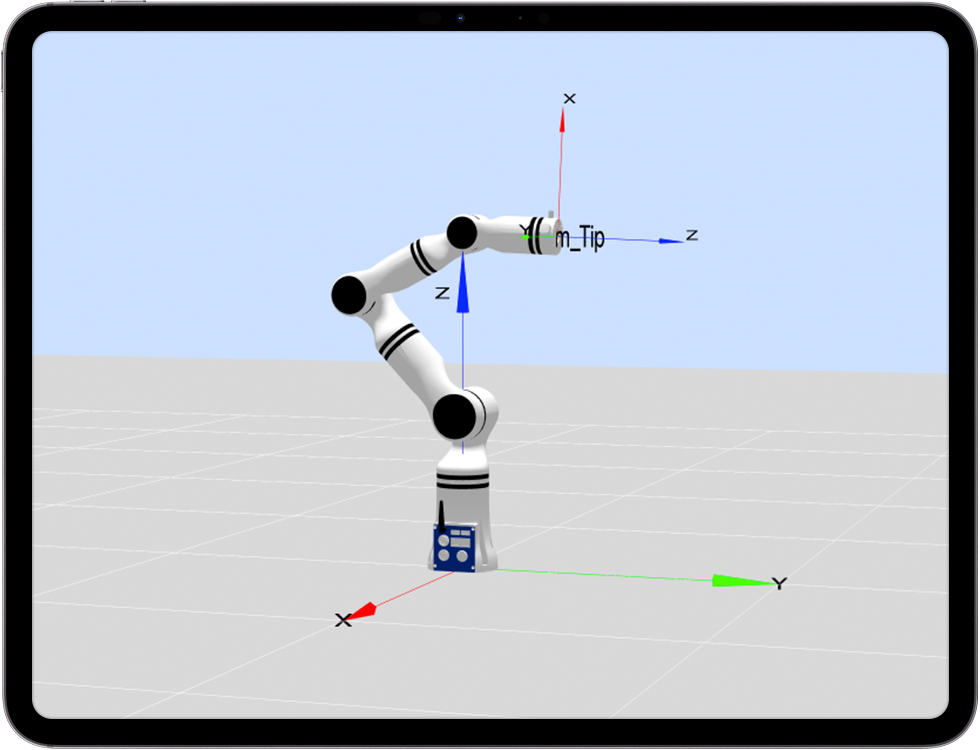
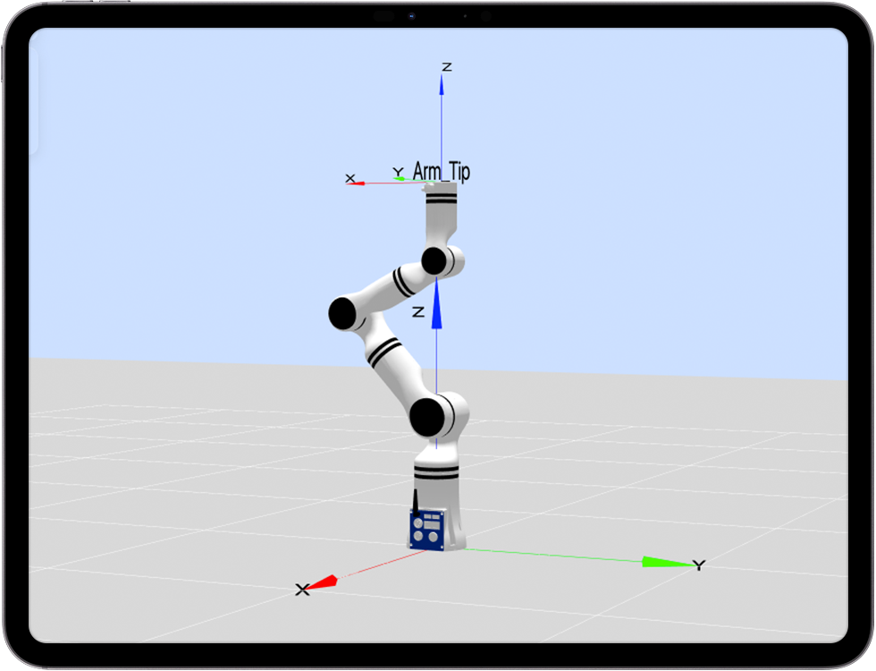
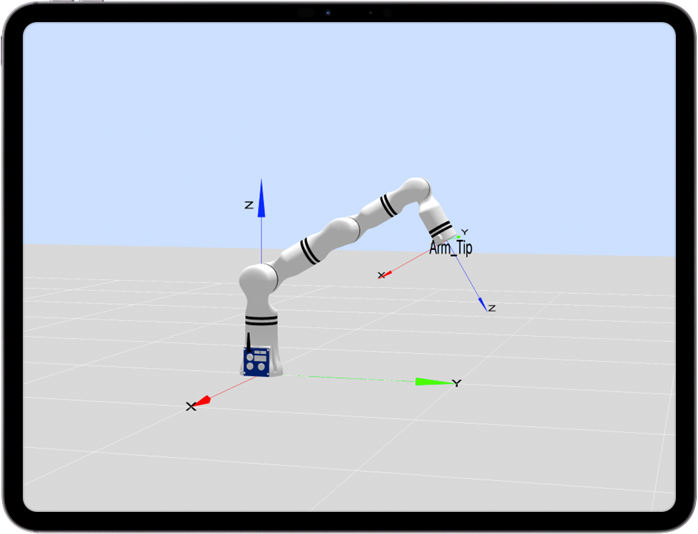
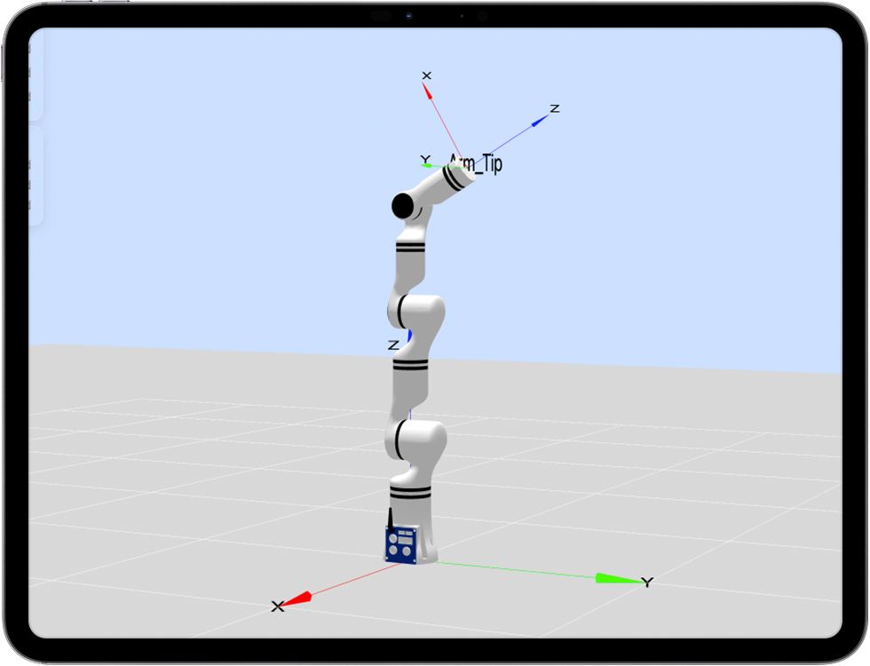
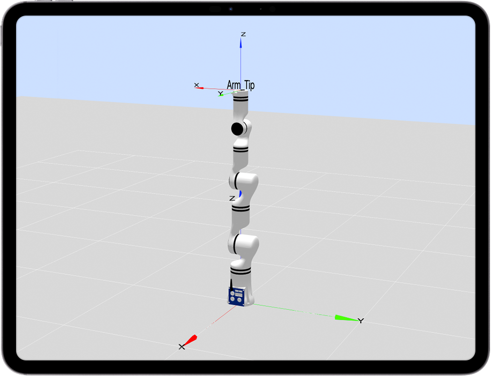
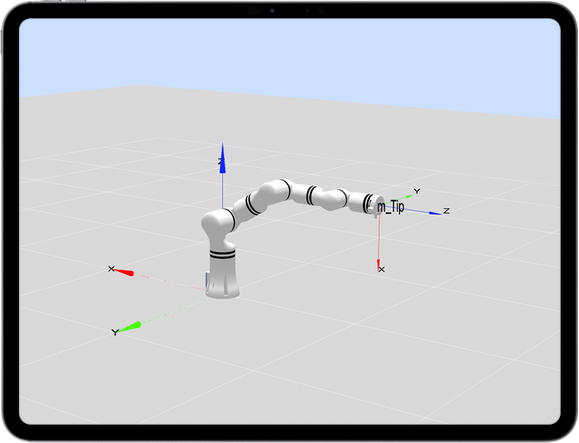
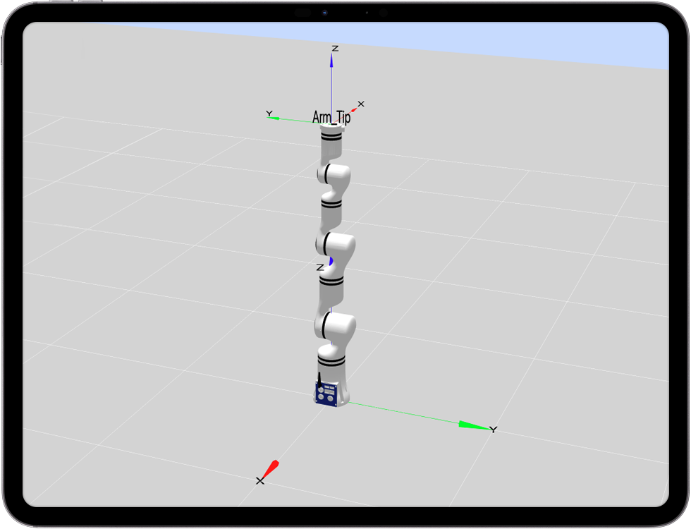
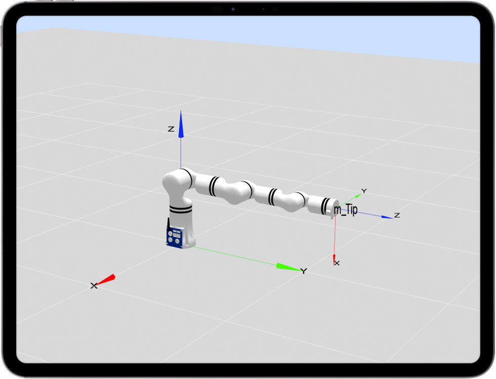
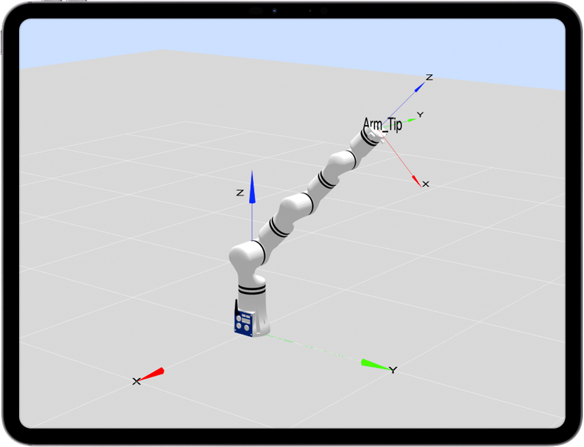

# 
本体参数：
RM65系列D-H模型及参数

**MDH模型坐标系：**

  

**RM65系列MDH参数(改进D-H参数)：**

|joint_id(i)|$a_{i-1}$(mm)|$\alpha_{i -1}$(°)|$d_i$(mm)|offset(°)|
|:--|:--|:--|:--|:--|
|   1   |   0   |   0   |  240.5|   0   |
|   2   |   0   |   90  |   0   |   90  |
|   3   |   256 |   0   |   0   |   90  |
|   4   |   0   |   90  |   210 |   0   |
|   5   |   0   |   -90 |   0   |   0   |
|   6   |   0   |   90  | $d_6$ |   0   |

- RM65-B &nbsp;: $d_6=144$ mm
- RM65-6F: $d_6=172.5$ mm

说明: offset为机械零位与建模零位的偏差, 即`模型角度 = 关节角度 + offset`.

## RM65系列连杆动力学参数

|   joint_id(i)   |  1     |  2     |  3     |  4     |  5     |  6     |  -     |
|:--   |:--     |:--     |:--     |:--     |:--     |:--     |:--     |
| **$m$**       | 1.51   | 1.653  | 0.726  | 0.671  | 0.647  | 0.107  | 0.248  |
| **$x$**       | 0.491  | 183.722 | 0.029  | 0.007  | 0.032  | -0.506 | -0.426 |
| **$y$**       | 7.803  | 0.103  | -90.105 | -9.486 | -83.769 | 0.255  | 0.237  |
| **$z$**       | -10.744 | -1.665 | 4.039  | -8.041 | 2.326  | -10.801 | -27.223 |
| **$L_{xx}$**  | 2928.466 | 1711.553 | 7259.884 | 794.014 | 5375.604 | 50.918 | 308.844 |
| **$L_{xy}$**  | -32.63 | -38.271 | 2.994  | -0.821 | 2.665  | -3.136 | -3.781 |
| **$L_{xz}$**  | -5.816 | 2314.91 | -0.314 | -0.655 | -0.304 | -0.699 | -1.468 |
| **$L_{yy}$**  | 2506.35 | 70514.722 | 371.872 | 596.235 | 285.265 | 47.42 | 304.616 |
| **$L_{yz}$**  | 47.925 | 6.507  | 44.451  | -34.785 | 14.235 | 0.388  | 0.888  |
| **$L_{zz}$**  | 1756.017 | 70036.186 | 7228.758 | 486.228 | 5359.769 | 60.35 | 122.62 |
| **备注**       |        |        |        |        |        | B      | 6F    |

说明:

- $m$为连杆质量, 单位为$kg$
- $x$为连杆质心x坐标, 单位为$mm$
- $y$为连杆质心y坐标, 单位为$mm$
- $z$为连杆质心z坐标, 单位为$mm$
- $L_{xx}$,$L_{xy}$,$L_{xz}$,$L_{yy}$,$L_{yz}$,$L_{zz}$ 为连杆坐标系下描述的主惯量, 单位为$kg·mm²$
- B: 标准版, 6F: 六维力版

备注:

- 以上数据来源为CAD设计值
- 如需质心坐标系下的惯性参数, 使用平行移轴定理即可, 计算方法如下所述.

---

假设有一输出坐标系为坐标系$\{i\}$，对齐坐标系$\{i\}$的质心坐标系为 $\{c\}$，质心在坐标系$\{i\}$中的坐标为 $P_c = [x_c  ，y_c， z_c]^T$，则由平行移轴定理可得：

$$I_c = L_i - m (P_{c}^{T}P_cI_{3×3} - P_cP_{c}^{T})$$

式中:
$$
L_i = \begin{bmatrix}L_{xx} & L_{xy} & L_{xz} \\ L_{xy} & L_{yy} & L_{yz} \\ L_{xz} & L_{yz} & L_{zz}\end{bmatrix}
$$

## 关节分布和尺寸说明

RM65机器人本体模仿人的手臂，共有6个旋转关节，每个关节表示1个自由度。如下图所示，机器人关节包括肩部（关节1），肩部（关节2），肘部（关节3），腕部（关节4），腕部（关节5）和腕部（关节6）。

### 工作空间

RM65-B运动范围，除去基座正上方和正下方的圆柱空间，工作范围为半径610mm的球体。选择机器人安装位置时，务必考虑机器人正上方和正下方的圆柱体空间，尽可能避免将工具移向圆柱体空间。另外，在实际应用中，关节1转动范围：±178°，关节2转动范围：±130°，关节3转动范围：±135°，关节4转动范围：±178°，关节5转动范围：±128°，关节6转动范围：±360°。

机器人可达空间示意图

从工作空间截面上看，6轴机器人可操作度较好的区域如下图黄色框线示意，在工作空间中整体呈现一个环状区域。

可操作度较好的区域示意图

### 运动奇异点

#### 肩部奇异

腕部中心点C(关节5、6轴线交点)与1轴共线，示意点位[0, 43.4 -105.7,0,-30,0]，如图下图所示：

肩部奇异

关节1、6共轴，C与1轴共线的特殊情况，示意点位[0, 43.4 -105.7,0,62.3,0]，如图下图所示：

肩部奇异

#### 肘部奇异

q3=0，即点位格式为[x,x,0,x,x,x]，示意点位[-90,60,0,0,90,0]，如图下图所示：

肘部奇异

关节1、4共轴，q3=0的特殊情况，即点位格式为[x,0,0,x,x,x]，示意点位[0,0,0,90,-60,0]，如图下图所示：

**肘部奇异**  

关节1、4、6共轴，q3=0的特殊情况，即点位格式为[x,0,0,x,0,x]，示意点位[0,0,0,90,0,0]，如图下图所示：

肘部奇异

#### 腕部奇异

关节4、6共轴,q5=0,即点位格式为[x,x,x,x,0,x]，示意点位[0,60,30,0,0,0]，如图下图所示：

腕部奇异

#### 边界奇异

机械臂末端到达最远端，q3=0的特殊情况,即点位格式为[x,x,0,x,0,x]。示意点位[0,0,0,0,0,0]、[-90,90,0,0,0,0]、[-90,45,0,0,0,0]如下图所示：

边界奇异1

边界奇异2

边界奇异3

#### 负载曲线图

两张图分别表示RM65-B、RM65-6F机械臂末端负载曲线图。其中L是末端负载的质心相对于末端法兰平面的径向距离，Z是相对于末端法兰平面的法向距离。

RM65-B机械臂末端负载曲线图

RM65-6F机械臂末端负载曲线图

