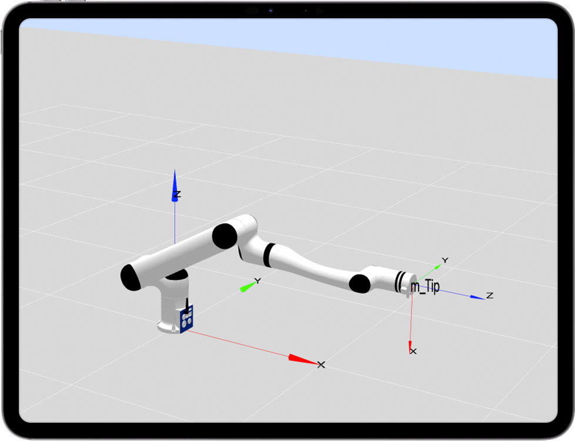
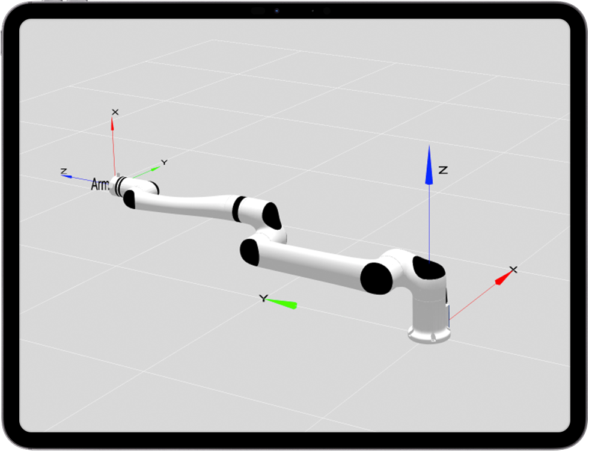

# 
本体参数：
RML63系列D-H模型及参数

**MDH模型坐标系：**

  

**RML63系列MDH参数(改进D-H参数)：**

|关节编号(i)|$a_{i-1}$(mm)|$\alpha_{i -1}$(°)|$d_i$(mm)|offset(°)|
|:--|:--|:--|:--|:--|
|   1   |   0     |   0    |  172  |  0   |
|   2   |   -86   |   -90  |   0   |  -90 |
|   3   |   380   |   0    |   0   |  90  |
|   4   |   69    |   90   |   405 |  0   |
|   5   |   0     |   -90  |   0   |  180 |
|   6   |   0     |   -90  | $d_6$ |  180 |

- RML63-B &nbsp;: $d_6=115$ mm
- RML63-6F: $d_6=143.5$ mm

说明: offset为机械零位与建模零位的偏差, 即`模型角度 = 关节角度 + offset`.

## RML63系列连杆动力学参数

|   joint_id(i)     |  1      |  2      |  3      |  4       |  5      |  6      |  -      |
|:--        |:--      |:--      |:--      |:--       |:--      |:--      |:--      |
| **$m$**       | 1.837   | 2.006   | 1.961   | 1.201    | 1.026   | 0.107   | 0.248   |
| **$x$**       | -68.442 | 166.7   | 33.399  | 0        | -0.031  | -0.506  | -0.426  |
| **$y$**       | -23.913 | -0.002  | -29.498 | -35.177  | 30.146  | 0.255   | 0.237   |
| **$z$**       | -6.938  | -92.59  | -17.697 | -184.4   | -12.341 | -10.801 | -27.223 |
| **$L_{xx}$**  | 3462.129 | 18664.833 | 6432.819 | 53007.563 | 2732.466 | 50.918 | 308.844 |
| **$L_{xy}$**  | -3765.305 | -0.587  | 3869.875 | -0.04    | -2.123  | -3.136  | -3.781  |
| **$L_{xz}$**  | -46.206  | 30804.14 | 17.607  | 0.087    | 0.374   | -0.699  | -1.468  |
| **$L_{yy}$**  | 12643.164 | 103568.483 | 7094.216 | 50754.293 | 829.793 | 47.42 | 304.616 |
| **$L_{yz}$**  | -50.044  | -0.287  | -17.611 | -5089.754 | -2.288  | 0.388   | 0.888   |
| **$L_{zz}$**  | 13576.758 | 86722.559 | 9257.063 | 2874.631 | 2384.323 | 60.35  | 122.62  |
| **备注**       |         |         |         |         |         | B       | 6F      |

说明:

- $m$为连杆质量, 单位为$kg$
- $x$为连杆质心x坐标, 单位为$mm$
- $y$为连杆质心y坐标, 单位为$mm$
- $z$为连杆质心z坐标, 单位为$mm$
- $L_{xx}$,$L_{xy}$,$L_{xz}$,$L_{yy}$,$L_{yz}$,$L_{zz}$ 为连杆坐标系下描述的主惯量, 单位为$kg·mm²$
- B: 标准版, 6F: 六维力版

备注:

- 以上数据来源为CAD设计值
- 如需质心坐标系下的惯性参数, 使用平行移轴定理即可, 计算方法如下所述.

---

假设有一输出坐标系为坐标系$\{i\}$，对齐坐标系$\{i\}$的质心坐标系为 $\{c\}$，质心在坐标系$\{i\}$中的坐标为 $P_c = [x_c  ，y_c， z_c]^T$，则由平行移轴定理可得：

$$I_c = L_i - m (P_{c}^{T}P_cI_{3×3} - P_cP_{c}^{T})$$

式中:
$$
L_i = \begin{bmatrix}L_{xx} & L_{xy} & L_{xz} \\ L_{xy} & L_{yy} & L_{yz} \\ L_{xz} & L_{yz} & L_{zz}\end{bmatrix}
$$

## 关节分布和尺寸说明

RML63机器人本体模仿人的手臂，共有6个旋转关节，每个关节表示1个自由度。如图5-47所示，机器人关节包括肩部（关节1），肩部（关节2），肘部（关节3），腕部（关节4），腕部（关节5）和腕部（关节6）。

### 工作空间

RML63-B运动范围，除去基座正上方和正下方的圆柱空间，工作范围为半径900mm的球体。选择机器人安装位置时，务必考虑机器人正上方和正下方的圆柱体空间，尽可能避免将工具移向圆柱体空间。另外，在实际应用中，关节1转动范围：±178°，关节2转动范围：±178°，关节3转动范围：-178°~+145°，关节4转动范围：±178°，关节5转动范围：±178°，关节6转动范围：±360°。

机器人可达空间示意图

### 运动奇异点

#### 腕部奇异

关节4、6共轴,q5=0,即点位格式为[x,x,x,x,0,x]，示意点位[0,60,30,0,0,0]，如图下图所示：

腕部奇异

#### 边界奇异

机械臂末端到达最远端，q3=0的特殊情况,即点位格式为[x,x,0,x,0,x]。示意点位[0,0,0,0,0,0]、[-90,-45,0,0,0,0]、[-90,-90,0,0,0,0]，如下图所示：

边界奇异1

边界奇异2

边界奇异3

#### 负载曲线图

表示RML63-B、RML63-6F机械臂末端负载曲线图

RML63-B机械臂末端负载曲线图

RML63-6F机械臂末端负载曲线图

