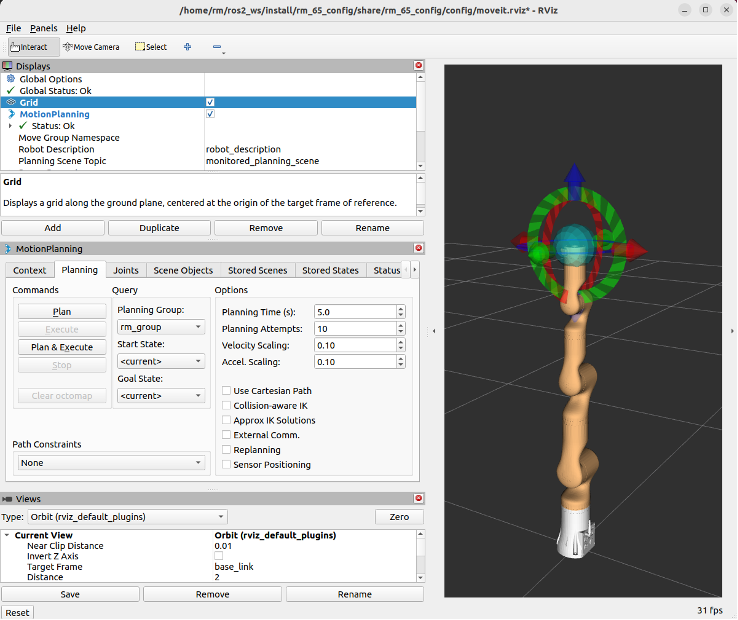

# <p class="hidden">ROS：</p>rm_bringup功能包

rm_bringup功能包为实现多个launch文件同时运行所设计的功能包，使用该功能包可用一条命令实现多个节点结合的复杂功能的启动。

1. 功能包使用。
2. 功能包架构说明。
3. 功能包话题说明。

通过这三部分内容的介绍可以帮助大家：

1. 了解该功能包的使用。
2. 熟悉功能包中的文件构成及作用。
3. 悉功能包相关的话题，方便开发和使用

代码链接：[https://github.com/RealManRobot/rm\_robot/tree/main/rm\_bringup](https://github.com/RealManRobot/rm_robot/tree/main/rm_bringup)

## 1.rm_bringup功能包使用

### 1.1 moveit控制真实机械臂

首先配置好环境完成连接后我们可以通过以下命令直接启动节点，运行 rm_bringup 功能包中的 launch 文件。

```ros
roslaunch rm_bringup rm_<arm_type>_robot.launch
```

在实际使用时需要将以上的`<arm_type>`更换为实际的机械臂型号，可选择的机械臂型号有65、63、eco65、75、65_6f、63_6f、eco65_6f、75_6f、gen72。

例如65机械臂的启动命令：

首先需要运行rm_control节点。

```ros
roslaunch rm_control rm_65_control.launch
```

之后需要运行bringup节点。

```ros
roslaunch rm_bringup rm_65_robot.launch
```

节点启动成功后，将弹出以下画面。



实际该launch文件启动的为moveit控制真实机械臂的功能下面就可以使用控制球规划控制机械臂运动，详细可查看《rm_moveit_config详解》相关内容。

## 3.rm_bringup功能包架构说明

### 3.1功能包文件总览

当前rm_bringup功能包的文件构成如下。

```
├── CMakeLists.txt  # 编译规则文件
├── launch
│   ├── rm_63_6f_robot.launch        # 63臂六维力启动文件
│   ├── rm_63_robot.launch           # 63臂 moveit 启动文件
│   ├── rm_65_6f_robot.launch        # 65臂六维力启动文件
│   ├── rm_65_robot.launch           # 65臂 moveit 启动文件
│   ├── rm_75_6f_robot.launch        # 75臂六维力启动文件
│   ├── rm_75_robot.launch           # 75臂 moveit 启动文件
│   ├── rm_eco65_6f_robot.launch     # ECO65臂六维力启动文件
│   ├── rm_eco65_robot.launch        # ECO65臂 moveit 启动文件
│   └── rm_gen72_robot.launch        # GEN72臂 moveit 启动文件
└── package.xml
```

## 4.rm_bringup话题说明

该功能包当前并没有本身的话题，主要为调用其他功能包的话题实现，关于moveit相关话题可查看[rm_moveit_config详解](/docs/robot/ros/moveitConfig/index.md)相关内容。
