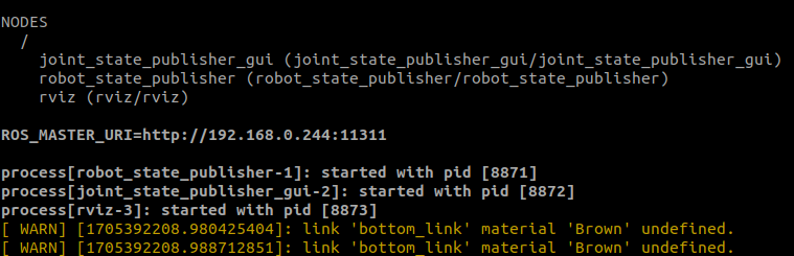
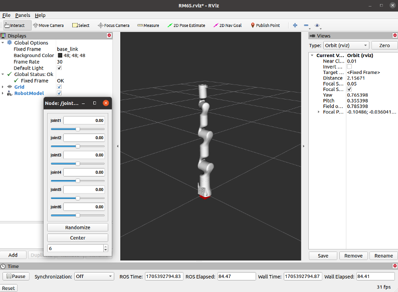
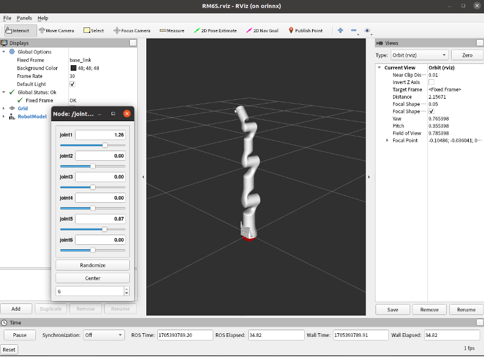

# <p class="hidden">ROS：</p>rm_description功能包说明

rm_description功能包为显示机器人模型和TF变换的功能包，通过该功能包，我们可以实现电脑中的虚拟机械臂与现实中的实际机械臂的联动的效果，在之后的moveit2的控制中我们也需要该功能包的支持。

1. 功能包使用。
2. 功能包架构说明。
3. 功能包话题说明。

通过这三部分内容的介绍可以帮助大家：

1. 了解该功能包的使用。
2. 熟悉功能包中的文件构成及作用。
3. 熟悉功能包相关的话题，方便开发和使用

代码链接：[https://github.com/RealManRobot/rm/robot/tree/main/rm/description](https://github.com/RealManRobot/rm_robot/tree/main/rm_description)

## 1.rm_description功能包使用

首先配置好环境完成连接后我们可以通过以下命令直接启动节点，运行rm_description功能包。

```ros
rm@rm-desktop:~$ roslaunch rm_description rm_<arm_type>_display.launch
```

在实际使用时需要将以上的`<arm_type>`更换为实际的机械臂型号，可选择的机械臂型号有65、63、eco65、75、gen72。

例如65机械臂的启动命令：

```ros
rm@rm-desktop:~$ roslaunch rm_description rm_65_display.launch
```

节点启动成功后，将显示以下画面。



启动成功后我们就可以在rviz中，查看机械臂状态了。



我们也可以通过拖动左边的滑块的方式控制机械臂运动。



## 2.rm_description功能包架构说明

### 2.1功能包文件总览

当前m_description功能包的文件构成如下。

```ros
├── CMakeLists.txt                               #编译规则文件
├── config                                       #配置文件主要是 RVIZ 显示配置
│ ├── ECO65.rviz
│ ├── GEN72.rviz
│ ├── joint_names_rm_65_description.yaml
│ ├── RM65.rviz
│ ├── RM75.rviz
│ └── RML63.rviz
├── launch                                       #加载 URDF、XACRO 显示文件
│ ├── ECO65
│ │ ├── rm_eco65_6f_display.launch
│ │ ├── rm_eco65_display.launch                  #ECO65 显示加载启动节点
│ │ ├── rm_eco65_display_xacro.launch
│ │ └── rm_eco65_gazebo.launch
│ ├── GEN72
│ │ ├──rm_gen72_gazebo.launch
│ │ ├── rm_gen72_display.launch                  #GEN72 显示加载启动节点
│ │ └── rm_gen72_display_xacro.launch
│ ├── RM65
│ │ ├── rm_65_6f_display.launch
│ │ ├── rm_65_display.launch                     #RM65 显示加载启动节点
│ │ ├── rm_65_display_y_90.launch
│ │ └── rm_65_gazebo.launch
│ ├── RM75
│ │ ├── rm_75_6f_display.launch
│ │ ├── rm_75_display.launch                     #RM75 显示加载启动节点
│ │ └── rm_75_display_urdf.launch
│ └── RML63
│ ├── display_rml63_bottom.launch
│ ├── rm_63_6f_display.launch
│ ├── rm_63_display.launch                       #RML63 显示加载启动节点
│ └── rm_63_gazebo.launch
├── meshes                                       #机械臂模型放置位置
│ ├── ECO65
│ │ ├── baselink.STL
│ │ ├── Link1.STL
│ │ ├── Link2.STL
│ │ ├── Link3.STL
│ │ ├── Link4.STL
│ │ ├── Link5.STL
│ │ └── Link6.STL
│ ├── ECO65_6F
│ │ ├── base_link.STL
│ │ ├── Link1.STL
│ │ ├── Link2.STL
│ │ ├── Link3.STL
│ │ ├── Link4.STL
│ │ ├── Link5.STL
│ │ └── Link6.STL
│ ├── GEN72
│ │ ├── base_link.STL
│ │ ├── Link1.STL
│ │ ├── Link2.STL
│ │ ├── Link3.STL
│ │ ├── Link4.STL
│ │ ├── Link5.STL
│ │ ├── Link6.STL
│ │ └── Link7.STL
│ ├── RM65
│ │ ├── base_link.STL
│ │ ├── link1.STL
│ │ ├── link2.STL
│ │ ├── link3.STL
│ │ ├── link4.STL
│ │ ├── link5.STL
│ │ └── link6.STL
│ ├── RM65_6F
│ │ ├── base_link.STL
│ │ ├── Link1.STL
│ │ ├── Link2.STL
│ │ ├── Link3.STL
│ │ ├── Link4.STL
│ │ ├── Link5.STL
│ │ └── Link6.STL
│ ├── RM75
│ │ ├── base_link.STL
│ │ ├── link1.STL
│ │ ├── link2.STL
│ │ ├── link3.STL
│ │ ├── link4.STL
│ │ ├── link5.STL
│ │ ├── link6.STL
│ │ └── link7.STL
│ ├── RM75_6F
│ │ ├── base_link.STL
│ │ ├── Link1.STL
│ │ ├── Link2.STL
│ │ ├── Link3.STL
│ │ ├── Link4.STL
│ │ ├── Link5.STL
│ │ ├── Link6.STL
│ │ └── Link7.STL
│ ├── RML63
│ │ ├── base_link.STL
│ │ ├── link1.STL
│ │ ├── link2.STL
│ │ ├── link3.STL
│ │ ├── link4.STL
│ │ ├── link5.STL
│ │ └── link6.STL
│ └── RML63_6F
│ ├── base_link.STL
│ ├── Link1.STL
│ ├── Link2.STL
│ ├── Link3.STL
│ ├── Link4.STL
│ ├── Link5.STL
│ └── Link6.STL
├── package.xml
└── urdf                                             #机械臂 URDF、XACRO 模型描述文件放置位置
├── ECO65
│ ├── eco65.csv
│ ├── eco65.urdf
│ ├── rm_eco65.gazebo.xacro
│ ├── rm_eco65.transmission.xacro
│ └── rm_eco65.urdf.xacro
├── ECO65_6F
│ ├── eco65.csv
│ ├── eco65.urdf
│ ├── rm_eco65_6f_description.urdf
│ └── rm_eco65_6f_description.urdf.xacro
├── GEN72
│ ├── GEN72.csv
│ ├── GEN72.urdf
│ ├── rm_gen72.gazebo.xacro
│ ├── rm_gen72.transmission.xacro
│ └── rm_gen72.urdf.xacro
├── RM65
│ ├── rm_65_description.csv
│ ├── rm_65.gazebo.xacro
│ ├── rm_65.transmission.xacro
│ ├── rm_65.urdf
│ ├── rm_65.urdf.xacro
│ ├── rm_65.urdf（复件）.xacro
│ └── rm_65_y_90.urdf.xacro
├── RM65_6F
│ ├── rm_65_6f_description.csv
│ ├── rm_65_6f_description.urdf
│ └── rm_65_6f_description.urdf.xacro
├── RM75
│ ├── rm_75_bottom.urdf.xacro
│ ├── rm_75_description.csv
│ ├── rm_75.gazebo.xacro
│ ├── rm_75.transmission.xacro
│ └── rm_75.urdf
├── RM75_6F
│ ├── rm_75_6f_description.csv
│ ├── rm_75_6f_description.urdf
│ └── rm_75_6f_description.urdf.xacro
├── RML63
│ ├── rml_63_bottom.urdf.xacro
│ ├── rml_63_description.csv
│ ├── rml_63_description.urdf
│ ├── rml_63.gazebo.xacro
│ └── rml_63.transmission.xacro
└── RML63_6F
├── rm_63_6f_description.csv
├── rm_63_6f_description.urdf
└── rm_63_6f_descriptio.urdf.xacro
```

## 3. rm_description话题说明

如下为该功能包的话题说明。

```ros
    /clicked_point
    /initialpose
    /joint_states
    /move_base_simple/goal
    /rosout
    /rosout_agg
    /tf
    /tf_static
```

我们主要关注以下几个话题。

/joint_states:代表其订阅的话题，其中的/joint_states代表机械臂当前的状态，我们的rm_driver功能包运行时会发布该话题，这样rviz中的模型就会根据实际的机械臂状态进行运动。在运行rm_<arm_type>_display.launch时我们实际上发布了一个模拟的/joint_states话题，以供robot_state_publisher进行订阅。

Publishers: 代表其当前发布的话题，其最主要发布的话题为/tf和/tf_static，这两个话题描述了机械臂关节与关节之间的坐标变换关系，也就是TF变换。

剩余话题和服务使用场景较少，大家可自行了解。
