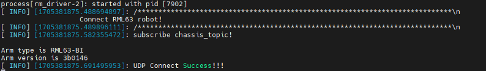
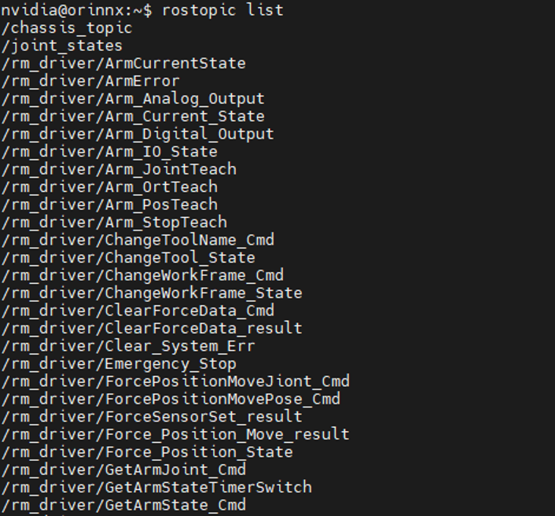
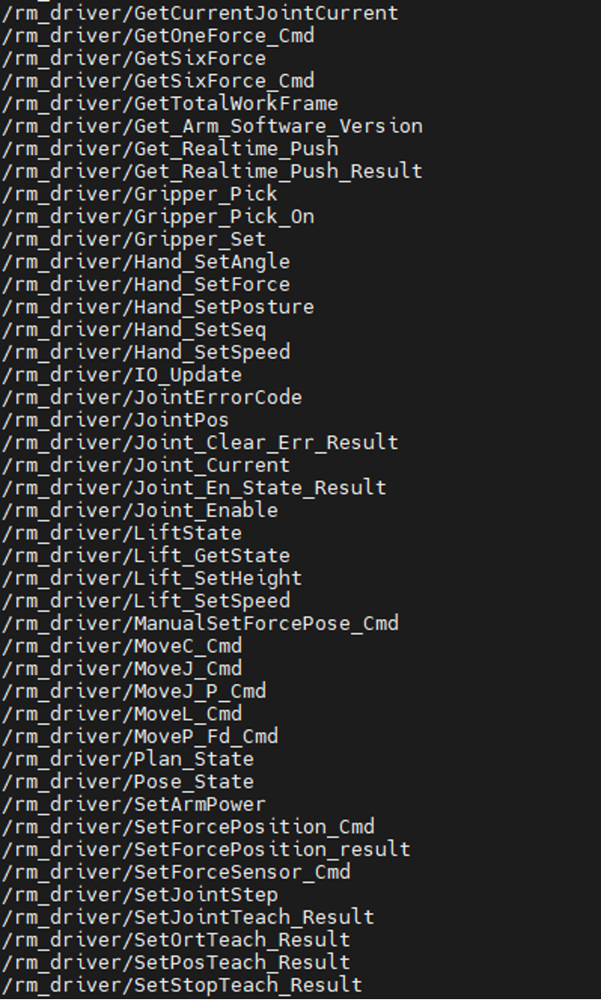
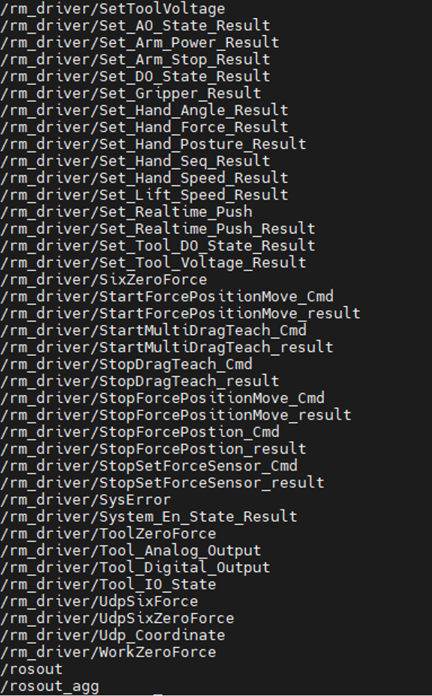

# <p class="hidden">ROS：</p>rm_driver功能包说明

rm_driver功能包在机械臂ROS功能包中是十分重要的，该功能包实现了通过ROS与机械臂进行通信控制机械臂的功能，在下文中将通过以下几个方面详细介绍该功能包。

- 功能包使用。
- 功能包架构说明。
- 功能包话题说明。

通过这三部分内容的介绍可以帮助大家：

- 了解该功能包的使用。
- 熟悉功能包中的文件构成及作用。
- 熟悉功能包相关的话题，方便开发和使用。

Github代码链接：[https://github.com/RealManRobot/rm_robot/tree/main/rm_driver](https://github.com/RealManRobot/rm_robot/tree/main/rm_driver)

## 1.rm_driver功能包使用

### 1.1 功能包基础使用

首先配置好环境完成连接后我们可以通过以下命令直接启动节点，控制机械臂。

当前的控制基于我们没有改变过机械臂的IP即当前机械臂的IP仍为192.168.1.18。

    rm@rm-desktop:~$ roslaunch rm_driver rm_<arm_type>_driver.launch

在实际使用时需要将以上的`<arm_type>`更换为实际的机械臂型号，可选择的机械臂型号有65、63、eco65、75、gen72。

底层驱动启动成功后，将显示以下画面。



其配置文件内容如下：

```
    <launch>
        <!-- 标签 -->
        <arg name="Arm_IP"  default="192.168.1.18"/>  <!-- 设置TCP连接时的IP -->
        <arg name="Arm_Port" default="8080"/>         <!-- 设置TCP连接时的端口 -->
        <arg name="Arm_Dof"  default="6"/>            <!-- 机械臂自由度设置 -->
        <arg name="Arm_Type" default="RML63"/>       <!-- 机械臂型号设置 -->
        <arg name="Follow" default="false"/>           <!-- 高低跟随设置 false：低跟随 true：高跟随 -->
        <arg name="Udp_IP" default="192.168.1.10"/>    <!-- 设置udp主动上报IP -->
        <arg name="Udp_Port" default="8089"/>         <!-- 设置udp主动上报端口 -->
        <arg name="Udp_cycle" default="5"/>           <!-- 设置udp主动上报周期（ms） 最低为5(200Hz)，需要为5的倍数 -->
        <arg name="Udp_force_coordinate" default="0"/>  <!-- 设置六维力参考坐标系 -->
        
        <!-- 启动机械臂底层驱动节点 -->
        <node name="rm_driver" pkg="rm_driver" type="rm_driver" output="screen" respawn="false">
            <!-- 机器人坐标frame -->
            <param name="Arm_IP"                value="$(arg Arm_IP)"/> 
            <param name="Arm_Port"              value="$(arg Arm_Port)"/>   
            <param name="Arm_Dof"               value="$(arg Arm_Dof)"/>   
            <param name="Arm_Type"              value="$(arg Arm_Type)"/> 
            <param name="Follow"                value="$(arg Follow)"/>  
            <param name="Udp_IP"                value="$(arg Udp_IP)"/>   
            <param name="Udp_Port"              value="$(arg Udp_Port)"/>  
            <param name="Udp_cycle"             value="$(arg Udp_cycle)"/>  
            <param name="Udp_force_coordinate"  value="$(arg Udp_force_coordinate)"/>  
        </node>
    </launch>
```

其中主要有以下几个参数。

Arm_IP：改参数代表机械臂当前的IP
Arm_Port：设置TCP连接时的端口。
Arm_Type：该参数代表机械臂当前的型号，可以选择的参数有RM_65（65系列）、RM_eco65（ECO65系列）、RM_63（63系列）、RM_75（75系列）。
Arm_Dof: 机械臂自由度设置。6为6自由度，7为7自由度。
Follow：透传跟随效果参数。false：低跟随，true：高跟随。
Udp_IP: 设置udp主动上报目标IP。
Udp_cycle：udp主动上报周期，需要是5的倍数，最低为5ms(200Hz)。
Udp_Port：设置udp主动上报端口。
Udp_force_coordinate：设置系统受力时六维力的基准坐标，0为传感器坐标系（原始数据） 1为当前工作坐标系 2为当前工具坐标系。

再实际使用时，我们选择对应的launch文件启动时会自动选择正确的型号，若有特殊要求可在此处进行相应的参数修改，修改之后需要重新启动该节点，之后修改的配置才会生效。

## 2.rm_driver功能包架构说明

### 2.1 功能包文件总览

当前rm_driver功能包的文件构成如下。

```
    ├── CMakeLists.txt                #编译规则文件
    ├── launch                       #节点启动+参数配置文件
    │   ├── rm_63_driver.launch          #RML63启动文件
    │   ├── rm_65_driver.launch          #RM65启动文件
    │   ├── rm_75_driver.launch         #RM75启动文件
    │   └── rm_eco65_driver.launch      #ECO65启动文件
    ├── package.xml                 #依赖声明文件
    └── src
        ├── cJSON.c                   #JSON协议文件
        ├── cJSON.h                   #JSON协议头文件
        ├── rm_driver.cpp               #rm_driver节点源文件
        └── rm_robot.h                 #rm_driver节点头文件
```

## 3.rm_driver话题说明

rm_driver的话题较多，可以通过如下指令了解其话题信息。






