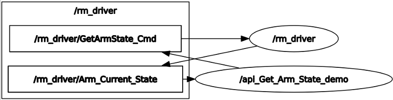

# <p class="hidden">ROS：</p>rm_example功能包说明

rm_bringup功能包为实现了一些基本的机械臂功能，通过该功能包我们可以实现机械臂的一些基本的控制功能，还可以参考代码，实现其他的机械臂功能，在下文中将通过以下几个方面详细介绍该功能包。

1. 功能包使用。
2. 功能包架构说明。
3. 功能包话题说明。

通过这三部分内容的介绍可以帮助大家：

1. 了解该功能包的使用。
2. 熟悉功能包中的文件构成及作用。
3. 熟悉功能包相关的话题，方便开发和使用

代码链接：[https://github.com/RealManRobot/rm_robot/tree/main/rm_demo](https://github.com/RealManRobot/rm_robot/tree/main/rm_demo)

## 1.rm_example功能包使用

### 1.1 更换工作坐标系

首先需要运行机械臂的底层驱动节点rm_driver。

```
roslaunch rm_driver rm_<arm_type>_driver.launch
```

在实际使用时需要将以上的`<arm_type>`更换为实际的机械臂型号，可选择的机械臂型号有65、63、eco65、75、gen72。

例如65机械臂的启动命令：

```
roslaunch rm_driver rm_65_driver.launch
```

节点启动成功后，需要执行如下指令运行我们更换工作坐标系的节点。

```
rosrun rm_demo api_ChangeWorkFrame_demo
```

弹出以下指令代表更换成功。


### 1.2 更换工具坐标系

首先需要运行机械臂的底层驱动节点rm_driver。

```
roslaunch rm_driver rm_<arm_type>_driver.launch
```

在实际使用时需要将以上的<arm_type>更换为实际的机械臂型号，可选择的机械臂型号有65，63，eco65，75，gen72。

例如65机械臂的启动命令：

```
roslaunch rm_driver rm_65_driver.launch
```

节点启动成功后，需要执行如下指令运行我们更换工作坐标系的节点。

```
rosrun rm_demo api_ChangeToolName_demo
```

弹出以下指令代表更换成功。


### 1.3 得到当前的机械臂状态信息

首先需要运行机械臂的底层驱动节点rm_driver。

```
roslaunch rm_driver rm_<arm_type>_driver.launch
```

在实际使用时需要将以上的<arm_type>更换为实际的机械臂型号，可选择的机械臂型号有65，63，eco65，75，gen72。

例如65机械臂的启动命令：

```
roslaunch rm_driver rm_65_driver.launch
```

节点启动成功后，需要执行如下指令运行获得机械臂当前状态的节点。

```
rosrun rm_demo api_Get_Arm_State_demo
```

弹出以下指令代表获取成功。


界面中现实的为机械臂当前的角度信息，以及机械臂当前的末端坐标位置和欧拉角姿态信息。

### 1.4 机械臂MoveJ运动

通过如下指令可以控制机械臂进行MoveJ关节运动。

首先需要运行机械臂的底层驱动节点rm_driver。

```
roslaunch rm_driver rm_<arm_type>_driver.launch
```

在实际使用时需要将以上的<arm_type>更换为实际的机械臂型号，可选择的机械臂型号有65，63，eco65，75，gen72。

例如65机械臂的启动命令：

```
roslaunch rm_driver rm_65_driver.launch
```

节点启动成功后，需要执行如下指令控制机械臂进行运动。

```
rosrun rm_demo api_moveJ_demo _Arm_Dof:=6
```

命令中的_Arm_Dof代表机械当前的自由度信息，可以选的参数有6和7

例如启动7轴的机械臂时需要使用如下指令。

```
rosrun rm_demo api_moveJ_demo _Arm_Dof:=7
```

运行成功后，机械臂的关节将发生转动，且界面将显示如下信息。


### 1.5 机械臂MoveJ_P运动

通过如下指令可以控制机械臂进行MoveJ_P关节运动。

首先需要运行机械臂的底层驱动节点rm_driver。

```
roslaunch rm_driver rm_<arm_type>_driver.launch
```

在实际使用时需要将以上的<arm_type>更换为实际的机械臂型号，可选择的机械臂型号有65，63，eco65，75，gen72。

例如65机械臂的启动命令：

```
roslaunch rm_driver rm_65_driver.launch
```

节点启动成功后，需要执行如下指令控制机械臂进行运动。

```
rosrun rm_demo api_moveJ_P_demo
```

执行成功后界面将出现如下提示，并且机械臂运动到指定位姿。


### 1.6 机械臂MoveL运动

通过如下指令可以控制机械臂进行MoveL关节运动。

首先需要运行机械臂的底层驱动节点rm_driver。

```
roslaunch rm_driver rm_<arm_type>_driver.launch
```

在实际使用时需要将以上的<arm_type>更换为实际的机械臂型号，可选择的机械臂型号有65，63，eco65，75，gen72。

例如65机械臂的启动命令：

```
roslaunch rm_driver rm_65_driver.launch
```

节点启动成功后，需要执行如下指令控制机械臂进行运动。

```
rosrun rm_demo api_moveL_demo
```

执行成功后界面将出现如下提示，并且机械臂将进行两次运动，首先通过MoveJP运动到指定位姿，之后通过MoveL进行关节运动。


### 1.7 机械臂场景规划

通过如下指令可以控制机械臂进行场景规划运动。

首先需要运行虚拟机械臂的moveit控制节点。

```
roslaunch rm_<arm_type>_moveit_config demo.launch
```

在实际使用时需要将以上的<arm_type>更换为实际的机械臂型号，可选择的机械臂型号有65，eco65，75，63，gen72机械臂的启动指令如下。

```
roslaunch rml_63_moveit_config demo.launch
```

其中<arm_type>可选择的型号有65，63，75，eco65，gen72。

例如65机械臂的启动命令：

```
roslaunch rm_65_moveit_config demo.launch
```

节点启动成功后，弹出如下rviz界面。


因为本示例程序使用MoveItVisualTools插件控制程序运行，所以需要在rviz中添加RvizVisualToolsGui插件，点击rviz中Add New Panel。


在rviz中添加RvizVisualToolsGui


打开一个新的终端，执行以下命令启动场景规划节点

```
roslaunch rm_demo arm_<arm_type>_planning_scene_ros_api_demo
```

场景规划节点启动完成后提示点击rviz中RvizVisualToolsGui面板中的Next按钮开始运行程序。


多次点击Next，执行完成后，会退出场景规划节点。

### 1.8 机械臂避障规划

通过如下指令可以控制机械臂进行避障规划运动。

首先需要运行虚拟机械臂的moveit控制节点。

```
roslaunch rm_<arm_type>_moveit_config demo.launch
```

在实际使用时需要将以上的<arm_type>更换为实际的机械臂型号，可选择的机械臂型号有65，eco65，75，63，gen72机械臂的启动指令如下。

```
roslaunch rml_63_moveit_config demo.launch
```

例如65机械臂的启动命令：

```
roslaunch rm_65_moveit_config demo.launch
```

节点启动成功后，弹出如下rviz界面。


再打开一个新的终端，执行以下命令启动避障规划节点：

```
rosrun rm_demo rm_<arm_type>_moveit_obstacles_demo.py
```

其中<arm_type>可选择的型号有65，63，75，eco65，gen72。

节点运行后，在rviz中可以看到场景中添加了一个table物体，然后机器人自动避开table运行到forward位姿，最后从forward位姿自动避开table回到zero位姿


### 1.9 机械臂pick and place

通过如下指令可以控制机械臂进行拾取运动。

首先需要运行虚拟机械臂的moveit控制节点。

```
roslaunch rm_<arm_type>_moveit_config demo.launch
```

在实际使用时需要将以上的<arm_type>更换为实际的机械臂型号，可选择的机械臂型号有65，eco65，75，63，gen72机械臂的启动指令如下。

```
roslaunch rml_63_moveit_config demo.launch
```

例如65机械臂的启动命令：

```
roslaunch rm_65_moveit_config demo.launch
```

节点启动成功后，弹出如下rviz界面。


再打开一个新的终端，执行以下命令运行pick_place_demo节点

```
rosrun rm_demo rm_<arm_type>_pick_place_demo
```

其中<arm_type>可选择的型号有65，63，75，eco65，gen72。

节点运行后，在rviz中可以看到场景中添加了三个物体，分别代表两个桌子和一个抓取的目标物，然后机器人运动到目标物的位置将目标物附着到机器人上模拟抓取物体，接着进行运动规划将目标物体放置到另一个桌子上然后解除附着，最后机器人返回zero姿态。

## 2.rm_example功能包架构说明

### 2.1功能包文件总览

当前rm_example功能包的文件构成如下。
```
├── CMakeLists.txt #编译规则文件
├── launch
│ └── planning_scene_ros_api_demo.launch
├── package.xml
├── scripts
│ ├── getHSV.py
│ ├── moveit_obstacles_demo.py
│ ├── moveit_plan_and_stop.py
│ ├── rm_63_moveit_obstacles_demo.py #63 机械臂避障程序
│ ├── rm_65_moveit_obstacles_demo.py #65 机械臂避障程序
│ ├── rm_75_moveit_obstacles_demo.py #75 机械臂避障程序
│ ├── rm_eco65_moveit_obstacles_demo.py #ECO65 机械臂避障程序
│ ├── rm_gen72_moveit_obstacles_demo.py #GEN72 机械臂避障程序
│ └── test_rgb.py
└── src
├── api_ChangeToolName_demo.cpp #更换工具坐标系源代码
├── api_ChangeWorkFrame_demo.cpp #更换工作坐标系源代码
├── api_eco65_pick_place_demo.cpp # pick_and_place 源代码
├── api_gen72_moveJ_P_demo.cpp # GEN72 moveJ_P 源代码
├── api_gen72_moveL_demo.cpp # GEN72 moveL 源代码
├── api_gen72_pick_place_demo.cpp #pick_and_place 源代码
├── api_getArmCurrentState.cpp #获取机械臂状态
├── api_Get_Arm_State_demo.cpp #获取机械臂状态
├── api_moveJ_demo.cpp #moveJ 运动
├── api_moveJ_P_demo.cpp #moveJ_P 运动
├── api_moveL_demo.cpp #moveL 运动
├── api_rm65_pick_place_demo.cpp # pick_and_place 源代码
├── api_rm75_pick_place_demo.cpp # pick_and_place 源代码
├── api_rml63_pick_place_demo.cpp # pick_and_place 源代码
├── api_teach_demo.cpp # 示教源代码
├── arm_63_planning_scene_ros_api_demo.cpp #63 场景规划源代码
├── arm_65_planning_scene_ros_api_demo.cpp #65 场景规划源代码
├── arm_75_planning_scene_ros_api_demo.cpp #75 场景规划源代码
├── arm_eco65_planning_scene_ros_api_demo.cpp #ECO65 场景规划源代码
├── arm_gen72_planning_scene_ros_api_demo.cpp#GEN72 场景规划源代码
├── planning_scene_ros_api_demo.cpp
└── test_api_movel.cpp
```

## 3.rm_example话题说明

### 3.1切换工作坐标系话题说明

以下为该节点的数据通信图：


可以看到/api_ChangeWorkFrame_demo节点和/rm_driver之间的主要通信话题为/rm_driver/ChangeWorkFrame_State和/rm_driver/ChangeWorkFrame_Cmd。/rm_driver/ChangeWorkFrame_Cmd为切换请求和切换目标坐标的发布，/rm_driver/ChangeWorkFrame_State为切换结果。

### 3.2切换工具坐标系话题说明

以下为该节点的数据通信图：


可以看到/api_ChangeToolName_demo节点和/rm_driver之间的主要通信话题为/rm_driver/ChangeTool_State和/rm_driver/ChangeToolName_Cmd。/rm_driver/ChangeToolName_Cmd为切换请求和切换目标坐标的发布，/rm_driver/ChangeTool_State为切换结果。

### 3.3rm_get_state话题说明

以下为该节点的数据通信图：



可以看到/api_Get_Arm_State_demo节点和/rm_driver之间的主要通信话题为/rm_driver/Arm_Current_State和/rm_driver/GetArmState_Cmd。/rm_driver/GetArmState_Cmd为获取机械臂当前状态请求，/rm_driver/Arm_Current_State为当前状态结果。

### 3.4movej_demo话题说明

以下为该节点的数据通信图：


可以看到/api_moveJ_demo节点和/rm_driver之间的主要通信话题为/rm_driver/MoveJ_Cmd和/rm_driver/Plan_State。/rm_driver/MoveJ_Cmd为控制机械臂运动的请求，将发布需要运动到的各关节的弧度信息，/rm_driver/Plan_State为运动结果。

### 3.5moveJ_P_demo话题说明

以下为该节点的数据通信图：


可以看到/api_moveJ_P_demo节点和/rm_driver之间的主要通信话题为/rm_driver/MoveJ_P_Cmd和/rm_driver/Plan_State。/rm_driver/MoveJ_P_Cmd为控制机械臂运动规划的请求，将发布需要运动到的目标点的坐标，/rm_driver/Plan_State为运动结果。

### 3.6movel_demo话题说明

以下为该节点的数据通信图：


可以看到/Movel_demo_node节点和/rm_driver之间的主要通信话题为/rm_driver/MoveJ_P_Cmd和/rm_driver/MoveL_Cmd还有/rm_driver/Plan_State。/rm_driver/MoveJ_P_Cmd为控制机械臂运动规划的请求，将发布机械臂首先需要运动到的目标点的坐标， /rm_driver/Plan_State为运动结果，到达第一个点位后我们通过直线运动到达第二个点位，就可以通过/rm_driver/MoveL_Cmd发布第二个点位的位姿，/rm_driver/Plan_State话题代表运动的结果。

### 3.7机械臂场景规划

话题节点的通信图如下：


可以看到/planning_scene_ros_api_demo节点和/move_group之间的主要通信话题为/planning_scene，其为添加障碍物的话题，详细信息可查看其源码，其中有较详细的说明。

### 3.8机械臂避障规划

话题节点通信如下。


### 3.9机械臂pick and place

话题节点通信如下。


