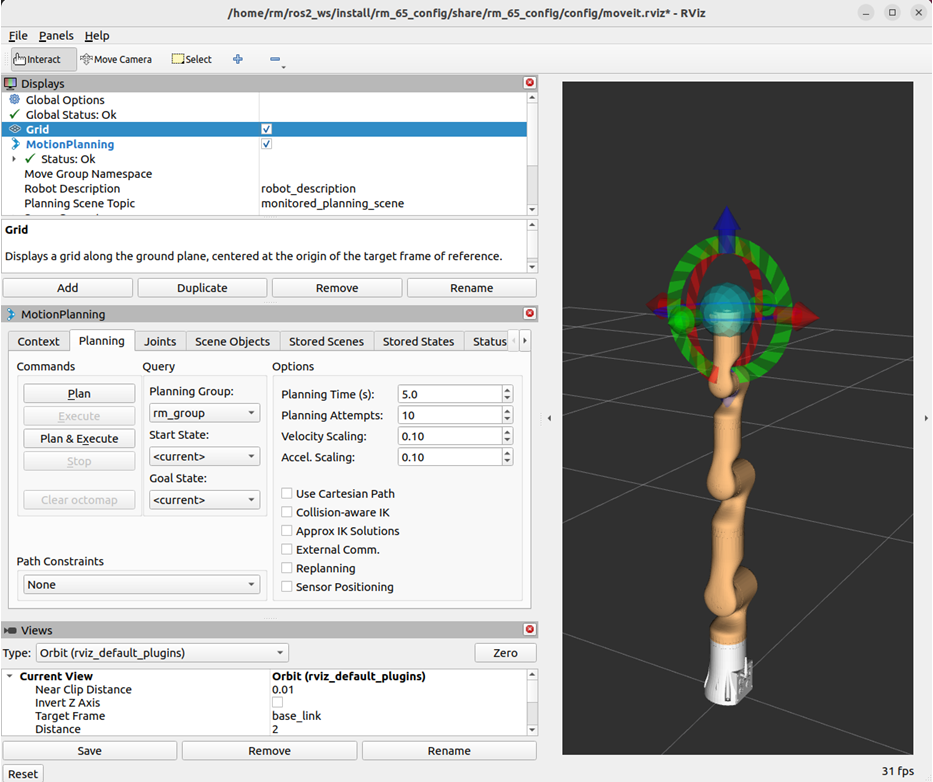
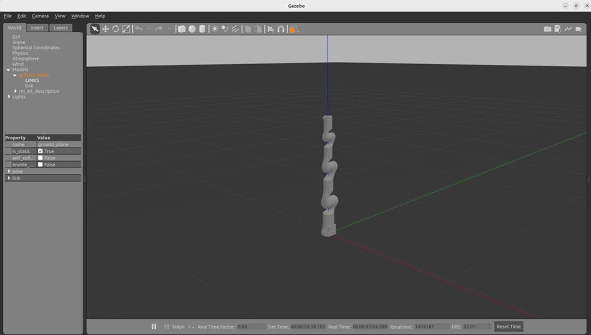
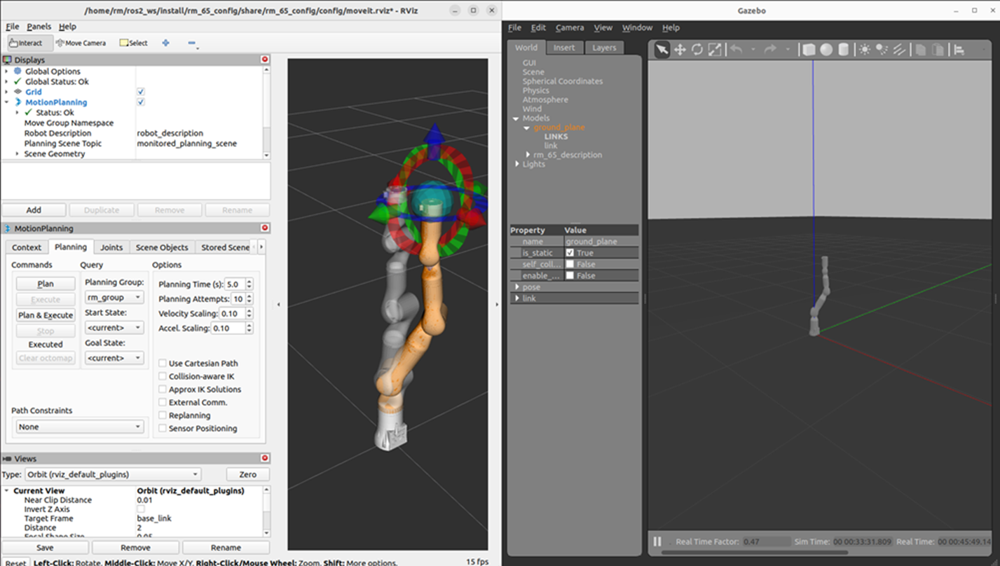

# <p class="hidden">ROS2：</p>rm_bringup功能包

rm_bringup功能包为实现多个launch文件同时运行所设计的功能包，使用该功能包可用一条命令实现多个节点结合的复杂功能的启动。
本节将围绕以下目的进行详细介绍：
这里将从以下三个方面整体介绍该功能包：

* 1.了解rm_bringup功能包的使用。
* 2.熟悉rm_bringup功能包中的文件构成及作用。
* 3.熟悉rm_bringup功能包相关的话题，方便开发和使用。

## 1.rm_bringup功能包使用

### 1.1moveit2控制真实机械臂

首先配置好环境完成连接后我们可以通过以下命令直接启动节点，运行rm_bringup功能包中的launch.py文件。

```
ros2 launch rm_bringup rm_<arm_type>_bringup.launch.py
```

在实际使用时需要将以上的`<arm_type>`更换为实际的机械臂型号，可选择的机械臂型号有65、63、eco65、75、gen72。
例如65机械臂的启动命令：

```
ros2 launch rm_bringup rm_65_bringup.launch.py
```

节点启动成功后，将弹出以下画面。
  
实际该launch文件启动的为moveit2控制真实机械臂的功能下面就可以使用控制球规划控制机械臂运动，详细可查看[rm_moveit2_config详解](../ros2/moveit2Config.md)相关内容。

### 1.2控制gazebo仿真机械臂

我们可以通过以下命令运行rm_bringup功能包中的launch.py文件，直接启动其中的gzaebo仿真节点。

```
ros2 launch rm_bringup rm_<arm_type>_gazebo.launch.py
```

在实际使用时需要将以上的<arm_type>更换为实际的机械臂型号，可选择的机械臂型号有65、63、eco65、75、gen72。  
例如65机械臂的启动命令：

```
ros2 launch rm_bringup rm_65_gazebo.launch.py
```

节点启动成功后，将弹出以下画面。
  
之后我们使用如下指令启动moveit2控制gazebo中的仿真机械臂。


## 2.rm_bringup功能包架构说明

### 2.1功能包文件总览

当前rm_bringup功能包的文件构成如下。

```
├── CMakeLists.txt                      #编译规则文件
├── doc                                 #辅助文档、图片存放文件夹
│   ├── rm_bringup1.png                 #图片1
│   ├── rm_bringup2.png                 #图片2
│   └── rm_bringup3.png                 #图片3
├── launch                              #启动文件
│   ├── rm_63_bringup.launch.py         #63臂moveit2启动文件
│   ├── rm_65_bringup.launch.py         #65臂moveit2启动文件
│   ├── rm_75_bringup.launch.py         #75臂moveit2启动文件
│   ├── rm_75_gazebo.launch.py          #75臂gazebo启动文件
│   ├── rm_eco65_bringup.launch.py      #eco65臂moveit2启动文件
│   └── rm_gen72_bringup.launch.py      #gen72臂moveit2启动文件
├── package.xml                         #依赖说明文件
├── README_CN.md                        #中文说明文档
└── README.md                           #英文说明文档
```

## 3.rm_bringup话题说明

该功能包当前并没有本身的话题，主要为调用其他功能包的话题实现。
