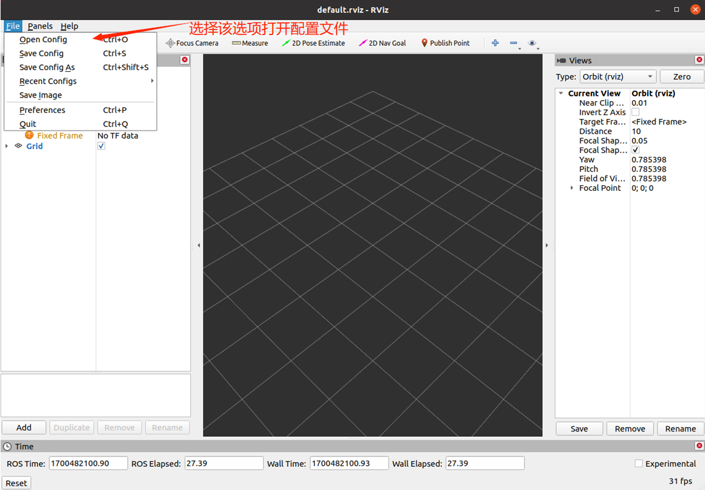

# rm_description功能包说明

rm_description功能包为显示机器人模型和TF变换的功能包，通过该功能包，我们可以实现电脑中的虚拟机械臂与现实中的实际机械臂的联动的效果，在之后的moveit2的控制中我们也需要该功能包的支持。
这里将从以下三个方面整体介绍该功能包：

* 1.功能包使用：了解该功能包的使用。
* 2.功能包架构说明：熟悉功能包中的文件构成及作用。
* 3.功能包话题说明：熟悉功能包相关的话题，方便开发和使用。

## 1.rm_description功能包使用

首先配置好环境完成连接后我们可以通过以下命令直接启动节点，运行rm_description功能包。  

```
rm@rm-desktop:~$ ros2 launch rm_description rm_<arm_type>_display.launch.py
```

在实际使用时需要将以上的<arm_type>更换为实际的机械臂型号，可选择的机械臂型号有65、63、eco65、75。  
例如65机械臂的启动命令：

```
rm@rm-desktop:~$ ros2 launch rm_description rm_65_display.launch.py
```

节点启动成功后，将显示以下画面。  

之后我们还需要启动rm_driver节点。

```
rm@rm-desktop:~$ ros2 launch rm_driver rm_<arm_type>_driver.launch.py
```

启动成功后我们就可以在rviz2中，查看机械臂状态了，运行如下命令启动rviz2。

```
rm@rm-desktop:~$ rviz2
```

通过如下配置打开机器人模型。  

在rm_description功能包的rviz文件夹下找到对应的配置文件。  

加载后就可以在rviz2的界面中看到当前的机械臂状态了。  


## 2.rm_description功能包架构总览

```
├── CMakeLists.txt                #编译规则文件
├── launch
│   ├── rm_63_display.launch.py     #63启动文件
│   ├── rm_65_display.launch.py     #65启动文件
│   ├── rm_75_display.launch.py     #75启动文件
│   └── rm_eco65_display.launch.py  #eco65启动文件
├── meshes                       #模型文件存放文件夹
│   ├── rm_63_arm                 #63机械臂模型文件存放文件夹
│   │   ├── base_link.STL
│   │   ├── link1.STL
│   │   ├── link2.STL
│   │   ├── link3.STL
│   │   ├── link4.STL
│   │   ├── link5.STL
│   │   └── link6.STL
│   ├── rm_65_arm                 #65机械臂模型文件存放文件夹
│   │   ├── base_link.STL
│   │   ├── link1.STL
│   │   ├── link2.STL
│   │   ├── link3.STL
│   │   ├── link4.STL
│   │   ├── link5.STL
│   │   └── link6.STL
│   ├── rm_75_arm                 #75机械臂模型文件存放文件夹
│   │   ├── base_link.STL
│   │   ├── link1.STL
│   │   ├── link2.STL
│   │   ├── link3.STL
│   │   ├── link4.STL
│   │   ├── link5.STL
│   │   ├── link6.STL
│   │   └── link7.STL
│   └── rm_eco65_arm                 #eco65机械臂模型文件存放文件夹
│       ├── baselink.STL
│       ├── Link1.STL
│       ├── Link2.STL
│       ├── Link3.STL
│       ├── Link4.STL
│       ├── Link5.STL
│       └── Link6.STL
├── package.xml
├── rviz                               #rviz2配置文件存放文件夹
│   ├── rm_63.rviz
│   ├── rm_65.rviz
│   ├── rm_75.rviz
│   └── rm_eco65.rviz
├── textures
└── urdf
    ├── display_arm.rviz
    ├── rm_65_description.csv
    ├── rm_65_gazebo.urdf               #65gazebo仿真urdf描述文件
    ├── rm_65.urdf                      #65 urdf描述文件
    ├── rm_75_description.csv
    ├── rm_75_gazebo.urdf               #75gazebo仿真urdf描述文件
    ├── rm_75.urdf                      #75 urdf描述文件
    ├── rm_eco65.csv
    ├── rm_eco65_gazebo.urdf           #eco65gazebo仿真urdf描述文件
    ├── rm_eco65.urdf                   #eco65 urdf描述文件
    ├── rml_63_description.csv
    ├── rml_63_gazebo.urdf               #63gazebo仿真urdf描述文件
    └── rml_63.urdf                      #63 urdf描述文件
```

## 3.rm_description话题说明

如下为该功能包的话题说明：

```
  Subscribers:
    /joint_states: sensor_msgs/msg/JointState
    /parameter_events: rcl_interfaces/msg/ParameterEvent
  Publishers:
    /parameter_events: rcl_interfaces/msg/ParameterEvent
    /robot_description: std_msgs/msg/String
    /rosout: rcl_interfaces/msg/Log
    /tf: tf2_msgs/msg/TFMessage
    /tf_static: tf2_msgs/msg/TFMessage
  Service Servers:
    /robot_state_publisher/describe_parameters: rcl_interfaces/srv/DescribeParameters
    /robot_state_publisher/get_parameter_types: rcl_interfaces/srv/GetParameterTypes
    /robot_state_publisher/get_parameters: rcl_interfaces/srv/GetParameters
    /robot_state_publisher/list_parameters: rcl_interfaces/srv/ListParameters
    /robot_state_publisher/set_parameters: rcl_interfaces/srv/SetParameters
    /robot_state_publisher/set_parameters_atomically: rcl_interfaces/srv/SetParametersAtomically
  Service Clients:

  Action Servers:

  Action Clients:
```

**Subscribers(订阅话题)：**

- `joint_states`代表机械臂当前的状态，我们的rm_driver功能包运行时会发布该话题，这样rviz中的模型就会根据实际的机械臂状态进行运动。

**Publishers（发布话题）：**

- `/tf`和`/tf_static`，这两个话题描述了机械臂关节与关节之间的坐标变换关系，也就是TF变换。剩余话题和服务使用场景较少，大家可自行了解。
