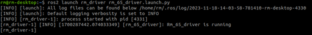
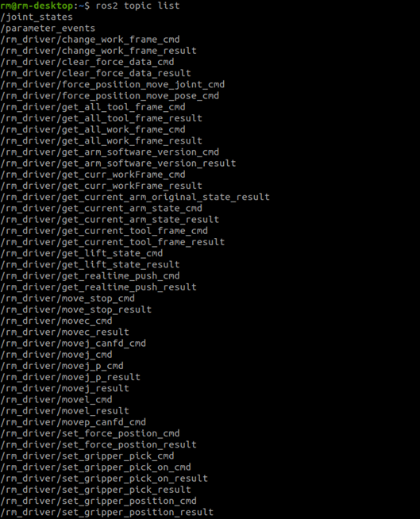
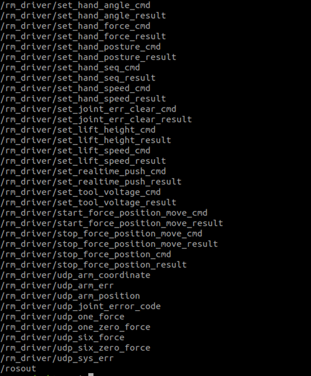

# <p class="hidden">ROS2：</p>rm_driver功能包说明

rm_driver功能包在机械臂ROS2功能包中是十分重要的，该功能包实现了通过ROS与机械臂进行通信控制机械臂的功能，在下文中将通过以下几个方面详细介绍该功能包。  
这里将从以下三个方面整体介绍该功能包：

* 1.功能包使用：了解该功能包的使用。  
* 2.功能包架构说明：熟悉功能包中的文件构成及作用。  
* 3.功能包话题说明：熟悉功能包相关的话题，方便开发和使用。

## 1.rm_driver功能包使用

### 1.1功能包基础使用

通过以下命令直接启动节点，控制机械臂：
>当前的控制基于我们没有改变过机械臂的IP即当前机械臂的IP仍为192.168.1.18。

```
ros2 launch rm_driver rm_<arm_type>_driver.launch.py
```

在实际使用时需要将以上的`<arm_type>`更换为实际的机械臂型号，可选择的机械臂型号有65、63、eco65、75、gen72。
底层驱动启动成功后，将显示以下画面:
  

### 1.2功能包进阶使用

当我们的机械臂IP被改变后我们的启动指令就失效了，再直接使用如上指令就无法成功连接到机械臂了，我们可以通过修改如下配置文件，重新建立连接。  
该配置文件位于我们的rm_driver功能包下的config文件夹下。  
  
其配置文件内容如下：

```
rm_driver:   
  ros__parameters:  
    #robot param  
    arm_ip: "192.168.1.18"        #设置TCP连接时的IP  
    tcp_port: 8080                #设置TCP连接时的端口  
    
    arm_type: "RM_65"             #机械臂型号设置    
    arm_dof: 6                    #机械臂自由度设置  

    udp_ip: "192.168.1.10"        #设置udp主动上报IP  
    udp_cycle: 5                  #udp主动上报周期，需要是5的倍数  
    udp_port: 8089                #设置udp主动上报端口  
    udp_force_coordinate: 0       #设置系统受力时六维力的基准坐标，0为传感器坐标系 1为当前工作坐标系 2为当前工具坐标系
```

其中主要有以下几个参数。

* arm_ip：改参数代表机械臂当前的IP
* tcp_port：设置TCP连接时的端口。
* arm_type：该参数代表机械臂当前的型号，可以选择的参数有RM_65（65系列）、RM_eco65（ECO65系列）、RML_63（63系列）、RM_75（75系列）、GEN_72（G72 系列）。
* arm_dof: 机械臂自由度设置。6为6自由度，7为7自由度。
* udp_ip: 设置udp主动上报目标IP。
* udp_cycle：udp主动上报周期，需要是5的倍数。
* udp_port：设置udp主动上报端口。
* udp_force_coordinate：设置系统受力时六维力的基准坐标，0为传感器坐标系（原始数据） 1为当前工作坐标系 2为当前工具坐标系。
* 再实际使用时，我们选择对应的launch文件启动时会自动选择正确的型号，若有特殊要求可在此处进行相应的参数修改，修改之后需要在工作空间目录下进行重新编译，之后修改的配置才会生效。
* 在工作空间目录运行colcon build指令。

```
colcon build
```

* 编译成功后可按如上指令进行功能包启动。

## 2.rm_driver功能包架构文件总览

```
├── CMakeLists.txt                 #编译规则文件
├── config                         #配置文件夹
│   ├── rm_63_config.yaml          #63配置文件
│   ├── rm_65_config.yaml          #65配置文件
│   ├── rm_75_config.yaml          #75配置文件
│   ├── rm_eco65_config.yaml       #eco65配置文件
│   └── rm_gen72_config.yaml       #gen725配置文件
├── doc
│   ├── RealMan Robotic Arm rm_driver Topic Detailed Description (ROS2).md
│   ├── rm_driver1.png
│   ├── rm_driver2.png
│   ├── rm_driver3.png
│   ├── rm_driver4.png
│   └── 睿尔曼机械臂ROS2rm_driver话题详细说明.md
├── include                        #依赖头文件文件夹
│   └── rm_driver
│       ├── cJSON.h                #API头文件
│       ├── constant_define.h      #API头文件
│       ├── rman_int.h             #API头文件
│       ├── rm_base_global.h       #API头文件
│       ├── rm_base.h              #API头文件
│       ├── rm_define.h            #API头文件
│       ├── rm_driver.h            #rm_driver.cpp头文件
│       ├── rm_praser_data.h       #API头文件
│       ├── rm_queue.h             #API头文件
│       ├── rm_service_global.h    #API头文件
│       ├── rm_service.h           #API头文件
│       └── robot_define.h         #API头文件
├── launch
│   ├── rm_63_driver.launch.py     #63启动文件
│   ├── rm_65_driver.launch.py     #65启动文件
│   ├── rm_75_driver.launch.py     #75启动文件
│   ├── rm_eco65_driver.launch.py  #eco65启动文件
│   └── rm_gen72_driver.launch.py  #gen72启动文件
├── lib
│   ├── libRM_Service.so -> libRM_Service.so.1.0.0        #API库文件
│   ├── libRM_Service.so.1 -> libRM_Service.so.1.0.0      #API库文件
│   ├── libRM_Service.so.1.0 -> libRM_Service.so.1.0.0    #API库文件
│   ├── libRM_Service.so.1.0.0                            #API库文件
│   ├── linux_arm_service_release_v4.3.2.t1.tar.bz2       #API库文件
│   └── linux_x86_service_release_v4.3.2.t1.tar.bz2       #API库文件
├── package.xml                                           #依赖声明文件
├── README_CN.md
├── README.md
└── src
    └── rm_driver.cpp                                     #驱动代码源文件
```

## 3.rm_driver话题说明

rm_driver的话题较多，基于机械臂API实现机械臂本体的功能。
运行功能包后可以通过如下指令了解其话题信息:

```
ros2 topic list
```


  
