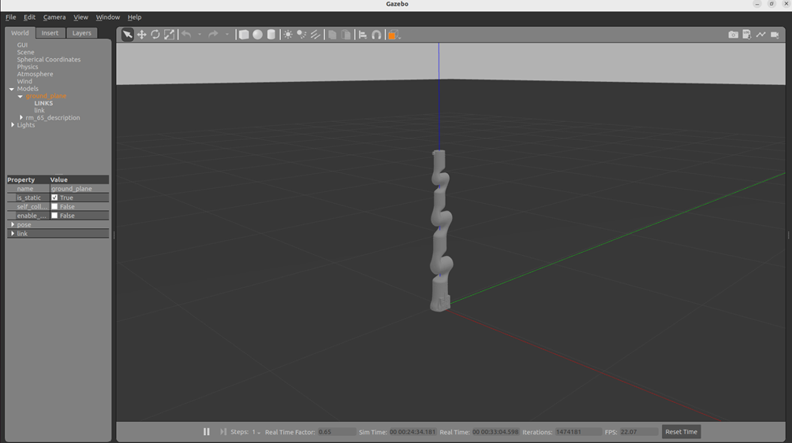
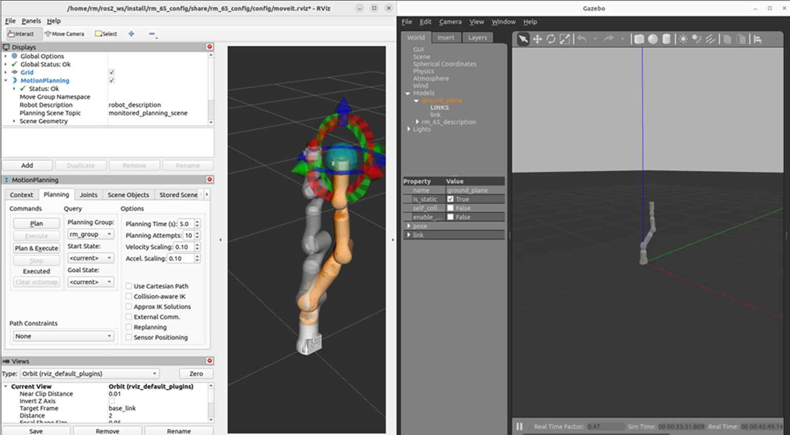

# <p class="hidden">ROS2：</p>rm_gazebo功能包说明

rm_gazebo的主要作用是帮助我们实现机械臂Moveit2规划的仿真功能，我们将在Gazebo的仿真环境中搭建一个虚拟机械臂，然后通过Moveit2控制Gazebo中的虚拟机械臂。
这里将从以下两个方面整体介绍该功能包：

* 1.功能包使用：了解该功能包的使用。
* 2.功能包架构说明：熟悉功能包中的文件构成及作用。

## 1.控制仿真机械臂

在完成环境安装和功能包安装后，我们可以进行rm_gazebo功能包的运行。  
使用如下指令启动Gazebo虚拟空间和虚拟机械臂。

```
ros2 launch rm_gazebo gazebo_65_demo.launch.py
```

运行成功后将弹出如下界面。

之后我们使用如下指令启动moveit2控制gazebo中的仿真机械臂。

```
ros2 launch rm_65_config gazebo_moveit_demo.launch.py
```

弹出rviz2的控制界面后就可以进行moveit2和gazebo的仿真控制了。


## 2.rm_gazebo功能包架构文件总览

```
├── CMakeLists.txt                           #编译规则文件
├── config
│   ├── gazebo_63_description.urdf.xacro     #RML63gazebo模型描述文件
│   ├── gazebo_65_description.urdf.xacro     #RM65gazebo模型描述文件
│   ├── gazebo_75_description.urdf.xacro     #RM75gazebo模型描述文件
│   ├── gazebo_eco65_description.urdf.xacro  #ECO65gazebo模型描述文件
│   └── gazebo_gen72_description.urdf.xacro  #GEN72gazebo模型描述文件
├── doc
│   ├── rm_gazebo1.png
│   └── rm_gazebo2.png
├── include
│   └── rm_gazebo
├── launch
│   ├── gazebo_63_demo.launch.py             #RML63gazebo启动文件
│   ├── gazebo_65_demo.launch.py             #RM65gazebo启动文件
│   ├── gazebo_75_demo.launch.py             #RM75gazebo启动文件
│   ├── gazebo_eco65_demo.launch.py          #ECO65gazebo启动文件
│   └── gazebo_gen72_demo.launch.py          #GEN72gazebo启动文件
├── package.xml
├── README_CN.md
└── README.md
```
