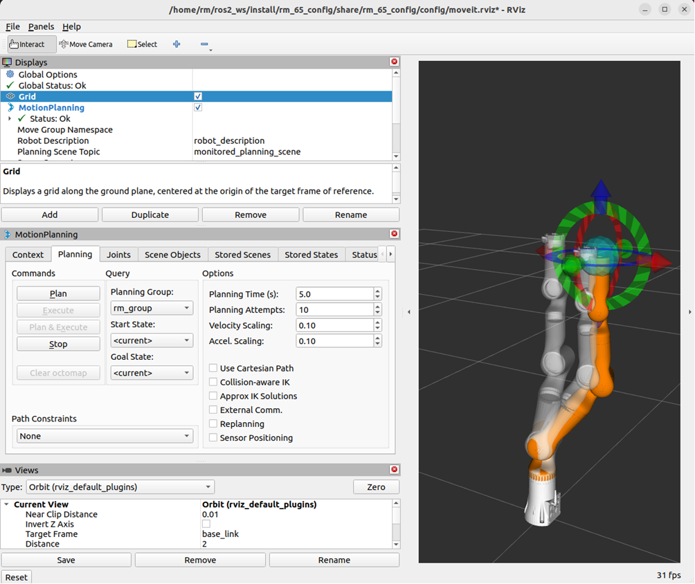
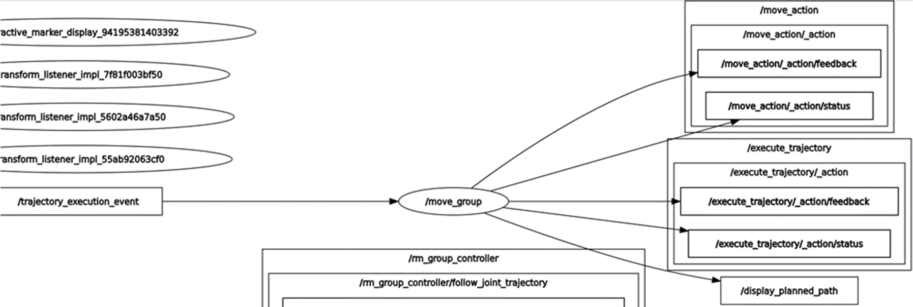

# <p class="hidden">ROS2：</p>rm_moveit2_config功能包说明

rm_moveit2_config是实现Moveit2控制真实机械臂的功能包，该功能包的主要作用为调用官方的Moveit2框架，结合我们机械臂本身的URDF生成适配于我们机械臂的moveit2的配置和启动文件，通过该功能包我们可以实现moveit2控制虚拟机械臂和控制真实机械臂。
这里将从以下三个方面整体介绍该功能包：

* 1.功能包使用：了解该功能包的使用。
* 2.功能包架构说明：熟悉功能包中的文件构成及作用。
* 3.功能包话题说明：熟悉功能包相关的话题，方便开发和使用。

## 1.rm_moveit2_config使用

### 1.1moveit2控制虚拟机械臂

首先配置好环境完成连接后我们可以通过以下命令直接启动节点。

```
rm@rm-desktop:~$ ros2 launch rm_<arm_type>_config demo.launch.py
```

在实际使用时需要将以上的`<arm_type>`更换为实际的机械臂型号，可选择的机械臂型号有65、63、eco65、75、gen72。
例如65机械臂的启动命令：  

```
rm@rm-desktop:~$ ros2 launch rm_65_config demo.launch.py
```

节点启动成功后，将显示以下画面。  

接下来我们可以通过拖动控制球使机械臂到达目标位置，然后点击规划执行。  

规划执行。  


### 1.2moveit2控制真实机械臂

控制真实机械臂需要的控制指令相对较多一些，如下为详细的控制方式。  
首先运行底盘驱动节点。  

```
rm@rm-desktop:~$ ros2 launch rm_driver rm_<arm_type>_driver.launch.py
```

接下来需要运行rm_description功能包文件。

```
rm@rm-desktop:~$ ros2 launch rm_description rm_<arm_type>_display.launch.py
```

之后需要运行中间功能包rm_control的相关节点。

```
rm@rm-desktop:~$ ros2 launch rm_control rm_<arm_type>_control.launch.py
```

最终需要启动控制真实机械臂的moveit2节点。

```
rm@rm-desktop:~$ ros2 launch rm_<arm_type>_config real_moveit_demo.launch.py
```

注意以上指令均需要将<arm_type>更换为对应的机械臂型号，可选择的型号有65、63、eco65、75。  
完成以上操作后将会出现以下界面，我们可以通过拖动控制球的方式控制机械臂运动。  


## 2.rm_moveit2_config功能包架构文件总览

```
├── rm_63_config                                    #63机械臂moveit2功能包
│   ├── CMakeLists.txt                              #63机械臂moveit2功能包编译规则
│   ├── config                                      #63机械臂moveit2功能包参数文件夹
│   │   ├── initial_positions.yaml                  #63机械臂moveit2初始化位姿
│   │   ├── joint_limits.yaml                       #63机械臂关节限制
│   │   ├── kinematics.yaml                         #63机械臂运动学参数
│   │   ├── moveit_controllers.yaml                 #63机械臂moveit2控制器
│   │   ├── moveit.rviz                             #63机械臂rviz2显示配置文件
│   │   ├── pilz_cartesian_limits.yaml
│   │   ├── rml_63_description.ros2_control.xacro   #63机械臂xacro描述文件
│   │   ├── rml_63_description.srdf                 #63机械臂moveit2控制配置文件
│   │   ├── rml_63_description.urdf.xacro           #63机械臂xacro描述文件
│   │   └── ros2_controllers.yaml                   #63机械臂运动控制器
│   ├── launch
│   │   ├── demo.launch.py                          #63虚拟机械臂moveit2启动文件
│   │   ├── gazebo_moveit_demo.launch.py            #63仿真机械臂moveit2启动文件
│   │   ├── move_group.launch.py
│   │   ├── moveit_rviz.launch.py
│   │   ├── real_moveit_demo.launch.py              #63真实机械臂moveit2启动文件
│   │   ├── rsp.launch.py
│   │   ├── setup_assistant.launch.py
│   │   ├── spawn_controllers.launch.py
│   │   ├── static_virtual_joint_tfs.launch.py
│   │   └── warehouse_db.launch.py
│   └── package.xml
├── rm_65_config                                    #65机械臂moveit2功能包（文件解释参考63）
│   ├── CMakeLists.txt
│   ├── config
│   │   ├── initial_positions.yaml
│   │   ├── joint_limits.yaml
│   │   ├── kinematics.yaml
│   │   ├── moveit_controllers.yaml
│   │   ├── moveit.rviz
│   │   ├── pilz_cartesian_limits.yaml
│   │   ├── rm_65_description.ros2_control.xacro
│   │   ├── rm_65_description.srdf
│   │   ├── rm_65_description.urdf.xacro
│   │   └── ros2_controllers.yaml
│   ├── launch
│   │   ├── demo.launch.py
│   │   ├── gazebo_moveit_demo.launch.py
│   │   ├── move_group.launch.py
│   │   ├── moveit_rviz.launch.py
│   │   ├── real_moveit_demo.launch.py
│   │   ├── rsp.launch.py
│   │   ├── setup_assistant.launch.py
│   │   ├── spawn_controllers.launch.py
│   │   ├── static_virtual_joint_tfs.launch.py
│   │   └── warehouse_db.launch.py
│   └── package.xml
├── rm_75_config                #75机械臂moveit2功能包（文件解释参考63）
│   ├── CMakeLists.txt
│   ├── config
│   │   ├── initial_positions.yaml
│   │   ├── joint_limits.yaml
│   │   ├── kinematics.yaml
│   │   ├── moveit_controllers.yaml
│   │   ├── moveit.rviz
│   │   ├── pilz_cartesian_limits.yaml
│   │   ├── rm_75_description.ros2_control.xacro
│   │   ├── rm_75_description.srdf
│   │   ├── rm_75_description.urdf.xacro
│   │   └── ros2_controllers.yaml
│   ├── launch
│   │   ├── demo.launch.py
│   │   ├── gazebo_moveit_demo.launch.py
│   │   ├── move_group.launch.py
│   │   ├── moveit_rviz.launch.py
│   │   ├── real_moveit_demo.launch.py
│   │   ├── rsp.launch.py
│   │   ├── setup_assistant.launch.py
│   │   ├── spawn_controllers.launch.py
│   │   ├── static_virtual_joint_tfs.launch.py
│   │   └── warehouse_db.launch.py
│   └── package.xml
└── rm_eco65_config              #eco65机械臂moveit2功能包（文件解释参考63）
    ├── CMakeLists.txt
    ├── config
    │   ├── initial_positions.yaml
    │   ├── joint_limits.yaml
    │   ├── kinematics.yaml
    │   ├── moveit_controllers.yaml
    │   ├── moveit.rviz
    │   ├── pilz_cartesian_limits.yaml
    │   ├── rm_eco65_description.ros2_control.xacro
    │   ├── rm_eco65_description.srdf
    │   ├── rm_eco65_description.urdf.xacro
    │   └── ros2_controllers.yaml
    ├── launch
    │   ├── demo.launch.py
    │   ├── gazebo_moveit_demo.launch.py
    │   ├── move_group.launch.py
    │   ├── moveit_rviz.launch.py
    │   ├── real_moveit_demo.launch.py
    │   ├── rsp.launch.py
    │   ├── setup_assistant.launch.py
    │   ├── spawn_controllers.launch.py
    │   ├── static_virtual_joint_tfs.launch.py
    │   └── warehouse_db.launch.py
    └── package.xml
```

## 3.rm_moveit2_config话题说明

这里以节点话题的数据流图的方式进行查看和讲解，使大家能够更清晰的了解话题结构。
先启动如上控制真实机器人的节点，再运行如下指令查看当前话题的对接情况：

```
rm@rm-desktop:~$ ros2 run rqt_graph rqt_graph
```

运行成功后界面将显示如下画面。

该图反应了当前运行的节点与节点之间的话题通信关系，首先查看/rm_driver节点，该节点在moveit2运行时订阅和发布的话题如下。


由图可知，rm_driver发布的/joint_states话题在持续被/robot_state_publiser节点和/move_group_private节点订阅。/robot_state_publiser接收/joint_states是为了持续发布关节间的TF变换；/move_group_private是moveit2的相关节点，moveit2在规划时也需要实时获取当前机械臂的关节状态信息，所以也订阅了该话题。
由图可知rm_driver还订阅了rm_control的/rm_driver/movej_canfd_cmd话题，该话题是机械臂透传功能的话题，通过该话题rm_control将规划的关节点位发布给rm_driver节点控制机械臂进行运动。

rm_control为rm_driver与moveit2之间通信的桥梁，其通过/rm_group_controller/follow_joint_trajectory动作与/moveit_simple_controller_manager进行通信，获取规划点，并进行插值运算，将插值之后的数据通过透传的方式给到rm_driver。

Moveit2本身涉及的节点有move_group、move_group_private、moveit_simple_controller_manager，它们的主要作用为实现机械臂的运动规划，并将规划信息等数据显示在rviz中，另一方面还需要将规划数据传递到rm_control端，进行进一步细分。
