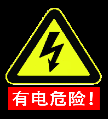
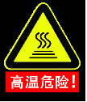
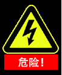
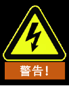
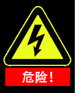
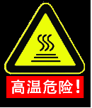
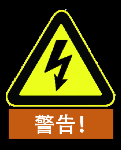

# 
入门指南：
安全指南

## 简介

本章介绍了操作机器人或机器人系统时应该遵守的安全原则和规范。集成商及用户必须认真阅读本手册，带有警示标识的内容需要重点掌握并严格遵守。由于机器人系统复杂且危险性较大，使用人员需要充分认识操作的危险性，严格遵守并执行本手册中的规范及要求。集成商及用户需要具备充分的安全意识。

### 安全警示标志

本手册中有关安全的标志，使用说明如下，请务必遵守。

**警示标志说明**  

| 标志     | 说明                                            |
|-------------------------------------------|------------------------------------------------|
|  | 即将引发危险的用电情况，如果不避免，可导致人员伤亡或设备 严重伤害。             |
|  | 可能引发危险的热表面，如果接触了，可造成人员伤害。                           |
|  | 即将引发危险的情况，如果不避免，可导致人员死亡或严重伤害。                     |
|  | 可能引发危险的用电情况，如果不避免，可导致人员伤害或设备 严重损坏。              |
|  | 可能引发危险的情况，如果不避免，可导致人员伤害或设备严重 损坏。 标记有此种符号的事项，根据具体情况，有时会有发生重大后果 的可能性。 |
|  | 一种情况，如果不避免，可导致人员伤害或设备损坏。 标记有此种符号的事项，根据具体情况，有时会有发生重大后果 的可能性。      |

### 安全注意事项**

本手册包含保护使用人员及预防机器损坏的安全措施。用户需要阅读说明书里的所有相关描述并且完全熟知安全事项。本手册中，我们尽量描述各种情况，但是，由于有太多的可能性，所有不能做或者不可以做的情况不可能都被记录下来。

在首次启动机器人或机器人系统时需要理解并遵循以下基本信息，其它安全相关信息在手册的其它部分予以介绍。不过，也不可能面面俱到，另外在实际应用中，特殊情况需要具体问题具体分析。

**安全注意事项**  

| 标志     | 说明                                            |
|-------------------------------------------|------------------------------------------------|
|  | 1. 请务必按照本说明书中的要求规范安装机器人及所有电气设备。  2. 在第一次使用机器人及投入生产前需要对机器人及其防护系统进行初步测试和检查。  3.首次启动设备前，须对设备的硬件、软件、及外观面进行检查确保设备正常使用，本次检测需参考符合国家或地区有效的安全生产规章制度，必须测试所有的安全功能。  4. 用户必须检查并确保所有的安全参数和用户程序是正确的，并且所有的安全功能工作正常。需要具有操作机器人资格的人员来检查每个安全功能。只有通过全面且仔细的安全测试且到达安全级别后才能启动机器人。  5. 需要有专业人员按照安装标准对机器人进行安装和调试。  6. 当机器人安装完成和构建完成后，需再次进行全面的风险评估并保留文件记录。  7. 由具有授权许可的人员来设置和更改安全参数，使用密码或者隔离措施来防止未被授权的人员更改或设置安全参数。安全参数修改后，相关的安全功能需要被分析。  8. 机器人在发生意外或者运行不正常等情况下，可以按下急停开关，停止机器人动作。|
|  | 1. 机器人本体和控制柜在运作的过程中会产生热量。机器人正在工作时或刚停止工作后，请不要操作或触摸机器人。  2. 切断电源并等待一小时，机器人才可冷却下来。  3. 切勿将手指伸到控制器发热处。 |
|  | 1. 确保机器人的手臂和末端工具都正确并安全地安装到位。  2. 确保机器人的手臂有足够的空间来自由活动。  3. 如果机器人已损坏，请勿使用。  4. 不要将安全设备连接到正常的I/O 接口上，只能使用安全型接口。  5. 确保进行正确的安装设置（例如机器人本体的安装角度、末端工具的重量、TCP偏移、安全配置）。将安装文件保存并载入程序内。  6. 工具及障碍物不得有尖角或扭点。确保所有人员在机器人工作范围之外。  7. 注意使用示教器时机器人的运动方向。  8. 任何撞击将释放大量的动能，这些动能比高速和高有效负载的情况下高得多。  9. 将不同的机械连接起来可能加重危险或引发新的危险。始终对整个安装进行全面的风险评估。当需要不同等级的安全和紧急停机性能时，始终选择最高的性能等级。始终都要阅读和理解安装中使用到的所有设备的手册。  10. 切勿改动机器人。对机器人的改动有可能造成集成商无法预测的危险。机器人授权重组需依照最新版的所有相关服务手册。如果机器人以任何方式被改变或改动，睿尔曼智能科技（北京）有限公司拒绝承担一切责任。  11. 在运输机器人之前，用户需要检查绝缘情况及保护措施。  12. 搬运机器人时要遵守运输要求，小心搬运，避免磕碰。 |
|  | 1. 当与能够造成机器人损坏的机械连接在一起或是在一起工作时，强烈推荐单独对机器人的所有功能以及机器人程序进行检查。推荐使用其它机械工作空间以外的临时路点来检测机器人程序。  2.睿尔曼智能科技（北京）有限公司对于人为造成程序出错使机器人操作失误造成的损坏或人员伤害概不承担责任。  3. 不要将机器人一直暴露在永久性磁场。强磁场可损坏机器人。 |

### 责任及规范

我司机器人可以与其它设备组成完整的机器，其本身并不完整。因此本手册信息中并不包含如何全面的设计、安装和操作一个完整的机器人，也不包含所有对这一完整的系统的周边设备的安全造成影响的可能性。完整机器人安装的安全性取决于该机器人是如何集成的。集成商需要遵循所在国的法律法规及安全规范和标准对该完整的系统进行设计和安装风险评估。风险评估是集成商务必完成的最重要任务之一，集成商可参考以下标准执行风险评估流程。风险评估是集成商务必完成的最重要任务之一，集成商可参考以下标准执行风险评估流程。

- ISO 12100:2010 机械安全 - 设计通则 - 风险评估与风险降低。
- ISO 10218-2:2011 机器人与机器人设备 - 安全要求 - 第 2 部分：工业机器人系统与集成。
- RIA TR R15.306-2014 工业机器人与机器人系统的技术报告 - 安全要求、任务型风险评估方法。
- ANSI B11.0-2010 机械安全；一般要求与风险评估。

我司全系列机器人的集成商需要履行但不限于以下责任：

- 对完整的机器人系统做全面的风险评估；
- 确认整个系统的设计安装准确无误；
- 向用户及工作人员提供培训；
- 创建完整系统的操作规范，明确使用流程说明；
- 建立适当的安全措施；
- 在最终安装时使用适当的方法消除危险或最大限度降低一切危险至可接受水平。

### 危险识别

风险评估应考虑正常使用期间操作人员与机器人之间所有潜在的接触以及可预见的误操作。操作人员的颈部、脸部和头部不应暴露，以免发生碰触。在不使用外围安全防护装置的情况下使用机器人需要首先进行风险评估，以判断相关危险是否会构成不可接受的风险，例如：

-   使用尖锐的末端执行器或工具连接器可能存在危险；

-   处理毒性或其它有害物质可能存在危险；

-   操作人员手指有被机器人底座或关节夹住的危险；

-   被机器人碰撞发生的危险；

-   机器人或连接到末端的工具固定不到位存在的危险；

-   机器人有效负载与坚固表面之间的冲击造成的危险。

集成商必须通过风险评估来衡量此类危险及其相关的风险等级，并且确定和实施相应的措施，以将风险降低至可接受的水平。请注意，特定机器人设备可能还存在其它重大危险。

通过将我司全系列机器人所应用的固有安全设计措施与集成商和最终用户所实施的安全规范或风险评估相结合，将与我司全系列机器人协作性操作相关的风险尽可能降低至合理可行的水平。通过此文档可将机器人在安装前存在的任何剩余风险传达给集成商和最终用户。如果集成商的风险评估测定其特定应用中存在可能对用户构成不可接受风险的危险，集成商必须采取适当的风险降低措施，以消除或最大限度降低这些危险，直至将风险降低至可接受的水平为止。在采取适当的风险降低措施（如有需要）之前使用是不安全的。

如果对机器人进行非协同性安装（例如，当使用危险工具时），风险评估可能推断集成商需要在其编程时连接额外的安全设备（例如，安全启动设备）确保人员及设备安全。

## 搬运及注意事项

机器人吊装时，运动部件应采取恰当的措施和定位，不使其在吊装和运输过程中产生意外的运动，造成危害。包装运输时，应按照包装标准进行包装，并在包装箱外打上所需的标记。

运输时，需要保证机器人是稳定的，而且需保持在固定的位置上。

从机器人的包装材料中将机器人移至安装位置时，扶住机器人直至机器人基座的所有螺栓全部紧固好。

机器人4\~6关节内部未安装抱闸，在断电状态下，请保持机器人在合适的位置，以防关节在重力作用下转动发生碰撞。（竖直状态下，断电前将机器人置于零位位姿。）

运输完成后保持好原包装，将包装材料保存在干燥处，以备将来需要重新包装并移动机器人。

::: warning 注意
RM65、ECO65系列机器人4-6关节无抱闸，RM75系列机器人5\~7关节无抱闸，RML63系列机器人5、6两个关节无抱闸。
:::

## 维护维修及废弃处理

维护维修工作务必遵守本手册的所有安全指示。

变更控制系统、机器人关节后，需要重新对机器人和工具零点进行现场标定。并且需要检查参数设置，如果有参数备份，可以导入备份的参数，如果没有备份，需要重新设置参数。

维修必须由授权的系统集成商或睿尔曼智能科技（北京）有限公司进行。零件退回给睿尔曼智能科技（北京）有限公司时应按服务手册的规定进行操作。

必须确保维护维修工作规定的安全级别，遵守有效的国家或地区的工作安全条例，同时必须测试所有的安全功能是否能正常运行。

维护维修工作的目的是为了确保系统正常运行，或在系统故障时帮助其恢复正常状态。

维修包括故障诊断和实际的维修。

操作机器人手臂或控制器时必须遵循以下安全程序和警告事项：

**安全程序：**

1. 从控制器接口板处移除输入电源确保其完全断电。需要采取必要的预防措施以避免其它人在维修期间重新接通系统电源。断电之后仍要重新检查系统，确保其断电。
2. 拆分机器人手臂或控制器时请遵守ESD（静电释放）法规。
3. 避免水或粉尘进入机器人手臂或控制器。

**警告事项：**

1. 维修时，需使用部件号相同的新部件或由睿尔曼智能科技（北京）有限公司替换故障部件。
2. 该工作完成后立即重新激活所有禁用的安全措施。
3. 书面记录所有维修操作，并将其保存在整个机器⼈系统相关的技术文档中。
4. 控制器没有最终用户可自行维修的零件。如果需要维护或维修服务，请联系您的经销商或睿尔曼智能科技（北京）有限公司。

**废弃处理：**

我司全系列机器人必须按照适用的国家法律法规及国家标准进行废弃处理。

**维修保养：**

1. 机器人的安全功能必须每年至少测试一次，以确保功能正确。
2. 在机械臂的末端关节上，有电池为编码器供电以保存关节的多圈计数,
为防止编码器数据丢失，至少需要每月开机 5-10 分钟为电池充电，如果上电后仍然发现末端关节异常，则需要待机5-10分钟后重启机械臂。如果仍有异常请及时联系我们的售后服务人员。

::: warning 注意
M65、ECO65、RML63系列机器人关节6，RM75系列机器人关节7上有电池为编码器供电。
:::

## 质量保证

### 产品质量保证

我司全系列机器人具有12个月有限保修期。

若新设备及其组件在投入使用12个月内（如包括运输时间则最长不超过15 个月），出现因制造或材料不良所致的缺陷，睿尔曼智能科技（北京）有限公司应提供必要的备用部件予以更换或维修相关部件。

被更换或返修的设备或组件的所有权归睿尔曼智能科技（北京）有限公司所有。

如果产品已经不在保修期内，睿尔曼智能科技（北京）有限公司保留向客户收取更换或维修费用的权利。

在保修期外，如果设备呈现缺陷，睿尔曼智能科技（北京）有限公司不承担由此引起的任何损害或损失，例如生产损失或对其它生产设备造成的损坏。

### 免责声明

若设备缺陷是由处理不当或未遵循用户手册中所述的相关信息所致，则“产品质量保证”即告失效。

以下情况导致的故障不在本保修范围内：

1. 未按用户手册要求安装、接线、连接其它控制设备；
2. 使用时超出用户手册所示规格或标准；
3. 将本产品用于指定以外用途；
4. 存放方式、工作环境超出用户手册的指定范围（如污染、盐害、结露等）；
5. 由于运输不当导致的产品损坏；
6. 事故或碰撞导致的损坏；
7. 安装非原装正品零部件、附件；
8. 由睿尔曼智能科技（北京）有限公司或其指定集成商以外的第三方对原装零部件进行改造、调试或维修导致的损坏；
9. 火灾、地震、海啸、雷击、大风和洪水等自然灾害；
10. 无法识别生产日期或保修起始日期；
11. 对软件或内部数据的更改；
12. 无法再现故障或者故障无法由睿尔曼智能科技（北京）有限公司识别；
13. 在放射性设备、生物试验设备或睿尔曼智能科技（北京）有限公司判断为危险用途中使用本产品；
14. 上述情况以外非睿尔曼智能科技（北京）有限公司责任导致的故障。

::: warning 注意
未经睿尔曼允许严禁用户自行拆解产品。
:::

根据产品质量保证协议，睿尔曼智能科技（北京）有限公司只对向经销商出售的产品和零部件中出现的瑕疵和缺陷进行质保承诺。任何其它明示或暗示的担保或责任，包括但不限于任何对适销性或特定用途的默示担保，睿尔曼智能科技（北京）有限公司不承担相关担保责任。此外，睿尔曼智能科技（北京）有限公司对由相关产品产生的任何形式的间接损害或后果不承担相关责任。

在机器人发生故障情况下，需第一时间与睿尔曼智能科技（北京）有限公司取得联系，获取解决办法，用户不得以任何理由进行机器人拆装维护，否则将终止保修服务。
