# 
入门指南：
机械臂示教

示教器软件面板用于机器人示教操作，用户通过点击面板上的图标来移动机器人。同时面板也会把机器人的运动信息反馈给用户。

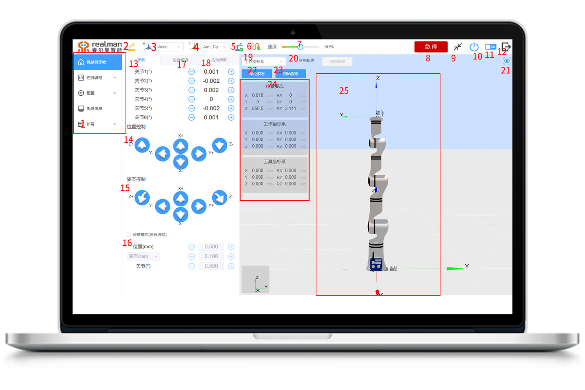

机器人示教面板

**机器人示教面板各功能区域名称**  

| 序号 | 名称             |
|------|------------------|
| 1    | 菜单栏选项       |
| 2    | 工作模式选择     |
| 3    | 工作坐标系选择   |
| 4    | 工具坐标系选择   |
| 5    | 机械臂状态显示   |
| 6    | 网络连接状态显示 |
| 7    | 速度百分比显示   |
| 8    | 机器人急停按钮   |
| 9    | 全屏按钮         |
| 10   | 机器人电源开关   |
| 11   | 中英文切换       |
| 12   | 退出登录         |
| 13   | 关节示教         |
| 14   | 位置示教         |
| 15   | 姿态示教         |
| 16   | 步进模式设置     |
| 17   | 位姿编辑         |
| 18   | 拖动示教轨迹编辑 |
| 19   | 运动坐标系选择   |
| 20   | 绘制、清除轨迹   |
| 21   | 一键回位按钮     |
| 22   | 零位姿态按钮     |
| 23   | 初始姿态按钮     |
| 24   | 当前位姿、坐标系 |
| 25   | 3D仿真模型       |

下面将按照上表的顺序，依次对各区域/按键进行说明：

## 菜单栏选项

点击菜单栏的选项名称可以切换到对应名称面板，方便用户操作。选中的面板呈现蓝色背景。

菜单栏选项

## 工作模式选择

黄色图标代表选择真实模式，此时程序在真实机器人上运行，机器人会按照指令来运动，界面会显示机器人参数及机械臂运动状态图像。

灰色图标代表选择仿真模式，此时真实机器人不运动，只移动3D仿真模型。完成一个机器人程序，可先选择仿真模式，通过仿真模式来验证程序是否可行，以提高机器人应用的安全性以及规划轨迹是否可达。

  

工作模式选择

## 工作坐标系选择

用户可以选择工作坐标系对机器人运动状态进行控制。在示教器界面选择基坐标系（Base）控制机器人，机器人将会以如图8-8所示的坐标系方向进行移动。用户也可以根据实际项目需求，创建自己所需的工作坐标系作为机器人移动的参考方向，假设work1为用户自己设定的工作坐标系（设定机器人工作坐标系的方法见8.4.2.3），设定完成后可进行工作坐标系切换。

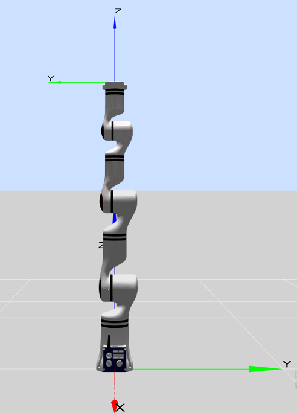

机器人基坐标系示意图

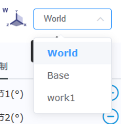

工作坐标系选择示意图

## 工具坐标系选择

工具坐标系可通过下拉菜单选择，默认显示的位姿目标是法兰盘中心（如图8-11所示），用户自己可以设定工具坐标系，假设tool1为用户自己设置的工具坐标系（设定机器人工具坐标系的方法见8.4.2.2），设定完成后可进行工具坐标系切换。

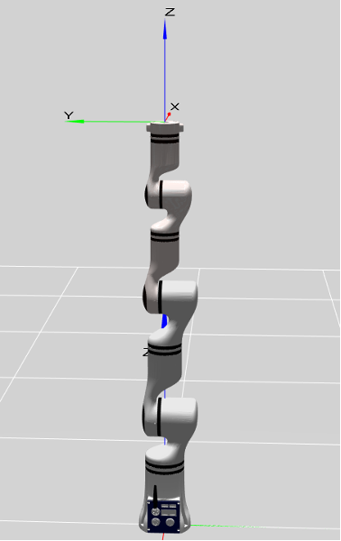

机器人末端法兰盘中心坐标系

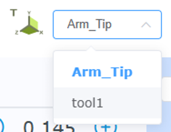

工具坐标系选择示意图

## 机械臂状态显示

当机器人发生错误时，会在此处提示错误，点击图标可打开错误提示列表。

机械臂错误状态显示

## 网络连接状态显示

当与机器人连接正常时，变为绿色，断开通讯时，变为红色。

  

网络连接状态显示

## 速度显示

此处可拖动滑动条来设置机器人运动速度占最大速度的百分比。

速度设置示意图

在使用位姿编辑时，此处可设置长按加减按钮时的数据变化速度。

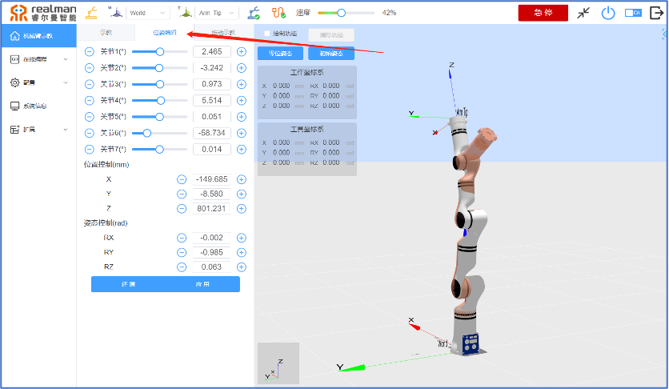

## 机器人急停按钮

按下急停按钮后，机器人以最大速度停止，再次按下，取消急停，可重新对机械臂进行操作。

  

机器人急停按钮

## 全屏按钮

该按钮用来控制示教界面进入全屏和退出全屏。

  

界面全屏按钮

## 电源按钮

该按钮用来控制机器人的电源开关，蓝色代表机器人电源处于开启状态，灰色代表机器人电源处于关闭状态。

  

机器人电源开关

## 中英文切换

点击中英文切换按钮可进行中文版示教器与英文版示教器的切换。

  

中英文切换

## 退出登录

点击退出登录按钮退出登录。

  

退出登录

## 关节控制

机器人一共有6个自由度，从下到上的每个关节分别命名为关节1\~关节6，分别对应机器人的六个关节。用户只需要使用示教界面上的关节控制按钮就可以控制每个机器人关节的转动。`增大`表示增大该关节角度，`减小`表示减小该关节角度,单位：度。

**按钮表格**  

| 增大 |减小 |
|------|------|
|   |  |

关节控制示意图

## 位置控制

机器人末端可以基于世界坐标系（World）、基坐标系（Base）、末端工具坐标系（Arm_Tip）以及用户自定义平面坐标系来完成位置控制，用户可以对末端进行不同坐标系下的示教。对X轴，`负方向`表示向X轴负方向运动，`正方向`表示向X轴正方向运动。长按按钮，机器人进行移动，松开后，机器人停止运动。其余轴向同理。

**按钮表格**  

| 负方向 |正方向 |
|------|------|
|   |  |

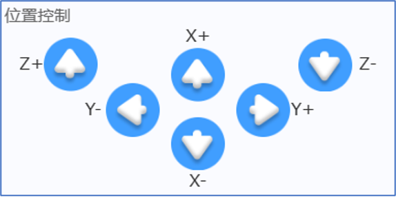

位置控制按键示意图

## 姿态控制

机器人末端可以基于世界坐标系（World）、基坐标系（Base）、末端工具坐标系（Arm_Tip）以及用户自定义的工作坐标系和工具坐标系来完成姿态控制，用户可以对末端进行不同坐标系下的示教。姿态示教时，末端位置不变，姿态绕指定坐标轴发生变化。对于RX，`负方向旋转`表示绕X轴负方向旋转，`正方向旋转`表示绕X轴正方向旋转。

**按钮表格**  

| 负方向旋转 |正方向旋转 |
|------|------|
|   |  |

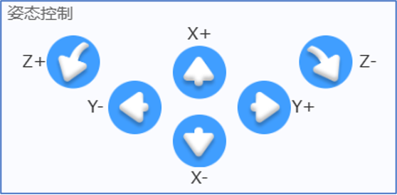

姿态控制按键示意图

## 步进模式设置

为了能够增加示教的精度，需要用到步进控制这个模式，能够让被控制的变量以步进的方式精确变化。

- 首先勾选“步进模式”选项框激活步进模式，进入步进控制方式。
- 用户可以通过点击步长数值左右两边的按钮来调整机器人运动相应的步长。
- “位置”：表示在位置控制区，点击一次某个方向按钮，末端在相应方向平移的距离，单位为毫米（移动的过程中不得松开该按钮，松开后将中途停止）。
- “姿态”：表示在姿态控制区，末端姿态运动的角度，单位可选为弧度（rad）或者度（°）。
- “关节”：表示在关节控制区，控制相应关节运动的角度，单位为度（°）。
- 步进控制只对末端控制及关节轴控制有效。

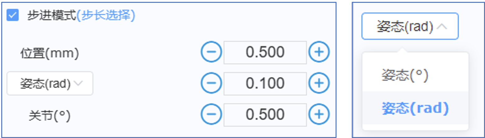

步进模式示意图

## 位姿编辑

1. 通过拖动进度条滑块或者拖动3D仿真区域中红色虚拟模型各关节可大体调节机械臂各关节角度。
2. 通过`+`和`-`按钮可微调关节角度以及位置姿态，同时也可直接输入参数调整。调整后的机械臂位置姿态由红色虚拟模型表示。
3. 长按`应用`按钮则机械臂运行至红色虚拟模型位置，松开按钮机械臂停止，点击`还原`按钮则红色虚拟模型恢复至真实机械臂相同位置。

**按钮表格**  

| 进度条滑块 | “+”和“-”按钮             |“应用”按钮             |“还原”按钮             |
|------|------------------|------------------|------------------|
|   |  |  |       |

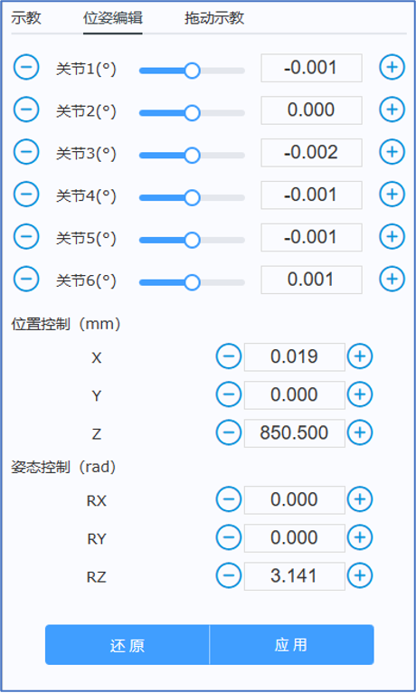

位姿编辑示意图

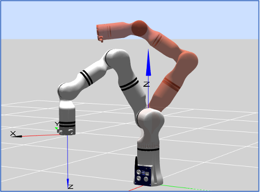

红色虚拟模型

## 拖动示教

在机械臂末端法兰外壳上有两个按钮，分别控制机器人进行拖动示教和轨迹复现。

按住机械臂末端绿色按钮，机械臂将处于可拖动状态，拖动机械臂末端进行轨迹记录，松开绿色按钮即完成轨迹记录。末端按钮位置如图所示。

点击机械臂末端蓝色按钮，机械臂自动回到轨迹起始位置，并进行一次轨迹复现（机械臂只复现最后一次记录的拖动轨迹）。

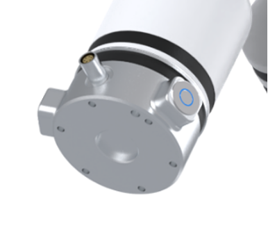

## 拖动示教轨迹裁剪

通过拖动示教保存的轨迹，可在此处选择运行或者裁剪。点击下拉框，选择要运行的轨迹，点击“轨迹运行”按钮运行轨迹，运行过程中可点击“停止运行”按钮随时停止，运行完毕后需点击“停止运行”手动停止。

拖动进度条两端的滑块可对轨迹进行裁剪，如下图所示，拖动滑块时红色虚拟机械臂可实时展示轨迹中每个点的位姿的描述，以方便用户确定裁剪点。裁剪完成后点击“保存”按钮裁剪后的轨迹将会把原轨迹覆盖保存，点击“另存为”按钮裁剪后的轨迹将另存为一条新的轨迹。

**按钮表格**  

| 下拉框 | 轨迹运行             |停止运动             |保存             |另存为             |
|------|------------------|------------------|------------------|------------------|
|   |  |  |       |       |

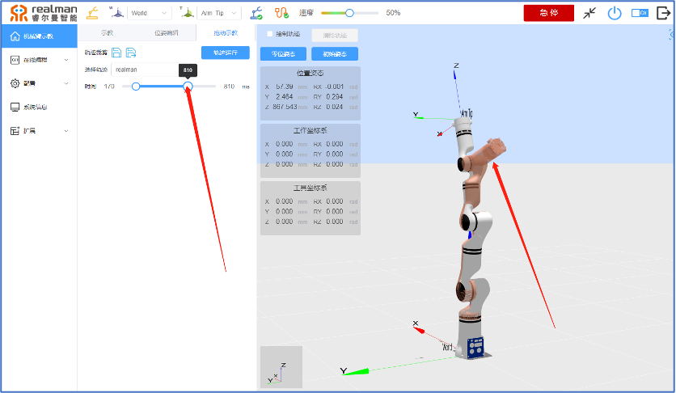

轨迹裁剪示意图

## 示教坐标系选择

选进行运动。选择工具坐标系，机器人运动将按照工具端坐标系方向进行运动。

运动坐标系选择示意图

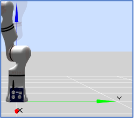

工作坐标系运动示意图

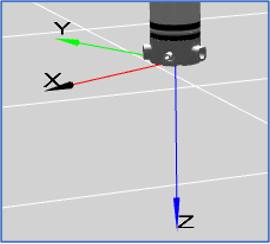

工具端运动示意图

## 绘制、清除轨迹

打开“绘制轨迹”功能，在模型预览区将实时显示机器人末端运行轨迹线。

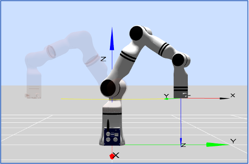

绘制轨迹示意图

打开“清除轨迹”功能，在模型预览区将清除机器人运行轨迹线。

清除轨迹示意图

## 一键回位按钮

点击“一键回位”按钮，3D仿真模型视图可快速恢复到初始视图。

  

一键回位按钮

## 零位姿态按钮

零位姿态：长按“零位姿态”按钮可使机器人回到零位。松开按钮运动停止。

  

零位姿态按钮

## 初始姿态按钮

初始位置：长按“初始姿态”按钮可使机器人回到初始位置。用户可以通过示教器界面来任意设定机器人初始位置（初始位置设定方法，详见8.4.2.4）。松开按钮运动停止。

  

初始姿态按钮

## 机器人位置姿态参数显示

位置下的X、Y、Z表示工具法兰中心点（选定的工具坐标系）在选定坐标系（基坐标系、末端坐标系、用户自定义坐标系）下的坐标值，姿态下的RX、RY、RZ 表示相对于选定坐标系旋转的弧度值。

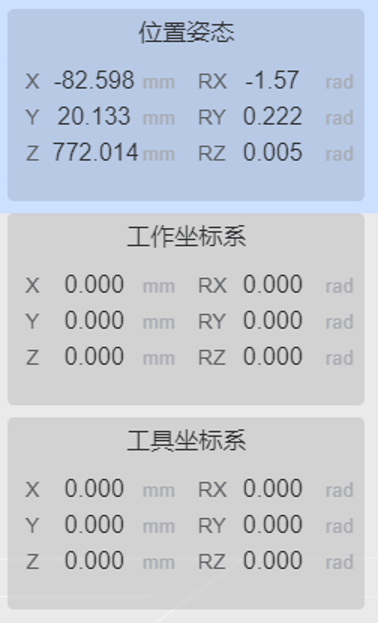

末端位姿显示示意图

## 3D仿真模型

机器人仿真界面的作用是为了脱离真实机械臂，验证用户编写的程序。用户可以根据仿真环境来检验机器人的控制程序是否合理。此外，模型区域有以下功能可方便用户的使用。

- 仿真模型可以根据需要，拖动鼠标（或触摸平板界面）改变大小及方向。
- 红色虚拟机械臂的每个关节都可以使用鼠标拖动，拖动超出限位时页面顶端会有弹窗提示。
- 当某关节报错时，模型对应关节会变成红色来示警。

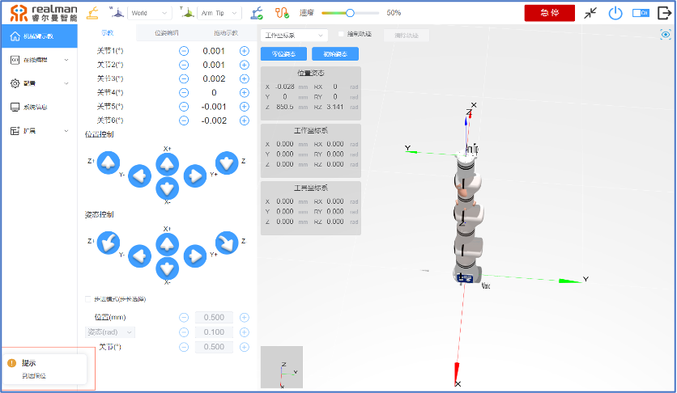

拖动超限提示

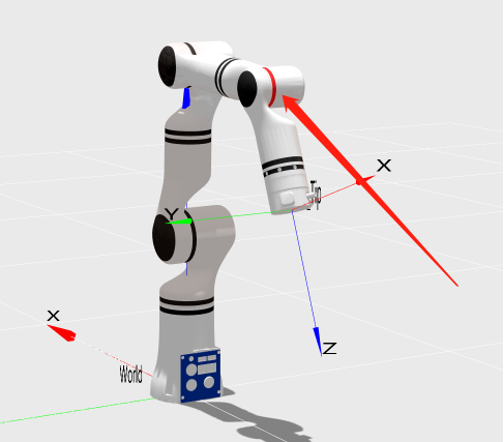

关节报错

