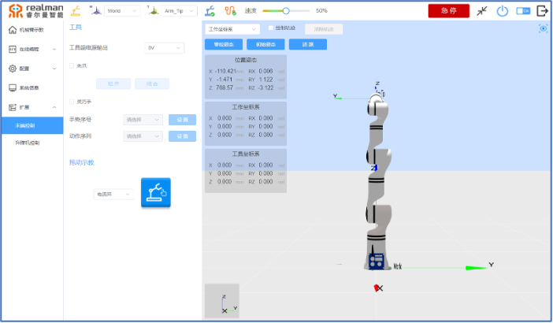
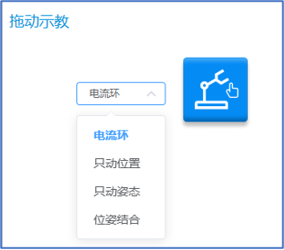
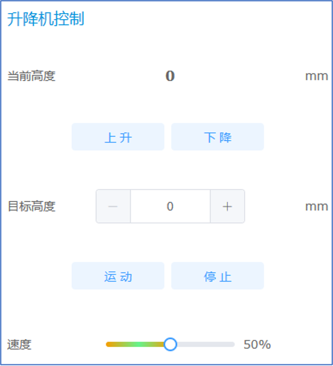
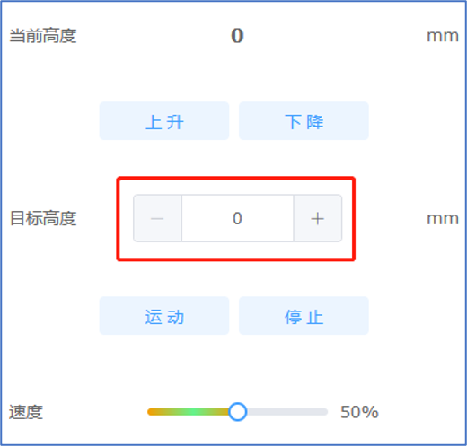
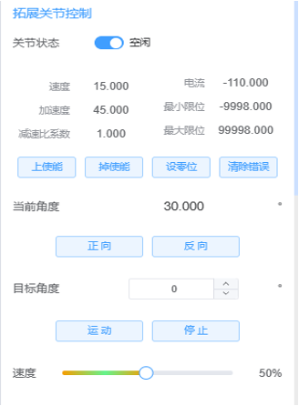

# 
入门指南：
扩展

在示教器的扩展界面可对末端工具进行配置和拖动示教的设置如下图所示：

扩展界面示意图

## 末端控制

### 末端工具

在示教器的扩展界面可对末端工具进行配置，并可切换工具端对外的输出电压，对末端手爪进行简单的控制，如下图所示：

末端工具控制界面

电源输出：该部分可配置末端接口板对外的输出电源，可配置为0V,12V和24V。

外接设备：目前工具端默认加定制手爪和灵巧手，后续可增加其它设备。夹爪控制，松开和闭合按钮分别控制手爪的张开和闭合；灵巧手控制，可通过设置灵巧手的手势序号和序列序号，来设置手势和动作序列。

### 拖动示教

除了通过机器人示教界面记录点位，运行轨迹之外，机器人还支持拖动示教功能，我们可以直接按住机器人末端的绿色按钮进行轨迹记录，完成动作后，松开绿色按钮。也可以在示教器上点击`开始拖动示教`按钮，然后拖动机器人。完成后再次点击`完成拖动示教`，完成轨迹记录，弹出保存窗口，可根据需求来选择是否保存轨迹文件。

轨迹记录完成后，点击机器人末端的蓝色按钮，可对轨迹进行复现。

**按钮表格**  

| 开始拖动示教 |完成拖动示教 |
|------|------|
|   |  |

拖动轨迹保存

拖动示教包括：电流环、只动位置、只动姿态、位姿结合四种方式。

拖动示教方式

::: warning 注意
只动位置、只动姿态、位姿结合三种方式需配合六维力传感器使用，否则将出现错误提示.
:::

拖动示教错误

当机器人末端工具为我公司标配的两指手爪时，在拖动示教过程中，除了可记录机器人运动轨迹之外，还可以记录手爪动作。长按绿色按钮拖动示教的同时，长按蓝色按钮，手爪关闭；短按蓝色按钮，手爪打开。

## 升降机控制、拓展关节控制

在示教器的扩展界面可对升降机控制进行参数配置如下图所示：

升降机控制

可对当前高度进行上升或下降，也可以设置目标高度后点击“运动”按钮使升降机到达目标高度。如下图所示：

升降机参数设置

在示教器的扩展界面可对拓展关节进行控制参数配置如下图所示：

升降机参数设置

在连接拓展关节后会显示当前速度、加速度、电流、最大最小限位、减速比系数。为了防止关节在连接上后有错误，请在连接后先清除关节错误，再点击上使能。拓展关节可向正向运动或者反向运动。可设置目标角度运动，在下方可调节拓展关节运动速度。
