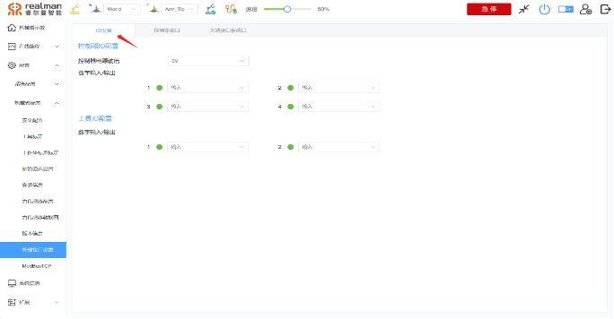
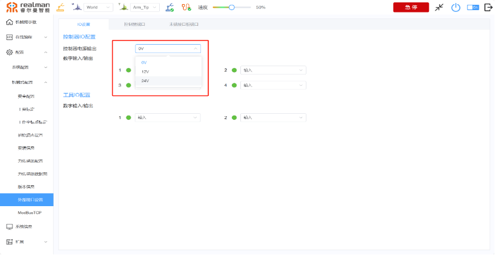
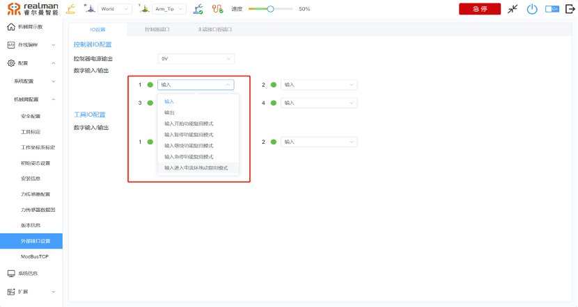
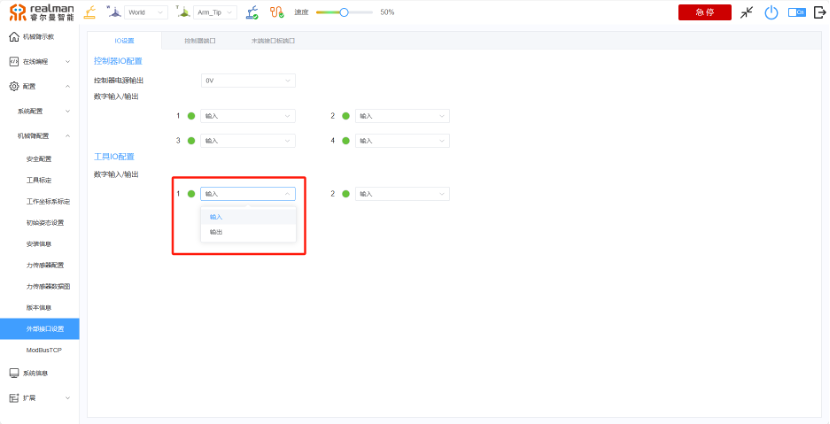
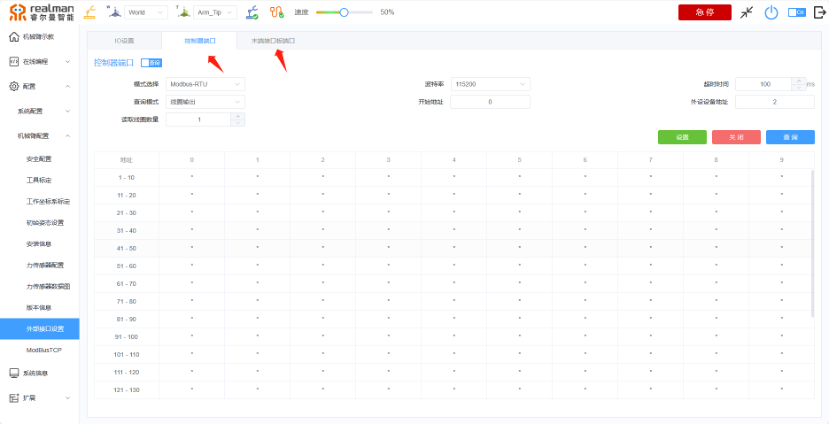
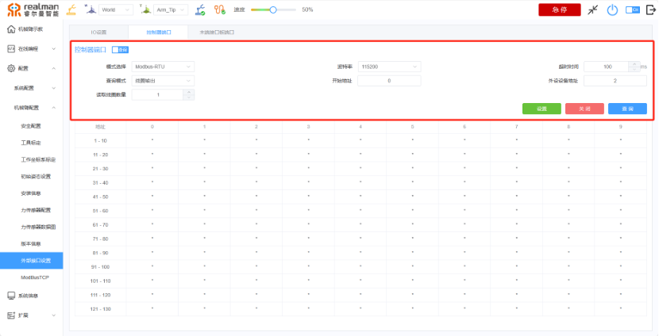
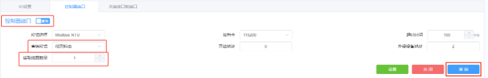
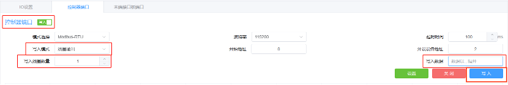

# 
入门指南：
外部接口设置

外部接口设置在配置、机械臂配置、外部接口设置。内容分别为IO设置、控制器端口、末端接口板端口。同时控制器端口、末端接口板端口内置modbus-RTU 功能可以通过左侧选择栏完成对RS485以及modBus-RTU的一系列设置。已设置的模式会自动获取，并回显到页面中。在modbus-RTU模式下，选择模式后可以在右侧查看实时数据

## IO设置

控制器IO配置，包括控制器电源输出、数字输出/输入。工具IO配置，包括数字输入/输出。

### 控制器电源输出

在点击框内0V 时会出现0V、12V、24V，三个选项。对应三个电压输出提供使用。

### 数字输出/输入

里面包括了4个相同的模块在点击后会弹出输入、输出、输入开始功能复用模式、输入暂停功能复用模式、输入继续功能复用模式、输入急停功能复用模式、输入进入电流环拖动复用模式，等相应功能。

### 工具IO配置

里面包含数字输出/输入，有两个相同的模块再点击后会弹出输出和输入两个选项以供使用。

## modbusRTU设置

在功能中分为控制器端口和末端接口板端口 用户可以通过选择栏对应的功能完成对modBus-RTU的一系列设置。在modbus-RTU模式下，选择模式后可以在下方查看实时数据。

### 控制器端口、末端接口板端口

控制器端口和末端接口板端口页面内容均涵盖有模式选择、波特率、超时时间、查询模式、开始地址、外设设备地址、读取线圈数量、设置、关闭、查询等操作。

点击页面控制器端口/末端接口板端口时，查询按钮时查询模式会切换到写入模式。其中查询按钮变成写入按钮、查询模式、读取线圈数量、会变成写入模式和写入线圈数量，写入数据操作对比图如下。

