# 
入门指南：
示教器使用说明

## 机械臂示教

示教器软件面板用于机器人示教操作，用户通过点击面板上的图标来移动机器人。同时面板也会把机器人的运动信息反馈给用户。

机器人示教面板

**机器人示教面板各功能区域名称**  

| 序号 | 名称             |
|------|------------------|
| 1    | 菜单栏选项       |
| 2    | 工作模式选择     |
| 3    | 工作坐标系选择   |
| 4    | 工具坐标系选择   |
| 5    | 机械臂状态显示   |
| 6    | 网络连接状态显示 |
| 7    | 速度百分比显示   |
| 8    | 机器人急停按钮   |
| 9    | 全屏按钮         |
| 10   | 机器人电源开关   |
| 11   | 中英文切换       |
| 12   | 退出登录         |
| 13   | 关节示教         |
| 14   | 位置示教         |
| 15   | 姿态示教         |
| 16   | 步进模式设置     |
| 17   | 位姿编辑         |
| 18   | 拖动示教轨迹编辑 |
| 19   | 运动坐标系选择   |
| 20   | 绘制、清除轨迹   |
| 21   | 一键回位按钮     |
| 22   | 零位姿态按钮     |
| 23   | 初始姿态按钮     |
| 24   | 当前位姿、坐标系 |
| 25   | 3D仿真模型       |

下面将按照上表的顺序，依次对各区域/按键进行说明：

### 菜单栏选项

点击菜单栏的选项名称可以切换到对应名称面板，方便用户操作。选中的面板呈现蓝色背景。

菜单栏选项

### 工作模式选择

黄色图标代表选择真实模式，此时程序在真实机器人上运行，机器人会按照指令来运动，界面会显示机器人参数及机械臂运动状态图像。

灰色图标代表选择仿真模式，此时真实机器人不运动，只移动3D仿真模型。完成一个机器人程序，可先选择仿真模式，通过仿真模式来验证程序是否可行，以提高机器人应用的安全性以及规划轨迹是否可达。

工作模式选择

### 工作坐标系选择

用户可以选择工作坐标系对机器人运动状态进行控制。在示教器界面选择基坐标系（Base）控制机器人，机器人将会以如图8-8所示的坐标系方向进行移动。用户也可以根据实际项目需求，创建自己所需的工作坐标系作为机器人移动的参考方向，假设work1为用户自己设定的工作坐标系（设定机器人工作坐标系的方法见8.4.2.3），设定完成后可进行工作坐标系切换，如图8-9所示。

机器人基坐标系示意图

工作坐标系选择示意图

### 工具坐标系选择

工具坐标系可通过下拉菜单选择，默认显示的位姿目标是法兰盘中心（如图8-11所示），用户自己可以设定工具坐标系，假设tool1为用户自己设置的工具坐标系（设定机器人工具坐标系的方法见8.4.2.2），设定完成后可进行工具坐标系切换，如图8-12所示。

机器人末端法兰盘中心坐标系

工具坐标系选择示意图

### 机械臂状态显示

当机器人发生错误时，会在此处提示错误，点击图标可打开错误提示列表（如图8-13所示）。

机械臂错误状态显示

### 网络连接状态显示

当与机器人连接正常时，变为绿色，断开通讯时，变为红色。

网络连接状态显示

### 速度显示

此处可拖动滑动条来设置机器人运动速度占最大速度的百分比。

速度设置示意图

在使用位姿编辑时，此处可设置长按加减按钮时的数据变化速度。

### 机器人急停按钮

按下急停按钮后，机器人以最大速度停止，再次按下，取消急停，可重新对机械臂进行操作。

机器人急停按钮

### 全屏按钮

该按钮用来控制示教界面进入全屏和退出全屏。

界面全屏按钮

### 电源按钮

该按钮用来控制机器人的电源开关，蓝色代表机器人电源处于开启状态，灰色代表机器人电源处于关闭状态。

机器人电源开关

### 中英文切换

点击中英文切换按钮可进行中文版示教器与英文版示教器的切换。

中英文切换

### 退出登录

点击退出登录按钮退出登录。

退出登录

### 关节控制

机器人一共有6个自由度，从下到上的每个关节分别命名为关节1\~关节6，分别对应机器人的六个关节。用户只需要使用示教界面上的关节控制按钮就可以控制每个机器人关节的转动。表示增大该关节角度，表示减小该关节角度,单位：度。

关节控制示意图

### 位置控制

机器人末端可以基于世界坐标系（World）、基坐标系（Base）、末端工具坐标系（Arm_Tip）以及用户自定义平面坐标系来完成位置控制，用户可以对末端进行不同坐标系下的示教。对X轴，表示向X轴负方向运动，表示向X轴正方向运动。长按按钮，机器人进行移动，松开后，机器人停止运动。其余轴向同理。

位置控制按键示意图

### 姿态控制

机器人末端可以基于世界坐标系（World）、基坐标系（Base）、末端工具坐标系（Arm_Tip）以及用户自定义的工作坐标系和工具坐标系来完成姿态控制，用户可以对末端进行不同坐标系下的示教。姿态示教时，末端位置不变，姿态绕指定坐标轴发生变化。对于RX，表示绕X轴负方向旋转，表示绕X轴正方向旋转。

姿态控制按键示意图

### 步进模式设置

为了能够增加示教的精度，需要用到步进控制这个模式，能够让被控制的变量以步进的方式精确变化。

- 首先勾选“步进模式”选项框激活步进模式，进入步进控制方式。
- 用户可以通过点击步长数值左右两边的按钮来调整机器人运动相应的步长。
- “位置”：表示在位置控制区，点击一次某个方向按钮，末端在相应方向平移的距离，单位为毫米（移动的过程中不得松开该按钮，松开后将中途停止）。
- “姿态”：表示在姿态控制区，末端姿态运动的角度，单位可选为弧度（rad）或者度（°）。
- “关节”：表示在关节控制区，控制相应关节运动的角度，单位为度（°）。
- 步进控制只对末端控制及关节轴控制有效。

步进模式示意图

### 位姿编辑

1. 通过拖动进度条滑块或者拖动3D仿真区域中红色虚拟模型各关节可大体调节机械臂各关节角度。
2. 通过“+”和“-”按钮可微调关节角度以及位置姿态，同时也可直接输入参数调整。调整后的机械臂位置姿态由红色虚拟模型表示。
3. 长按“应用”按钮则机械臂运行至红色虚拟模型位置，松开按钮机械臂停止，点击“还原”按钮则红色虚拟模型恢复至真实机械臂相同位置。

**按钮表格**  

| 进度条滑块 | “+”和“-”按钮             |“应用”按钮             |“还原”按钮             |
|------|------------------|------------------|------------------|
|   |  |  |       |

位姿编辑示意图

红色虚拟模型

### 拖动示教

在机械臂末端法兰外壳上有两个按钮，分别控制机器人进行拖动示教和轨迹复现。

按住机械臂末端绿色按钮，机械臂将处于可拖动状态，拖动机械臂末端进行轨迹记录，松开绿色按钮即完成轨迹记录。末端按钮位置如图所示。

点击机械臂末端蓝色按钮，机械臂自动回到轨迹起始位置，并进行一次轨迹复现（机械臂只复现最后一次记录的拖动轨迹）。

### 拖动示教轨迹裁剪

通过拖动示教保存的轨迹，可在此处选择运行或者裁剪。点击下拉框，选择要运行的轨迹，点击“轨迹运行”按钮运行轨迹，运行过程中可点击“停止运行”按钮随时停止，运行完毕后需点击“停止运行”手动停止。

拖动进度条两端的滑块可对轨迹进行裁剪，如下图所示，拖动滑块时红色虚拟机械臂可实时展示轨迹中每个点的位姿的描述，以方便用户确定裁剪点。裁剪完成后点击“保存”按钮裁剪后的轨迹将会把原轨迹覆盖保存，点击“另存为”按钮裁剪后的轨迹将另存为一条新的轨迹。

**按钮表格**  

| 下拉框 | 轨迹运行             |停止运动             |保存             |另存为             |
|------|------------------|------------------|------------------|------------------|
|   |  |  |       |       |

轨迹裁剪示意图

### 示教坐标系选择

选进行运动。选择工具坐标系，机器人运动将按照工具端坐标系方向进行运动。

运动坐标系选择示意图

工作坐标系运动示意图

工具端运动示意图

### 绘制、清除轨迹

打开“绘制轨迹”功能，在模型预览区将实时显示机器人末端运行轨迹线。

绘制轨迹示意图

打开“清除轨迹”功能，在模型预览区将清除机器人运行轨迹线。

清除轨迹示意图

### 一键回位按钮

点击“一键回位”按钮，3D仿真模型视图可快速恢复到初始视图。

一键回位按钮

### 零位姿态按钮

零位姿态：长按“零位姿态”按钮可使机器人回到零位。松开按钮运动停止。

零位姿态按钮

### 初始姿态按钮

初始位置：长按“初始姿态”按钮可使机器人回到初始位置。用户可以通过示教器界面来任意设定机器人初始位置（初始位置设定方法，详见8.4.2.4）。松开按钮运动停止。

初始姿态按钮

### 机器人位置姿态参数显示

位置下的X、Y、Z表示工具法兰中心点（选定的工具坐标系）在选定坐标系（基坐标系、末端坐标系、用户自定义坐标系）下的坐标值，姿态下的RX、RY、RZ 表示相对于选定坐标系旋转的弧度值。

末端位姿显示示意图

### 3D仿真模型

机器人仿真界面的作用是为了脱离真实机械臂，验证用户编写的程序。用户可以根据仿真环境来检验机器人的控制程序是否合理。此外，模型区域有以下功能可方便用户的使用。

- 仿真模型可以根据需要，拖动鼠标（或触摸平板界面）改变大小及方向。
- 红色虚拟机械臂的每个关节都可以使用鼠标拖动，拖动超出限位时页面顶端会有弹窗提示。
- 当某关节报错时，模型对应关节会变成红色来示警。

拖动超限提示

关节报错

## 在线编程

### 图形化编程

用户可通过“图形化编程”界面，对RM65系列机器人进行编程操作，实现机器人的复杂运动。

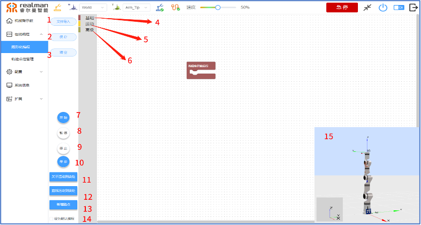

图形化编程界面

**图形化编程界面**  

| 序号 | 名称           |
|------|----------------|
| 1    | 本地导入按钮   |
| 2    | 保存按钮       |
| 3    | 清空按钮       |
| 4    | 基础指令       |
| 5    | 运动指令       |
| 6    | 高级指令       |
| 7    | 开始按钮       |
| 8    | 暂停按钮       |
| 9    | 停止按钮       |
| 10   | 单步按钮       |
| 11   | 关节运动到该处 |
| 12   | 直线运动到该处 |
| 13   | 新增路点       |
| 14   | 设置默认编程   |
| 15   | 模型预览       |

下面将按照上表的顺序，依次对各区域/按键进行说明：

#### 本地导入按钮

对于已经建立的工程，单击”本地导入“按钮，弹出当前编辑中的文件是否需要保存弹窗提示，点击继续导入，选择好工程文件并单击“打开”后，文件将显示在右侧的文本框内，工程文件后缀为.txt。

例如：选择名为“program2023_04_14 16_12_27.txt”的文件。

**按钮表格**  

| 本地导入 |
|------|
|   |

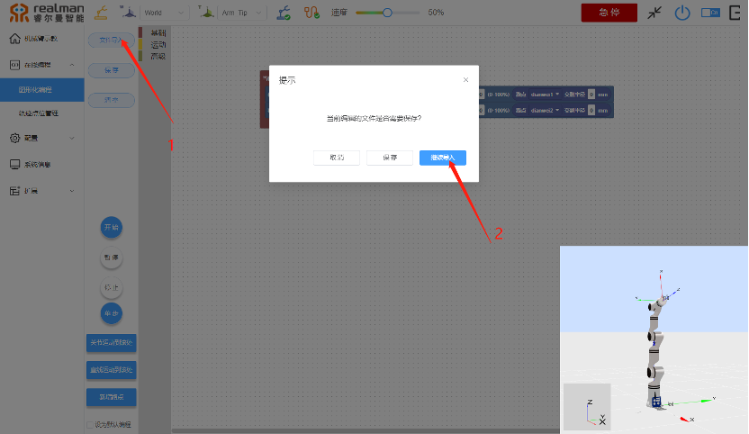

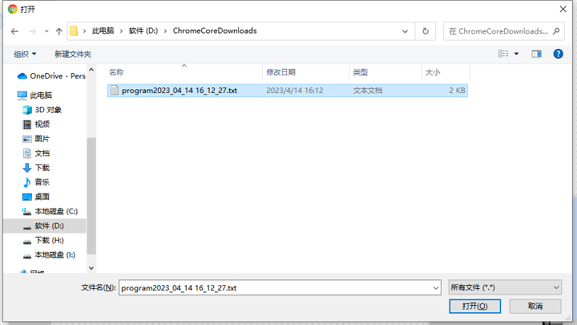

本地导入工程

#### 保存按钮

单击”保存“按钮后，工程内容显示区域中的数据将会下载到设置的下载路径中，文件名为“program 日期 时间”，如“program2023_07_19 18_02_17”，后缀为.txt。

**按钮表格**  

| 保存 |
|------|
|   |

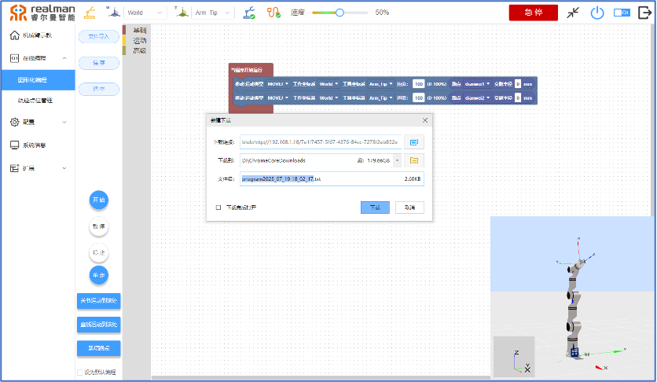

工程保存示意图

#### 保存在线编程文件

在图形化编程界面里编写运行的程序后，勾选左下角的“保存编程文件”选项，之后点击”开始“会出现弹窗提示，设置编程文件的名称（需用数字命名）后点击开始，保存好的编程文件在数据管理-编程文件下，保存的文件可以通过TCP或者Modbus直接调用。

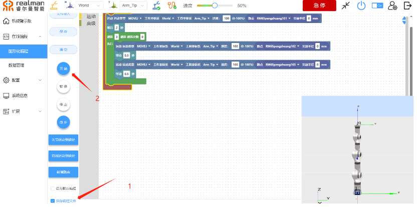

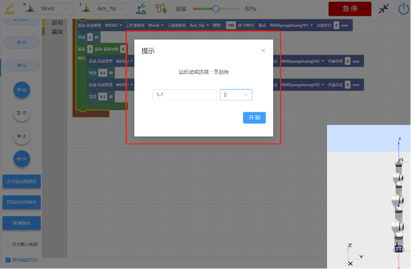

编程文件命名示意图

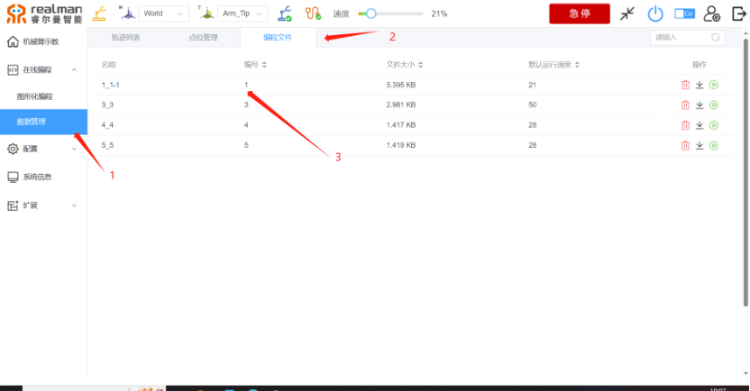

编程文件路径示意图

#### 清空按钮

**按钮表格**  

| 清空 |
|------|
|   |

单击”清空“按钮后，将清空编程区域的内容，若当前有正在编辑的工程，将弹出“确认清空？”提示框，根据实际需求单击“确定”进行清空，或单击“取消”放弃。

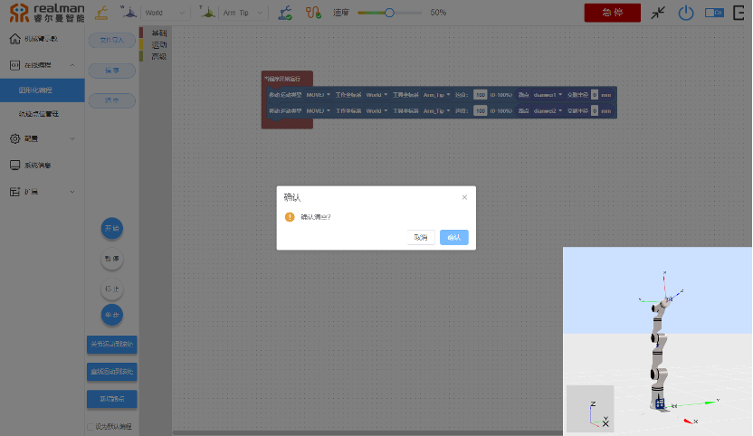

确认清空提示

#### 基础指令

基础指令包含“初始模块”、“等待”、“设置”、“判断”、“循环”、“终止”、“弹窗”、“文件”8个指令。

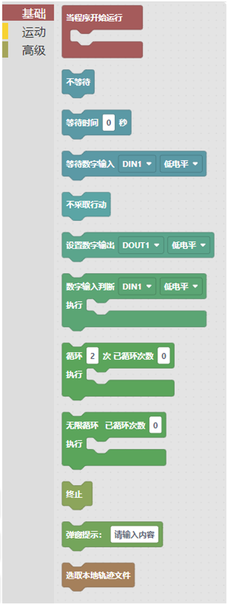

基础指令

##### 初始模块

“**初始模块**”为每次编程必须添加的模块，添加在程序的开始。不添加该模块点击开始则示教器界面顶部弹窗提示“请添加初始模块”。

初始模块

未添加初始模块提示

##### 等待指令

“**等待**”指令用于等待时间或信号输入。可选择为不等待、等待时间、等待数字输入。

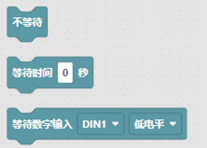

等待指令

**不等待：** 不设置等待条件。

**等待时间**：用户可设置等待时间，单位：秒。

**等待数字输入：** 等待数字信号输入接口满足设定条件。包括控制器端数字输入接口DIN1、DIN2、DIN3、DIN4和工具端数字输入接口T_DIN1、T_DIN2。数字输入分为高电平和低电平两种电位。

**程序示例：** 在程序段中添加一个等待2秒指令，在路点1与路点2之间示例如下图所示。

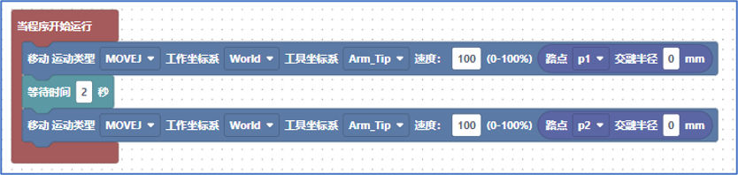

等待指令程序示例

##### 设置指令

“**设置**”指令用于设置数字输出接口状态。可选择为不设置、设置数字输出。

设置指令

**不采取行动：** 保持输出接口状态不变。

**设置数字输出：** 设置数字信号输出接口为指定状态。包括控制器端数字输出接口DON1、DON2、DON3、DON4和工具端数字输出接口T_DON1、T_DON2。数字输出分为高电平和低电平两种电位。

**程序示例：** 在程序段中添加一个设置指令，在路点2与路点3之间示例如下图所示。

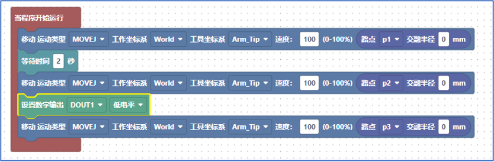

设置指令程序示例

在程序中，程序行5位置为设置模式，可设置数字输出为低电平或高电平如下图所示:

设置指令程序示例

##### 判断指令

“**判断**”指令用来判断是否执行分支程序。满足设定条件时执行分支程序，不满足时跳过分支程序。

判断指令

**数字输入判断：** 判断数字信号输入接口是否满足设定条件。包括控制器端数字输入接口DIN1、DIN2、DIN3、DIN4和工具端数字输入接口T_DIN1、T_DIN2。数字输入分为高电平和低电平两种电位。

**程序示例：** 在程序段中添加一个判断指令，在路点1与路点2之间示例如下图所示。

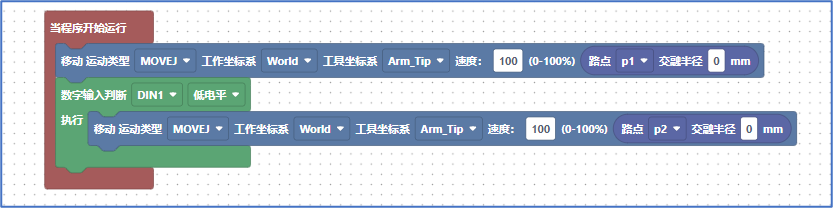

判断指令程序示例

在程序中，程序行3位置为判断模式，判断数字输入为低电平或高电平如下图所示:

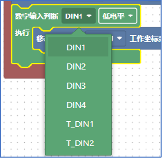

判断指令程序示例

##### 循环指令

“**循环**”指令表示重复执行程序指令。可设置为循环指定次数和无限循环。

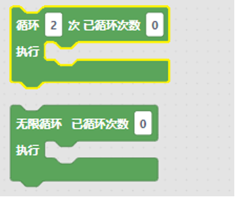

循环指令参数

**执行循环次数：** 程序循环执行指定次数。

**无限循环：** 无限次循环执行程序指令。

**程序示例：** 在程序段中添加一个循环指令，在路点1与路点2之间示例如下图所示。

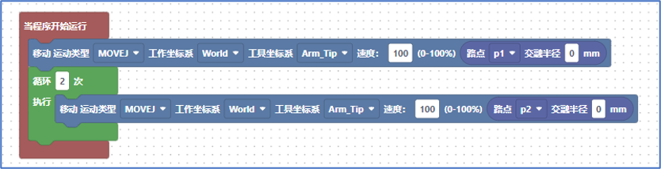

循环指令程序示例

在程序中，程序行最下方位置为循环模式，循环次数为两次。

##### 终止指令

“**终止**”程序运行至终止命令时，程序停止，不再执行终止命令以后的程序。

**程序示例：** 在程序段中添加一个终止指令，在路点8与路点9中添加终止指令

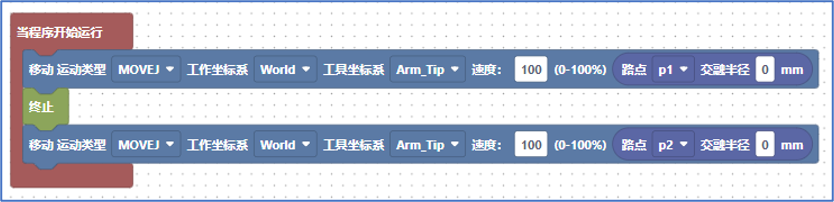

终止指令程序示例

在程序中，程序行3位置为终止指令，运动轨迹运动到该点位会终止程序下面轨迹路点2不再执行运动。

##### 弹窗指令

“**弹窗**”指令用来向用户进行信息提示，弹窗内容不得为中文。

弹窗指令参数

**程序示例：**在程序段中添加一个弹窗指令，在路点1下添加弹窗指令如下图所示：

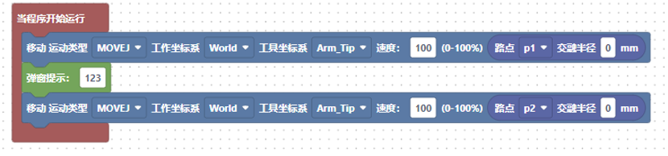

弹窗指令程序示例

在程序中，程序行3位置为弹窗模式，轨迹运动到该点位会弹出窗口

如下图所示:

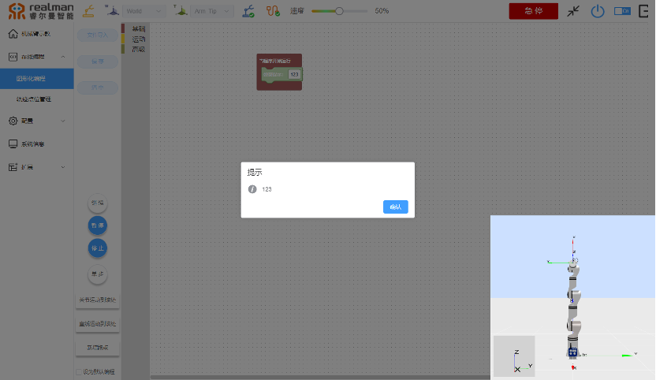

弹窗指令程序示例

根据提示需要确认后，程序继续执行。

#### 运动指令

运动指令包含“移动”、“路点”2个指令。

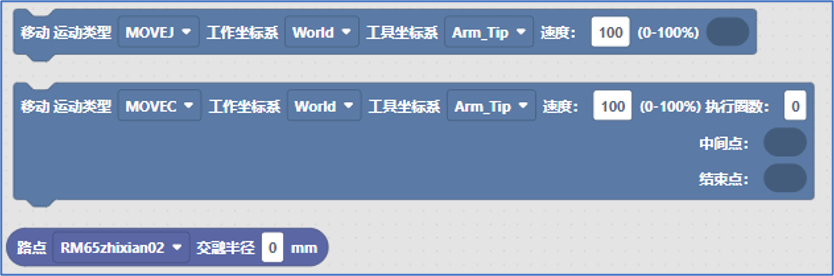

运动指令

##### 移动指令

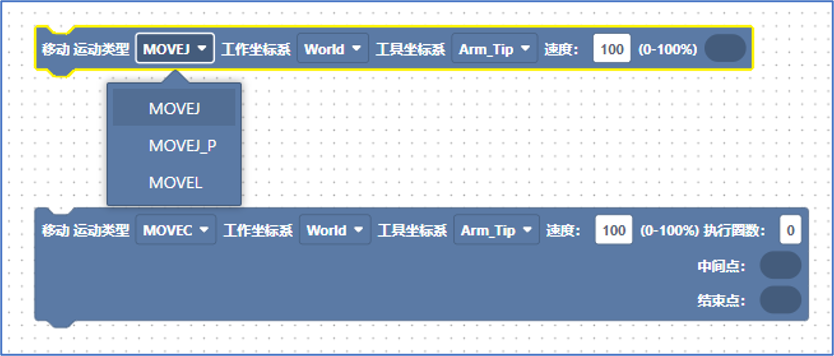

移动指令参数

移动指令分为“MOVEJ”、“MOVEJ_P”、“MOVEL”、“MOVEC”四种运动类型。

1. MOVEJ与MOVEJ_P指令：只保证最终路点位置，不对中间轨迹进行约束。
2. MOVEL指令：在保证最终路点位置的同时，保证两点之间轨迹为直线运动。
3. MOVEC指令：用来执行圆弧或圆形轨迹，只能添加两个路点（中间点和终点）。

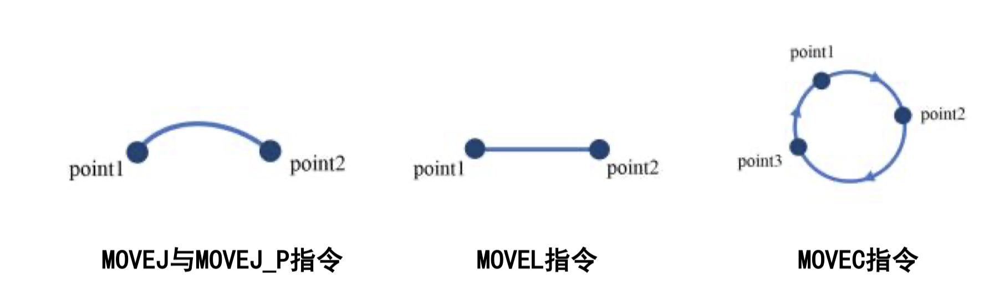

移动指令

**“移动”** 指令可对运动类型、运动速度、工作坐标系、工具坐标系进行设定。

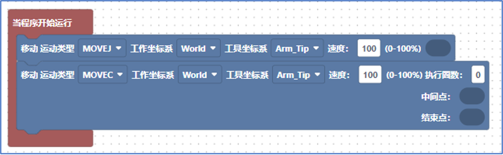

添加移动指令

**运动类型：** 包括“MOVEJ”、“MOVEL”、“MOVEJ_P”、“MOVEC”，分别表示关节运动、直线运动、和圆弧运动（当执行圈数为“0”时，执行圆弧轨迹；当执行圈数为大于等于1时，执行圆形轨迹）。其中“MOVEJ”与“MOVEJ_P”均为关节运动，但路点参数不同，“MOVEJ”的路点参数为各轴关节角度，“MOVEJ_P”为工具坐标点的位姿。

**运动速度：** 为该移动指令下路点的默认速度。

**工作坐标系：** 以实际工作位置设定的坐标系，支持用户创建。

**工具坐标系：** 以实际末端工具中心点设定的坐标系，支持用户创建。

**程序示例1：** 在程序段中添加一段MOVEJ运动轨迹，其中路点1至路点2之间的运动为MOVEJ，示例如下图所示。

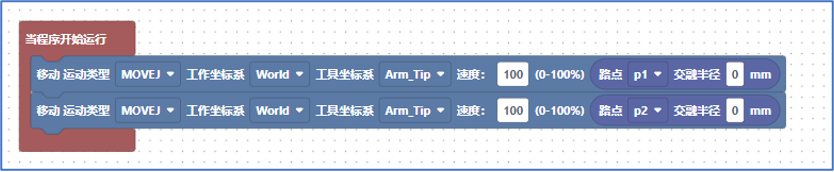

MOVEJ移动程序示例

**程序示例2：** 在程序段中添加一段MOVEL运动轨迹，示例如下图所示。

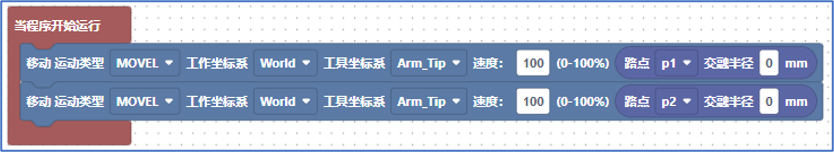

MOVEL移动程序示例

**程序示例3：** 在程序段中添加一段MOVEC运动轨迹，示例如下图所示。

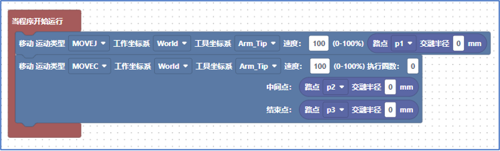

MOVEC移动程序示例

##### 路点指令

“**路点**”指令必须添加在“**移动**”指令下，作为机器人工作运动点位。该指令可选择事前保存的路点，可设置速度以及交融半径。

路点指令参数

**路点选择：** 用户可点击下拉框选择自己保存好的路点。

**交融半径：** 默认为0 ，无需更改。

**程序示例：** 在程序段中添加MOVEJ运动轨迹的一个路点，在路点p1下设置路点为p2，示例如下图所示。

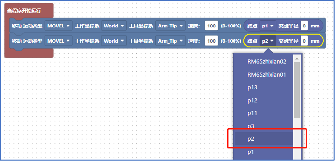

路点程序示例

#### 高级指令

高级指令包含“力控”、“夹爪”、“注释”、“灵巧手”、“升降机”5个指令。

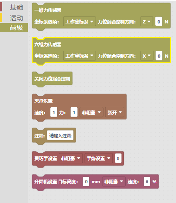

高级指令

##### 力控指令

“**力控**”指令只针对在机器人末端安装有力矩传感器的机器人（包括：RM65-6FI/RM75-6FI/RML63-6FI/ECO65-6FI）。设定参数包括传感器选项、坐标系选项、力位混合控制方向、力度值、打开或关闭力位混合控制模式。

力控指令参数

**传感器选项：** 六维力传感器。

**坐标系选项：** 选择力控参考坐标系。

**力位混合控制：** 可设定力位混合控制的方向和力度，六维力传感器可以选择X\\Y\\Z\\Rx\\Ry\\Rz中的一个方向。

**关闭力位混合控制：** 勾选关闭力位混合控制后，程序中后续移动指令将不再采用力位控制模式。

::: warning 注意

1. 通过力位混合控制移动的点位，必须通过笛卡尔坐标系进行参数记录，即不得包含MOVEJ指令。
2. RM65-B机器人不支持力控指令操作，连接标准版机械臂时在示教器中该模块为禁用状态。
3. 力控的前一个点位需和力控的第一个点保持一致。
4. 运行启动力控指令时，请勿对力传感器施加系统外的力，以免影响校准（编程参考程序示例）。
:::

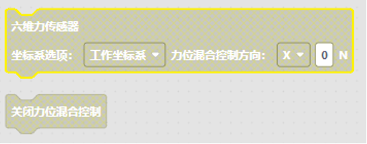

力控模块禁用状态

**程序示例：** 在程序段中添加一段力控轨迹，其中循环中的直线运动为力控过程，示例如下图所示。

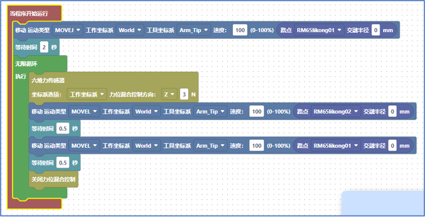

力控程序示例

##### 夹爪指令

“**夹爪**”指令用来控制两指夹爪动作。可进行速度、力度、阻塞模式、夹爪夹持动作的控制。

夹爪指令参数

**速度：** 设置夹爪运行速度。速度参数可设置为0-1000，最大速度70mm/s。

**力：** 设置夹爪夹持力度，力控参数可设置为0-1000，最大夹持力20N。

**阻塞模式：** 分为阻塞和非阻塞模式。阻塞模式下，夹爪运动完成后，机器人执行后续指令；非阻塞模式下，夹爪运动过程中，机器人同步执行后续程序。

**夹爪夹持动作：** 夹持动作包含张开和闭合两个动作。

**程序示例：** 在程序段中添加一个夹爪指令，示例如下图所示：

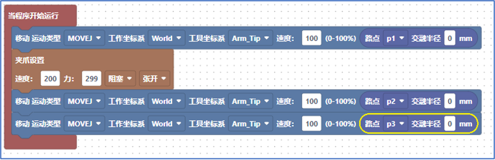

夹爪指令程序示例

在程序中，程序行2位置为夹爪阻塞模式打开，速度：200 力：200。

**夹爪闭合如下图所示：**

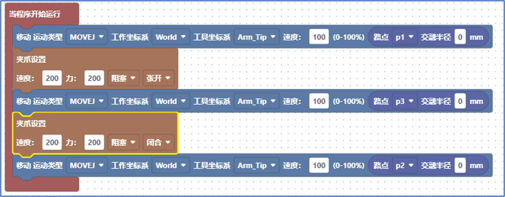

夹爪闭合指令程序示例

##### 注释指令

“**注释**”指令用来在程序中进行程序段功能解释说明。不进行任何机器人控制。注释内容不得输入中文。

注释指令参数

**程序示例：** 在程序段中添加一个注释指令，其中路点2与路点3之间添加一个注释指令，示例如下图所示：

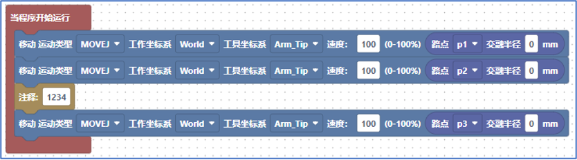

注释指令程序示例

##### 灵巧手指令

“**灵巧手**”指令用来控制五指灵巧手动作。可进行阻塞模式设置、手势设置、动作序号设置。

灵巧手指令参数

**阻塞模式：** 分为阻塞和非阻塞模式。阻塞模式下，灵巧手运动完成后，机器人执行后续指令；非阻塞模式下，灵巧手运动过程中，机器人同步执行后续程序。

**手势设置：** 灵巧手预存手势。

**动作序号设置：** 灵巧手预存的手势序号，可设置为1-40，每个序号代表1种手势动作。

**程序示例：** 在程序段中添加一个灵巧手指令，在路点1点位后添加一个灵巧手指令，示例如下图所示：

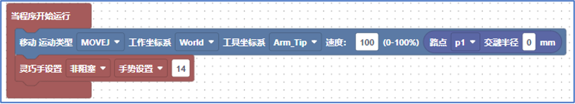

灵巧手指令程序示例

在程序中，程序行3位置为灵巧手指令，手势为：14 。

##### 升降机指令

“**升降机**”指令用来控制机器人扩展关节升降机或滑台的移动。可设定目标高度、阻塞模式和速度。

升降机指令参数

**目标高度：** 对升降机构进行位置控制，根据机器人实际工作位置进行位置设定，需注意升降机构实际行程。

**阻塞模式：** 分为阻塞和非阻塞模式。阻塞模式下，升降机构运动到位后，机器人执行后续指令；非阻塞模式下，升降机构运动过程中，机器人同步执行后续程序。

**速度：** 设置升降机构移动速度。参数设定范围为0-100。

**程序示例：** 在程序段中添加一段升降机轨迹，在路点1后添加升降机指令，示例如下图所示。

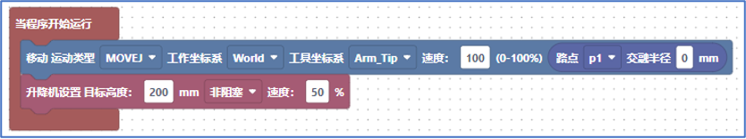

升降机指令程序示例

在程序中，程序行3位置为升降机指令，目标高度为：200mm 速度为：50%。

#### 开始按钮

当在线编程工程建立完成后，点击页面左下侧的”开始“按钮（该按钮被点击之后变为”继续“按钮）。轨迹自动运行过程中，当前运动编程点的背景颜色变为亮色。

**按钮表格**  

| 开始 | 继续             |
|------|------------------|
|   |  |

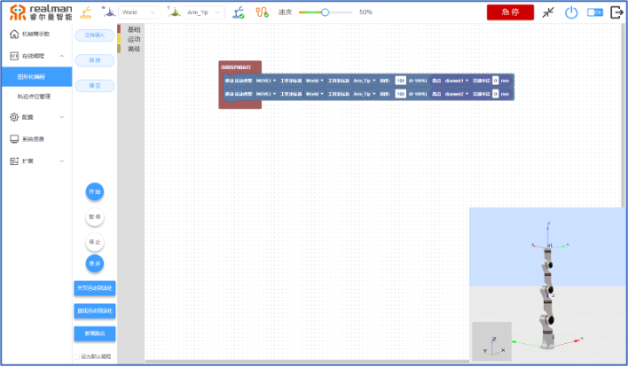

开始程序

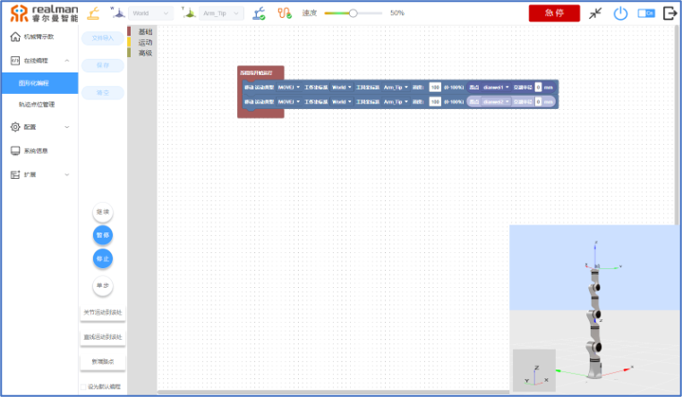

程序运行中

#### 暂停按钮

在机器人运动过程中点击”暂停“按钮，机器人将立即停止运动，当再次点击”继续“时，机器人将继续移动。

**按钮表格**  

| 暂停 | 继续             |
|------|------------------|
|   |  |

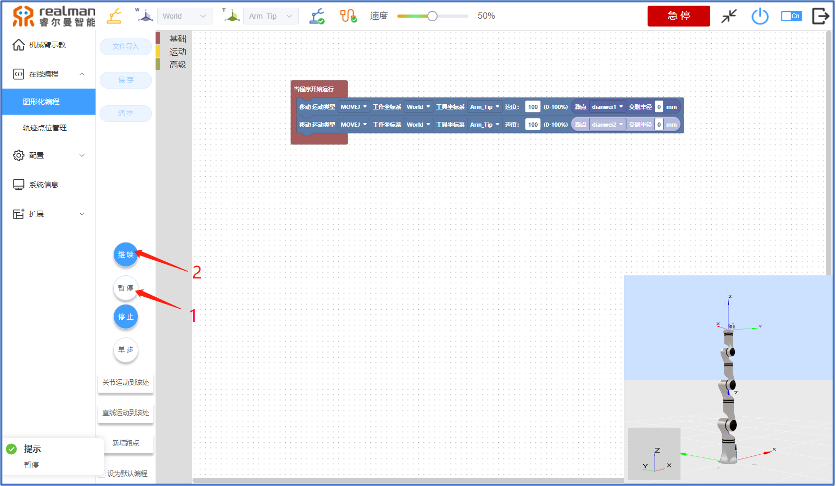

程序暂停与继续

#### 停止按钮

当点击”停止“按钮，结束该工程后，”继续“按钮内容恢复为”开始“。点击”停止“按钮，轨迹也会停止，不可继续。

**按钮表格**  

| 停止 | 继续             |开始             |
|------|------------------|------------------|
|   |  | |

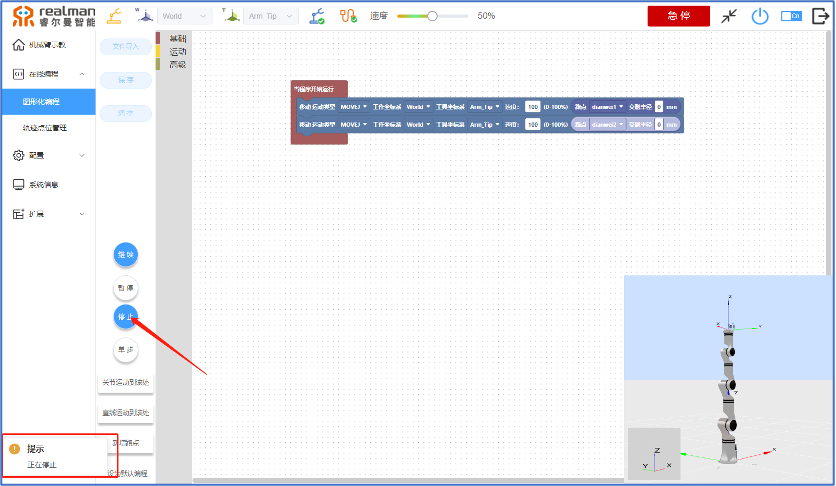

程序停止

#### 单步按钮

在线编程数据可单步运行。点击”单步“按钮，”开始“按钮变为”继续“按钮（配合暂停功能完成轨迹恢复）。单步模式下，程序逐条执行，当只有在完成一段轨迹后，再次点击单步按钮才能下发下一段轨迹命令。

**按钮表格**  

| 单步 | 开始             |继续             |
|------|------------------|------------------|
|   |  | |

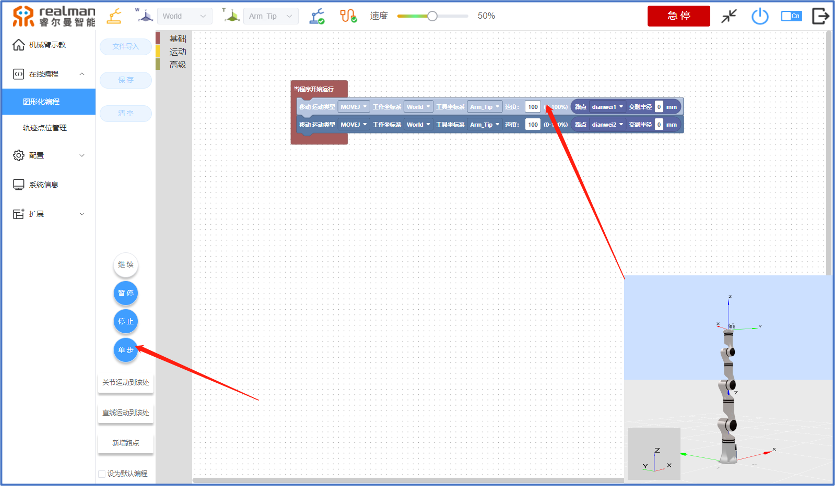

程序单步运行

#### 关节运动到该处

**按钮表格**  

| 关节运动到该处 |
|------|
|   |

该按钮只对“路点”指令有作用，用来控制机器人从当前位置以MOVEJ形式运动到目标点。首先在右侧程序显示栏中点击目标点（目标点选中状态为添加黄色边框），长按”关节运动到该处“按钮，就可以通过关节空间规划运动到该处，松开按钮运动停止。

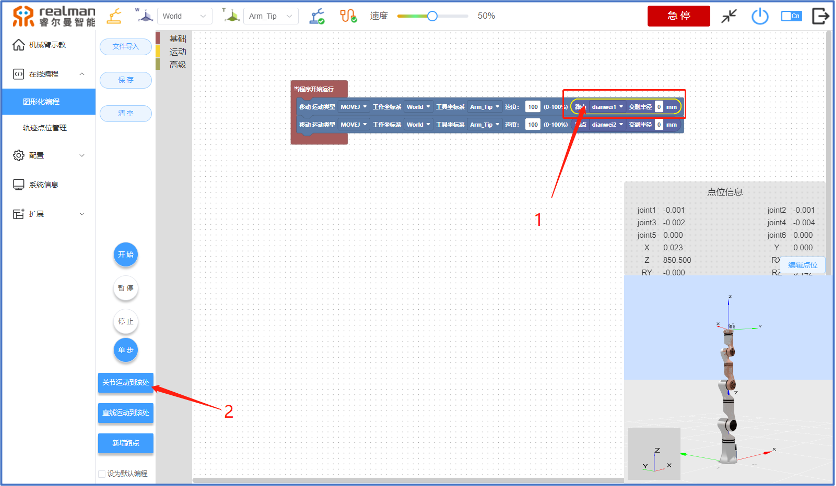

关节运动到该处

#### 直线运动到该处

该按钮只对“路点”指令有作用，用来控制机器人从当前位置以MOVEL形式运动到目标点。选中目标点后，长按”直线运动到该处“按钮，机器人末端就沿直线向目标点运动，松开按钮或者发生不可达时运动停止。

**按钮表格**  

| 直线运动到该处 |
|------|
|   |

直线运动到该处

#### 新增路点

用户可通过此功能保存常用点位，保存的点位可在点位管理中查看编辑，方便用户使用。

**新增路点示例：**

1. 点击”新增路点“按钮，页面自动跳转到机械臂示教页面。

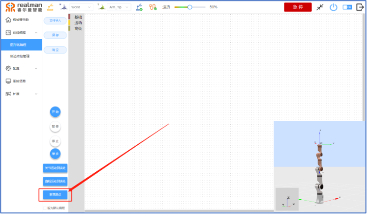

新增路点

2. 在此页面通过示教按钮、位姿编辑或者末端拖动示教按钮拖动使机械臂到达需要的点位。

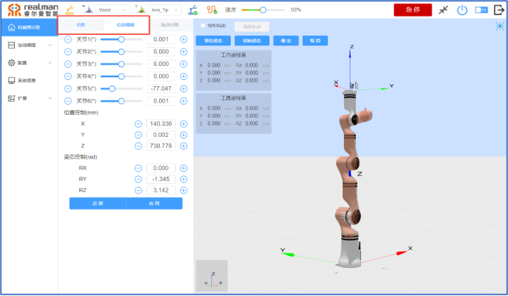

编辑路点

3. 点击”确定“按钮保存该点位。

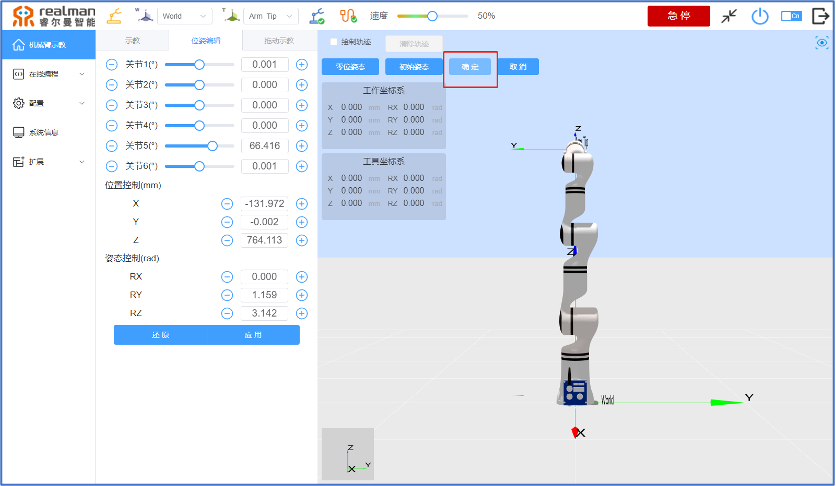

确定路点

4. 在弹出的保存弹窗中输入点位名称，点击确定即可保存成功。

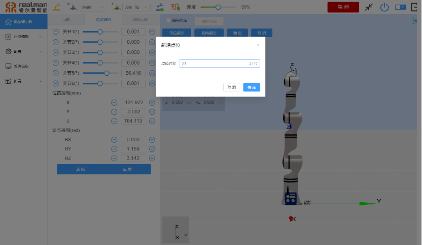

保存路点

#### 设置默认编程

勾选设置默认编程选项点击“开始”运行编程文件，该程序会作为默认在线编程文件保存在控制器中，通过设置控制器数字IO模式控制默认编程的运行。

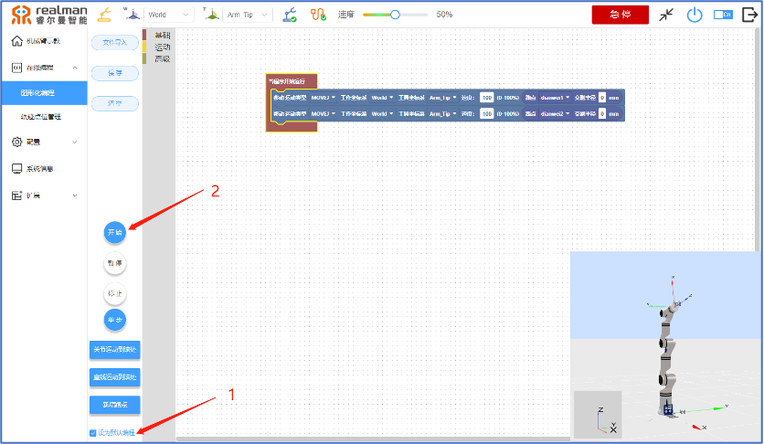

设置默认在线编程

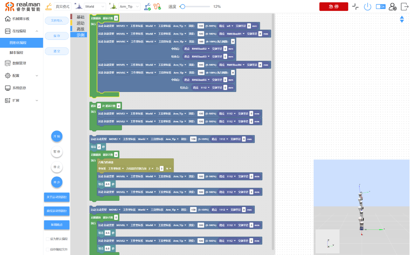

在线编程示例

控制器IO模式可设置如下：通用输入模式，通用输出模式、输入开始功能复用模式，输入暂停功能复用模式，输入继续功能复用模式，输入急停功能复用模式。

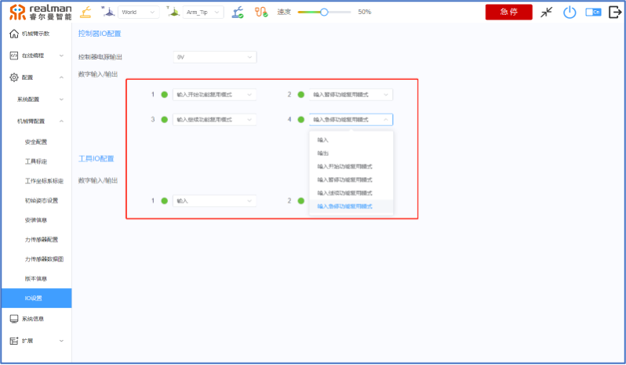

控制器数字IO

例如我们设置控制器数字IO四个通道依次为输入开始功能复用模式、输入暂停功能复用模式、输入继续功能复用模式、输入急停功能复用模式，且分别接通外部输入数字电源通道（OUT_P_IN+）和外部数字地通道（OUT_P_GND），打开控制器电源输出12V，此时，对应IO通道输入低电平会触发编程文件的开始、暂停、继续、急停操作。

