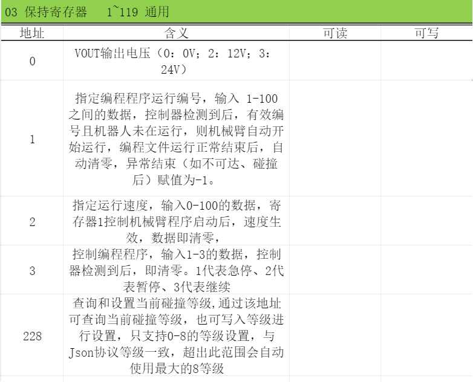
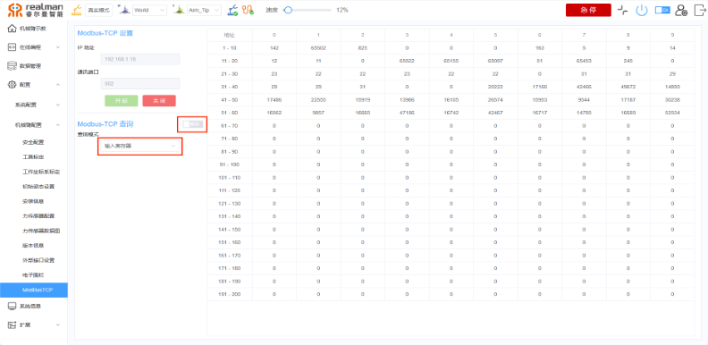
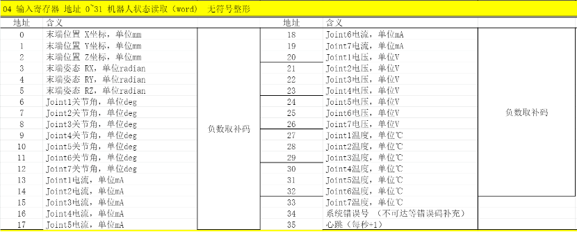
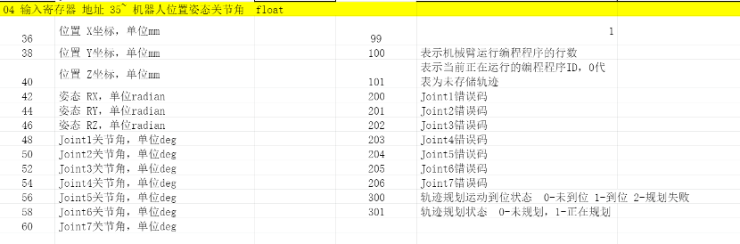
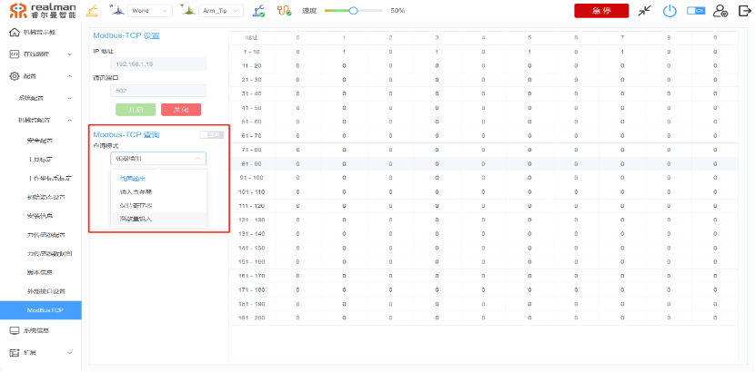
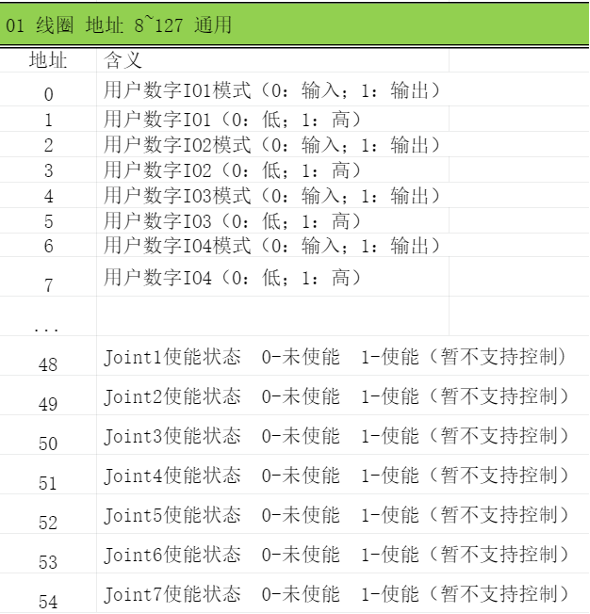
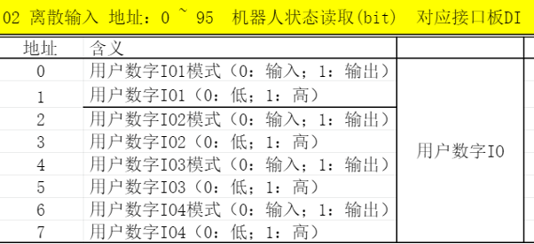

# 
入门指南：
MODBUS-TCP介绍

RM65 I系列机械臂可以通过MODBUS-TCP协议可以直接调用WEB示教器保存的编程文件，也可直接控制或者查询机械臂状态。

## 调用在线编程文件

（1）使用modbus-TCP协议，可以调用保存在数据管理里面已经编写好的点位。调用时在modbus-TCP设置页面，选择（写入模式）中（保持寄存器）按照以下方式进行操作便可调用。

## 控制机械臂

使用modbus-TCP协议，同样可以在对应寄存器内写入角度、位置、姿态，控制机械臂移动，具体地址参考下图。具体用例可以联系技术支持或关注官网论坛获取。

保持寄存器指令集

## 获取机械臂当前状态

用户选择查询模式、输入寄存器进行查询机械臂当前数据。

输入寄存器指令集

## IO线圈输出查询写入-离散量输入

线圈输出可根据在地址栏中填写对应的指令，来获取或者操作IO模式的输出或者输出。离散量输入可以通过指令来读取当前机械臂状态。

IO查询写入指令集
