# <p class="hidden">入门指南：</p>示教器使用说明

## 在线编程

### 图形化编程

用户可通过“图形化编程”界面，对RM65系列机器人进行编程操作，实现机器人的复杂运动。


<center>图形化编程界面</center>

**图形化编程界面**  

| 序号 | 名称           |
|------|----------------|
| 1    | 本地导入按钮   |
| 2    | 保存按钮       |
| 3    | 清空按钮       |
| 4    | 基础指令       |
| 5    | 运动指令       |
| 6    | 高级指令       |
| 7    | 开始按钮       |
| 8    | 暂停按钮       |
| 9    | 停止按钮       |
| 10   | 单步按钮       |
| 11   | 关节运动到该处 |
| 12   | 直线运动到该处 |
| 13   | 新增路点       |
| 14   | 设置默认编程   |
| 15   | 模型预览       |

下面将按照上表的顺序，依次对各区域/按键进行说明：

#### 本地导入按钮

对于已经建立的工程，单击”本地导入“按钮，弹出当前编辑中的文件是否需要保存弹窗提示，点击继续导入，选择好工程文件并单击“打开”后，文件将显示在右侧的文本框内，工程文件后缀为.txt。

例如：选择名为“program2023_04_14 16_12_27.txt”的文件。

**按钮表格**  

| 本地导入 |
|------|
|   |


<center>本地导入工程</center>

#### 保存按钮

单击”保存“按钮后，工程内容显示区域中的数据将会下载到设置的下载路径中，文件名为“program 日期 时间”，如“program2023_07_19 18_02_17”，后缀为.txt。

**按钮表格**  

| 保存 |
|------|
|   |


<center>工程保存示意图</center>

#### 保存在线编程文件

在图形化编程界面里编写运行的程序后，勾选左下角的“保存编程文件”选项，之后点击”开始“会出现弹窗提示，设置编程文件的名称（需用数字命名）后点击开始，保存好的编程文件在数据管理-编程文件下，保存的文件可以通过TCP或者Modbus直接调用。


<center>编程文件命名示意图</center>


<center>编程文件路径示意图</center>

#### 清空按钮

**按钮表格**  

| 清空 |
|------|
|   |

单击”清空“按钮后，将清空编程区域的内容，若当前有正在编辑的工程，将弹出“确认清空？”提示框，根据实际需求单击“确定”进行清空，或单击“取消”放弃。


<center>确认清空提示</center>

#### 基础指令

基础指令包含“初始模块”、“等待”、“设置”、“判断”、“循环”、“终止”、“弹窗”、“文件”8个指令。


<center>基础指令</center>

##### 初始模块

“**初始模块**”为每次编程必须添加的模块，添加在程序的开始。不添加该模块点击开始则示教器界面顶部弹窗提示“请添加初始模块”。


<center>初始模块</center>


<center>未添加初始模块提示</center>

##### 等待指令

“**等待**”指令用于等待时间或信号输入。可选择为不等待、等待时间、等待数字输入。


<center>等待指令</center>

**不等待：** 不设置等待条件。

**等待时间**：用户可设置等待时间，单位：秒。

**等待数字输入：** 等待数字信号输入接口满足设定条件。包括控制器端数字输入接口DIN1、DIN2、DIN3、DIN4和工具端数字输入接口T_DIN1、T_DIN2。数字输入分为高电平和低电平两种电位。

**程序示例：** 在程序段中添加一个等待2秒指令，在路点1与路点2之间示例如下图所示。


<center>等待指令程序示例</center>

##### 设置指令

“**设置**”指令用于设置数字输出接口状态。可选择为不设置、设置数字输出。


<center>设置指令</center>

**不采取行动：** 保持输出接口状态不变。

**设置数字输出：** 设置数字信号输出接口为指定状态。包括控制器端数字输出接口DON1、DON2、DON3、DON4和工具端数字输出接口T_DON1、T_DON2。数字输出分为高电平和低电平两种电位。

**程序示例：** 在程序段中添加一个设置指令，在路点2与路点3之间示例如下图所示。


<center>设置指令程序示例</center>

在程序中，程序行5位置为设置模式，可设置数字输出为低电平或高电平如下图所示:


<center>设置指令程序示例</center>

##### 判断指令

“**判断**”指令用来判断是否执行分支程序。满足设定条件时执行分支程序，不满足时跳过分支程序。


<center>判断指令</center>

**数字输入判断：** 判断数字信号输入接口是否满足设定条件。包括控制器端数字输入接口DIN1、DIN2、DIN3、DIN4和工具端数字输入接口T_DIN1、T_DIN2。数字输入分为高电平和低电平两种电位。

**程序示例：** 在程序段中添加一个判断指令，在路点1与路点2之间示例如下图所示。


<center>判断指令程序示例</center>

在程序中，程序行3位置为判断模式，判断数字输入为低电平或高电平如下图所示:


<center>判断指令程序示例</center>

##### 循环指令

“**循环**”指令表示重复执行程序指令。可设置为循环指定次数和无限循环。


<center>循环指令参数</center>

**执行循环次数：** 程序循环执行指定次数。

**无限循环：** 无限次循环执行程序指令。

**程序示例：** 在程序段中添加一个循环指令，在路点1与路点2之间示例如下图所示。


<center>循环指令程序示例</center>

在程序中，程序行最下方位置为循环模式，循环次数为两次。

##### 终止指令

“**终止**”程序运行至终止命令时，程序停止，不再执行终止命令以后的程序。

**程序示例：** 在程序段中添加一个终止指令，在路点8与路点9中添加终止指令


<center>终止指令程序示例</center>

在程序中，程序行3位置为终止指令，运动轨迹运动到该点位会终止程序下面轨迹路点2不再执行运动。

##### 弹窗指令

“**弹窗**”指令用来向用户进行信息提示，弹窗内容不得为中文。


<center>弹窗指令参数</center>

**程序示例：**在程序段中添加一个弹窗指令，在路点1下添加弹窗指令如下图所示：


<center>弹窗指令程序示例</center>

在程序中，程序行3位置为弹窗模式，轨迹运动到该点位会弹出窗口

如下图所示:


<center>弹窗指令程序示例</center>

根据提示需要确认后，程序继续执行。

#### 运动指令

运动指令包含“移动”、“路点”2个指令。


<center>运动指令</center>

##### 移动指令


<center>移动指令参数</center>

移动指令分为“MOVEJ”、“MOVEJ_P”、“MOVEL”、“MOVEC”四种运动类型。

1. MOVEJ与MOVEJ_P指令：只保证最终路点位置，不对中间轨迹进行约束。
2. MOVEL指令：在保证最终路点位置的同时，保证两点之间轨迹为直线运动。
3. MOVEC指令：用来执行圆弧或圆形轨迹，只能添加两个路点（中间点和终点）。


<center>移动指令</center>

**“移动”** 指令可对运动类型、运动速度、工作坐标系、工具坐标系进行设定。


<center>添加移动指令</center>

**运动类型：** 包括“MOVEJ”、“MOVEL”、“MOVEJ_P”、“MOVEC”，分别表示关节运动、直线运动、和圆弧运动（当执行圈数为“0”时，执行圆弧轨迹；当执行圈数为大于等于1时，执行圆形轨迹）。其中“MOVEJ”与“MOVEJ_P”均为关节运动，但路点参数不同，“MOVEJ”的路点参数为各轴关节角度，“MOVEJ_P”为工具坐标点的位姿。

**运动速度：** 为该移动指令下路点的默认速度。

**工作坐标系：** 以实际工作位置设定的坐标系，支持用户创建。

**工具坐标系：** 以实际末端工具中心点设定的坐标系，支持用户创建。

**程序示例1：** 在程序段中添加一段MOVEJ运动轨迹，其中路点1至路点2之间的运动为MOVEJ，示例如下图所示。


<center>MOVEJ移动程序示例</center>

**程序示例2：** 在程序段中添加一段MOVEL运动轨迹，示例如下图所示。


<center>MOVEL移动程序示例</center>

**程序示例3：** 在程序段中添加一段MOVEC运动轨迹，示例如下图所示。


<center>MOVEC移动程序示例</center>

##### 路点指令

“**路点**”指令必须添加在“**移动**”指令下，作为机器人工作运动点位。该指令可选择事前保存的路点，可设置速度以及交融半径。


<center>路点指令参数</center>

**路点选择：** 用户可点击下拉框选择自己保存好的路点。

**交融半径：** 默认为0 ，无需更改。

**程序示例：** 在程序段中添加MOVEJ运动轨迹的一个路点，在路点p1下设置路点为p2，示例如下图所示。


<center>路点程序示例</center>

#### 高级指令

高级指令包含“力控”、“夹爪”、“注释”、“灵巧手”、“升降机”5个指令。


<center>高级指令</center>

##### 力控指令

“**力控**”指令只针对在机器人末端安装有力矩传感器的机器人（包括：RM65-6FI/RM75-6FI/RML63-6FI/ECO65-6FI）。设定参数包括传感器选项、坐标系选项、力位混合控制方向、力度值、打开或关闭力位混合控制模式。


<center>力控指令参数</center>

**传感器选项：** 六维力传感器。

**坐标系选项：** 选择力控参考坐标系。

**力位混合控制：** 可设定力位混合控制的方向和力度，六维力传感器可以选择X\\Y\\Z\\Rx\\Ry\\Rz中的一个方向。

**关闭力位混合控制：** 勾选关闭力位混合控制后，程序中后续移动指令将不再采用力位控制模式。

::: warning 注意

1. 通过力位混合控制移动的点位，必须通过笛卡尔坐标系进行参数记录，即不得包含MOVEJ指令。
2. RM65-B机器人不支持力控指令操作，连接标准版机械臂时在示教器中该模块为禁用状态。
3. 力控的前一个点位需和力控的第一个点保持一致。
4. 运行启动力控指令时，请勿对力传感器施加系统外的力，以免影响校准（编程参考程序示例）。
:::


<center>力控模块禁用状态</center>

**程序示例：** 在程序段中添加一段力控轨迹，其中循环中的直线运动为力控过程，示例如下图所示。


<center>力控程序示例</center>

##### 夹爪指令

“**夹爪**”指令用来控制两指夹爪动作。可进行速度、力度、阻塞模式、夹爪夹持动作的控制。


<center>夹爪指令参数</center>

**速度：** 设置夹爪运行速度。速度参数可设置为0-1000，最大速度70mm/s。

**力：** 设置夹爪夹持力度，力控参数可设置为0-1000，最大夹持力20N。

**阻塞模式：** 分为阻塞和非阻塞模式。阻塞模式下，夹爪运动完成后，机器人执行后续指令；非阻塞模式下，夹爪运动过程中，机器人同步执行后续程序。

**夹爪夹持动作：** 夹持动作包含张开和闭合两个动作。

**程序示例：** 在程序段中添加一个夹爪指令，示例如下图所示：


<center>夹爪指令程序示例</center>

在程序中，程序行2位置为夹爪阻塞模式打开，速度：200 力：200。

**夹爪闭合如下图所示：**


<center>夹爪闭合指令程序示例</center>

##### 注释指令

“**注释**”指令用来在程序中进行程序段功能解释说明。不进行任何机器人控制。注释内容不得输入中文。


<center>注释指令参数</center>

**程序示例：** 在程序段中添加一个注释指令，其中路点2与路点3之间添加一个注释指令，示例如下图所示：


<center>注释指令程序示例</center>

##### 灵巧手指令

“**灵巧手**”指令用来控制五指灵巧手动作。可进行阻塞模式设置、手势设置、动作序号设置。


<center>灵巧手指令参数</center>

**阻塞模式：** 分为阻塞和非阻塞模式。阻塞模式下，灵巧手运动完成后，机器人执行后续指令；非阻塞模式下，灵巧手运动过程中，机器人同步执行后续程序。

**手势设置：** 灵巧手预存手势。

**动作序号设置：** 灵巧手预存的手势序号，可设置为1-40，每个序号代表1种手势动作。

**程序示例：** 在程序段中添加一个灵巧手指令，在路点1点位后添加一个灵巧手指令，示例如下图所示：


<center>灵巧手指令程序示例</center>

在程序中，程序行3位置为灵巧手指令，手势为：14 。

##### 升降机指令

“**升降机**”指令用来控制机器人扩展关节升降机或滑台的移动。可设定目标高度、阻塞模式和速度。


<center>升降机指令参数</center>

**目标高度：** 对升降机构进行位置控制，根据机器人实际工作位置进行位置设定，需注意升降机构实际行程。

**阻塞模式：** 分为阻塞和非阻塞模式。阻塞模式下，升降机构运动到位后，机器人执行后续指令；非阻塞模式下，升降机构运动过程中，机器人同步执行后续程序。

**速度：** 设置升降机构移动速度。参数设定范围为0-100。

**程序示例：** 在程序段中添加一段升降机轨迹，在路点1后添加升降机指令，示例如下图所示。


<center>升降机指令程序示例</center>

在程序中，程序行3位置为升降机指令，目标高度为：200mm 速度为：50%。

#### 开始按钮

当在线编程工程建立完成后，点击页面左下侧的”开始“按钮（该按钮被点击之后变为”继续“按钮）。轨迹自动运行过程中，当前运动编程点的背景颜色变为亮色。

**按钮表格**  

| 开始 | 继续             |
|------|------------------|
|   |  |


<center>开始程序</center>


<center>程序运行中</center>

#### 暂停按钮

在机器人运动过程中点击”暂停“按钮，机器人将立即停止运动，当再次点击”继续“时，机器人将继续移动。

**按钮表格**  

| 暂停 | 继续             |
|------|------------------|
|   |  |


<center>程序暂停与继续</center>

#### 停止按钮

当点击”停止“按钮，结束该工程后，”继续“按钮内容恢复为”开始“。点击”停止“按钮，轨迹也会停止，不可继续。

**按钮表格**  

| 停止 | 继续             |开始             |
|------|------------------|------------------|
|   |  | |


<center>程序停止</center>

#### 单步按钮

在线编程数据可单步运行。点击”单步“按钮，”开始“按钮变为”继续“按钮（配合暂停功能完成轨迹恢复）。单步模式下，程序逐条执行，当只有在完成一段轨迹后，再次点击单步按钮才能下发下一段轨迹命令。

**按钮表格**  

| 单步 | 开始             |继续             |
|------|------------------|------------------|
|   |  | |


<center>程序单步运行</center>

#### 关节运动到该处

**按钮表格**  

| 关节运动到该处 |
|------|
|   |

该按钮只对“路点”指令有作用，用来控制机器人从当前位置以MOVEJ形式运动到目标点。首先在右侧程序显示栏中点击目标点（目标点选中状态为添加黄色边框），长按”关节运动到该处“按钮，就可以通过关节空间规划运动到该处，松开按钮运动停止。


<center>关节运动到该处</center>

#### 直线运动到该处

该按钮只对“路点”指令有作用，用来控制机器人从当前位置以MOVEL形式运动到目标点。选中目标点后，长按”直线运动到该处“按钮，机器人末端就沿直线向目标点运动，松开按钮或者发生不可达时运动停止。

**按钮表格**  

| 直线运动到该处 |
|------|
|   |


<center>直线运动到该处</center>

#### 新增路点

用户可通过此功能保存常用点位，保存的点位可在点位管理中查看编辑，方便用户使用。

**新增路点示例：**

1. 点击”新增路点“按钮，页面自动跳转到机械臂示教页面。


<center>新增路点</center>

2. 在此页面通过示教按钮、位姿编辑或者末端拖动示教按钮拖动使机械臂到达需要的点位。


<center>编辑路点</center>

3. 点击”确定“按钮保存该点位。


<center>确定路点</center>

4. 在弹出的保存弹窗中输入点位名称，点击确定即可保存成功。


<center>保存路点</center>

#### 设置默认编程

勾选设置默认编程选项点击“开始”运行编程文件，该程序会作为默认在线编程文件保存在控制器中，通过设置控制器数字IO模式控制默认编程的运行。


<center>设置默认在线编程</center>


<center>在线编程示例</center>

控制器IO模式可设置如下：通用输入模式，通用输出模式、输入开始功能复用模式，输入暂停功能复用模式，输入继续功能复用模式，输入急停功能复用模式。


<center>控制器数字IO</center>

例如我们设置控制器数字IO四个通道依次为输入开始功能复用模式、输入暂停功能复用模式、输入继续功能复用模式、输入急停功能复用模式，且分别接通外部输入数字电源通道（OUT_P_IN+）和外部数字地通道（OUT_P_GND），打开控制器电源输出12V，此时，对应IO通道输入低电平会触发编程文件的开始、暂停、继续、急停操作。

#### 模型预览

模型预览区可以在仿真模式下运行程序，对程序进行轨迹预览，也可以在真实机械臂模式下与机械臂进行同步运行。

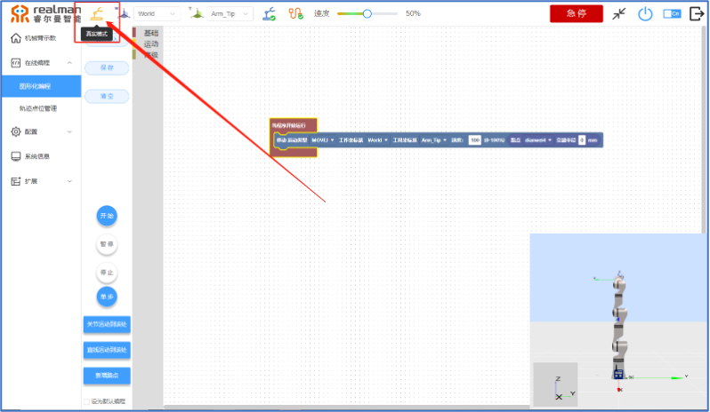

<center>模型预览</center>

### 数据管理

用户保存的轨迹、点位、图形化编程、脚本编程、电子围栏。均可在此页面进行管理。


<center>数据管理</center>

#### 轨迹列表

轨迹管理页面会显示轨迹名称、文件大小、创建时间以及修改时间，可执行的操作包括“删除”、“编辑”、“下载”。

**按钮表格**  

| 删除 |编辑 |下载 |
|------|-----|-----|
|   |  |  |

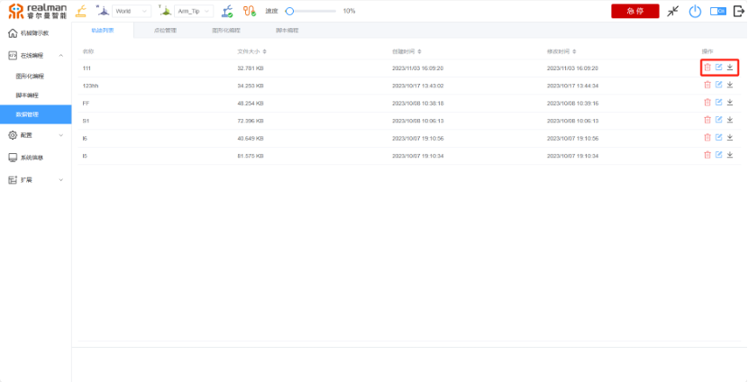

<center>数据管理</center>

**删除：** 删除该条轨迹。

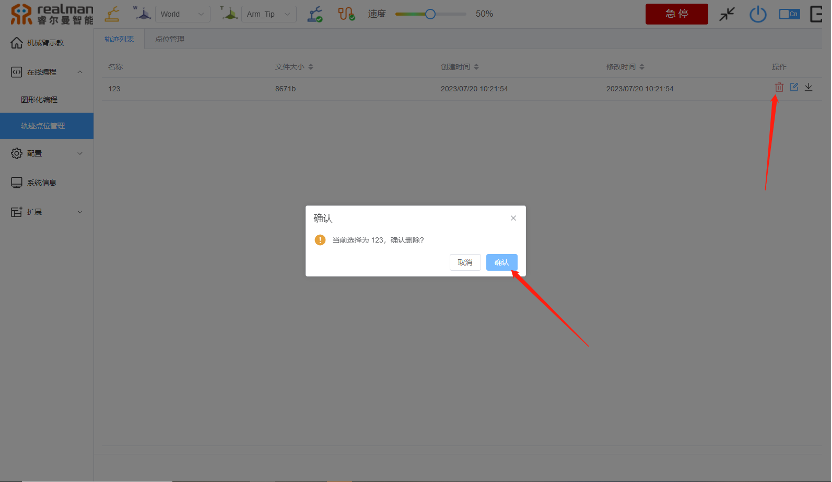

<center>删除轨迹</center>

**编辑：** 修改保存的点位。

点击该按钮跳转到机械臂示教页面，在该页面的轨迹裁剪部分裁剪轨迹，点击确定即可保存。

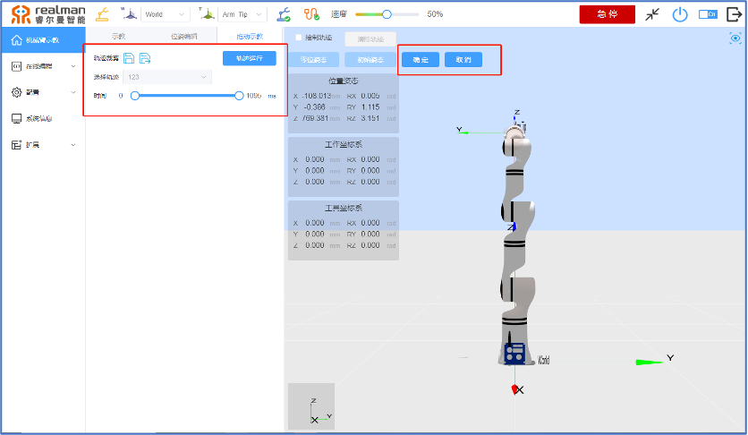

<center>编辑轨迹</center>

**下载：** 保存该轨迹到本地。

点击下载按钮会将轨迹文件下载到浏览器设置的下载路径中，后缀为.txt。

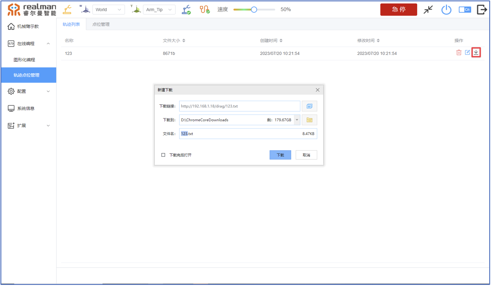

<center>下载轨迹</center>

#### 点位管理

点位管理页面会显示点位名称、位置姿态、关节角度、工作坐标系以及工具坐标系，可执行的操作包括“删除”、“编辑”、“新建”、“一键删除”、“搜索”。在页面下方有保存点位的页数展示，及页面跳转选项，保存的点位、编程的脚本无条数限制。

**按钮表格**  

| 删除 |编辑 |新建 |批量删除 |搜索  |
|------|-----|-----|-----|-----|
|   |  |  |  |  |

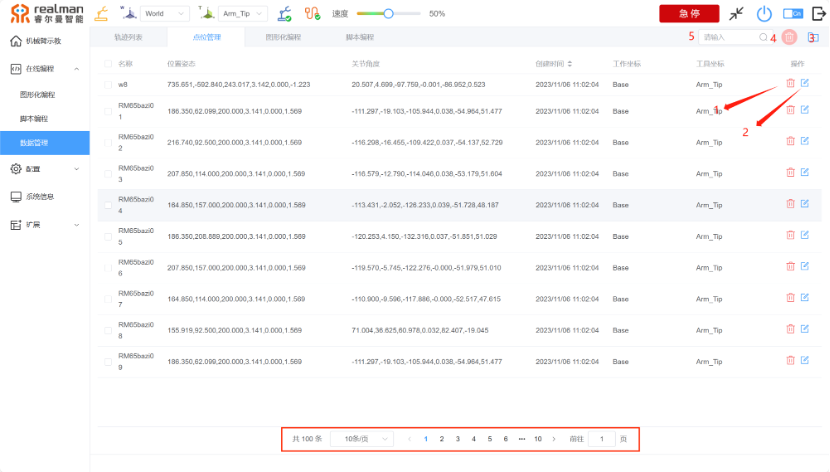

<center>轨迹/点位管理</center>

**删除：** 删除该点位。

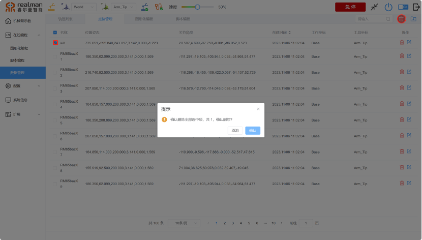

<center>删除点位</center>

**编辑：** 修改保存的点位。

点击该按钮跳转到机械臂示教页面，在该页面通过示教按钮或者末端拖动示教按钮拖动使机械臂到达需要的点位，点击确定即可保存。

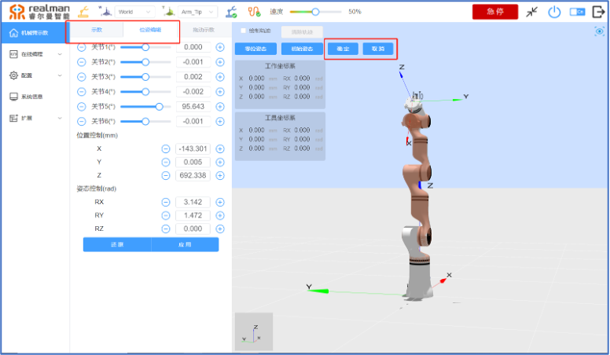

<center>编辑点位</center>

**新建：** 建立新的点位。

新建点位步骤同8.3.1.13节新建路点。

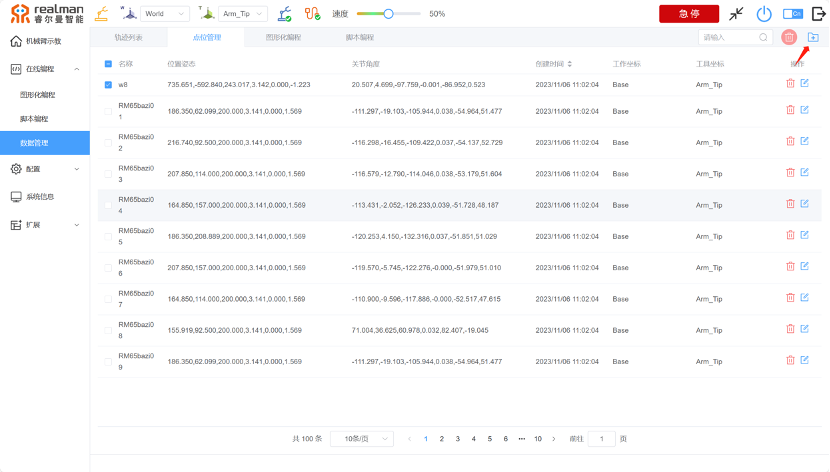

<center>新建点位</center>

**批量删除：** 一键删除多个点位。

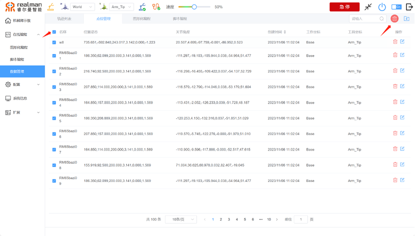

<center>一键删除</center>

**搜索：** 通过点位名称搜索点位，支持模糊搜索。

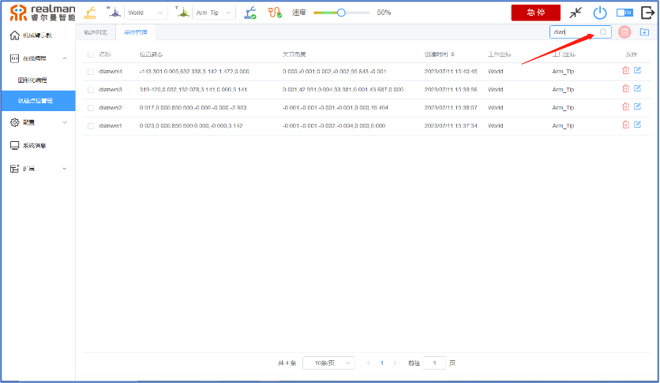

<center>搜索</center>

#### 图形化编程

图形化编程界面会显示名称，编号、文件大小、默认运行速度、操作。可执行操作包括“删除”、“下载”、“运行”

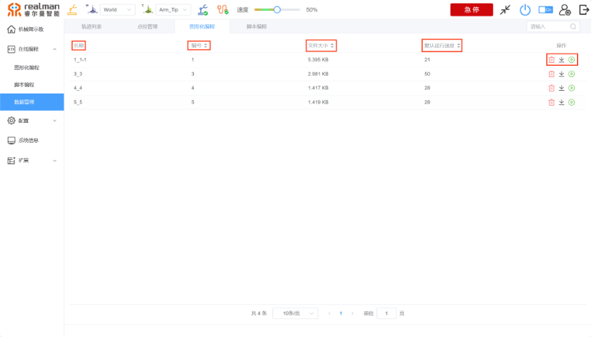

<center>图形化编程</center>

#### 脚本编程

脚本编程界面会显示名称，编号、文件大小、操作。可执行操作包括“删除”、“下载”、“运行”


<center>脚本编程</center>

#### 电子围栏

电子围栏页面显示序列名称、类型、参数、操作等。点击编辑可立刻进入编辑页面，具体操作见（8.4.2.10），编辑完成后点击更新参数。

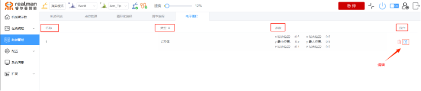

<center>电子围栏</center>

### 脚本编程介绍

可通过代码编辑器直接输入python代码，也可以通过页面上方多种的icon选择后输出相应python代码段。代码编辑器手动输入可自动进行代码格式的缩进排版，通过icon选择后输出的代码段必须手动调整代码格式


<center>脚本编程</center>

**脚本编程Icon介绍**  

| 序号 | 名称         |
|------|--------------|
| 1    | 运动按钮     |
| 2    | 等待按钮     |
| 3    | 设置按钮     |
| 4    | 循环指令     |
| 5    | 力控指令     |
| 6    | 灵巧手指令   |
| 7    | 夹爪按钮     |
| 8    | 升降机按钮   |
| 9    | 文件导入     |
| 10   | 保存         |
| 11   | 清空         |
| 12   | 保存编程文件 |
| 13   | 开始         |
| 14   | 停止         |

下面将按照上表的顺序，依次对各Icon进行说明：

#### 运动按钮

在点击运动按钮后弹出窗口，窗口内容为运动类型、工作坐标系、工具坐标系、路点、运动速度、交融半径、执行圈数、阻塞、添加路点、应用等相关按钮。

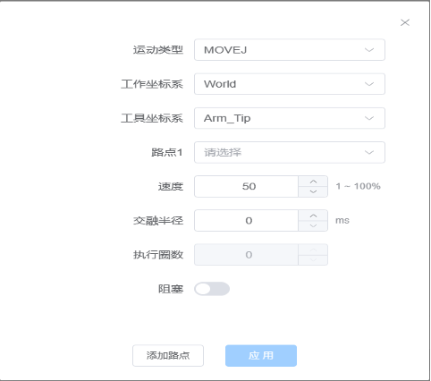

<center>运动按钮</center>

点击运动类型按钮弹出运动指令选项，详细请参考[8.3.1.6]运动类型介绍

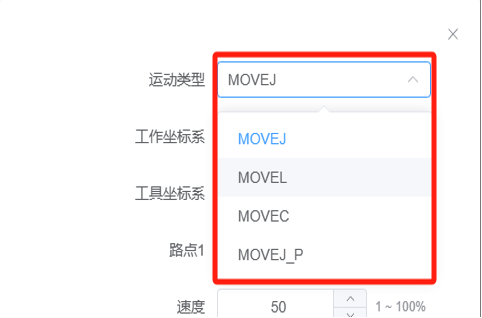

<center>运动按钮</center>

点击工作坐标系按钮弹出已添加的当前坐标系，默认的三个分别是world、base、test三款，在窗口内选择需要的坐标系，，坐标系详细介绍请参考[8.4.2.3]


<center>工作坐标系</center>

点击工具坐标系按钮弹出已添加的当前坐标系，在窗口内选择需要的坐标系，坐标系详细介绍请参考[8.4.2.3]


<center>工具坐标系</center>

点击路点，跳出在点位管理中保存所有路点。可点击使用路点来来进行脚本编程每次选择一个（movec可选择两个路点），在选择完成后页面下方显示当前路点的关节角度。

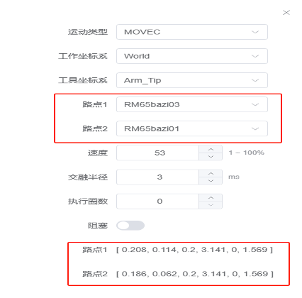

<center>路点</center>

速度按钮可以调试0~100%的速度，默认值为50%，点击向上向下两个小按钮每次可增加1%。


<center>速度</center>

交融半径按钮可输入需要的交融半径范围，默认值为0，不需要则无需更改


<center>交融半径</center>

执行圈数按钮在使用MOVEC时选择需要的执行圈数。


<center>执行圈数</center>

阻塞可点击页面下方按钮开启或关闭阻塞


<center>阻塞</center>

在选择好需要的运动类型、路点等内容后脚本编程自动跳出选择好相应的脚本编程。

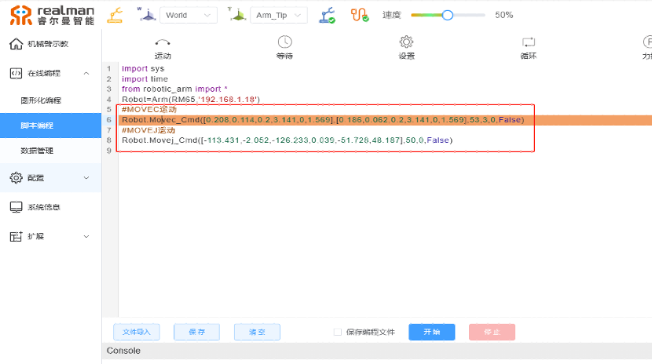

<center>脚本编程页面</center>

#### 等待按钮

再点击等待按钮后可选择等待类型分为两种。等待时间、等待数字输入两种类型。

等待时间可输入需要的等待时间限制

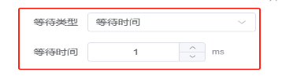

<center>等待时间</center>

等待数字输入有DIN1-DIN4和T_DIN1\\T_DIN2、高电平、低电平，等选项。

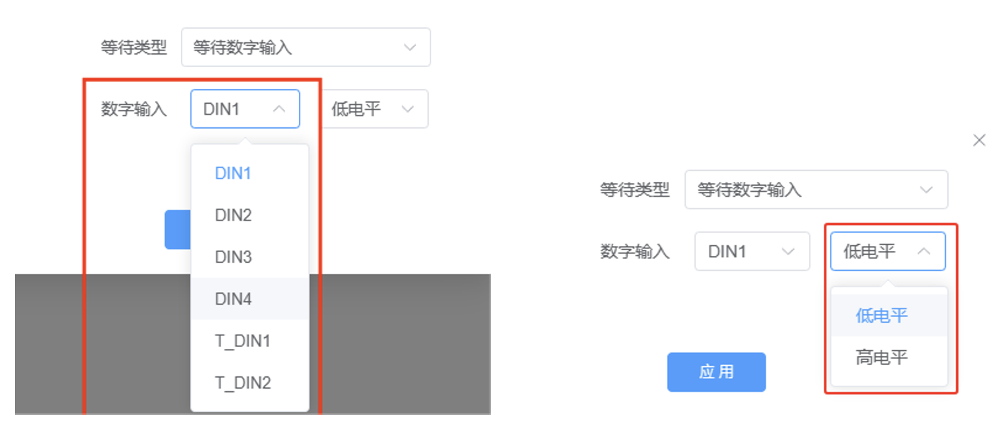

<center>等待数字输入</center>

在选择完成等待时间或等待数字输入后主页面跳转出相应的脚本编程。

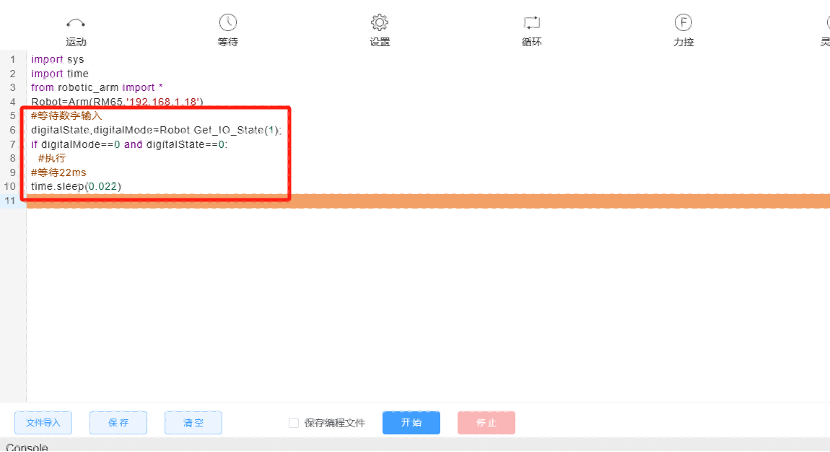

<center>脚本编程页面</center>

#### 设置按钮

设置内容有设置数字输出，其中包括DOUT1\~DOUT4和T_DOUT1\\ T_DUOT2、高电平、低电平、阻塞开关等内容。


<center>设置按钮</center>

在选择完成数字输出后，主页面跳转住相应的脚本编程。

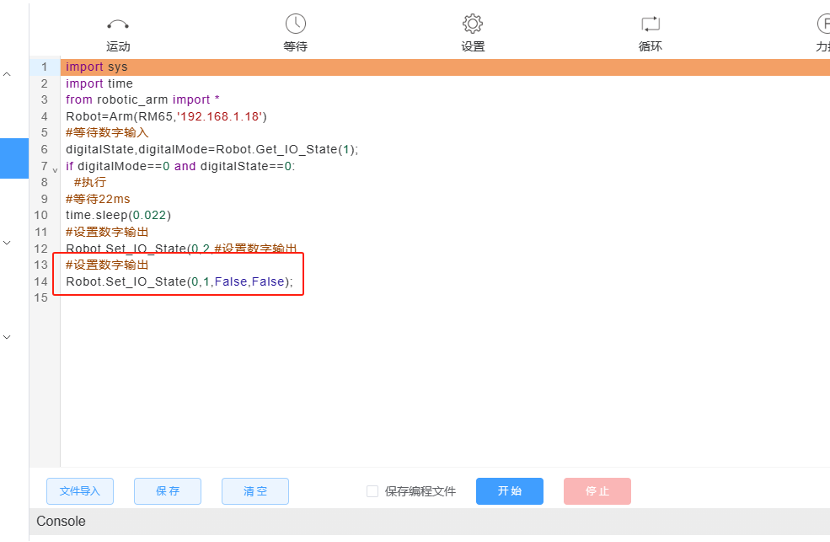

<center>脚本编程页面</center>

#### 循环按钮

循环内容包括循环，无限循环、结束循环，在选择循环时可选择相应的循环次数。


<center>循环按钮</center>

在选择完循环类型后主页面跳转住相应的脚本编程。

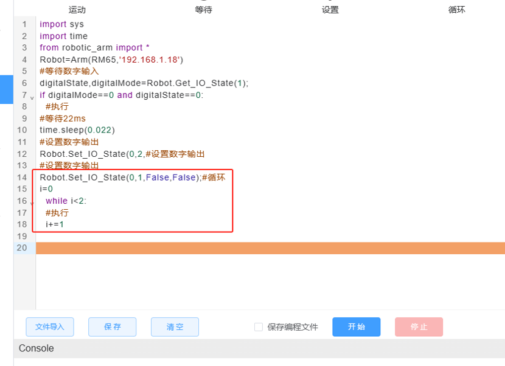

<center>脚本编程页面</center>

#### 力控按钮

内容包括力控，阻塞两块。力控分为关闭力位混合模式和开启六维力传感器，在开启六维力传感器后可选择个人所需的工作坐标系和工具坐标系以及力位混合模式下控制的方向，多少牛米的力。力位混合控制方向分为X、Y、Z以及MX、MY、MZ。


<center>力控页面</center>

在选择相应的需求后在脚本编程页面会弹出相应的六维力传感器脚本

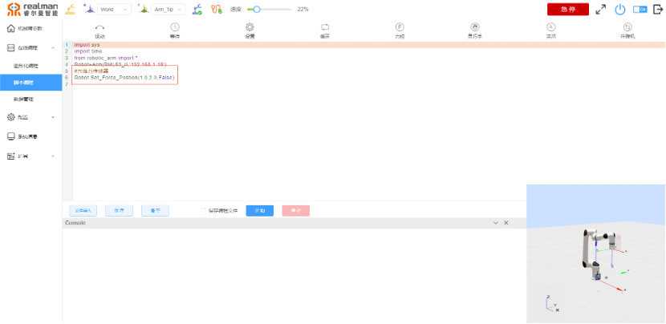

<center>脚本编程页面</center>

#### 灵巧手按钮

内容包括灵巧手、编号、阻塞，其中灵巧手可以选择手势设置和动作序列设置。选择完成后再编号界面内可以选择编译好的灵巧手程序。


<center>灵巧手页面</center>

选择好需要手势设置或者动作序列设置的同时选择好需要的编号。点击应用后脚本编程页面会出现相应的脚本编程。

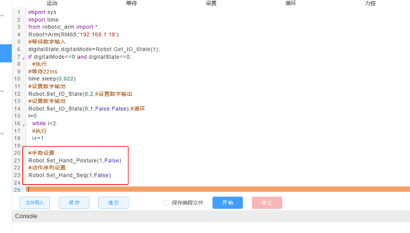

<center>脚本编程页面</center>

#### 夹爪按钮

内容包括动作类型、速度、力、阻塞。动作类型分为张开，闭合两种，速度默认为50%力默认为50N。


<center>夹爪按钮</center>

需要夹爪张开和闭合的位置选择好速度和力脚本编程页面回显示出对应的脚本

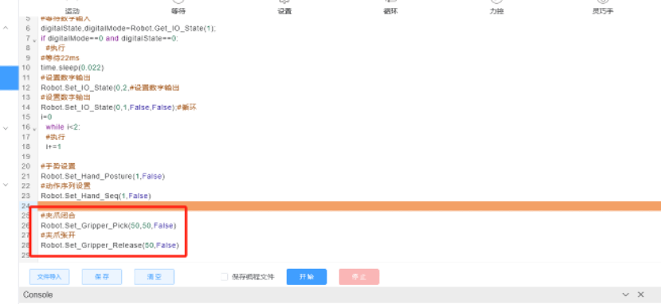

<center>脚本编程页面</center>

#### 升降机按钮

内容包括目标高度、速度、阻塞。


<center>升降机按钮</center>

选择好需要的升降机的目标高度与速度，点击应用后脚本编程页面回显示出对应的脚本。

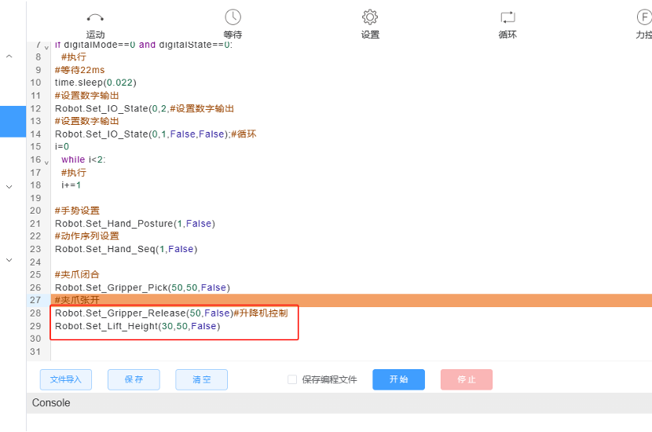

<center>脚本编程页面</center>

#### 基础按钮

页面下方有本地编程文件导入、保存当前代码到本地、清空代码编辑器、选中保存编程文件、以及编程下发开始和停止。本地编程文件导入时仅校验文件格式为“.py”。选中保存编程文件后，可以在编程开始下发时自动保存当前运行的python代码。

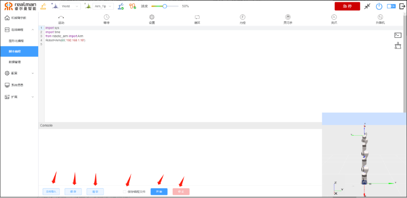

编程下发开始前无任何格式或语法校验，以console区域反馈提示为准。

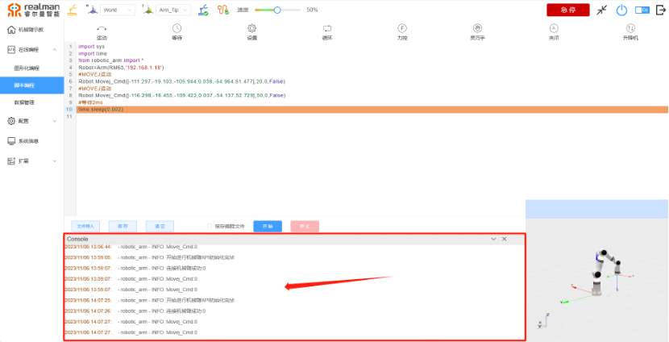

**RM65-脚本编程画八字代码实例**  

```python
import sys
import time
from robotic_arm import *
Robot=Arm(RM65,'192.168.1.18')
#MOVEJ运动
Robot.Movej_Cmd([20.507,4.699,-97.759,-0.001,-86.952,0.523],50,0,False)
#MOVEL运动
Robot.Movel_Cmd([0.186,0.062,0.2,3.141,0,1.569],50,0,False)
#MOVEC运动
Robot.Movec_Cmd([0.217,0.092,0.2,3.141,0,1.569],[0.208,0.114,0.2,3.141,0,1.569],50,0,0,False)
#MOVEL运动
Robot.Movel_Cmd([0.165,0.157,0.2,3.141,0,1.569],50,0,False)
#MOVEC运动
Robot.Movec_Cmd([0.186,0.209,0.2,3.141,0,1.569],[0.208,0.157,0.2,3.141,0,1.569],50,0,0,False)
#MOVEL运动
Robot.Movel_Cmd([0.165,0.114,0.2,3.141,0,1.569],50,0,False)
#MOVEC运动
Robot.Movec_Cmd([0.156,0.092,0.2,3.141,0,1.569],[0.186,0.062,0.2,3.141,0,1.569],50,0,0,False)
```
