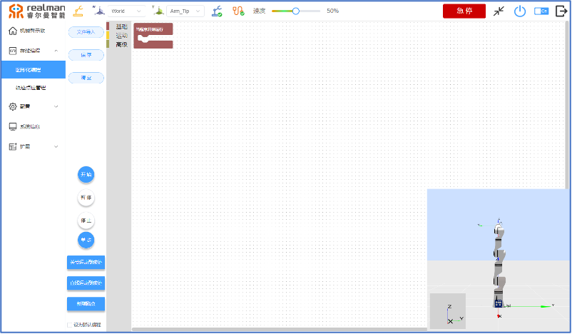
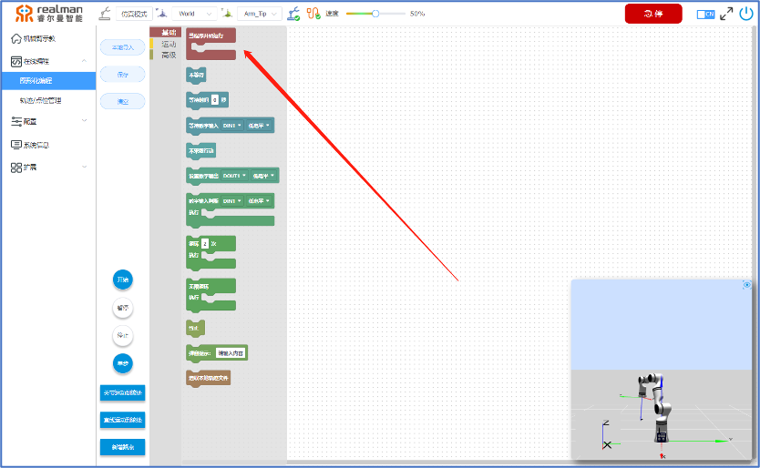
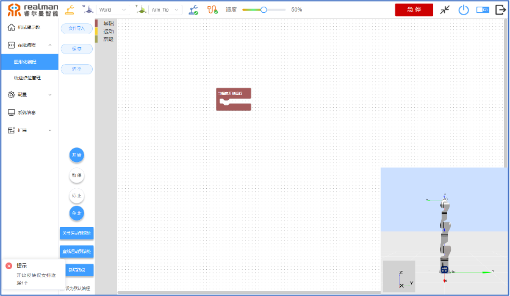
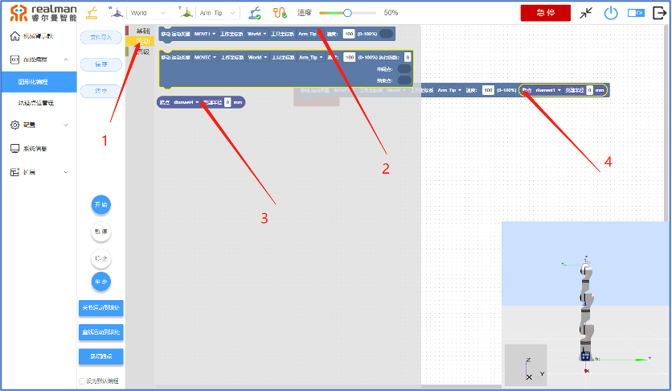
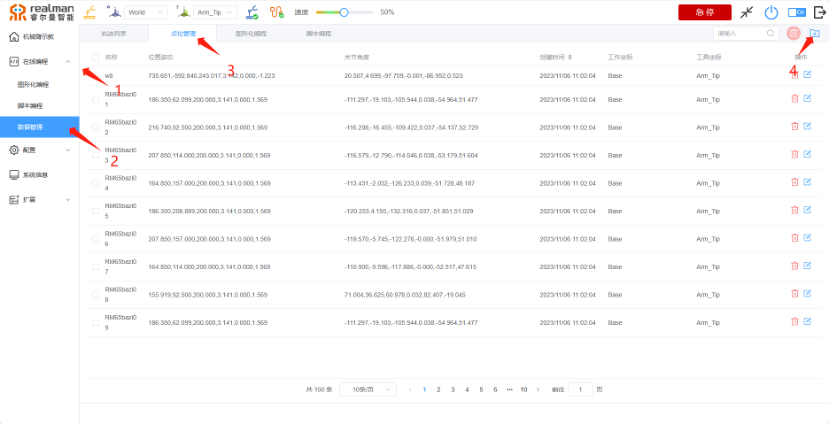
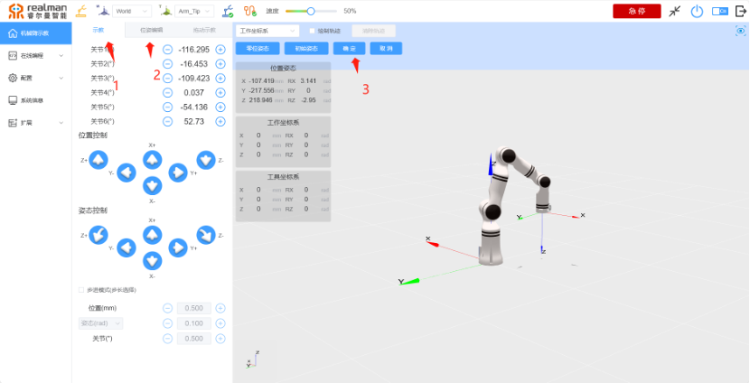
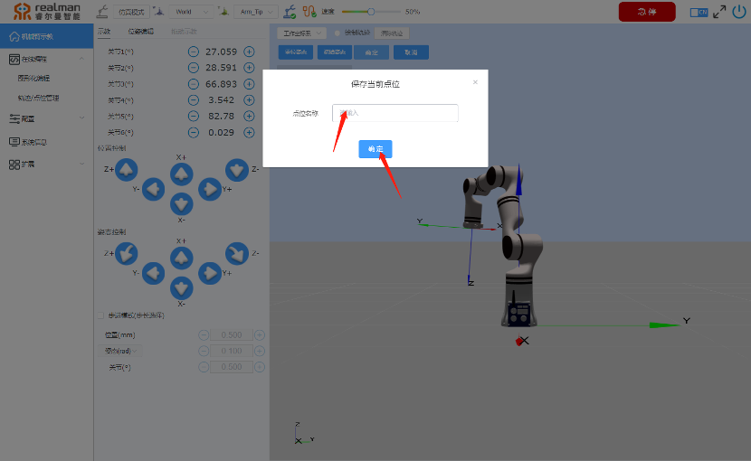
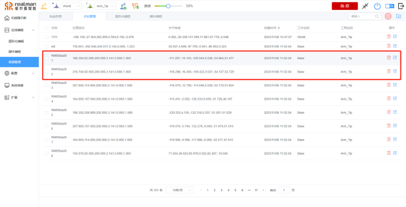
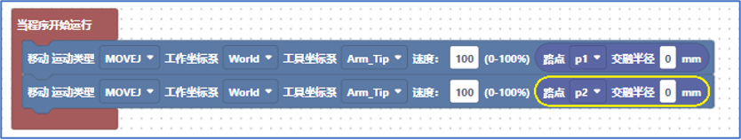
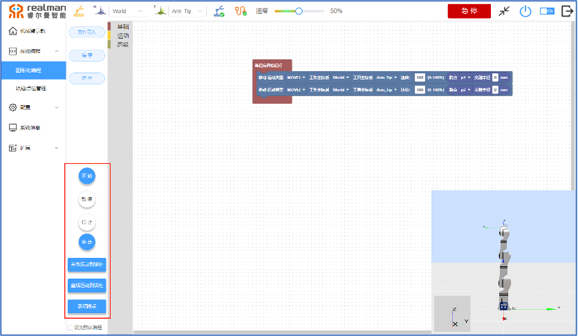

# 
入门指南：
在线编程示例

## 运行示例教程

1. **点击“在线编程”按钮，进入选项。再次点击图形化编程，右侧回显示“基础、运动、高级”共3种类型的命令栏。**

图形化编程

2. **图形化编程界面可进行拖拽编程操作。**

编程模块

3. **在基础指令界面将“当程序开始运行”模块拖拽至多点组成的网格界面。注意：所有的程序模块均需组合放置在`当程序开始运行`图块内。**

初始模块

4. **单击打开运动指令列表。**
    - 拖拽“移动”条状图块至编程界面。
    - 拖拽“路点”条状图块至“移动”图块正后方，并确保2个图块卡槽相组合。

添加移动指令

5. **“移动”图块中需要根据实际运行需要进行设置运动类型、工作坐标系、工具坐标系、运行速度共4项参数。**

移动指令

6. **“路点”图块中需要设置路点、交融半径共2项参数。**

路点指令

7. **添加机械臂运动点位。**

- 打开示教器界面，左侧菜单栏中点击“在线编程”按钮，进入“数据管理”，进行添加点位的操作。具体操作，如下图所示

添加路点

- 进入点位编辑界面，根据实际需要选择单轴控制或多轴控制，编辑完成相应点位后，点击机械臂仿真界面的确定按钮保存点位，如下图所示

添加路点

- 点击确定按钮之后会弹出提示框，需输入点位名称进行点位保存。此处名称可为中文/英文/数字及其组合。保存完成后的点位可在“点位管理”界面查看与编辑。在示例中设置了2个点位，分别为：p1、p2。

添加路点

添加路点

8. **机械臂运动点位设置完毕之后，在图形化编程界面将点位应用至程序中。**

运动编程

9. **至此，1个基于Move_J运动类型，运动速度为百分百的运动示例程序已编写完成。**

## 运行程序示例

1. 若要运行编辑好的程序，点击“开始”按钮，轨迹将自动运行。
2. 按“暂停”按钮，运动将在轨迹方向暂停，暂停后可按“继续”按钮继续运动。
3. 按“单步”按钮，将进行单步运动。
4. 按“停止”按钮，运动停止。为防止意外发生，轨迹运行结束后，需手动点击“停止”按钮，各功能键才能继续发挥作用。

运行程序

::: warning 注意
并不是所有点机器人都能到达，如果取的点提示无法到达，请重新取点。
:::
