# 
入门指南：
配置

## 系统配置

### 通讯配置

系统配置界面主要对机器人控制器的通讯进行配置。设置AP、STA、IP模式后，页面会自动获取已设置的模式以及名称、密码等信息的回显AP模式下WIFI热点的物理信道的显示

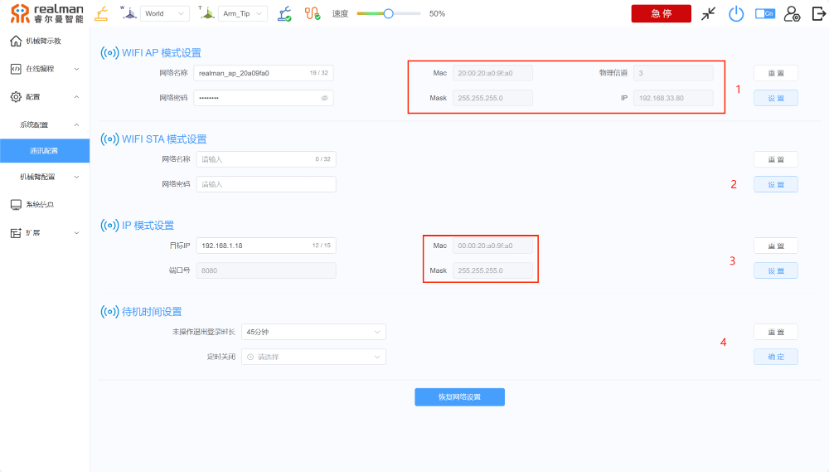

系统配置示意图

**系统配置内容**  

| 序号 | 名称             |
|------|------------------|
| 1    | WIFI AP模式设置  |
| 2    | WIFI STA模式设置 |
| 3    | IP模式设置       |
| 4    | 待机时间设置     |

下面将按照上表的顺序，依次对各配置项进行说明：

#### WIFI AP配置

控制器可切换到WIFI AP模式对外通信，网络名称为控制器对外显示的WIFI名称，网络密码为控制器WIFI的密码，点击设置按钮后，控制器将按照此内容进行网络配置，配置完成后立即以WIFI AP模式对外通信。 该模式下，控制器的IP为192.168.33.80，通讯端口号：8080，通讯模式：server模式。机械臂出厂时默认设置为AP模式，名称格式如图，默认密码为12345678。

设定网络名称及密码，网络名称和密码不得包含中文字符，网络密码设定为8-10位密码。单击`确定`按钮，机器人控制器发出“滴”提示音，界面弹窗提示设置成功且自动下载保存网络名称及密码，重启控制器，模式切换完成。

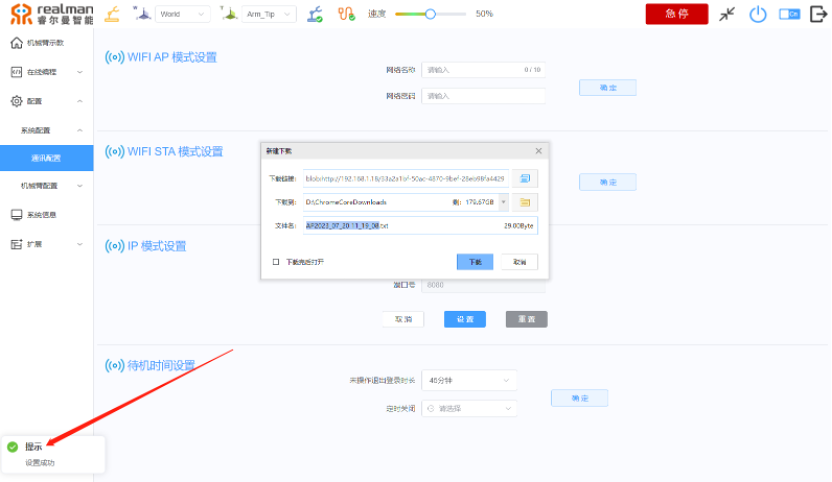

WIFI AP模式设置

WIFI AP模式连接机器人时，电脑连接好机器人WIFI（示例WIFI名称为RM65-01）,设置电脑WLAN为自动获得IP地址。

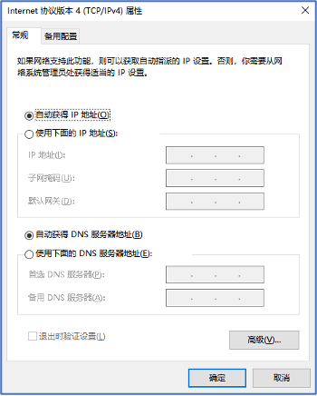

电脑本地IP设置

::: warning 注意
设置完成之后，可在浏览器输入“192.168.33.80”IP地址登录WEB示教器。
:::

#### WIFI STA设置

控制器可切换到WIFI STA模式，连接用户指定的路由器。网络名称为指定控制器要连接的路由器名称，网络密码为指定的路由器密码，配置完成后控制器立即以WIFI STA模式对外通信。该模式下，控制器的IP为路由器自动分配，通讯端口号：8080，通讯模式：server模式。

WIFI STA模式设置

单击`确定`按钮，机器人控制器发出“滴滴”提示音，模式切换完成。控制电脑与机器人连接到同一个路由器。

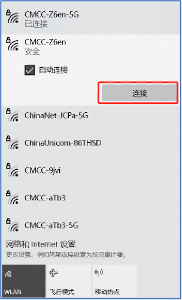

电脑连接路由器

登录路由器管理界面，查看路由器为机器人分配的IP地址（以路由器给机器人分配的IP为192.168.1.142为例）。

示教器与控制器通过网口连接时，控制器与示教器通过网口进行通讯，端口号：8080，通讯模式：server模式。下图为网口位置，通讯速率：1000Mbps。

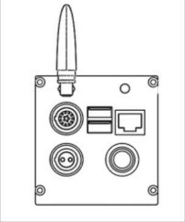

网口接口

本地网络设置：示教器启动时默认控制器的IP地址为192.168.1.18，端口号为8080（机械臂IP修改方式见[设置机械臂IP](../teachingPendant/setting.md#设置机械臂ip)）。

机器人控制器的网络IP地址为192.168.1.18，为了电脑能与控制器建立网络连接，需要将本地网络IP配置在同一网段内。

Windows系统与机械臂建立连接时，首先需要将电脑ip更改到192.168.1.xx网段，xx可为除192.168.1.18中“18”以外的ip，建议配置为192.168.1.100。Windows电脑ip配置方法为：

1. 打开电脑右下方WIFI按钮打开“网络和Internet设置.

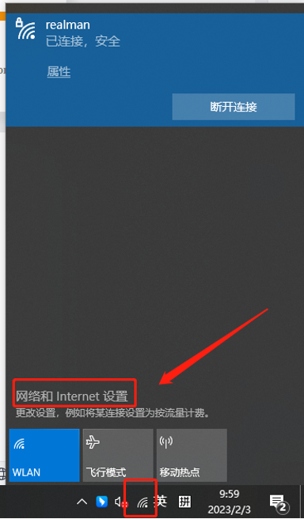

打开网络和Internet设置示意图

2. 如果是有线连接机器人，单击“以太网--\>更改适配器选项.

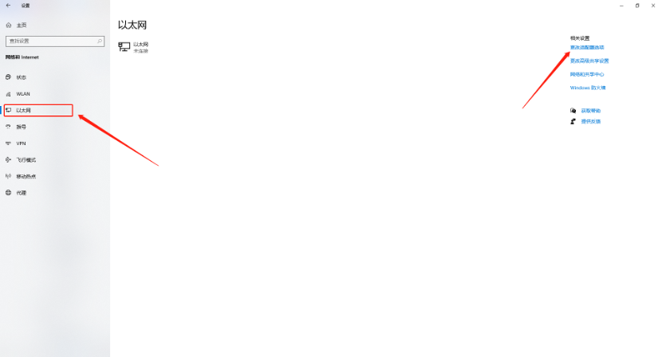

本地连接示意图

3. 双击“以太网”并打开，并且在弹出的窗口中单击“属性”按钮。

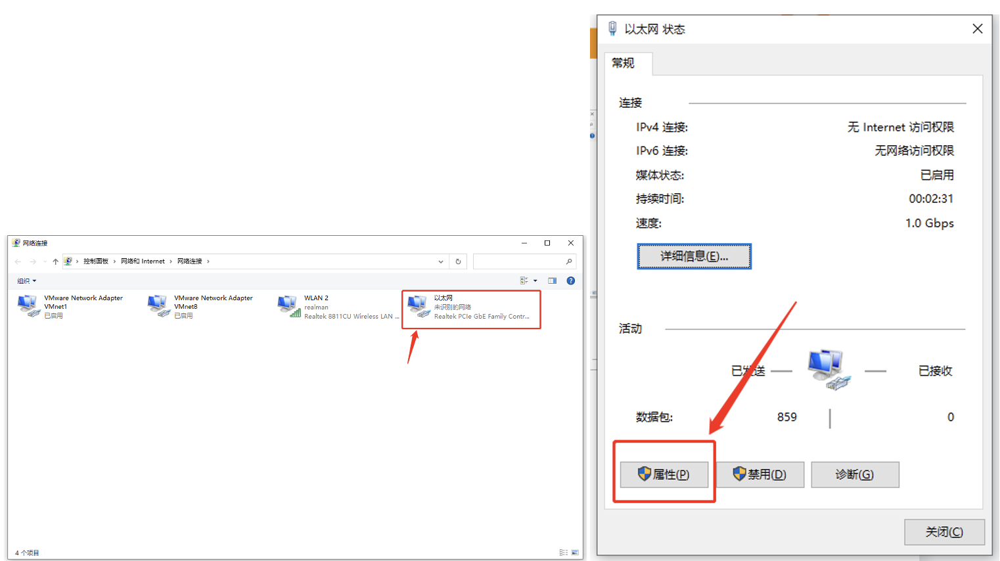

属性示意图

4. 在弹出的对话框中，第一步选中“Internet协议版本4”，第二步单击“属性”按钮。

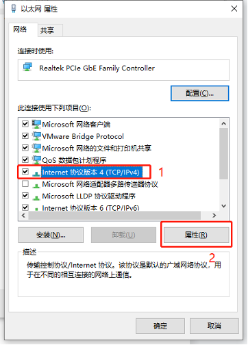

协议版本示意图

5. 按下图配置网络IP地址，配置完成后点击“确定”按钮，即可完成本地网络设置。

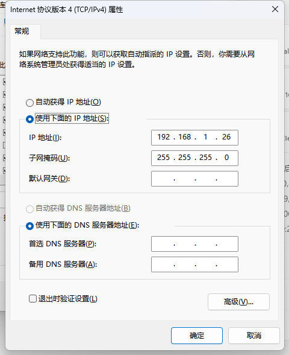

网络IP地址示意图

6. 电脑的ip配置完成之后，将机械臂与电脑通过网线连接。等待机械臂开机完成之后，在网页网址处输入192.168.1.18，如进入以下界面，即说明机械臂连接成功，输入账号密码即可进入示教器。

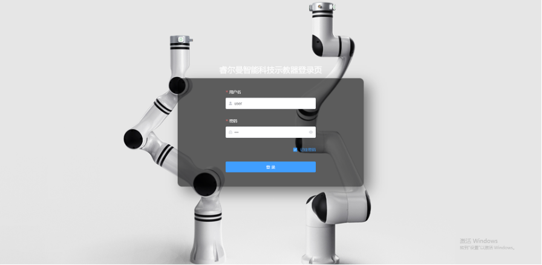

连接机器人示意图

#### 设置机械臂IP

在机械臂与示教器连接成功的基础上，可通过“配置--\>系统配置--\>通讯设置--\>目标IP文本框”中设置机械臂IP。

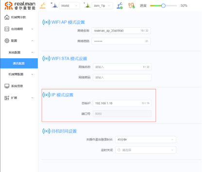

IP模式设置

在示教器IP模式设置栏中，最下方可直接设置机械臂IP，可在目标IP文本框中输入IP，如“192.168.1.19”，输入完毕之后单击下方设置按钮，可直接设置机械臂IP，此IP设置结束，此设置需重启机械臂生效。如需恢复“192.168.1.18”IP地址，可单击“重置”按钮，机械臂IP即可恢复“192.168.1.18”IP地址，此设置需重启机械臂生效。（如修改过机械臂IP，则登录示教器界面需输入更新过后的IP）

点击设置后会自动下载设置的IP，请注意保存以防止遗忘IP。

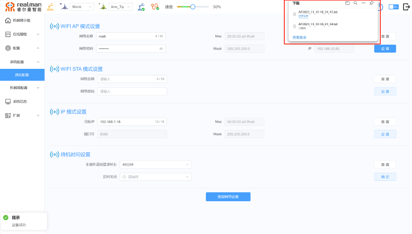

设置成功

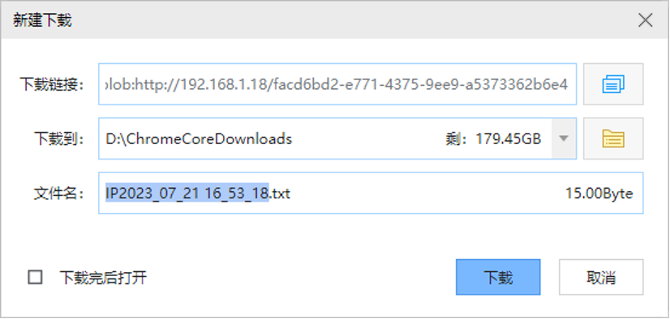

设置机械臂IP示意图

#### 待机时间设置

如下图所示，可设置示教器未操作退出登录时长或者定时关闭，两者都设置则退出登录时间在前的设置生效。

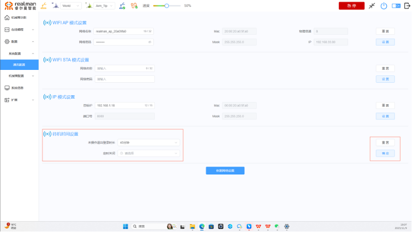

待机时间设置

### 机器人配置

机器人配置界面包括安全配置、工具标定、工作坐标系标定、初始姿态设置、安装信息、力传感器配置、力传感器数据图、版本信息、IO设置。

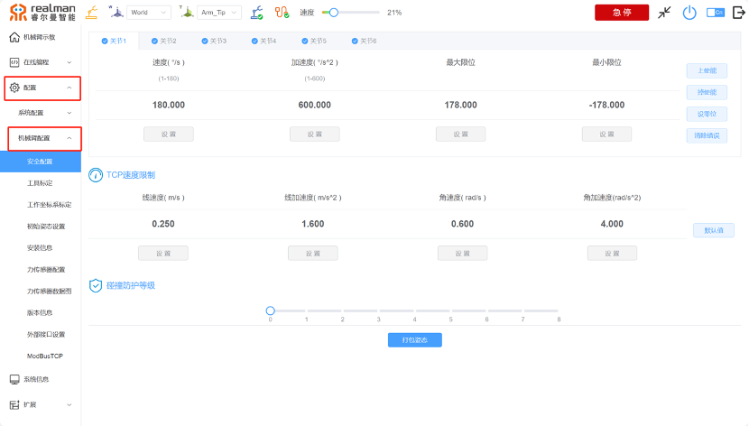

机器人配置

#### 安全配置

安全配置界面主要对机器人的关节、末端TCP速度限制和防碰撞参数进行配置。如下图所示：

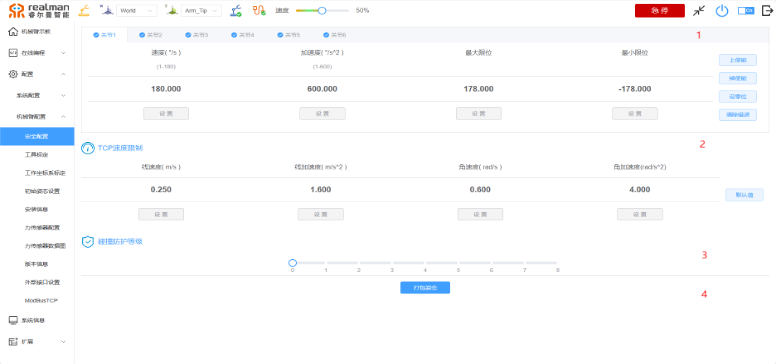

安全配置界面示意图

##### 关节配置

在上方选项卡选择关节1\~6，分别对应机器人从下到上的六个关节。示教器与机器人建立连接后，关节的最大速度、加速度、最小限位和最大限位信息会自动显示在对应位置。

::: warning 注意
睿尔曼机械臂在出厂前所有参数都已经配置到最佳状态，一般不建议用户修改关节的底层参数。若用户确需修改，首先应使机械臂处于非使能状态，然后再发送修改参数指令，参数设置成功后，发送关节恢复使能指令。需要注意的是，关节恢复使能时，用户需要保证关节处于静止状态，以免上使能过程中关节发生定位报错。关节正常上使能后，用户方可控制关节运动。更改时，设置的关节最大加速度与最大转速的比值需要≥1.5倍，否则可能出现运动异常。
:::

关节配置示意图

 

1. 速度：关节的最大转速，单位°/s，最大值为180°/s。12关节最大180°/s，其他关节最大225°/s。
2. 加速度：关节的最大加速度，单位°/s\^2，最大值为600°/s\^2。出厂默认值600°/s\^2，是各方面综合状态最好的数据，不建议用户更改。
3. 最小限位：关节的达到的最小位置，单位：度。
4. 最大限位：关节的达到的最大位置，单位：度。
5. 使能：上使能按钮和掉使能按钮分别给指定关节发送上使能和掉使能指令。

**上使能示例：**

给关节1上使能（同理可给其它关节上使能）

1. 在最左面的选项中选择关节1
2. 若报错信息显示关节有其他错误，首先点击“清除错误”按钮清除错误
3. 点击右侧的“上使能”按钮

关节上使能示意图

设置零位：关节在掉使能状态下，点击`设零位`按钮后，将指定关节当前位置设置为零位，设置完成后该关节仍处于掉使能状态。单击`上使能`按钮，重新给该关节上使能，才可以控制关节运动。

机器人每个关节都有一个机械原点位置（如下图所示），零位姿态即为各关节均在机器人原点位置时的位姿。当机器人在零位姿态时，机械原点位置标记不对齐，则需要手动将机器人设置回机械原点位置。零位姿态时，机器人的状态如下图所示：

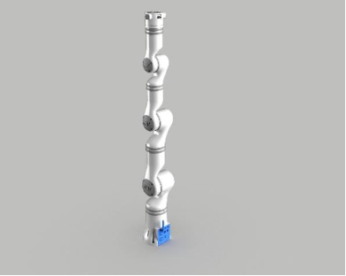

机器人零位姿态

当更换机器人关节后，必须重新设置对应关节的零位。

::: warning 注意
并非所有机器人均支持该功能，设定前先与睿尔曼智能科技（北京）有限公司确认。
:::

设置关节1的零位（同理可设置其它关节的零位）。

1.在最左面的选项中选择关节1。

2.点击右侧的“掉使能”按钮（如果关节处于上使能状态），先让关节掉使能。

设置关节掉使能

3.将关节1旋转到机械原点位置（关节缝隙两侧的凹槽完全对应，为机械原点位置）

机器人关节零位标识

4.点击最右侧的“设零位”按钮，完成关节1的零位设置

5.上使能

设置关节上使能

**打包姿态示例：**

机器人使用完成后，需要重新装箱时。在控制器内部已经保存机器人装箱姿态，长按`打包姿态`按钮，机器人自动运动至装箱姿态，机器人停止运动时，打包姿态完成。

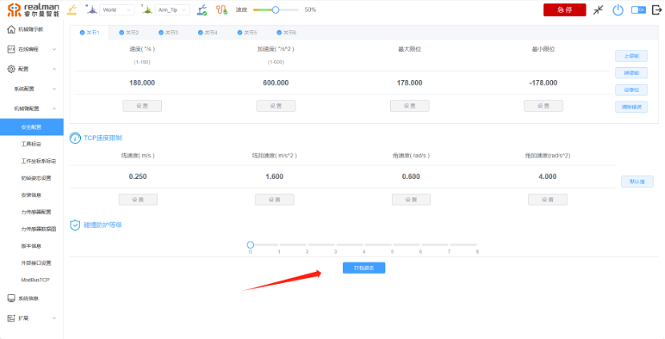

打包姿态示意图

##### TCP速度限制

该部分主要对机器人末端的线速度、线加速度、角速度和角加速度进行设置。示教器与机器人控制器建立网络连接后，该部分会自动更新当前机器人的TCP参数，用户可手动修改参数并下发。

点击默认值按钮，机器人TCP参数恢复默认值。末端线速度：0.25m/s,末端加速度：1.6m/s2，末端角速度：0.6rad/s，末端角加速度：4rad/ s2。

::: warning 注意
建议使用默认TCP速度，如需更改，设置的机械臂末端最大加速度与最大速度的比值需要≥3，否则可能出现运动异常。
:::

##### 碰撞防护等级

该部分主要对机器人的碰撞等级进行设置，等级级别为0~8，代表机器人碰撞灵敏度的级别，等级越高，对碰撞越敏感。机器人上电默认碰撞等级为0，即不对碰撞做检测。

碰撞防护等级设置

::: warning 注意
用户在设置碰撞防护等级时，应该合理选择，等级越高，机器人检测到误碰撞的概率就越高，如无特殊需求，建议用户可将碰撞等级设置在4左右；另外，如果机器人末端改变工具和负载，需在“工具标定”时设定工具的质量和质心参数（[工具标定](../teachingPendant/setting.md#工具标定)过程参照）以匹配正确的动力学模型。
:::

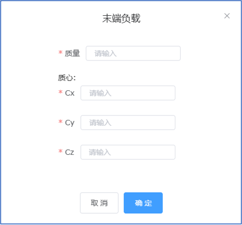

末端负载参数设置

#### 工具标定

工具坐标系标定如下图所示，区域1为显示当前所有工具坐标系及工具位姿信息，区域2为自动标定当前工具坐标系，区域3为手动设置工具坐标系信息。

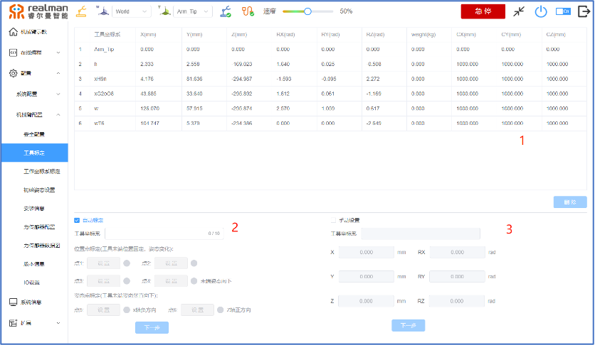

工具标定界面示意图

##### 工具显示

表格内显示的为当前机器人已经建立的所有工具坐标系名称及位姿参数。如果要删除某一工具，在表格中选中后，点删除工具按钮即可。删除完成后，机器人进入末端法兰坐标系工作。另外，Arm_Tip（机器人末端工具坐标系）不可删除。

##### 自动标定工具坐标系

选中该部分后，即可通过六点法标定当前工具坐标系，首先填写工具名称（英文字符，不可超过10个字符）后，将机器人工具分别以6个姿态接触工具参考点（该参考点要求末端尖锐，并且竖直向上放置于机器人工作范围内）。

标定完成6个点之后，点击`添加工具`根据6个标定点自动计算当前工具信息，计算完成后回传给示教器，在工具表格中显示。另外，由于机器人控制器容量有限，只能保存10个工具坐标系，因此在标定前请确认不会超过限制。

6点法标定内容规则如下所示：

| 序号 | 名称                      |
|------|:-----------------------------------------------------:|
| 1    | 任意姿态，工具末端与参考末端接触                               |
| 2    | 任意姿态，工具末端与参考末端接触 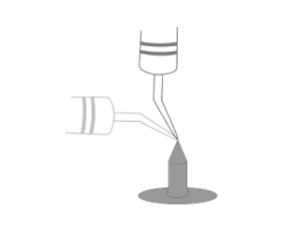                              |
| 3    | 任意姿态，工具末端与参考末端接触 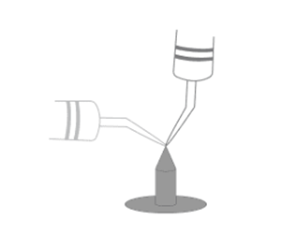                              |
| 4    | 工具末端竖直向下，并与参考末端接触 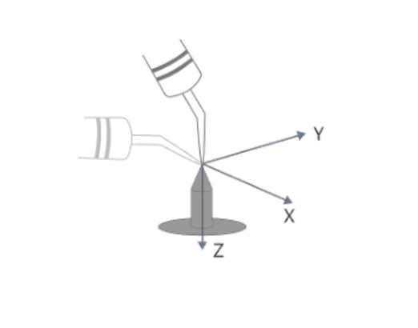                             |
| 5    | 保持4的姿态，从点4沿工具坐标系X轴负方向移动到某一位置，该位置与点4的距离尽可能大于10cm 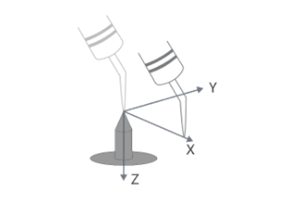 |
| 6    | 保持4的姿态，从点4沿工具坐标系Z轴正方向移动到某一位置，该位置与点4的距离尽可能大于10cm 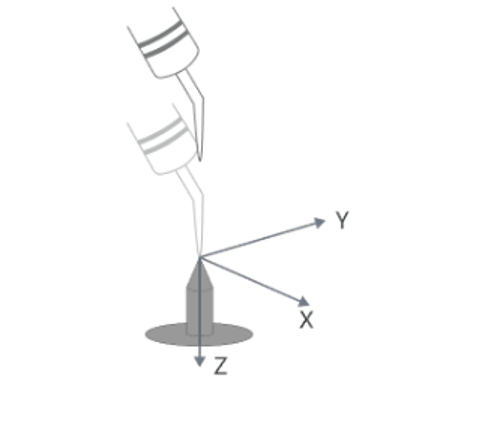 |

::: warning 注意
前4个点的姿态差距应尽可能大，不要找相同的点。
:::

##### 手动设置工具

当用户知道工具相对于机器人末端法兰中心的准确的相对位姿后，可通过手动输入信息，直接设置工具坐标系。选中该部分后，输入新建工具名称和位姿信息，点击添加工具按钮，即可将新建工具信息发送给机器人控制器，并在工具表格中显示。标定成功后，机器人进入末端法兰中心工具坐标系工作。

##### 末端负载

工具标定之后，我们需要输入末端工具的质量及重心位置，使机器人末端工具参数更加完善。

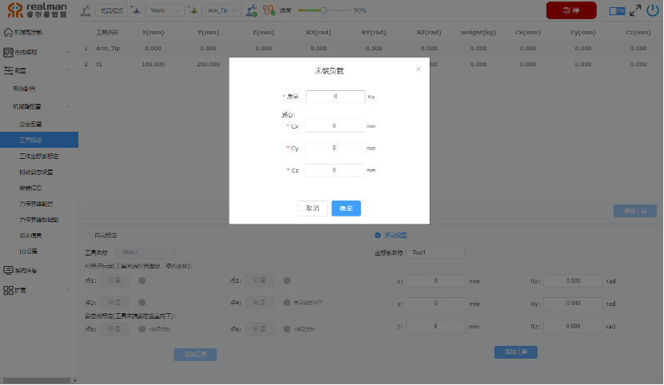

设定末端负载

#### 工作坐标系标定

工作坐标系标定如下图所示，区域1为显示当前所有工作坐标系名称及工作坐标系相对基坐标系位姿，区域2为自动标定当前工作坐标系，区域3为手动设置工作坐标系信息。

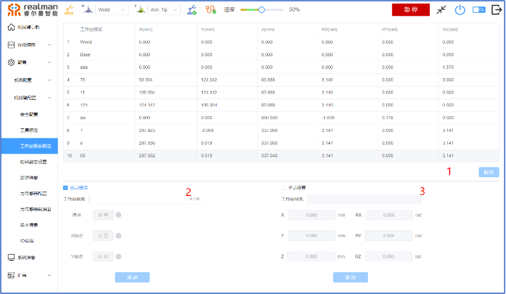

工作标定界面示意图

##### 工作坐标系显示

表格内显示的为当前机器人已经建立的所有工作坐标系名称及位姿参数。如果要删除某一坐标系，在表格中选中后，点`删除坐标系`按钮即可。删除完成后，机器人进入基坐标系工作。另外，World（世界坐标系）以及Base（基坐标系）不可删除。

##### 自动标定工作坐标系

选中该部分后，即可通过三点法标定当前工作坐标系，首先填写工作坐标系名称（英文字符，不可超过10个字符）后，将机器人工具末端分别以固定姿态接触工作坐标系的原点、X轴正方向上任一点（与原点距离尽可能大于10cm）和Y轴正方向上任一点（与原点距离尽可能大于10cm）。

| 序号 | 名称                                                                                                |
|------|:-----------------------------------------------------------------------------------------------------:|
| 1    | 将机器人工具未端以固定姿态接触工作坐标系的原点 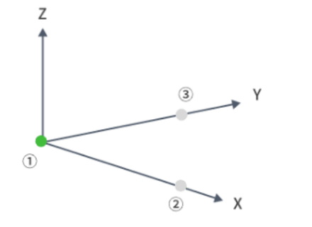            |
| 2    | 接触工作坐标系X轴正方向上任一点,与原点距离尽可能大于10cm   |
| 3    | 接触工作坐标系Y轴正方向上任一点与原点距离尽可能大于10cm 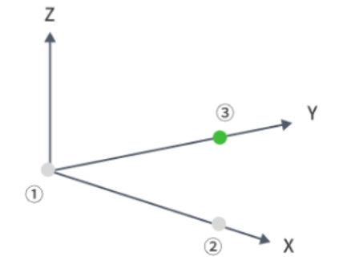   |

标定完成3个点之后，点击`添加坐标系`，系统根据3个标定点自动计算当前坐标系信息，计算完成后回传给示教器，在坐标系表格中显示。另外，由于机器人控制器容量有限，只能保存10个工作坐标系，因此在标定前请确认数量不会超过限制。完成标定后，机器人进入基坐标系工作。

##### 手动设置工作坐标系

当用户知道坐标系相对于机器人基坐标系的准确的相对位姿后，可通过手动输入信息，直接设置工作坐标系。选中该部分后，输入新建坐标系名称和位姿信息，点击`添加坐标系`按钮，即可将新建坐标系信息发送给机器人控制器，并在坐标系表格中显示。

#### 初始姿态设置

机器人可设置初始姿态，方便用户控制机器人快速到达该位姿。 如下图，区域1显示目前机器人建立的初始位姿关节角度； 区域2为用户手动设置虚拟机械臂，将6个关节的角度设定好后，点击设置按钮，即可将设定好的位姿关节角度发送给机器人保存，设置成功后在区域1中显示； 区域3为自动设置，将机器人6个关节的当前角度设置为初始位姿关节角度，设置成功后在区域1中显示。

机器人初始姿态设置

#### 安装信息

机器人安装信息指安装角度设定。在该界面的模型窗口可实时查看设定的安装角度是否与需求角度一致。区域1可快速设定常用安装方向，包括正装、侧装以及倒装。区域2为通过调节X轴、Y轴和Z轴角度进行安装角度设定。设置完成后，单击“确定”按钮进行保存。

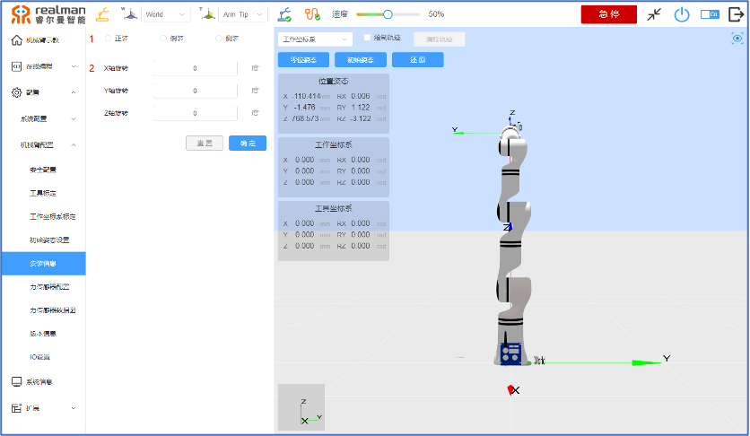

安装信息设置

#### 六维力传感器配置

六维力传感器参数说明见下表

<table>
  <tr>
    <th colspan="7">六维力传感器</th>
  </tr>
  <tr>
    <td>额定载荷</td>
    <td>X：200N</td>
    <td>Y：200N</td>
    <td>Z:200N</td>
    <td>MX：7Nm</td>
    <td>MY：7Nm</td>
    <td>MZ:7Nm</td>
  </tr>
</table>

::: warning 注意
六维力量程200N/7NM，如果末端受到600N以上的力或者21NM以上的力矩，会对传感器造成不可逆损坏。机械臂在运行过程中，避免传感器与外部设备发生硬碰撞，造成损伤。
:::

力传感器配置界面，六维力重心计算传感器标定。

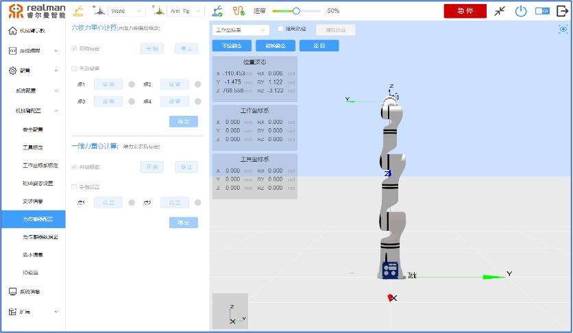

力传感器配置

##### 力传感器标定

1. **六维力标定**

六维力标定只有在末端工具发生更换后，才需要进行重新进行六维力重心计算。标定过程可通过控制器预存的轨迹路径进行自动标定，为避免预存轨迹在运行过程中与外部设备发生干涉，用户也可以根据实际场景进行手动标定。

六维力自动标定

自动标定过程，点击`开始`按钮，将提示标定状态提示，如下图所示。

状态确认提示

机器人会自动运行4种已经设定的姿态位置，进行重心计算。若运动过程中有机器人碰撞危险，需点击`停止`按钮进行终止运行。

六维力重心标定成功后，将弹出“标定成功”提示，重心标定完成。

六维力重心标定完成

手动标定过程，勾选`手动设置`选框，通过机械臂示教界面分别设置4个位姿差距尽量大的点位，待4个点位记录完成后，点击`确定`钮。

六维力手动标定

机器人自动进行六维力重心计算，待弹出“传感器重心标定成功”提示，重心标定完成。

六维力重心标定完成

2. **一维力标定**

一维力传感器标定与六维力传感器标定方法类似，也分为自动标定和手动标定两种方式。

一维力自动标定

自动标定过程，点击`开始`按钮，将提示标定状态确认提示，如下图所示。

状态确认提示

机器人会自动运行2种已经设定的姿态位置，进行重心计算。若运动过程中有机器人碰撞危险，需点击`停止`按钮进行终止运行。

一维力重心标定成功后，将弹出“传感器重心标定成功”提示，重心标定完成。

一维力重心标定完成

手动标定过程，勾选`手动设置`选框，通过机械臂示教界面分别设置2个位姿差距尽量大的点位，待2个点位记录完成后，点击`确定`按钮。

一维力手动标定

机器人自动进行一维力重心计算，待弹出“标定成功”提示，重心标定完成。

一维力重心标定完成

::: warning 注意
在机器人进行力传感器标定时，机器人周围需要具有充足运动空间，以免机器人与外物发生碰撞；其次，在整个标定过程中，不得以外力作用于机器人和传感器，以免数据有误。
:::

#### 力传感器数据图

根据机器人型号力传感器可分别实时记录机器人末端六维力数据，如下图所示为六维力数据图：

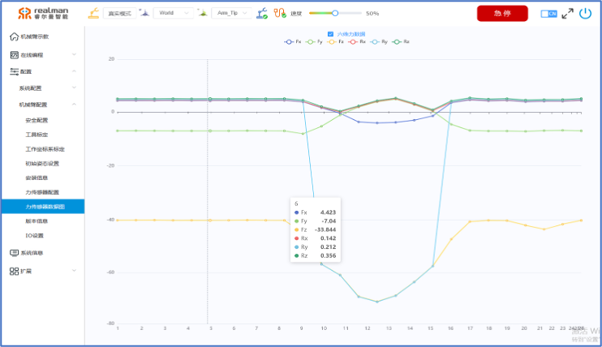

力传感器数据图

#### 版本信息

连接机器人后，版本信息界面可以查看控制器软件版本号、机械臂型号、后端版本、Web版本、关节软件版本号和末端接口板版本号。

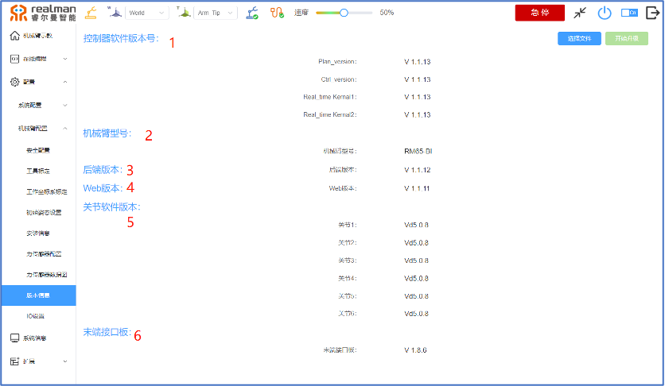

版本信息界面

#### IO设置

IO设置分别可设置控制器IO配置和工具IO进行配置，如下图所示：

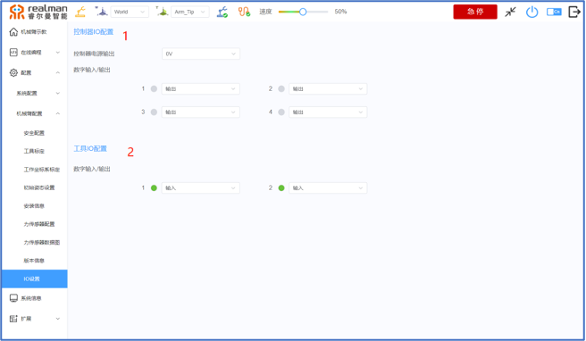

IO设置界面

1. **控制器IO设置：**

在示教器的IO配置界面可显示控制器IO的状态和对控制器IO进行配置，如下图所示：

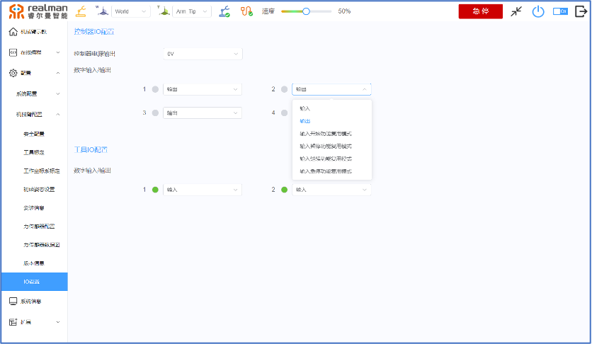

控制器IO设置界面

控制器电源输出:该部分可配置控制器对外的输出电源，可配置为0V,5V,12V和24V。

数字输入/输出:该部分显示数字IO的状态，用户根据实际需要设定为输入模式，输出模式、输入开始功能复用模式，输入暂停功能复用模式，输入继续功能复用模式，输入急停功能复用模式。设定为输入接口时，灰色圆圈代表低电平，绿色圆圈代表高电平。 设定为输出接口时，按下按钮颜色变为绿色，对应通道设置输出状态为高；按钮弹起变为灰色，代表对应通道输出为低。

2. **工具IO配置**

在示教器的工具IO界面可显示工具IO的状态和对IO进行配置如下图所示：

工具IO设置界面

数字输入/输出:该部分显示的数字IO的状态，灰色圆圈代表低电平，绿色圆圈代表高电平，用户根据实际需要设定为输入或输出接口。

#### 电子围栏

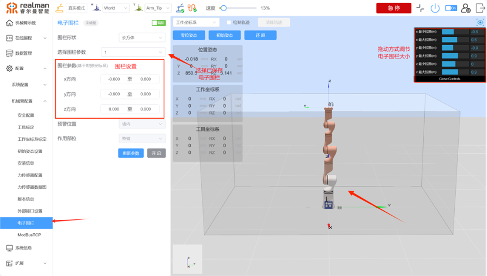

电子围栏包括，围栏形状、选择围栏参数、围栏参数、预警位置、作用部位、更新参数开启等。

1. 围栏形状默认为长方形三维视图显示当前电子围栏三维形态，并通过颜色进行区分，（灰色未生效、绿色生效、红色撞墙报错），
2. 电子围栏设置时可以选择已保存围栏（最多保存10个电子围栏）。可以选择手动输入，围栏参数中包括X.Y.Z.三个方向的最大值最小值 ，也可以选择在页面右上方使用鼠标拖动设置位置位置单位为（M）
3. 支持设置和使能，重启依然有效。
4. 预警位置默认为墙内，作用位置默认整臂

::: warning 注意
电子围栏目前只可在仿真模式下进行运动指令操作。
:::

## 系统信息

系统信息包括控制器状态和关节状态，以及系统日志，报错信息等。

1. 系统信息：包括控制器的输入电压、输出电流、温度、位姿和错误代码。
2. 机器人信息：包括6个关节的电压、电流、温度、使能状态和错误代码。当关节错误排除后，需要点击清除按钮清除错误代码后，才可给关节上使能控制关节运动。
3. 系统日志：包含示教器的所有操作指令和机器人、控制器的错误类型，并带有时间戳在文本框内显示。点击`下载当前日志`可将当前日志信息保存到本地。点击`下载系统日志`可下载机械臂全部日志到本地，支持所有程序的完整日志下载。点击`清除`会清空所有显示的系统日志。

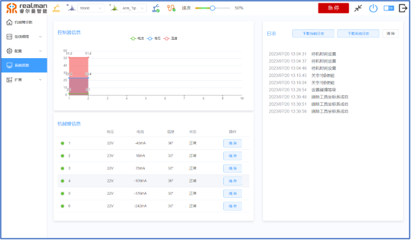

系统信息示意图

