# <p class="hidden">应用集成案例: </p>新型智能零售平台v3.0——赋能复合升降机器人

## 一、 项目概述

新零售3.0项目是一个创新的自动化解决方案，旨在通过集成先进的机器人技术和智能软件系统，优化零售行业的商品分拣、运输和交付流程。该项目通过结合机器人硬件和ROS（Robot Operating System）软件平台，实现了一个全自动化的新零售环境，不仅提高了效率，还增强了顾客的购物体验。

**1. 项目背景与目标**  

随着电子商务的迅猛发展和消费者对即时服务需求的增加，传统的零售模式面临着转型的压力。新零售3.0项目正是在这样的背景下应运而生，旨在通过技术革新，实现零售流程的自动化和智能化。项目的主要目标包括：

- **自动化商品处理**：利用机器人完成商品的抓取、搬运和交付。
- **提高效率**：减少人力成本，缩短商品处理时间，提升整体运营效率。
- **增强顾客体验**：通过自动化服务，提供快速、准确的商品交付。
- **环境适应性**：确保机器人能够在多变的零售环境中稳定运行。

**2. 核心功能**  

新零售3.0项目的核心功能涵盖了从订单处理到商品交付的全过程：

1. **订单接收与处理**：通过网页界面接收顾客订单，并实时传输至系统进行处理。
2. **商品识别与抓取**：使用D435深度相机进行商品识别，并由RM65-V机械臂完成精准抓取。
3. **智能导航与运输**：云迹底盘结合激光雷达和声波测距技术，实现精准的建图与导航。
4. **商品交付**：机器人自动导航至指定的交付点，等待顾客取货。
5. **自主充电**：任务完成后，机器人自动返回充电桩进行充电，确保持续运行。

**3. 技术亮点**  

项目采用了多项前沿技术，包括但不限于：

- **深度学习与计算机视觉**：用于商品的快速识别与定位。
- **ROS集成**：作为项目开发的基础，提供了丰富的工具和库来实现复杂的机器人行为。
- **多传感器融合**：结合激光雷达、声波测距等多种传感器，提高机器人的环境感知能力。
- **自主决策系统**：NX控制器作为主控制器，负责机器人的功能决策和运动规划。
- **用户交互界面**：简洁直观的网页下单系统，提升用户体验。

**4. 项目实施与展望**  

新零售3.0项目的实施将分为多个阶段，包括系统设计、硬件集成、软件开发、测试验证和最终部署。项目团队将不断优化系统性能，探索更多创新应用，以期在未来的零售行业中发挥更大的作用。

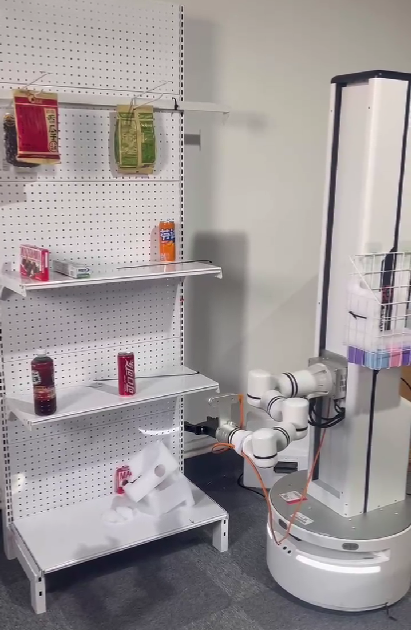

## 二、 硬件环境

**1. 硬件基础介绍**  

- 435深度相机：用于识别并获取与下单时对应名称的商品，最终得到识别目标（商品）基于机械臂基坐标系的位姿，从而执行机械臂抓取动作。
- M65-v机械臂：末端法兰装上夹爪，用于抓取已下单的商品，并通过机械臂规划相应行动路径。
- 云迹底盘：通过网口协议的传输去控制机器人的位置。该底盘集成了激光雷达、声波测距等等。可进行精准的建图与导航等功能。
- NX控制器：作为主控制器控制机器人运动机器人功能决策单元与目标识别单元。
- 升降装置：与机械臂绑定，通过RM机械臂控制接口也可同时控制升降装置。
- 接近开关：对升降装置进行物理限位，防止升级装置发生碰撞。
- WIFI路由：为客户与机器人提供网络环境作为网络连接装置。
- RM控制器：集成机械臂与升降机，方便示教器调用与通过代码接口直接控制。

**2. 硬件通信框架**  

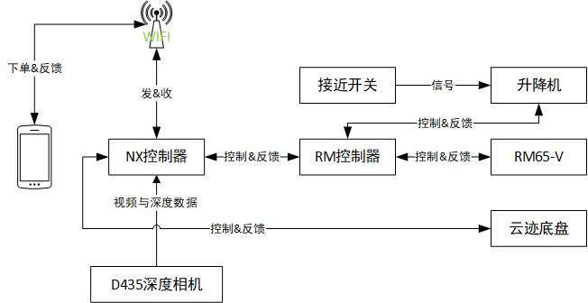

NX控制器通过网口通讯连接RM控制器，从而控制升降机与RM65-V臂，升降机通过接近开关信号来控制位置的限制；通过USB3.0接口获取D435深度相机深度数据与RGB像素数据；通过网口通讯接收并发送json格式数据实现云迹底盘的连接；通过WIFI信号与客户机相连接，进而获取网页端下单数据，从而实现集成控制。

::: 注意
其中，手机IP应当与WIFI热点IP在同一网段下，并直接用浏览器访问NX控制器的`http://+IP+/8000`。例如：[客户下单网页](http://192.168.8.19:8000)。另外，RM机械臂IP需与NX控制器以太网IP在同一网段下。默认NX控制器的以太网IP为`192.168.10.100`，RM机械臂IP为`192.168.10.18`，云迹底盘的IP为`192.168.10.10`。由上图易知NX控制器、RM机械臂控制器与云迹底盘通过交换机连接，进而形成局域网进行通讯。
:::

## 三、 软件环境

ROS版本：noetic
Ubuntu版本：20.04
系统架构：X86/ARM64

**项目文件结构**  

```tree
new_retail3_ros1/src
  │ README.md    <- 文件描述
  │
  ├─agv_control    <- 底盘控制与测试功能包
  ├─cam_vision    <- 相机识别与检测功能包
  ├─retail_control    <- 新零售决策与启动demo
  ├─rm_control    <- 睿尔曼机械臂官方接口
  ├─tf_transform    <- tf坐标树操作
  ├─django_myshop    <- 网页框架服务
  └─web_service    <- 新零售web通讯服务端
```

**1. 依赖包及必要的配置**  

- **geometry_msgs**
提供了基本的几何消息类型，如点（Point）、向量（Vector3）、姿态（Quaternion）等，用于在ROS节点之间传递几何信息。
- **moveit_commander**
MoveIt是一个功能强大的运动规划框架，而moveit_commander是它的Python接口，用于与MoveIt进行交互，执行运动规划和控制机器人动作。
- **moveit_msgs**
包含MoveIt特有的消息类型和服务类型，用于在ROS中处理运动规划相关的通信。
- **tf_msgs**
提供了针对于新零售tf坐标系转换所自定义的一系列话题、服务与动作的消息类型，用于方便节点间的调用。
- **rm_msgs**
睿尔曼机械臂官方ros1包的话题和服务的数据类型。
- **roscpp**
ROS的C++客户端库，提供API用于在C++程序中实现ROS节点，进行话题发布、订阅、服务调用等。
- **rospy**
ROS的Python客户端库，提供API用于在Python程序中实现ROS节点，功能与roscpp类似，但使用Python语言。
- **std_msgs**
提供了ROS中的标准消息类型，如字符串（String）、整数（Int32/Int64）、浮点数（Float32/Float64）等，用于基本的数据传输。
- **tf**
Transformation Framework（转换框架）的缩写，用于处理坐标变换和跟踪多个坐标帧之间的关系。

**2. ros软件包的下载**  

```bash
sudo apt-get install ros-noetic-moveit*    # 下载全部的moveit软件包
```

**3. Python环境配置**  

该demo的目标检测部分依赖于yolov8，python本身的版本为python3.8。yolov8的安装教程请参考链接：[yolov8基于ubuntu20.04的安装教程](https://blog.csdn.net/m0_53717069/article/details/128536837?spm=1001.2101.3001.6650.4&utm_medium=distribute.pc_relevant.none-task-blog-2%7Edefault%7ECTRLIST%7ERate-4-128536837-blog-121696967.235%5Ev40%5Epc_relevant_anti_t3_base&depth_1-utm_source=distribute.pc_relevant.none-task-blog-2%7Edefault%7ECTRLIST%7ERate-4-128536837-blog-121696967.235%5Ev40%5Epc_relevant_anti_t3_base&utm_relevant_index=9)。相对应的pytorch版本为：torch=2.1.0a0+41361538.nv23.6、torchvision=0.16.1。

另外，web_service功能包用的是conda中的new2虚拟环境，所以需要创建一个名字为new2的虚拟环境，python版本为3.6.15。

```bash
cd ~/new_retail3_ros1

conda create --name new2 --file ./py_env/conda_new2.yml    # 创建虚拟环境
```

## 四、 话题与服务参数说明

**1. 话题说明**  

项目中主要用到的数据类型主要来源于rm_msgs、tf_msgs与std_msgs等，其中下表为相应话题示例。

| 话题名                         | 数据类型     | 作用说明                         |
| :----------------------------- | ------------ | -------------------------------- |
| /navigation                    | String       | 导航点设置                       |
| /navigation_feedback           | Bool         | 判断是否导航成功                 |
| /cabinet_widget/result         | Cabinet      | 传递识别结果                     |
| /target_item                   | String       | 被识别的标签名称                 |
| /target2base_single_arm_server | Target2Base  | 目标坐标系在基坐标系的表示       |
| /shop_target_topic             | String       | web客户端通讯数据的传递          |
| /grabbing_done                 | Bool         | 判断是否完成抓取                 |
| /grab_target                   | String       | 抓取目标                         |
| /rm_driver/Lift_SetHeight      | Lift_Height  | 升降机高度设置                   |
| /rm_driver/Plan_State          | Plan_State   | 机械臂规划状态                   |
| /rm_driver/ArmError            | UInt16       | 睿尔曼机械臂错误代码             |
| /rm_driver/Clear_System_Err    | Empty        | 清除系统错误                     |
| /rm_driver/JointPos            | JointPos     | 关节位姿                         |
| /rm_driver/MoveJ_Cmd           | MoveJ        | 关节控制                         |
| /rm_driver/Gripper_Set         | Gripper_Set  | 手抓闭合设置                     |
| /rm_driver/Gripper_Pick_On     | Gripper_Pick | 闭合参数配置（闭合速度、力反馈） |
| /rm_driver/MoveJ_P_Cmd         | MoveJ_P      | 关节位姿控制                     |

**2. 服务说明**  

项目中主要用到的数据类型主要来源于tf_msgs，其中下表为相应服务示例。

| 服务名     | 数据类型    | 作用说明         |
| ---------- | ----------- | ---------------- |
| /do_action | Ldle_Action | 开始执行动作通讯 |

**3. 动作说明**  

项目中主要用到的数据类型主要来源于control_msgs，其中下表为相应服务示例。

| 服务名                            | 数据类型                  | 作用说明             |
| --------------------------------- | ------------------------- | -------------------- |
| /rm_group/follow_joint_trajectory | FollowJointTrajectoryGoal | move_group规划的动作 |

## 五、 准备阶段

**1. 场地条件以及位置**  

场地的宽2.5米，长2米。其中一面靠墙（货架和充电桩的墙面），布局如下图，其中参考物可以放置到左右两边主要作用是模拟边墙体，提高导航准确度。

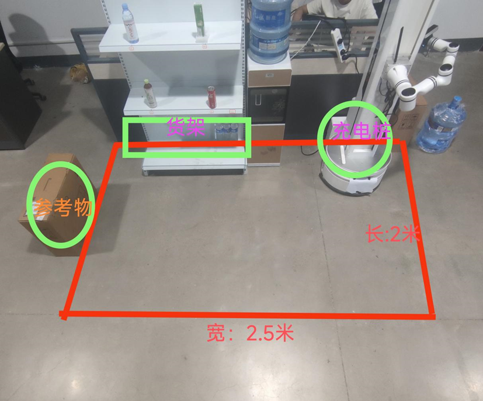

其中货架到左边界的距离是0.3米，充电桩到右边界的距离是0.55米，如图：

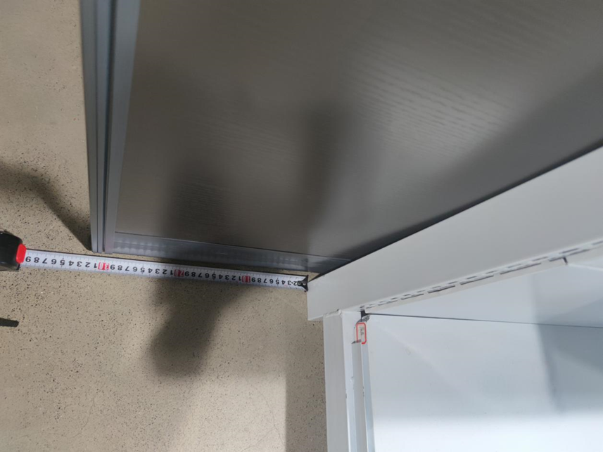

货架层高，第一层高70cm，第二层高116cm：

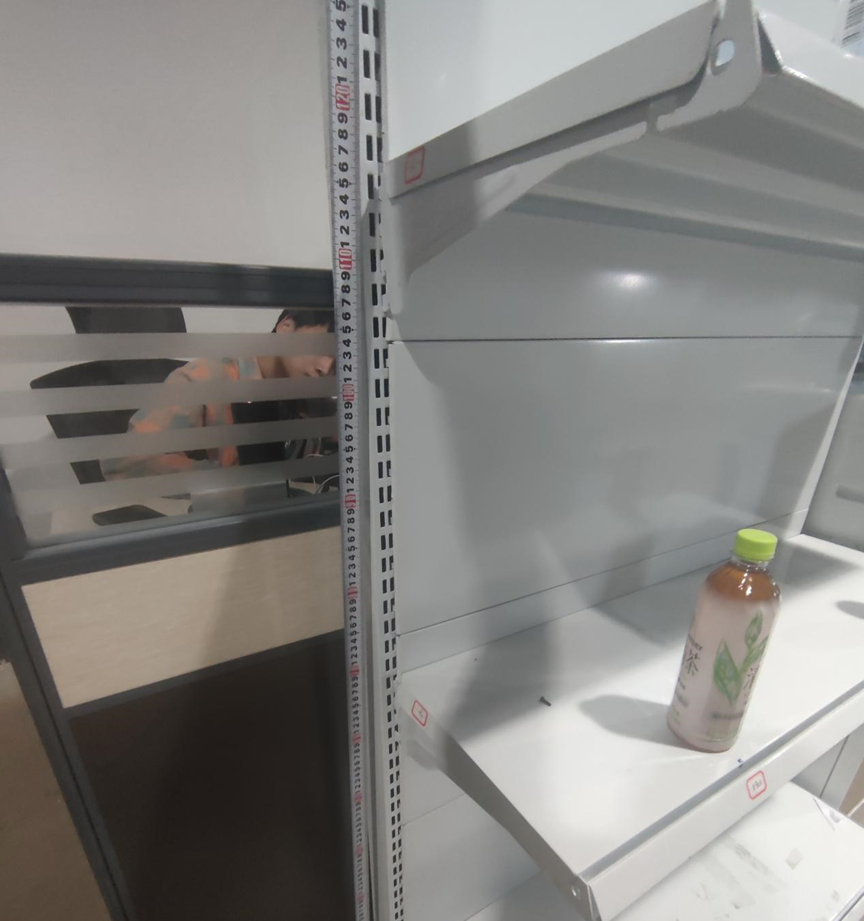

**2. 升降测试**  

进入示教器，192.168.10.18，升降零位高度为：240mm。

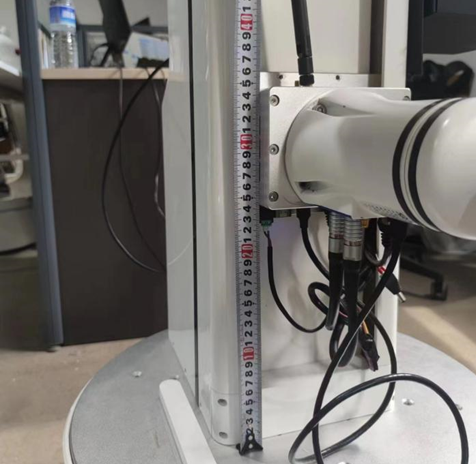

**3. 点位测试**  

进入`192.168.10.10:9001`,可见点位分布dianD是充电桩，dianA是货架右侧，dianB是货架左侧，dianC是送货客户取货点。可以通过测试工具，选择dianA，dianB，dianC，dianD，依次到达一次，观察点位是否正确进行点位调整，尤其是dianA与dianB，不能距离货架位置太远。

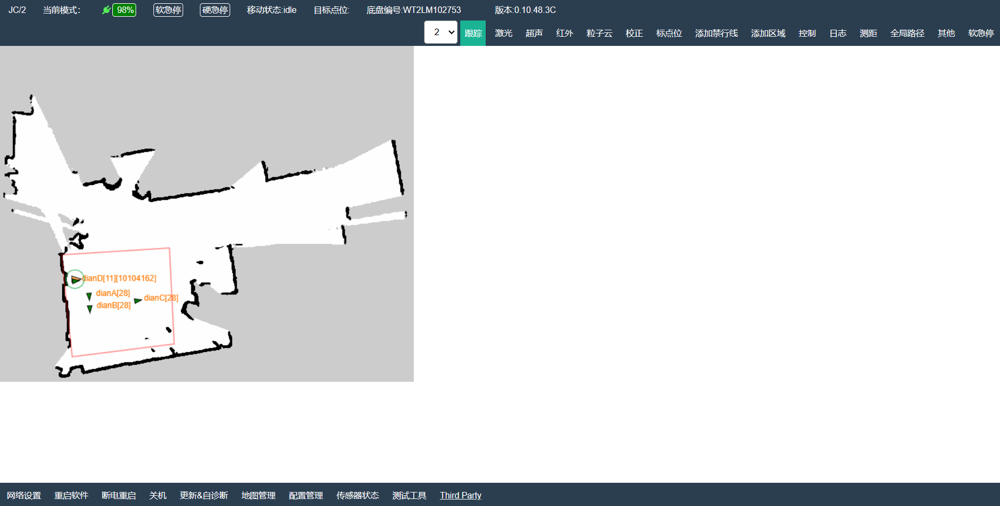

若机器人所处于新环境之中，建议对环境进行重新建图并采集点位：dianA(28, 第一列商品位置)、dianB(28, 第二列商品位置)、dianC(29, 拿取商品点位)、dianD(11, 充电桩点位，选择红外充电，其中充电桩编号位于无线充电桩背面的条形码下方)。其中：建图相应操作请查阅：[水滴2使用手册](../doc/WATER2UserManual.pdf)

**踩点过程：**

其中，dianD的设置只需要将正在充电中的当前位置进行设置即可；dianC为了使顾客将机器人抓取的商品拿走的点，可在合适的位置进行设置，无要求；dianA为货架第一列抓取的位置；dianB为货架第二列抓取的位置。dianA与dianB的点位状态与货架之间的距离如下所示：


**4. 参数配置**  

进入到NX主控中，先将NX连接到无线wifi下，然后启用终端，输入ifconfig查看无线网ip，如下图的192.168.8.19就可以改写到参数表文件config.json中。若IP已经被更改，则后续对应的二维码需要从[草料网址二维码生成器 (cli.im)](https://cli.im/url?1666236d6f4b989bf7cd9977f5ede4bf)网站通过网址生成器将IP(例子):`http://192.168.8.19:8000`生成为二维码并进行下载。


另外，在config.json文件中同样包含着其他参数如下所示：

```json
{
    "web_ip": "192.168.8.19",
    "_comment_web_ip": "ifconfig查看当前主机无线网络的ip",
    
    "hand_gaodu": -0.02,
    "_comment_hand_gaodu": "手部高度偏差，数值越大高度越低，单位是米，建议修改范围为 -0.05至0.05之间",
    
    "hand_shendu": 0.01,
    "_comment_hand_shendu": "手部深度偏差，数值越大深度越浅，单位是米，建议修改范围为 -0.05至0.05之间",
    
    "hand_zuoyou": 0.01,
    "_comment_hand_zuoyou": "手部左右偏差，数值越大越偏向左边，单位是米，建议修改范围为 -0.05至0.05之间",
    
    "joint_posture_1": [-75 , 98 , -121 , 11 , -60 , -95 ],
    "_comment_joint_posture_1": "#动作一，抓取时看的姿态，joint_posture_1",
    
    "joint_posture_2": [-75, 98,  -121, 11, -60, -95],
    "_comment_joint_posture_2": "动作二，抓取后回到看的姿态，joint_posture_2",
    
    "joint_posture_3": [0, 98,  -121, 0, -60, 0],
    "_comment_joint_posture_3": "动作三，放置到框的过渡点3，joint_posture_3",
    
    "joint_posture_4": [0, 0,  -121, 0, -60, 0],
    "_comment_joint_posture_4": "动作四，放置到框的过渡点4，joint_posture_4",
    
    "joint_posture_5": [0, -10,  -100, 0, -60, 0],
    "_comment_joint_posture_5": "动作五，放置到框的正上方5，joint_posture_5",
    
    "joint_posture_6": [0, 120,  -121, 0, -60, 0],
    "_comment_joint_posture_6": "动作六，放置完毕的姿态过渡，joint_posture_6",
    
    "joint_posture_7": [0, 120,  -121, 0, 100, 0],
    "_comment_joint_posture_7": "动作七，放置完毕的姿态过渡，joint_posture_7",
    
    "joint_posture_8": [0, 90,  0, 0, 0, 0],
    "_comment_joint_posture_8": "动作八，放置完毕的姿态，joint_posture_8",
    
    "hand_rot": [1.556, 0, 0],
    "_comment_hand_rot": "抓取姿态rx，ry，rz，参考示教器数值",
    
    "fang_higth": 380,
    "_comment_fang_higth": "抓取完毕后放置物品到篓里面动作的升降高度",
    
    "V_speed": 40,
    "_comment_V_speed": "升降的运动速度，范围0-100",
    
    "V_height_1": 350,
    "_comment_V_height_1": "货架第一层的升降高度",
    
    "V_height_2": 800,
    "_comment_V_height_2": "货架第二层的升降高度",
    
    "V_height_3": 800,
    "_comment_V_height_3": "货架第三层的升降高度",
    
    "V_height_song": 450,
    "_comment_V_height_song": "送货的升降高度，方便客户从篮子里取货",
    
    "action_order": [
        [[0, 90, 0, 0, 0, 0], 0.4, 450],
        [[0, 0, 0, 0, 0, -180], 0.4, 450],
        [[0, 10, 30, 0, 30, -180], 0.4, 450],
        [[0, 0, 0, 0, 0, -180], 0.4, 450],
        [[0, 10, 30, 0, 30, -180], 0.4, 450],
        [[0, 0, 0, 0, 0, -180], 0.4, 450],
        [[0, 10, 30, 0, 30, -180], 0.4, 450],
        [[0, 90, 0, 0, 0, -180], 0.4, 450],
        [[30, 90, 0, 0, 0, -180], 0.4, 450],
        [[-30, 90, 0, 0, 0, -180], 0.4, 450],
        [[30, 90, 0, 0, 0, -180], 0.4, 450],
        [[-30, 90, 0, 0, 0, -180], 0.4, 450],
        [[30, 90, 0, 0, 0, -180], 0.4, 450],
        [[-30, 90, 0, 0, 0, -180], 0.4, 450],
        [[0, 90, 0, 0, 0, -180], 0.4, 450],
        [[0, 60, -60, 0, -60, -180], 0.4, 450],
        [[0, 60, -60, 0, -60, -180], 0.4, 800],
        [[0, 60, -60, 0, -60, -180], 0.4, 300],
        [[0, 60, -60, 0, -60, -180], 0.4, 800],
        [[0, 60, -60, 0, -60, -180], 0.4, 300],
        [[0, 90, 0, 0, 0, 0], 0.4, 450]
    ],
    "_comment_action_order": "闲置状态的动作序列的执行:[[joint1, joint2, joint3, joint4, joint5, joint6], vel, high"
    
}
```

**注意：** 针对于货架高度的设置，需将机器人位于dianA/dianB，之后将机械臂的各个关节设置在上述参数中的joint_posture_1处，如下所示：

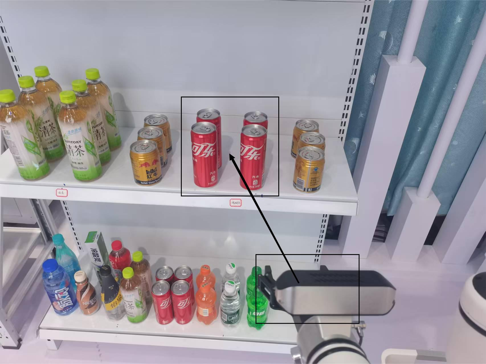

控制升降机运动，使得夹爪与各层货架的相对位置大致为上述位置处设置相应的层级高度V_height_1、V_height_2，且目前没有第三层货架，所以V_height_3可忽略。

另外，货架各个商品的位置摆放应大致按照下述所示：


## 六、 运行演示

**1. 运行命令**  

```bash
mkdir -p ~/new_retail3_ros1    # 创建文件夹，并将src库复制到该文件夹下
cd new_retail3_ros1    # 进入工作空间目录
catkin build    # 编译工作空间

source devel/setup.bash    # 刷新环境变量

sh ./scripts/set_exe_of_scripts.sh    # 将new_retail3_ros1的所有sh与py脚本设置可执行权限
sh ./scripts/run_new_retail3_now.sh    # 启动脚本
```

启动程序之后，等待3分钟直到视觉启动成功（有语音的播放提示），然后进入下单网页下单，机器人开始运动，观察抓取货物时是否前后左右上下偏移，对应修改参数表config.json，保存然后重启程序即可再次测试。对应得也观察一下抓取姿态是否合适，考虑换安装方式还是修改hand_rot参数，hand_rot也是示教器末端的Rx、Ry、Rz三个偏航角，调节到合适姿势的rot改到config.json中。

或通过启动应用软件配置开机自启项，开机自启文件目录为：`sh ./scripts/run_new_retail3.sh`。

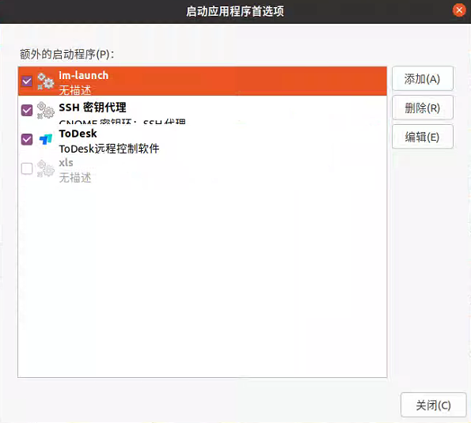

**2. 手机下单展示**  


**3. 运用页面展示**  

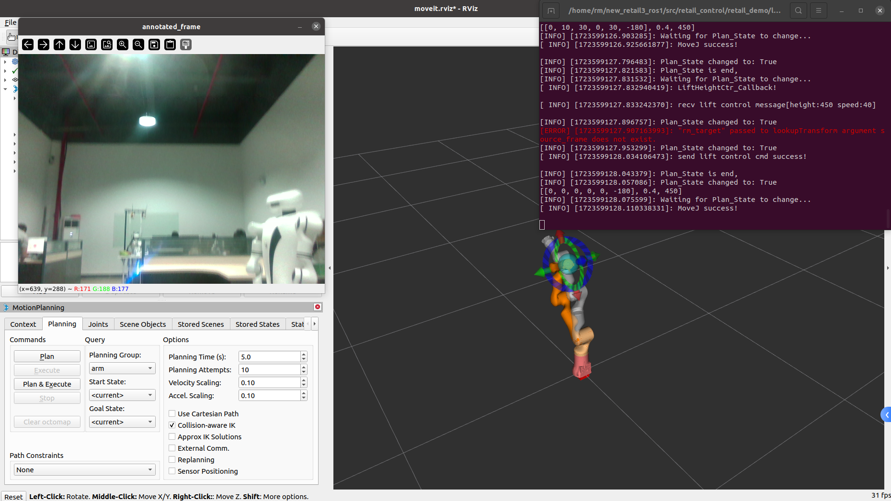

**4. 扫码下单**  

程序启动成功之后，开始扫码下单。下单之后执行取货、送货与回充电位置，之后再等待下单、执行限制时刻动作等等（该二维码指定网址为：`https://192.168.8.19:8000`）。


**5. 程序运行节点图**  

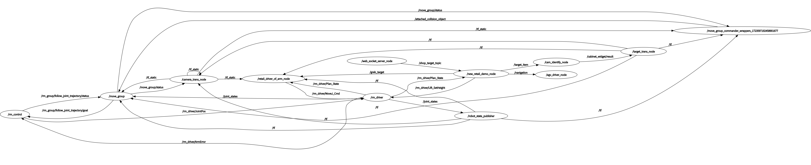

- **/rm_control**

  接收/move_group节点发布的规划目标点，之后将得到的目标点进行解析转换成每个关节的位置信息发布给rm_driver节点，若规划中间出现错误则反馈/rm_driver/ArmError机械臂规划错误话题给/rm_control节点。最后将规划状态发布给move_group节点。用于通过RVIZ仿真环境控制机械臂的部分。

- **/move_group**

  将多个节点整合的tf坐标系、tf_static坐标系数据进行订阅，再根据/rm_driver节点发布的/joint_states话题数据作为参照进行处理，发布出目标规划点给/rm_control节点，并实时监听规划状态。同时也结合了由/move_group_commander_wrappers话题发布的/attached_collision_object话题作为碰撞检测和物体附着的参考。

- **/camera_trans_node**

  通过相机标定数据给tf坐标树发布/camera_link坐标系基于/Link6坐标系之间的坐标旋转与平移关系。从而得到相机基于机械臂base_link的坐标关系。

- **/retail_driver_of_arm_node**

  通过/new_retail_demo_node节点发布的/grab_target抓取信号，将目标物基于机械臂基坐标系的位姿关系转换成机械臂的rm_driver/MoveJ_Cmd规划数据给rm_driver节点，进而让机械臂规划至目标位置。最终获取机械臂规划状态（是否规划成功）。用于识别目标物后自主规划机械臂部分。

- **/rm_driver**

  通过得到机械臂控制的ROS话题去调用机械臂sdk接口，从而实现真实机械臂的控制。

- **/robot_state_publisher**

  提供机器人的实时状态信息，它使得其他节点能够基于这些信息进行操作和决策。

- **/web_socket_server_node**

  该节点用于订阅用户通过操作网页而发布的下单信息，并将其转化成/shop_target_topic话题，从而发布给/new_retail_demo_node节点。

- **/new_retail_demo_node**

  将/shop_target_topic话题数据所包含的客户订单信息转换成/grab_target抓取信号发布给/retail_driver_of_arm_node节点启动抓取程序，与此同时发布/target_item话题发布订单物的标签名给/cam_identify_node节点，从而对目标物进行识别并将其转换成坐标数据。通过/navigation话题控制底盘的指点导航。利用/rm_driver/Lift_SetHeight数据控制升降机升降。

- **/cam_identify_node**

  得到/target_item话题数据之后，对该标签名进行识别检测，得到其坐标数据后进行一定方式的转换，最后将其以/cabinet_widget/result话题数据发布出来。

- **/agv_driver_node**

  通过解析订阅/navigation话题数据去控制底盘的指点导航，从而达到某一点位。

- **/target_trans_node**

  通过订阅/cabinet_widget/result话题去解算目标物基于camera_link坐标系的关系，最终将其转换成实时的/tf坐标系。成功实现tf坐标树的整合，为后续机械臂规划做铺垫。

- **/move_group_commander_wrappers**

  通过订阅整合过后的tf坐标树数据与真实机械臂各个关节的运动状态发布/attached_collision_object话题给/move_group节点。

## 七、 软件用例模型图

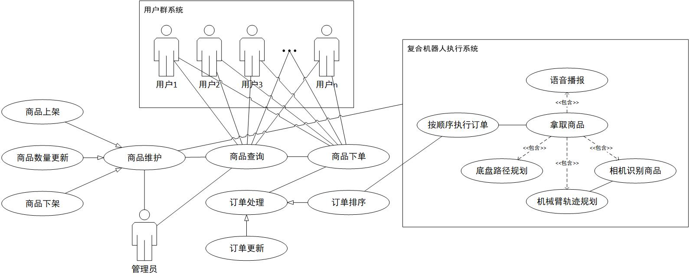

用户群系统的用户通过web网页查询商品，确定商品下单信息。之后系统对订单进行处理操作，将处理后的数据发布给复合机器人执行系统。复合机器人执行系统依次获取排序之后的订单数据，通过这些数据执行拿取商品的过程。执行过程中将会对商品进行实时播报，通过订单信息规划出底盘路径、机械臂执行轨迹与相机识别目标，同样也通过商品识别结果二次规划机械臂执行轨迹。并通过最终的执行结果对商品进行维护，实现闭环。管理员则通过该系统对商品进行查询与维护操作。

## 八、 关键代码分析

下述代码通过下单信息数据控制机械臂规划：

```python
def publish_movej_command():
    """整合数据，发布机械臂拿取商品的一系列动作"""

    global run_zhua ,hand_gaodu , hand_shendu , hand_zuoyou ,hand_rot  ,fang_higth ,V_speed_JP, V_speed ,trans , rx , tanx , tf_listener
    global joint_posture_1 ,joint_posture_2,joint_posture_3,joint_posture_4,joint_posture_5,joint_posture_6,joint_posture_7,joint_posture_8
    global pub_MoveJ, height_pub
    # 初始化 ROS 节点
    rospy.init_node('movej_publisher', anonymous=True)

    # 初始化moveit_commander
    moveit_commander.roscpp_initialize(sys.argv)
    # 初始化需要使用的对象
    robot = moveit_commander.RobotCommander()
    scene = moveit_commander.PlanningSceneInterface()
    group_name = "arm"  # 替换为你的机械臂group名称
    group = moveit_commander.MoveGroupCommander(group_name)
    #tf_listener = TransformListener()
    tf_listener = tf.TransformListener()
    group.set_planning_time(10)
    group.set_max_velocity_scaling_factor(0.8)
    # 设置机械臂规划策略为最短路径
    group.set_planner_id("RRTConnectkConfigDefault")
    # 等待tf信息变得可用
    rospy.sleep(1)

    # 创建一个 Publisher，发布到 /rm_driver/MoveJ_Cmd 主题
    pub_MoveJ = rospy.Publisher('/rm_driver/MoveJ_Cmd', MoveJ, queue_size=10)
    # 创建一个 Publisher，发布到 /rm_driver/Gripper_Set 主题
    pub_Gripper = rospy.Publisher('/rm_driver/Gripper_Set', Gripper_Set, queue_size=10)
    pub_Gripper_Pick_On = rospy.Publisher('/rm_driver/Gripper_Pick_On', Gripper_Pick, queue_size=10)
    pub_MoveJ_P = rospy.Publisher('/rm_driver/MoveJ_P_Cmd', MoveJ_P, queue_size=10)
    pub_grabbing_done = rospy.Publisher('/grabbing_done', Bool, queue_size=10)
    height_pub = rospy.Publisher("/rm_driver/Lift_SetHeight", Lift_Height, queue_size=10)

    rospy.Subscriber('/rm_driver/Plan_State', Plan_State, plan_state_callback)
    rospy.Subscriber('/grab_target', String, grab_target_callback)
    rospy.Service('/do_action', Ldle_Action, do_action_callback)    # 绑定动作话题监听回调函数

    # 等待连接
    rospy.sleep(1)
    flag_num = 0
    run_zhua = 0
    while not rospy.is_shutdown():
        while not rospy.is_shutdown():
            rospy.sleep(0.1)
            if run_zhua == 1 :
                run_zhua = 0
                flag_num = 1
                break
        if flag_num > 0 :
            flag_num = flag_num - 1
            #动作一，抓取时看的姿态，joint_posture_1
            movej_cmd = MoveJ()
            movej_cmd.joint = [num / 57.0 for num in joint_posture_1]
            movej_cmd.speed = V_speed
            pub_MoveJ.publish(movej_cmd)
            rospy.loginfo("Published MoveJ Command to joint_posture_1")
            wait_time()

            # 创建 Gripper_Set 消息实例
            gripper_set_cmd = Gripper_Set()
            gripper_set_cmd.position = 1000
            
            pub_Gripper.publish(gripper_set_cmd)
            rospy.loginfo("Published Gripper_Set Command to /rm_driver/Gripper_Set")
            
            rospy.sleep(5)
            tf_trans()

            # 设置机械臂的目标位置和姿态 -------到达目标前方
            rospy.loginfo(trans)
            trans[0] = trans[0] 
            trans[1] = trans[1] - 0.01 
            trans[2] = trans[2] + 0.035 
            if trans[0] > 0.16 :
                trans[0] = 0.16
            rospy.loginfo(trans)
            move_command = MoveJ_P()
            move_command.Pose.position.x = trans[0] + 0.03  
            move_command.Pose.position.y = trans[1] + 0.05
            move_command.Pose.position.z = trans[2] + 0.05 * tanx * 2
            #quaternion = euler_to_quaternion(1.556 + rx , 0.428, 0.182)  hand_rot
            quaternion = euler_to_quaternion(hand_rot[0] - rx , hand_rot[1], hand_rot[2]) 
            move_command.Pose.orientation.x = quaternion[0]
            move_command.Pose.orientation.y = quaternion[1]
            move_command.Pose.orientation.z = quaternion[2]
            move_command.Pose.orientation.w = quaternion[3]
            move_command.speed = V_speed_JP
            
            pub_MoveJ_P.publish(move_command)
            rospy.loginfo("Published move command to /rm_driver/MoveJ_P_Cmd")
            wait_time()
            rospy.sleep(0.1)

            move_command.Pose.position.y = trans[1]
            move_command.Pose.position.z = trans[2] + 0.05 * tanx * 1
            move_command.speed = V_speed_JP - 0.1
            pub_MoveJ_P.publish(move_command)
            wait_time()
            rospy.sleep(0.1)

            # 设置机械臂的目标位置和姿态 -------到达目标
            rospy.loginfo(trans)
            move_command = MoveJ_P()
            move_command.Pose.position.x = trans[0] + 0.03
            move_command.Pose.position.y = trans[1] - 0.05
            move_command.Pose.position.z = trans[2] 
            quaternion = euler_to_quaternion(hand_rot[0] - rx , hand_rot[1], hand_rot[2])
            move_command.Pose.orientation.x = quaternion[0]
            move_command.Pose.orientation.y = quaternion[1]
            move_command.Pose.orientation.z = quaternion[2]
            move_command.Pose.orientation.w = quaternion[3]
            move_command.speed = V_speed_JP - 0.1
            
            pub_MoveJ_P.publish(move_command)
            rospy.loginfo("Published move command to /rm_driver/MoveJ_P_Cmd")
            wait_time()
            rospy.sleep(0.1)
            rospy.sleep(1)
            msg_pub_Gripper_Pick_On = Gripper_Pick()
            msg_pub_Gripper_Pick_On.speed = 400
            msg_pub_Gripper_Pick_On.force = 850
            pub_Gripper_Pick_On.publish(msg_pub_Gripper_Pick_On)
            rospy.loginfo("Published Gripper_Set Command to /rm_driver/Gripper_Set")
            rospy.sleep(3)

            move_command.Pose.position.x = trans[0] - 0.05
            move_command.Pose.position.y = trans[1]
            move_command.Pose.position.z = trans[2] + 0.05 * tanx * 1
            move_command.speed = V_speed_JP
            pub_MoveJ_P.publish(move_command)
            wait_time()
            rospy.sleep(0.1)

            move_command.Pose.position.y = trans[1] + 0.05
            move_command.Pose.position.z = trans[2] + 0.05 * tanx * 2
            pub_MoveJ_P.publish(move_command)
            wait_time()
            rospy.sleep(0.1)

            #动作二，抓取后回到看的姿态，joint_posture_2
            movej_cmd.joint = [num / 57.0 for num in joint_posture_2]
            pub_MoveJ.publish(movej_cmd)
            rospy.loginfo("Published MoveJ Command to joint_posture_2")
            wait_time()
            
            #升降放置，到放至高度
            height_msg = Lift_Height()
            V_height = fang_higth
            height_msg.height = V_height + 100
            height_msg.speed = 30
            height_pub.publish(height_msg)
            print(f"发布目标高度: {V_height}")
            wait_time()

            #动作三，放置到框的过渡点3，joint_posture_3
            movej_cmd.joint = [num / 57.0 for num in joint_posture_3]
            pub_MoveJ.publish(movej_cmd)
            rospy.loginfo("Published MoveJ Command to joint_posture_3")
            wait_time()
            
            #动作四，放置到框的过渡点4，joint_posture_4
            movej_cmd.joint = [num / 57.0 for num in joint_posture_4]
            pub_MoveJ.publish(movej_cmd)
            rospy.loginfo("Published MoveJ Command to joint_posture_4")
            wait_time()
            
            #动作五，放置到框的正上方5，joint_posture_5
            movej_cmd.joint = [num / 57.0 for num in joint_posture_5]
            pub_MoveJ.publish(movej_cmd)
            rospy.loginfo("Published MoveJ Command to joint_posture_5")
            wait_time()
            
            #升降放置，到放至高度
            height_msg = Lift_Height()
            V_height = fang_higth
            height_msg.height = V_height
            height_msg.speed = 30
            height_pub.publish(height_msg)
            print(f"发布目标高度: {V_height}")
            wait_time()
            
            # 打开夹爪，放商品
            gripper_set_cmd = Gripper_Set()
            gripper_set_cmd.position = 990
            pub_Gripper.publish(gripper_set_cmd)
            rospy.loginfo("Published Gripper_Set Command to /rm_driver/Gripper_Set")
            rospy.sleep(2)
            
            #升降放置
            height_msg = Lift_Height()
            V_height = fang_higth + 150 
            height_msg.height = V_height
            height_msg.speed = 30
            height_pub.publish(height_msg)
            print(f"发布目标高度: {V_height}")
            wait_time()
            
            #动作六，放置完毕的姿态过渡点，joint_posture_6
            movej_cmd.joint = [num / 57.0 for num in joint_posture_6]
            pub_MoveJ.publish(movej_cmd)
            rospy.loginfo("Published MoveJ Command to joint_posture_6")
            wait_time()
            
            #动作七，放置完毕的姿态过渡点，joint_posture_7
            movej_cmd.joint = [num / 57.0 for num in joint_posture_7]
            pub_MoveJ.publish(movej_cmd)
            rospy.loginfo("Published MoveJ Command to joint_posture_7")
            wait_time()
            
            #动作八，放置完毕的姿态，joint_posture_8
            movej_cmd.joint = [num / 57.0 for num in joint_posture_8]
            pub_MoveJ.publish(movej_cmd)
            rospy.loginfo("Published MoveJ Command to joint_posture_8")
            wait_time()

            message = Bool()
            message.data = True  # 或者 False，取决于你的需求
            pub_grabbing_done.publish(message)
```

这段代码是一个用于ROS（机器人操作系统）的Python脚本，目的是控制机械臂执行一系列动作，包括移动到特定位置、抓取物体、移动到另一个位置并放置物体。以下是对代码的分析：

1. **全局变量声明**：代码开始时声明了一系列全局变量，这些变量用于在函数内部访问和修改。
2. **ROS节点初始化**：使用`rospy.init_node`初始化一个ROS节点，节点名为`movej_publisher`。
3. **MoveIt! 初始化**：使用`moveit_commander`包初始化MoveIt! 相关的对象，包括机器人模型、规划场景和机械臂组。
4. **TransformListener**：创建了一个`TransformListener`对象，用于监听坐标变换。
5. **Publisher和Subscriber初始化**：创建了多个Publisher对象用于发布不同类型的ROS消息，例如机械臂关节运动命令、夹爪控制命令等。同时，还创建了Subscriber和Service对象用于接收外部消息和提供服务。
6. **机械臂规划参数设置**：设置了机械臂的规划时间和最大速度缩放因子，并指定了规划器ID。
7. **等待Tf信息**：使用`rospy.sleep(1)`等待tf变换信息变得可用。
8. **发布机械臂动作**：在主循环中，当`run_zhua`变量被设置为1时，会执行一系列机械臂动作。这些动作包括：
   - 发布关节空间运动命令到`/rm_driver/MoveJ_Cmd`主题。
   - 控制夹爪的开合。
   - 使用`tf_listener`获取坐标变换信息。
   - 发布笛卡尔空间运动命令到`/rm_driver/MoveJ_P_Cmd`主题。
   - 发布夹爪抓取命令。
   - 发布升降高度设置命令。
   - 发布机械臂回到初始姿态的命令。
9. **动作序列**：代码中定义了多个关节姿态（`joint_posture_1`到`joint_posture_8`），这些姿态用于机械臂在抓取和放置物体过程中的不同阶段。
10. **回调函数**：代码中提到了回调函数，例如`plan_state_callback`和`grab_target_callback`，这些函数用于处理订阅到的机械臂规划状态数据与目标物抓取状态。
11. **服务回调**：`do_action_callback`是一个服务回调，用于响应`/do_action`服务的请求。
12. **发布完成信号**：最后，发布一个布尔值到`/grabbing_done`主题，表示抓取动作是否完成。

整体来看，这段代码是一个典型的ROS节点，用于控制机械臂执行复杂的动作序列。它涉及到了ROS通信的多个方面，包括发布者/订阅者模式和服务。

**技术关键点说明：**

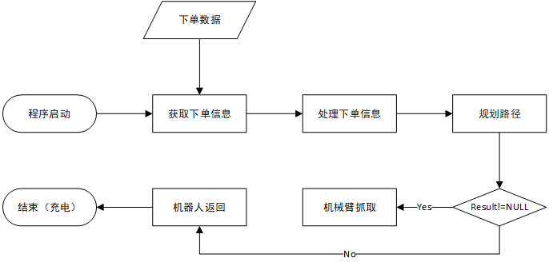

上图为整体demo大致流程图，本demo最重要的关键点针对于机械臂抓取部分，这里首先对Yolo v8目标检测算法模型进行改进，改进后的模型将相机拍到的图像作为输入，最终通过非极大值抑制的方法将图像不同的分类分数与检测框作为输入，最终输出结果框。从而实现目标检测功能的实现。对每个目标检测结果赋予相应标签，并确定其置信度反馈给cam_identify节点。cam_identify节点将客户端请求的预抓取标签与商品目标检测结果进行对比判断。若检测结果里面存在请求数据，则获取目标检测框的中心点像素位并与深度图进行匹配得到该点的深度数据从而转换成目标商品基于相机坐标系的相对位置。如下图所示：

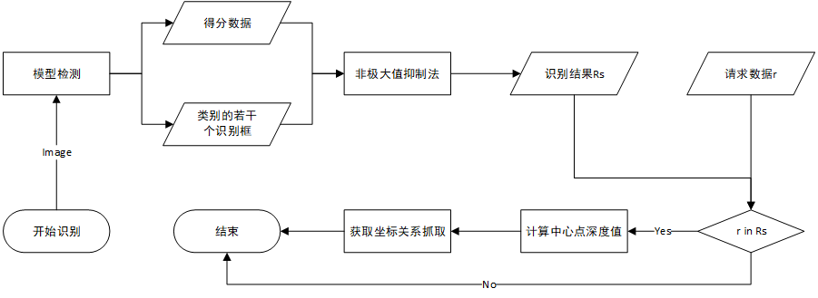

## 九、 视频演示

- 新零售抓取演示

<video width="300px" autoplay loop muted height="300px" >
  <source src="../doc/retail_20.mp4" type="video/mp4">
</video>

- 新零售下单操作演示

<video width="300px" autoplay loop muted height="300px" >
  <source src="../doc/retail_21.mp4" type="video/mp4">
</video>

## 附录：相关资源获取

**1. 相关文件查阅**  

- JSON 相关说明请访问[睿尔曼JSON通信协议](../../../robot/json/getStartedJson.md)
- [水滴2上位机接口说明](../doc/WATER2Interface.pdf)
- [水滴2软件API手册](../doc/WATER2API.pdf)
- [水滴2使用手册](../doc/WATER2UserManual.pdf)

**2. 功能包下载**  

[新零售3.0开源功能包](./src)