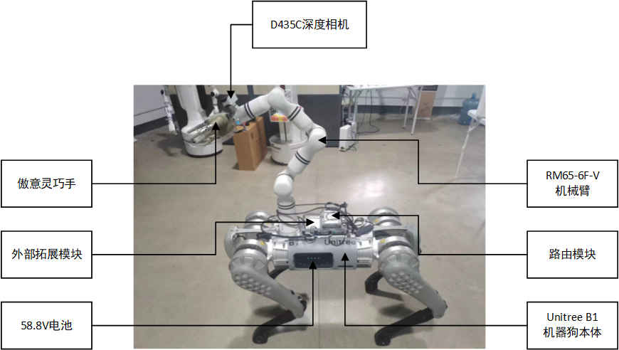
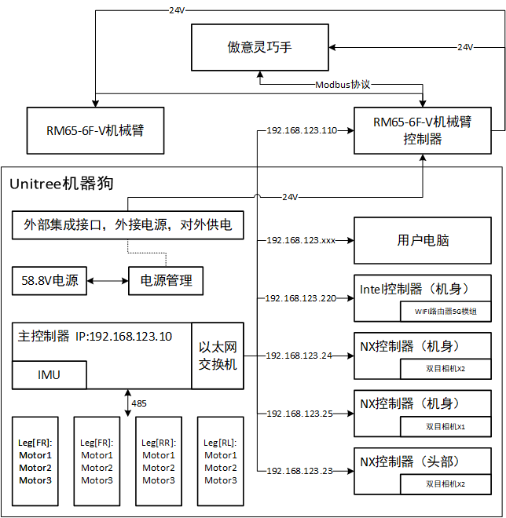
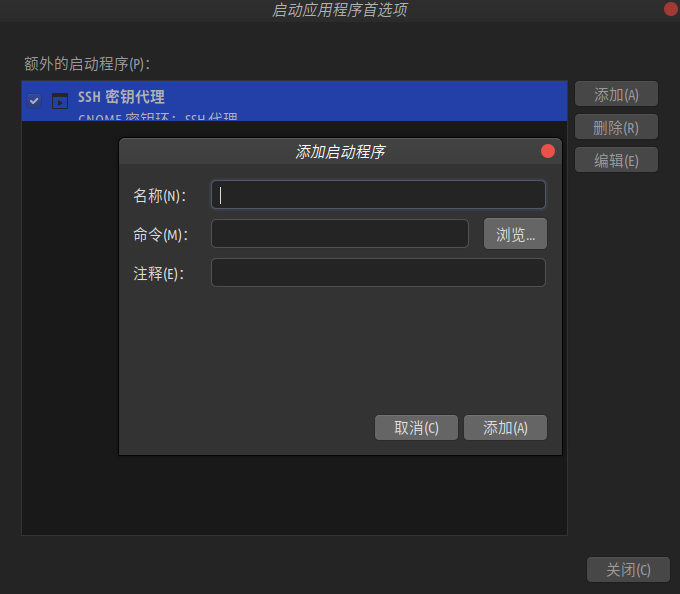
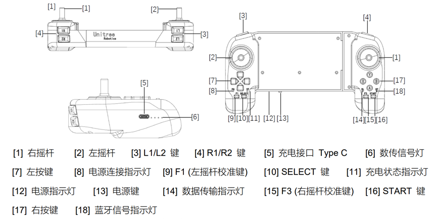
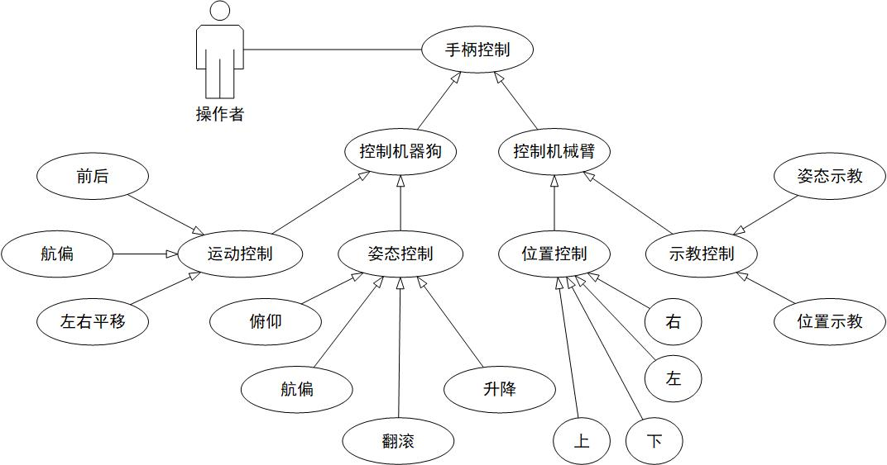

# <p class="hidden">应用集成案例: </p>赋能RealMan机械臂-复合机器狗手柄控制案例

## 一、 项目概述

本项目是一个创新的机器人案例集成方案，融合了宇树B1机器狗的灵活性、睿尔曼RM65-6f-v机械臂的操作精度以及傲意灵巧手的精细抓取能力，旨在打造一个多功能、高效率的控制案例。通过这一案例，我们能够实现在复杂环境中的敏捷移动和精确操作，满足多样化的作业需求。为该复合机器人实现的可能性做出对应的案例，为后续自主作业系统的开发做出铺垫。



### 项目背景

随着工业自动化和智能制造的快速发展，对于能够适应多变作业环境、执行复杂任务的设备的需求日益增长。本案例正是在这样的背景下应运而生，通过集成多个高性能硬件和先进的控制软件，提供一个一体化的解决方案，用于将来在自动化领域实现重大突破。

### 主要目标

- **多功能集成**：将移动平台、机械臂和灵巧手的功能有机结合，形成一个能够执行多样化任务的系统。
- **协同作业**：通过手柄实现机器狗、机械臂和灵巧手之间的高度协同控制。

### 核心功能

- **精确移动与操作**：机器狗提供稳定的移动平台，机械臂和灵巧手执行精确的抓取和放置任务。
- **实时遥控与自主控制**：结合实时遥控，提供灵活的手柄操作方式。

### 技术亮点

- **高性能机械臂**：睿尔曼RM65-6f-v机械臂以其6自由度和5kg负载能力，提供广泛的操作范围和高精度作业能力。
- **先进的灵巧手设计**：傲意灵巧手的集成，模拟人手动作，实现复杂物品的抓取和操作。
- **多传感器数据融合**：结合IMU、深度相机等传感器，实现对机器人姿态和周围环境的精确感知。
- **基于ROS的软件架构**：采用ROS melodic版本，构建模块化、可扩展的软件系统，支持二次开发和功能扩展。

### 应用前景与展望

预期该系统将在自动化制造、智能物流、服务机器人、灾难救援等领域发挥重要作用，提供灵活、高效的自动化解决方案。随着技术的不断进步和创新，我们相信该系统将推动相关行业的自动化水平达到新的高度。

### 更新日志

|  更新日期  |          更新内容          | 版本号 |
| :--------: | :------------------------: | :----: |
| 2024/10/21 | 复合机器狗项目初始版本发布 | v1.0.0 |

## 二、 硬件环境

### 硬件基础介绍

- 外部拓展模块：宇树提供了8个2×8PIN千兆以太网、12V电源、485/CAN(透传)接口、6个Type-C USB2.0接口等。
- 电池电源（58.8V）：机器人唯一电源，机械臂与灵巧手皆通过外部拓展模块（24.0V）供电。
- 主控制器：获取IMU数据，将接口接入以太网交换机，构成物理连接的局域网。可通过网线连接访问对应ip。
- IMU：获取机器人姿态等数据。
- 以太网交换机：构建局域网络，接入多个网口。
- Intel（机身）控制器：已搭建WIFI路由器5G模组（对外开放）。
- NX（机身）控制器 * 2：其中1个集成2个双目相机，另1个集成1个双目相机以供使用（对外开放）。
- NX（头部）控制器：集成2个双目相机（不对外开放）。
- 机器狗腿部电机 * 4 * 3：由主控制器通过485协议直接控制。
- D435C深度相机：获取RGB像素数据与点云数据。
- 路由模块：提供WIFI路由5G模组。
- 傲意灵巧手：五指灵巧手，主要用来方便抓取。
- 睿尔曼机械臂控制器：集成机械臂与灵巧手，方便示教器调用与通过代码接口直接控制。
- 睿尔曼RM65-6f-v机械臂：为睿尔曼RM65系列机械臂，该系列产品为6自由度且负载5kg的机械臂，同时机械臂末端含有6维力传感器可用来配合力位混合控制用来补偿末端位姿，优化机械臂指点控制性能。
- 宇树机器狗手柄：通过遥杆和按键触发信号，最终将信号通过UDP协议发布出来，等待同一局域网下其他IP的控制器进行订阅。

### 硬件通信框架



上图展示了一个高度集成化的自动化系统，其中包含了多个关键组件和它们之间的交互关系。系统以Unitree机器狗作为移动平台，搭载有RM65-6F-V机械臂和傲意灵巧手，实现精确的操作和移动作业。主控制器（IP: 192.168.123.10）作为系统的核心，通过以太网交换机连接到各个NX控制器（其中头部控制器不对外开放），IMU单元，以及Intel控制器，后者还集成了WIFI路由器5G模组，提供无线通信能力。系统还配置了电源管理模块，将58.8V电源转换为24V，为机械臂和灵巧手等组件供电。此外，系统还设计了外部集成接口，允许外接电源和设备扩展，增强了系统的灵活性和扩展性。

整个系统的设计体现了模块化和层次化的架构理念，每个组件都有明确的职责和通信接口。通过Modbus协议控制傲意灵巧手，而RM65-6F-V机械臂则通过其自身的控制器进行操作。机器狗的腿部电机通过485通信协议由主控制器直接控制，实现行走和移动。NX控制器上的IMU和双目相机提供了机器人的感知能力，使其能够在环境中自主导航和避障。用户电脑通过局域网连接到主控制器，进行系统配置和监控。整体来看，该系统是一个功能强大、灵活性高的自动化解决方案，适用于多种复杂操作和环境。

## 三、 准备阶段

### 机械臂配置

用户电脑与机械臂通过网口连接之后，电脑IP需配置成`192.168.123.xxx`，机械臂IP配置成`192.168.123.110`，并且需添加傲意灵巧手末端标定工具坐标系并且命名为ROH。进入示教器，将拓展栏里面的末端夹爪电压设置成24V用以为灵巧手提供电能。

### 灵巧手固件升级

傲意灵巧手需用USB转485数据与24V电源将灵巧手内部的固件通过upd拓展文件oHandSerialRobotic_SpeedControlModBus_1B01_V3.0-68-bcf55cb.upd文件进行升级，从而获取末端Modbus控制协议通讯功能。升级过程如下所示：

1. 手头断电
2. 连接好USB转485模块以及手头，并将USB转485模块连接到电脑
3. 设备管理器内查找好USB转485模块的串口名
4. windows下以命令行方式运行命令
5. 10秒内打开手头电源
6. 完成升级

```bash
update <update_file> -COMx -115200
```

::: warning 注意
其中，<update_file>为升级文件，带扩展名，例如：\modbus\oHandSerialRobotic_SpeedControlModBus_1B01_V3.0-68-bcf55cb.upd，COMx即USB转485模块的串口名。
:::

### 操作条件

首先要确保机器人启动前将四肢摆放正确的位置，防止由于初始化调整过程使机器人发生侧翻现象导致个人生命财产安全受到危害；确保机器人在空旷场景下启动；确保机器人在电量充足时启动，避免由于电量问题导致机器人失控。

- 开启阶段

  机器人与操作手柄的启动皆采用的是点按加长按的方式。其中，点按用来查看电量，后接快速的长按用来开机。开机过程的初始化大致需要40s，当看到机械臂与灵巧手大拇指运动到特定位置时代表机器人初始化成功，即可通过手柄进行控制。

- 关闭阶段

  机器人与操作手柄的关闭亦采用的是点按加长按的方式。但值得注意的是，机器人关闭时要确保机器人处于正确的趴卧姿态，直接使关节断电是不可取的控制方式。

## 四、 软件环境

- ROS版本：melodic
- Ubuntu版本：18.04
- 系统架构：ARM64

**文件结构**  

```tree
new_retail3_ros1/src
  │ README.md    <- 文件描述
  │
  ├─rm_robot    <- 睿尔曼机械臂官方接口
  ├─rm_unitree_description    <- 宇树与睿尔曼模型描述功能包（空）
  ├─rm_unitree_joy    <- 宇树手柄ROS驱动功能包
  ├─unitree_robot    <- 宇树机器狗官方接口
  ├─rm_unitree_auto.sh    <- 开机自启脚本
  └─rm_unitree_run.sh    <- 程序运行脚本
```

### 依赖包及必要的配置

- **geometry_msgs**
提供基本的几何消息类型，如点（Point）、向量（Vector3）、姿态（Quaternion）和变换（Transform）等，用于在ROS节点之间传递几何信息。
- **roscpp**
ROS的C++客户端库，包含用于实现ROS节点的API，允许C++程序创建节点、发布话题、订阅话题、提供服务和使用参数服务器。
- **rospy**
ROS的Python客户端库，提供类似于roscpp的功能，但用于Python程序。允许Python节点与ROS通信和交互。
- **sensor_msgs**
包含多种传感器数据的消息类型，如图像（Image）、激光扫描（LaserScan）、关节状态（JointState）等，用于标准化传感器数据的传递。
- **std_msgs**
提供ROS中的标准消息类型，如字符串（String）、整数（Int32/Int64）、浮点数（Float32/Float64）等基本数据类型的传递。
- **unitree_legged_msgs**
Unitree的四足机器狗定制的消息包，包含该机器人特有的消息类型，用于控制和通信。
- **rm_msgs**
睿尔曼机械臂官方ros1包的话题和服务的数据类型。
- **rm_deftHand**
傲意灵巧手的ROS消息包，用于控制和接收该机器人手的状态信息。
- **message_generation**
这是一个工具包，用于生成ROS消息。它通常不直接用于通信，而是在构建ROS消息定义时使用，帮助自动化消息的生成和接口的创建。

### ros软件包的下载

```bash
# 下载全部的moveit软件包
sudo apt-get install ros-noetic-moveit

# 更新线上的包列表
sudo apt update
# 安装所需json库，用以解析json格式数据
sudo apt install libjsoncpp-dev

# 另外，您也可以通过以下命令直接安装JsonCpp，而不需要单独更新包列表，如果之前已经更新过的话：
sudo apt-get install libjsoncpp-dev libjsoncpp0
```

## 五、 话题、服务参数说明

### 话题说明

| 话题名                        | 数据类型                       | 作用说明           |
| ---------------------------- | ------------------------------ | ------------------ |
| /rm_driver/Arm_PosTeach       | rm_msgs::Pos_Teach             | 位置示教话题       |
| /rm_driver/Arm_OrtTeach       | rm_msgs::Ort_Teach             | 位姿示教话题       |
| /rm_driver/Arm_StopTeach      | rm_msgs::Stop_Teach            | 暂停示教话题       |
| /rm_driver/MoveJ_Cmd          | rm_msgs::MoveJ                 | 关节空间规划话题   |
| /rm_driver/Plan_State         | rm_msgs::Plan_State            | 机械臂执行状态话题 |
| /rm_driver/ChangeToolName_Cmd | rm_msgs::ChangeTool_Name       | 工具坐标系设置话题 |
| /high_cmd                     | unitree_legged_msgs::HighCmd   | 机器狗控制话题     |
| /high_state                   | unitree_legged_msgs::HighState | 机器狗状态话题     |
| /joy                          | sensor_msgs::joy               | 手柄状态话题       |

**注：**示教话题发布一次就会一直按照发布数据进行执行，若想停止则必须发布暂停示教话题。

### 服务说明

| 服务名              | 数据类型              | 作用说明       |
| ------------------- | --------------------- | -------------- |
| /rm_deftHand_Server | rm_deftHand::deftHand | 灵巧手控制话题 |

## 六、 运行演示

### 功能包建立

通过下列命令建立功能包并编译：

```bash
mkdir -p rm_unitree_ws1    # 创建功能包
cd rm_unitree_ws1    # 进入工作空间目录

# 将src文件夹放入~/rm_unitree_ws1文件夹中
catkin build    # 将该工作空间进行编译

# 若提示catkin:未找到命令，则执行命令：
sudo apt-get update    # 更新在线包列表
sudo apt-get install python-catkin-tools    # 安装catkin
```

### 开机自启设置

在终端输入`gnome-session-properties`命令启动软件，之后点右方的add加入。填写过名称并导入run_unitree_auto文件即可。



其中的rm_unitree_auto.sh文件内容如下所示：

```bash
#!/bin/bash
gnome-terminal -- bash -c "cd rm_unitree_ws; source /opt/ros/melodic/setup.bash; source ~/rm_unitree_ws/devel/setup.bash; sleep 10; roslaunch rm_driver rm_65_driver.launch & sleep 4; roslaunch rm_unitree_joy Joystick_To_Cmd.launch & sleep 4; roslaunch rm_deftHand rm_deftHand.launch; exec bash"
```

### 总执行功能

通过终端启动rm_unitree_run.sh 命令

```bash
# rm_unitree_run.sh内容如下：
#!/bin/bash
roslaunch rm_driver rm_65_driver.launch & sleep 4;
roslaunch rm_unitree_joy Joystick_To_Cmd.launch & sleep 4;
roslaunch rm_deftHand rm_deftHand.launch;

---
sh src/rm_unitree_run.sh    # 启动sh脚本文件
```

#### launch文件启动功能

依次启动下述命令：

```bash
# 启动65臂的ros驱动
roslaunch rm_driver rm_65_driver.launch
# 启动手柄数据处理与对应数据的相应控制文件
roslaunch rm_unitree_joy Joystick_To_Cmd.launch
# 启动傲意灵巧手ROS驱动
roslaunch rm_deftHand rm_deftHand.launch
```

## 七、 手柄控制说明

本项目的主要由与宇树机器狗搭配的手柄控制器控制，控制器详情如下图所示。控制器控制宇树机器狗的站立、趴下、行走（前后、左右和航偏）、姿态（俯仰、倾斜和扭动）和卧倒。同时控制器利用示教模式控制睿尔曼机械臂的末端位姿、预制位置和灵巧手的开合。



### 左控制器机器狗控制

该模式指的是控制器的左半边全部用来控制机器狗。

- 行走模式控制

  机器狗站立控制由`7`左按钮中的上键控制。当触发上键时机器狗起立，与此同时，机械臂调整为站立姿态。此时机器狗为站立模式（如需控制机器狗位移，则需要按下`16`start按键进入行走模式）。按`16`start键可直接让机器狗切换至行走模式。

  机器狗趴下控制由`7`左按钮中的下键控制。机器狗趴下之后则无法控制机器狗任何操作，只能对机械臂进行控制。

  机器狗的前进与平移由左摇杆`2`控制，航偏由`7`左按钮中的左、右键控制。

- 姿态模式控制

  机器狗姿态控制必须一直触发按键`3`中的L1按键，与此同时按下其他对应按钮则可实现机器狗姿态控制。

  在L1持续触发的前提下，左摇杆`2`控制机器狗的俯仰与倾斜，`7`左按钮控制机器狗身体的上升与扭动。`10`select按键让机器狗姿态回到零位。

### 右控制器机械臂控制

该模式指的是控制器的右半边全部用来控制机械臂。机械臂控制机械臂末端的位置与姿态是基于狗本身作为基坐标系控制的（狗的正前方为正方向X轴）。另外，控制时建议控制者方向与机器狗一致，便于观察。

- 位置模式控制

  机械臂位置控制由`17`右按钮中上、下按键控制Z轴位置。`1`右摇杆控制机械臂位置的X轴与Y轴。

- 姿态模式控制

  机器狗姿态控制必须一直触发按键[4]中的R1按键，与此同时按下其他对应按钮则可实现机器狗姿态控制。

  在R1持续触发的前提下，右摇杆`1`控制机械臂末端的俯仰与翻滚。`17`右按钮的左、右键控制机械臂末端的航偏位姿，上键控制机械臂末端灵巧手的步进夹取功能（所谓步进夹取指的是灵巧手夹取的程度由上键触发的时长决定），下键控制灵巧手的打开功能，如下图所示。

### 全控制器控制

该模式指的是由全控制器控制机械臂或机器狗，增加控制的灵活性，使控制高效且方便。

- 全控制器机器狗控制

  在L2持续触发的前提下，`2`左摇杆控制机器狗的平移与前进、后退，`1`右摇杆控制机器狗的航偏。其他动作待开发。

- 全控制器机械臂控制

  在R2持续触发的前提下，`2`左摇杆控制机械臂的X轴、Y轴位移，`1`右摇杆控制机械臂的X轴位移。`7`左按钮控制机械臂的四个预制位置，`17`左按钮的下按键控制机器狗卧倒。其他动作待开发。

::: warning 注意
其他控制器相关功能相关操作见宇树b1机器狗说明文档。
:::

## 八、 软件用例模型图



由上述可知，操作者通过手柄可控制B1狗本体的线性运动与姿态，可控制机械臂的特定位置与机械臂的姿态角、基于机械臂底座的空间位置。

## 九、 关键代码分析

通过监听手柄控制数据，对机械臂与机器狗执行相应控制操作如下代码所示：

```C++
void Rm_Unitree_Getcmd::Joy_Listener(const sensor_msgs::Joy::ConstPtr &joy) {
    // 初始化假设手柄发布数据数据发生更改。
    RM_ARM arm_flag = RM_ARM::NONE;
    dog_data.pub_stop = true;   // 假设时可以发布狗子动作
    int mode = static_cast<int>(dog_data.unitree_state.mode);

    int col_flag = joy->buttons[13] + joy->buttons[15];
    if (col_flag == 0 || col_flag == 2) {
        // 简易模式可用
        if (mode != 7)
            if (joy->buttons[12] == 1) {
                // 机器狗姿态简易示教
                dog_data.unitree_cmd.mode = 1;  // 控制狗子整体高度与姿态角
                dog_data.unitree_cmd.euler[0] = -joy->axes[1] * dog_pub.e_limit[0]; // r
                dog_data.unitree_cmd.euler[1] = joy->axes[0] * dog_pub.e_limit[1]; //p
                Button_Step_Pose(joy->buttons[2], joy->buttons[3], "left", "right", dog_pub.e_limit[2] / 6, dog_data.unitree_cmd.euler[2]); // y
                Button_Velocity(joy->buttons[0], joy->buttons[1], dog_pub.bh_limit / 2, dog_data.unitree_cmd.bodyHeight);  //bodyheight
            }
            else {
                // 机器狗位置简易示教
                dog_data.unitree_cmd.mode = 2;  //控制狗子位置速度
                dog_data.unitree_cmd.velocity[0] = joy->axes[0] * dog_pub.v_limit[0];  // x
                dog_data.unitree_cmd.velocity[1] = joy->axes[1] * dog_pub.v_limit[1]; // y
                Button_Velocity(joy->buttons[2], joy->buttons[3], dog_pub.yaw_limit / 2, dog_data.unitree_cmd.yawSpeed); // yaw

                // 机械臂发布模式设置
                arm_flag = RM_ARM::MOVEJ;
                // 控制狗子起立、坐下
                if (joy->buttons[0]) {
                    dog_data.unitree_cmd.mode = 6;  //起立
                    // ROS_INFO("Plan stand over!");
                    rm_data.movej["pub"] = rm_data.movej["stand"];
                    rm_data.movej["pub"].speed = rm_pub.movej_limit;
                    dog_pub.ROS_Publish(dog_data);
                    rm_pub.ROS_Publish(arm_flag, rm_data);
                    return;
                }
                else if (joy->buttons[1]) {
                    dog_data.unitree_cmd.mode = 5;  //坐下
                    // ROS_INFO("Plan frap over!");
                    rm_data.movej["pub"] = rm_data.movej["fall"];
                    rm_data.movej["pub"].speed = rm_pub.movej_limit;
                    dog_pub.ROS_Publish(dog_data);
                    rm_pub.ROS_Publish(arm_flag, rm_data);
                    return;
                }
                else    {}
            }
        else {
            // 机械臂发布模式设置
            arm_flag = RM_ARM::MOVEJ;
            // 控制狗子坐下
            if (joy->buttons[0]) {
                dog_data.unitree_cmd.mode = 6;  //起立
                // ROS_INFO("Plan stand over!");
                rm_data.movej["pub"] = rm_data.movej["stand"];
                rm_data.movej["pub"].speed = rm_pub.movej_limit;
                dog_pub.ROS_Publish(dog_data);
                rm_pub.ROS_Publish(arm_flag, rm_data);
                return;
            }
            else    {}
        }
        
        float vel_of_dog = int(abs(dog_data.unitree_state.velocity[0] * 100) + abs(dog_data.unitree_state.velocity[1] * 100));
        // std::cout<< vel_of_dog <<std::endl;
        if(vel_of_dog == 0)
            if (joy->buttons[14] == 1) {
                rm_data.pos_cmd.v = 0;
                // 机械臂姿态简易示教
                arm_flag = RM_ARM::ORT;
                // 判断是否停止控制
                if (joy->axes[2] != 0 || joy->axes[3] != 0 || joy->buttons[6] || joy->buttons[7]) {
                    rm_data.pub_stop = false;
                }
                else if(rm_data.pub_stop) {
                    arm_flag = RM_ARM::NONE;
                }
                else {
                    arm_flag = RM_ARM::STOP;
                    rm_data.pub_stop = true;
                }
                // 机械臂位姿赋值
                if (joy->axes[2] != 0) {
                    rm_data.ort_cmd.teach_type = "ry";
                    rm_data.ort_cmd.v = abs(joy->axes[2]) * rm_pub.ort_limit;
                    if (joy->axes[2] > 0)
                        rm_data.ort_cmd.direction = "pos";
                    else
                        rm_data.ort_cmd.direction = "neg";
                }
                else if (joy->axes[3] != 0) {
                    rm_data.ort_cmd.v = 0.0;
                    rm_data.ort_cmd.teach_type = "rx";
                    rm_data.ort_cmd.v = abs(joy->axes[3]) * rm_pub.ort_limit;
                    if (joy->axes[3] < 0) {
                        rm_data.ort_cmd.direction = "pos";
                    }
                    else {
                        rm_data.ort_cmd.direction = "neg";
                    }
                }
                else if (joy->buttons[6] || joy->buttons[7]) {
                    rm_data.ort_cmd.teach_type = "rz";
                    rm_data.ort_cmd.v = rm_pub.ort_limit / 1.5;
                    if (joy->buttons[6]) {
                        rm_data.ort_cmd.direction = "pos";
                    }
                    else {
                        rm_data.ort_cmd.direction = "neg";
                    }
                }
                else    {}

                // 手柄控制灵巧手
                if (joy->buttons[4] && rm_pub.Hand_Planner(RM_HAND::CLOSE_OF_FINGERS, rm_data, 0)) {
                    ROS_INFO("Close the fingers succeed..");
                }
                else if (rm_data.finger_finish && rm_pub.Hand_Planner(RM_HAND::CLOSE_OF_THUMB, rm_data, 0)) {
                    ROS_INFO("Close the thumb succeed..");
                }
                else    {}

                if (joy->buttons[5] && rm_pub.Hand_Planner(RM_HAND::OPEN_OF_HAND, rm_data, 0.7)) {
                    ROS_INFO("Open the hand succeed..");
                }
                else    {}
            }
            else {
                rm_data.ort_cmd.v = 0;
                // 机械臂位置简易示教
                arm_flag = RM_ARM::POS;
                // 判断是否停止控制
                if (joy->axes[2] != 0 || joy->axes[3] != 0 || joy->buttons[4] || joy->buttons[5]) {
                    rm_data.pub_stop = false;
                }
                else if(rm_data.pub_stop) {
                    arm_flag = RM_ARM::NONE;
                }
                else {
                    arm_flag = RM_ARM::STOP;
                    rm_data.pub_stop = true;
                }
                // 机械臂位置消息赋值
                if (joy->axes[2] != 0) {
                    rm_data.pos_cmd.teach_type = "x";
                    rm_data.pos_cmd.v = abs(joy->axes[2]) * rm_pub.pos_limit;
                    if (joy->axes[2] > 0) {
                        rm_data.pos_cmd.direction = "pos";
                    }
                    else {
                        rm_data.pos_cmd.direction = "neg";
                    }
                }
                else if (joy->axes[3] != 0)
                {
                    rm_data.pos_cmd.teach_type = "y";
                    rm_data.pos_cmd.v = abs(joy->axes[3]) * rm_pub.pos_limit;
                    if (joy->axes[3] > 0) {
                        rm_data.pos_cmd.direction = "pos";
                    }
                    else {
                        rm_data.pos_cmd.direction = "neg";
                    }
                }
                else if (joy->buttons[4] || joy->buttons[5])
                {
                    rm_data.pos_cmd.teach_type = "z";
                    rm_data.pos_cmd.v = rm_pub.pos_limit / 1.5;
                    if (joy->buttons[4])
                        rm_data.pos_cmd.direction = "pos";
                    else
                        rm_data.pos_cmd.direction = "neg";
                }
                else    {}
            }
        else
            arm_flag = RM_ARM::NONE;
    }
    else if (joy->buttons[13] == 1)
    {
        // 机器狗复杂示教
        if (mode != 7)
        {
            dog_data.unitree_cmd.mode = 2;  //控制狗子位移速度
            dog_data.unitree_cmd.velocity[0] = joy->axes[0] * dog_pub.v_limit[0];  // x
            dog_data.unitree_cmd.velocity[1] = joy->axes[1] * dog_pub.v_limit[1]; // y
            dog_data.unitree_cmd.yawSpeed = joy->axes[3] * dog_pub.yaw_limit; // yaw
        }
        else    {}

        // 设定机器狗四个控制模式
        if (joy->buttons[0]) {
            dog_data.unitree_cmd.gaitType = 1;
        }
        else if (joy->buttons[1]) {
            dog_data.unitree_cmd.gaitType = 2;
        }
        else if (joy->buttons[2]) {
            dog_data.unitree_cmd.gaitType = 3;
        }
        else if (joy->buttons[3]) {
            dog_data.unitree_cmd.gaitType = 4;
        }
        else    {}
    }
    else if(joy->buttons[15] == 1) {
        rm_data.ort_cmd.v = 0;
        // 设置机械臂示教模式
        arm_flag = RM_ARM::ORT_POS;

        // 判断是否停止控制
        if (joy->axes[0] != 0 || joy->axes[1] != 0 || joy->axes[2] != 0) {
            rm_data.pub_stop = false;
        }
        else if(rm_data.pub_stop) {
            arm_flag = RM_ARM::NONE;
        }
        else {
            arm_flag = RM_ARM::STOP;
            rm_data.pub_stop = true;
        }
        
        // 
        rm_data.ort_cmd.v = 0;
        // 机械臂复杂示教
        if (joy->axes[0] != 0) {
            rm_data.pos_cmd.teach_type = "x";
            rm_data.pos_cmd.v = abs(joy->axes[0]) * rm_pub.pos_limit;
            if (joy->axes[0] > 0) {
                rm_data.pos_cmd.direction = "pos";
            }
            else {
                rm_data.pos_cmd.direction = "neg";
            }
        }
        else if (joy->axes[1] != 0) {
            rm_data.pos_cmd.teach_type = "y";
            rm_data.pos_cmd.v = abs(joy->axes[1]) * rm_pub.pos_limit;
            if (joy->axes[1] > 0){
                rm_data.pos_cmd.direction = "pos";
            }
            else {
                rm_data.pos_cmd.direction = "neg";
            }
        }
        else if (joy->axes[2] != 0) {
            rm_data.pos_cmd.teach_type = "z";
            rm_data.pos_cmd.v = abs(joy->axes[2]) * rm_pub.pos_limit;
            if (joy->axes[2] > 0) {
                rm_data.pos_cmd.direction = "pos";
            }
            else {
                rm_data.pos_cmd.direction = "neg";
            }
        }
        else    {}

        // 设定机械臂四个动作
        if (joy->buttons[0]) {
            arm_flag = RM_ARM::MOVEJ;
            rm_data.movej["pub"] = rm_data.movej["pre"];
            rm_data.movej["pub"].speed = rm_pub.movej_limit;
        }
        else if (joy->buttons[1]) {
            arm_flag = RM_ARM::MOVEJ;
            rm_data.movej["pub"] = rm_data.movej["back"];
            rm_data.movej["pub"].speed = rm_pub.movej_limit;
        }
        else if (joy->buttons[2]) {
            arm_flag = RM_ARM::MOVEJ;
            rm_data.movej["pub"] = rm_data.movej["left"];
            rm_data.movej["pub"].speed = rm_pub.movej_limit;
        }
        else if (joy->buttons[3]) {
            arm_flag = RM_ARM::MOVEJ;
            rm_data.movej["pub"] = rm_data.movej["right"];
            rm_data.movej["pub"].speed = rm_pub.movej_limit;
        }
        else if (joy->buttons[11]) {
            arm_flag = RM_ARM::MOVEJ;
            rm_data.movej["pub"] = rm_data.movej["run"];
            rm_data.movej["pub"].speed = rm_pub.movej_limit;
        }
        else    {}
    }

    // 控制机械狗姿态归零
    if (joy->buttons[10] == 1) {
        dog_data.unitree_cmd.mode = 1;
        dog_data.unitree_cmd.euler[0] = 0.0;
        dog_data.unitree_cmd.euler[1] = 0.0;
        dog_data.unitree_cmd.euler[2] = 0.0;
        dog_data.unitree_cmd.bodyHeight = 0;
        dog_data.unitree_cmd.gaitType = 0;
    }
    else    {}
    // 手柄数据开始控制机器人
    rm_pub.ROS_Publish(arm_flag, rm_data);
    dog_pub.ROS_Publish(dog_data);
}
```

这段C++代码是一个ROS（机器人操作系统）节点的一部分，用于处理来自游戏手柄的输入，并将这些输入转换成对机器人（宇树B1机器狗和机械臂的组合）的控制命令。以下是对代码的分析：

1. **函数声明**：`Rm_Unitree_Getcmd::Joy_Listener`是一个成员函数，它接收一个`sensor_msgs::Joy`消息的指针作为参数。
2. **初始化变量**：函数开始时初始化了一些变量，包括`arm_flag`来标识机械臂的状态，`dog_data`用于存储与机器狗相关的状态和命令，`mode`表示当前的控制模式。
3. **按钮和轴状态读取**：代码通过检查`joy`对象的`buttons`和`axes`数组来读取游戏手柄的按钮和轴的状态。
4. **简易模式和复杂模式控制**：根据按钮`13`和`15`的状态，代码区分了简易模式和复杂模式。在简易模式下，允许通过按钮和轴控制机器狗的姿态、速度和机械臂的动作。在复杂模式下，提供了更细致的控制，允许对机器狗的步态和机械臂的位置进行更精细的调节。
5. **机器狗控制**：在简易模式下，如果按钮`12`被按下，代码将进入机器狗姿态控制模式，通过轴`0`和`1`来控制机器狗的俯仰角（pitch）和横滚角（roll），通过按钮`2`和`3`来控制偏航角（yaw）。在复杂模式下，允许通过轴`0`、`1`和`3`来控制机器狗的线性速度和偏航速度。
6. **机械臂控制**：代码中有几个部分用于控制机械臂。例如，如果按钮`0`或`1`被按下，并且当前不是模式`7`，则会触发机械臂的升高或降低动作。此外，还有通过轴`2`和`3`来控制机械臂。
7. **控制命令发布**：使用`rm_pub.ROS_Publish`和`dog_pub.ROS_Publish`函数来发布控制命令到ROS系统中，这些命令将被相应的机器人节点接收并执行。
8. **停止和归零控制**：代码还提供了停止所有动作的逻辑（通过设置`arm_flag`为`RM_ARM::STOP`或`RM_ARM::NONE`），以及将机器狗的姿态归零的功能（通过按钮`10`）。
9. **灵巧手控制**：代码中还有一部分用于控制灵巧手的开合，通过按钮`4`和`5`来实现。
10. **状态标志**：`dog_data.pub_stop`标志用来确定是否应该发布动作命令。
11. **模式和速度设置**：代码中设置了多种模式和速度限制，例如`dog_pub.e_limit`、`dog_pub.v_limit`、`dog_pub.yaw_limit`等，用于限制控制命令的值，保证机器人动作的安全性。

本案例通过ROS将机械臂、灵巧手与机器狗等相联系，充分利用了ROS的分布式通讯方式对复合机器狗进行集成开发。整体来看，这段代码实现了一个通过游戏手柄控制机器人的接口，包括机器狗的姿态、速度控制和机械臂的位置、姿态控制。开发者可基于上述接口对其进行二次开发，为复合机器狗进行赋能应用，从而助力于科技与生产力的发展。

## 十、 视频演示

<video width="300px" autoplay loop muted height="300px" >
  <source src="https://develop1.oss-cn-beijing.aliyuncs.com/video/robotDog/dog_6.mp4" type="video/mp4">
</video>

## 附录：资源下载

**1. 相关文件查阅**  

- [睿尔曼机械臂接口函数说明(c++)](../../../robot/api/c/getStarted.md)
- [睿尔曼机械臂JSON通信协议](../../../robot/json/getStartedJson.md)
- [B1机器狗接口说明和产品手册请问宇树科技Github](https://github.com/unitreerobotics)
- [傲意灵巧手说明书](https://develop1.oss-cn-beijing.aliyuncs.com/files/robotDog/ROHAND_userMaunal.pdf)
- [傲意灵巧手Modbus协议](https://github.com/oymotion/roh_firmware)
- [oHandSerialRobotic_SpeedControlModBus_1B01_V3.0-68-bcf55cb.upd固件升级文件](https://develop1.oss-cn-beijing.aliyuncs.com/files/robotDog/oHandSerialRobotic_SpeedControlModBus_1B01_V3.0-68-bcf55cb.upd)

**2. 功能包下载**  

- [宇树B1机器狗+睿尔曼RM65-6f-v机械臂+傲意灵巧手的手柄控制系统](https://develop1.oss-cn-beijing.aliyuncs.com/files/robotDog/rm65_roh_b1_ws.zip)
