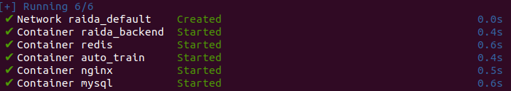
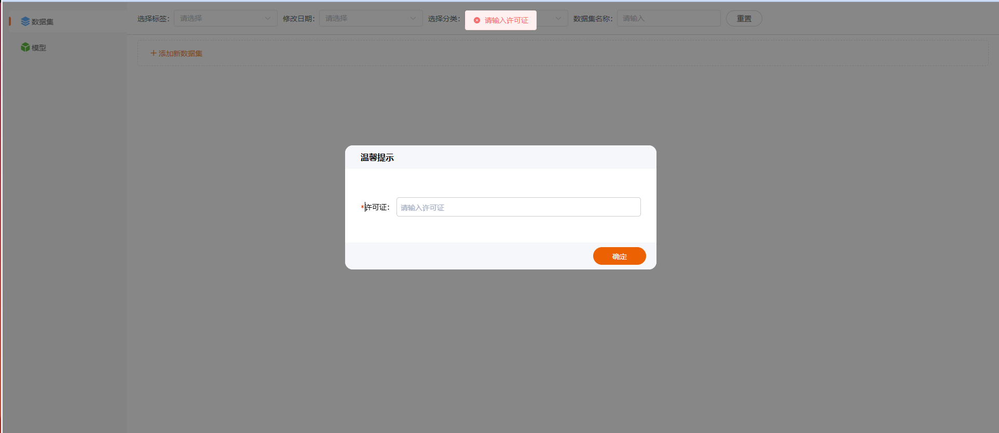
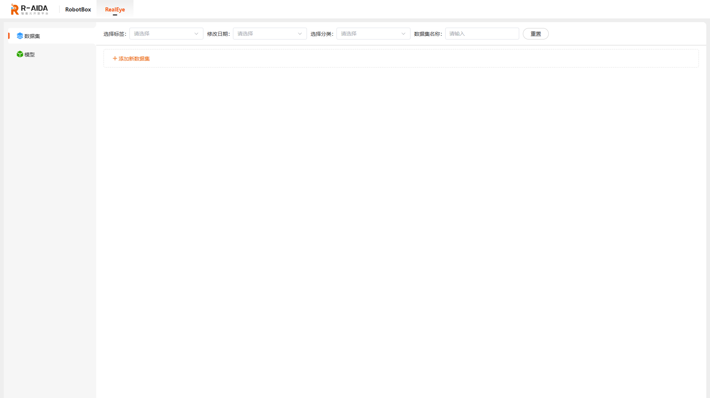

# <p class="hidden">AI：</p> R-AIDA平台部署指导

本文档适用于R-AIDA平台部署，操作步骤仅供参考，如有问题请及时联系技术支持。

## 前提条件

### 准备环境

R-AIDA平台要求部署在Ubuntu系统中，关于系统版本以及相关软件及其对应版本要求如下：

|名称|版本|
|-|-|
|操作系统|Ubuntu 20.04/22.04 LTS|
|架构|x86|
|Python|3.8|
|Pip|24.2|
|Nvidia驱动|535（推荐）|
|Cuda|11.1（推荐）|
|Cudnn|8005（推荐）|

### 下载安装包

请访问[下载地址](https://pan.baidu.com/s/1C3R5HREwv1xYShqpFvyH7A?pwd=94t5)（提取码：94t5）下载R-AIDA平台部署安装包，并保存至系统中。

### 配置网路

- 配置Ubuntu系统网络，确保可以访问机械臂IP。
- 机械臂默认额IPV4地址为`192.168.1.19`，可根据实际情况配置修改。

## 平台部署

R-ADIA平台支持通过脚本进行一键部署和通过Docker手动部署两种方式，具体操作步骤如下。

### 一键部署

1. 打开终端命令窗口，执行以下命令，解压R-AIDA平台安装包。

    ```Linux
    unzip ~/raida.zip  # 压缩包位置
    ```

2. 执行以下命令，运行raida_install.sh脚本，执行一键安装部署操作。<br>

    ```Linux
    # 进入解压后的raida目录
    cd raida
    # 一键安装部署
    sudo bash raida_install.sh
    ```

    当终端打印以下日志时，表明R-AIDA平台部署成功了。
    
3. 请在URL地址栏输入`http://127.0.0.1:8888`，并键入回车访问R-AIDA平台，页面弹出输入许可证提示框。
    
4. 请输入提前与管理员获取访问许可证，并点击“确定”进入R-AIDA平台。
    

### 手动部署

#### 部署准备

1. 打开终端命令窗口，执行以下命令，解压R-AIDA平台安装包。

    ```Linux
    unzip ~/raida.zip  # 压缩包位置
    ```

2. 执行以下命令卸载系统默认的Docker。

    ```Linux
    sudo apt-get remove docker docker-engine docker.io containerd runc
    ```

3. 执行以下命令，配置系统支持HTTPS访问协议。

    ```Linux
    sudo apt install apt-transport-https ca-certificates curl software-properties-common gnupg lsb-release
    ```

4. 根据Docker获取来源，执行以下命令，添加GPG Key。

    - Docker官方：

    ```Liunx
    curl -fsSL https://download.docker.com/linux/ubuntu/gpg | sudo gpg --dearmor -o /usr/share/keyrings/docker-archive-keyring.gpg
    ```

    - 阿里源：

    ```Linux
    curl -fsSL https://mirrors.aliyun.com/docker-ce/linux/ubuntu/gpg | sudo gpg --dearmor -o /usr/share/keyrings/docker-archive-keyring.gpg
    ```

5. 根据Docker获取来源，执行以下命令，将Docker软件源添加到系统的APT源列表中。

    - Docker官方：

    ```Liunx
    echo "deb [arch=$(dpkg --print-architecture) signed-by=/usr/share/keyrings/docker-archive-keyring.gpg] https://download.docker.com/linux/ubuntu $(lsb_release -cs) stable" | sudo tee /etc/apt/sources.list.d/docker.list > /dev/null
    ```

    - 阿里源：

    ```Linux
    echo "deb [arch=$(dpkg --print-architecture) signed-by=/usr/share/keyrings/docker-archive-keyring.gpg] https://mirrors.aliyun.com/docker-ce/linux/ubuntu $(lsb_release -cs) stable" | sudo tee /etc/apt/sources.list.d/docker.list > /dev/null
    ```

6. 执行以下命令，更新本地源文件至最新版本。

    ```Linux
    sudo apt update
    sudo apt-get update
    ```

#### 安装Docker

1. 执行以下命令，安装Docker至系统。

    ```Linux
    sudo apt install docker-ce docker-ce-cli containerd.io
    ```

2. 待Docker安装完成后，执行以下命令查看Docker运行状态。

    ```Linux
    sudo systemctl status docker
    ```

3. 当Docker运行正常后，执行以下命令，安装Docker-compose。

    ```Linux
    sudo apt install docker-compose
    ```

4. 执行以下命令，安装nvidia-docker。

    ```Linux
    distribution=$(. /etc/os-release;echo $ID$VERSION_ID) \
        && curl -s -L https://nvidia.github.io/nvidia-docker/gpgkey | sudo apt-key add - \
        && curl -s -L https://nvidia.github.io/nvidia-docker/$distribution/nvidia-docker.list | sudo tee /etc/apt/sources.list.d/nvidia-docker.list
    sudo apt-get update
    sudo apt-get install -y nvidia-docker2
    ```

#### 拉取镜像

本文以阿里云为例。

1. 执行以下命令，登录阿里云。

    ```Linux
    docker login --username=administrator@1008710409799142 registry.cn-hangzhou.aliyuncs.com # 密码：123456!a
    ```

2. 执行以下命令，拉取项目依赖的镜像文件。

    ```Linux
    # redis
    docker pull  registry.cn-hangzhou.aliyuncs.com/realman_base/redis-code:1.0
    # nginx
    docker pull  registry.cn-hangzhou.aliyuncs.com/realman_base/nginx-code:1.0
    # mysql
    docker pull  registry.cn-hangzhou.aliyuncs.com/realman_base/mysql-code:1.0
    # raida数据接口
    docker pull  registry.cn-hangzhou.aliyuncs.com/realman_base/raida-code:1.0
    # train训练推理接口
    docker pull  registry.cn-hangzhou.aliyuncs.com/realman_base/train-code:1.0
    ```

#### 运行R-AIDA平台

1. 执行以下命令，运行R-AIDA平台。

    ```Linux
    # 进入raida目录
    cd raida
    # 启动项目
    docker-compose up -d
    ```

2. 当成功启动项目后，请在URL地址栏输入`http://127.0.0.1:8888`，并键入回车访问R-AIDA平台，页面弹出输入许可证提示框。
    
3. 请输入提前与管理员获取访问许可证，并点击“确定”进入R-AIDA平台。
    

## 后续操作

### 重启服务

当需要重启R-AIDA平台服务时，请执行以下命令，完成服务重启操作。

```Linux
# 进入raida目录下
cd raida
# 重启
sudo docker-compose restart
```

### 关闭服务

当需要关闭R-AIDA平台服务时，请执行以下命令，完成服务关闭操作。

```Linux
# 进入raida目录下
cd raida
# 重启
sudo docker-compose down
```

当需要仅运行R-AIDA平台后端服务时，请在完成R-AIDA平台服务运行后，执行以下命令，关闭前端服务。

```Linux
sudo docker stop nginx
```
