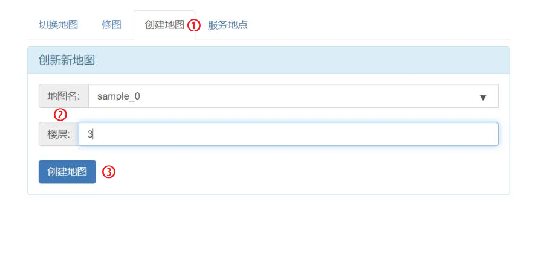
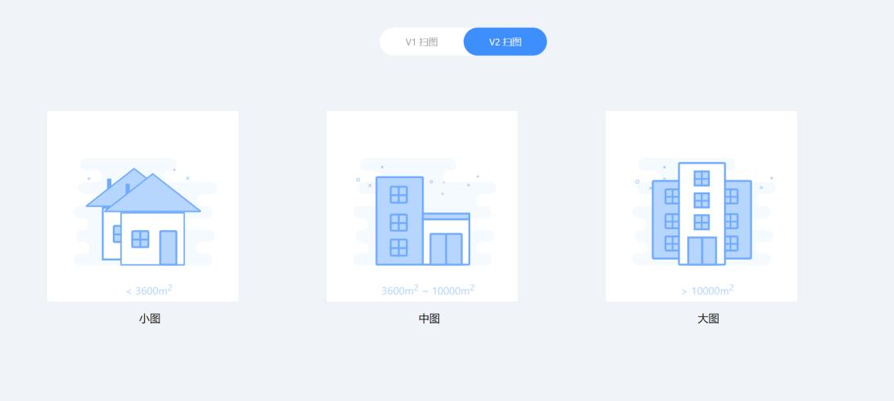
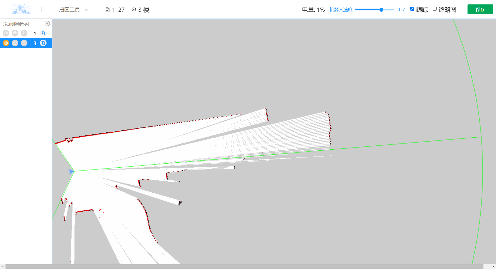
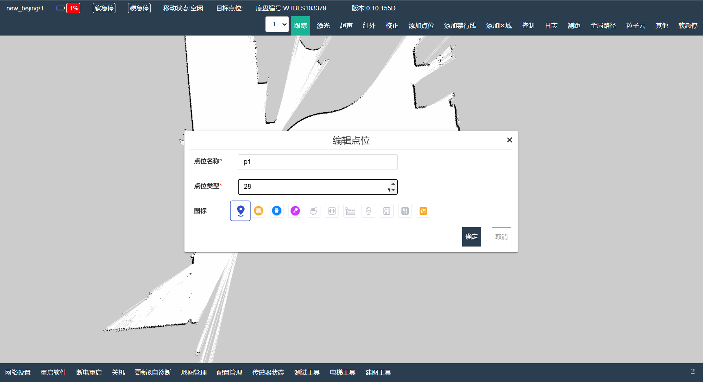

# 
 博客： 
 关于水滴2到点误差大以及避障距离过长的解决方法

## 地图类型区别以及28号点位类型解析

**1. 地图类型区别：**

- V1地图更为细腻，设备运行时定位效果更好，可兼容水滴其它机型及地图，但对于大型及复杂场景建图效果不好；
- V2在大场景及复杂场景下更方便建图，且支持地图续扫，但地图较为粗犷，定位效果相对V1较差，在需要高定位且场景不会很复杂的情况下可以优先选择V1建图。

**2. 28号点位类型解析：**
28点位是依靠实时获取的激光数据和当前地图的匹配度来实现定位的，因此所处的物理环境需要相对固定，尽可能的避免人员、宠物等可移动物体的随意走动。

::: warning 注意：
建议需要精准停靠的位置（即底盘设备中心位置）四周70cm内不要有障碍物，例如墙体等。
:::

## 建图和校正

### 建图

1. 在机器人的web页面中，进入`地图管理`页面，点击 `创建地图`，然后输入`地图名`和`楼层`，点击`创建地图`。

    

2. 页面将会跳转至扫图选择页面，默认为`V2 扫图`，请点击左侧`V1扫图`，并选择`小图`。

    

3. 此时机器人会进入扫图模式，红色为激光雷达实时扫描到的物体，蓝色三角为机器人，如下图所示。

    

此时可通过按下键盘的`i`、`j`、`k`、`l`分别对机器人进行前后左右控制来完成地图，这里就不作过多阐述。

### 校正

当加载上一步建好的地图后，发现激光雷达实时扫描的物体与地图轮廓不符时，需要手动点击`校正`，使得扫描的物体与地图轮廓完全匹配，否则会出现定位不准确，机器人乱走的现象。

按下硬急停按钮或点击机器人web页面中`软急停`，再将机器人手动推动到目标点位，调整好机器人位姿，释放掉急停，点击`标点位`，选择`当前位置增加点位`。

如上图，此处设置点位名称为`p1`，点位类型为`28`，再点击`确定`可根据上述内容重复标记多个点位。

## 配置管理设置

在机器人web页面中的`配置管理`页面，可根据需要自定义配置，请参考如下描述进行配置。

- 设置`安全停靠距离`为`关闭`。
- 设置`到点位置容差`为最小值0.05m。
- 设置`到点角度容差`为最小值0.05rad。

然后，点击左下角`保存配置`对设置的内容进行保存。

## 最终效果

- 停靠距离误差参考值2~5cm。
- 角度偏差参考值 3°~5°。
