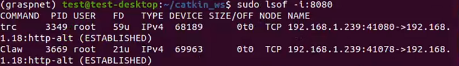

# <p class="hidden">博客： </p> 端口冲突解决方法

## 问题现象

在ubuntu下使用ROS控制机械臂时出现了“98 Address already in use“错误，表明端口已被占用。

## 解决方案

关闭或立即停止占用端口的进程，或释放占用的端口。

## 操作步骤

**方法一：** 重启系统。

**方法二：** 使用命令下线占用端口的进程。

1. 打开终端，执行以下命令查询占用端口进程的PID：

```Linux
sudo netstat -lnp | grep 8080
```

或

```Linux
sudo lsof -i:8080
```

如果存在进程占用端口8080，则命令行将显示该进程的详细信息，如下图所示。



2. 执行以下命令下线目标进程。

```Linux
sudo kill -9 PID
```

如果占用8080端口的进程PID是3349和3669，执行以下命令下线目标进程。

```Linux
sudo kill -9 3349
sudo kill -9 3669
```

::: tip 说明
这里-9代表着SIGKILL信号，此信号强制进程立刻停止运行。
此时，就可以正常使用ros控制机械臂了。
:::
