# <p class="hidden"> 博客： </p> 使用串口实现机械臂UDP回传

## 确保电脑和机械臂连接成功

首先确保电脑和机械臂连接成功，二者ip需设置到同一网段下。（本次教程的机械臂IP是`192.168.10.18`，电脑IP是`192.168.10.111`）。

按下`win+R`快捷键打开运行窗口，输入`cmd`并按下`回车`键以打开命令提示符窗口。输入如下命令，若有如下返回，则证明连接成功。

```cmd
ping 机械臂IP
```

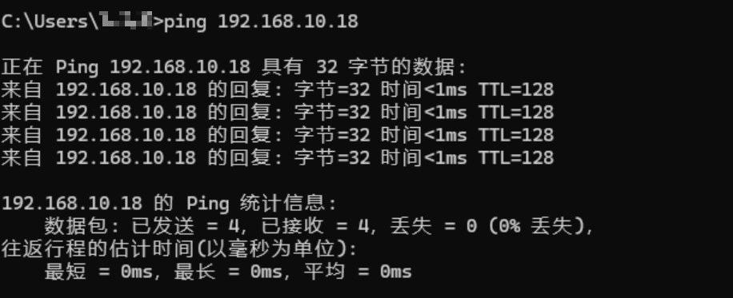

## 关闭电脑防火墙和安全设置

由于电脑的防火墙、杀毒软件可能会进行误拦截，所以需要关闭上位机（回传的目标设备）的所有防火墙和杀毒软件。
这里不涉及杀毒软件相应设置的关闭方法，不同杀毒软件关闭方法自行百度。

### 关闭Windows Defender防火墙

1. 按下`win+R`快捷键打开运行窗口，输入`control`并按下`回车`键以打开控制面板。

    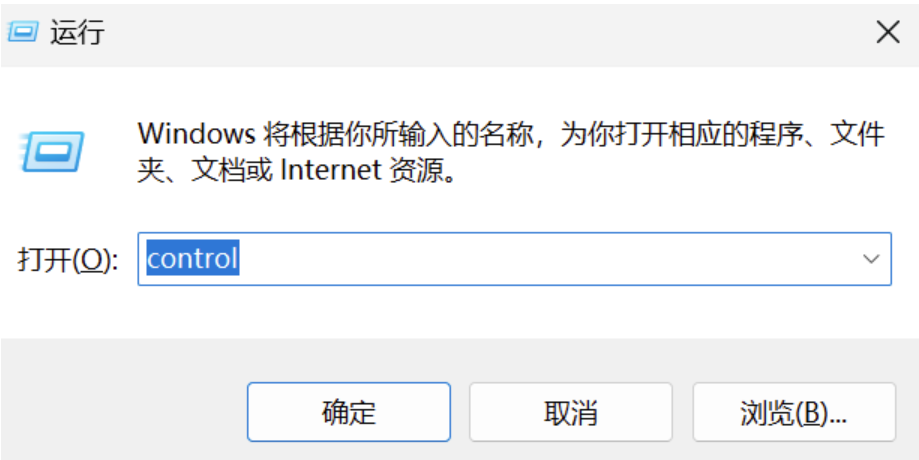

2. 点击`系统和安全`。

    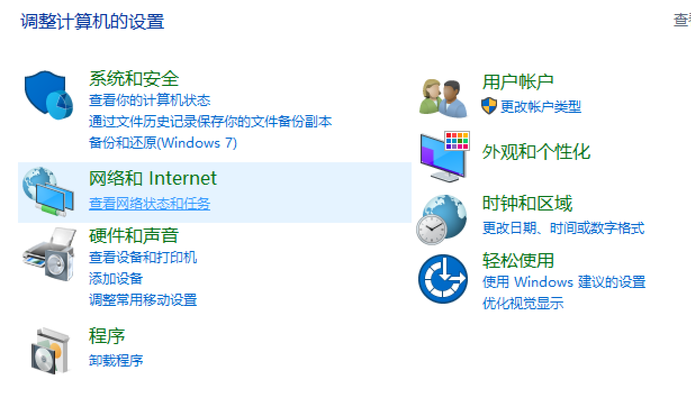

3. 点击`Windows Defender防火墙`。

    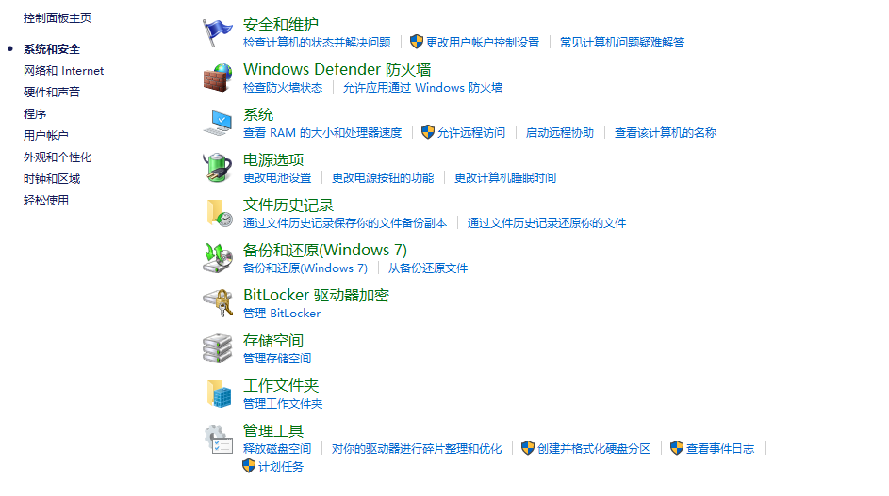

4. 点击`启用或关闭Windows Defender防火墙`。

    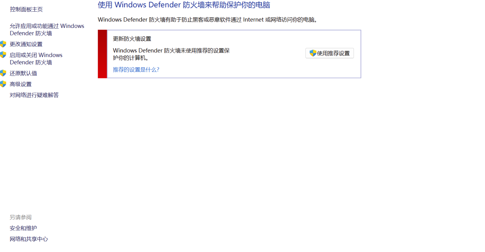

5. 关闭 Windows Defender防火墙，并点击`确定`。

    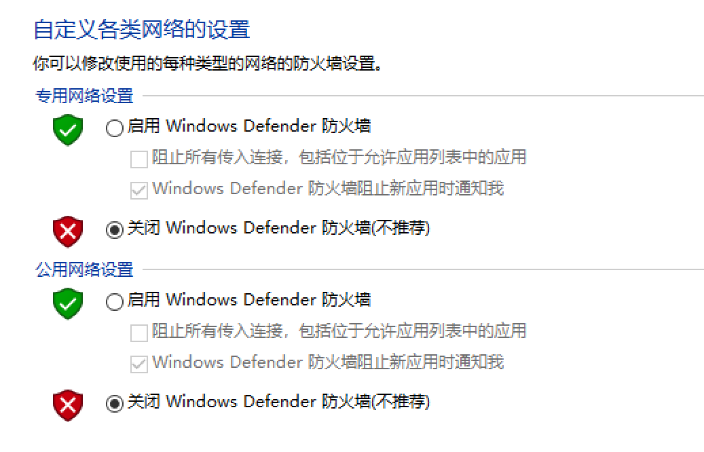

### 关闭Windows安全设置

1. 点击电脑`开始`菜单栏，并选择`设置`。

    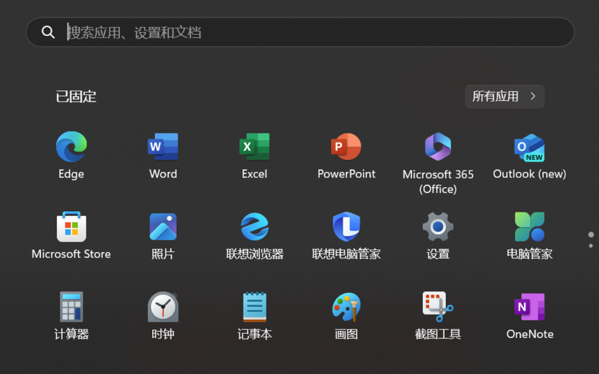

2. 选择`隐私和安全性`，点击`Windows安全中心`。

    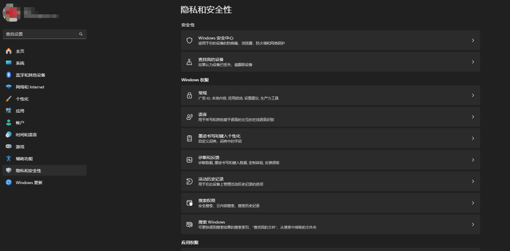

3. 选择`病毒和威胁防护`，找到Microsoft Defender防病毒选项，关闭各类保护。

    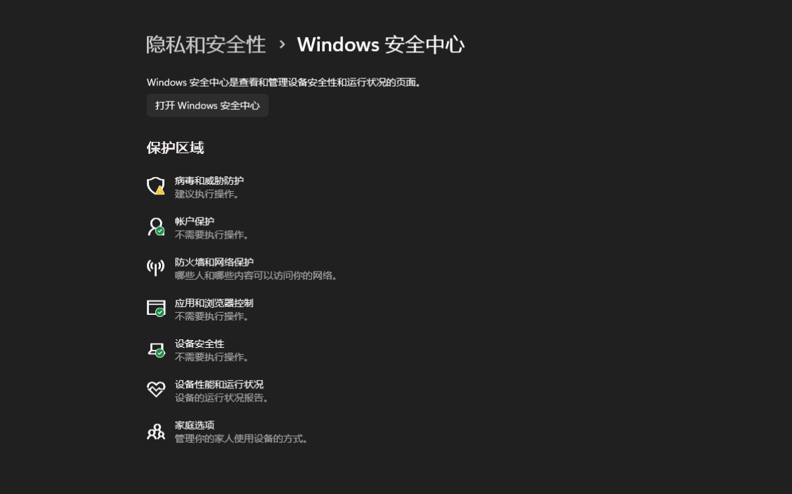
    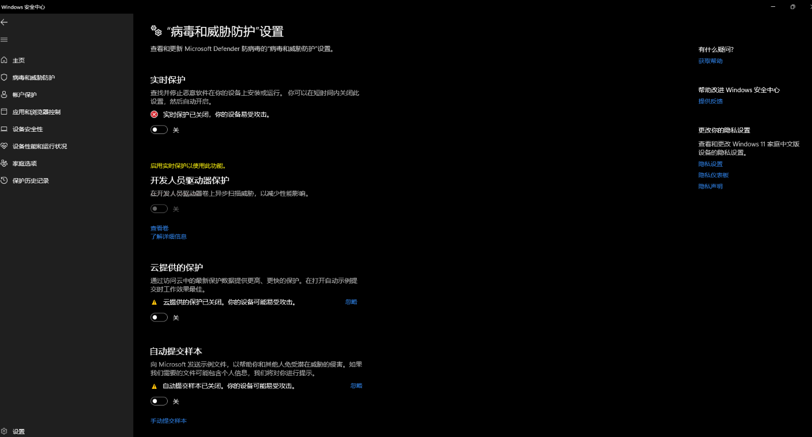

## 配置UDP回传

1. 打开缤果串口，选择协议类型为`TCP Client`。
2. 在`远程主机地址`和`远程主机端口`输入机械臂的IP地址和端口号（笔者的机械臂IP为192.168.10.18，端口号为8080）。
3. 点击`打开`，开启TCP模式。
4. 输入JSON指令。

    ```json
    {"command":"set_realtime_push","cycle":10,"enable":true,"port":8099,"ip":"192.168.10.111"}
    ```

    JSON指令说明请参考：[设置 UDP 机械臂状态主动上报配置set_realtime_push](../../../robot/json/udpConfig/index.md#设置-udp-机械臂状态主动上报配置set_realtime_push)。

5. 点击`发送`。

    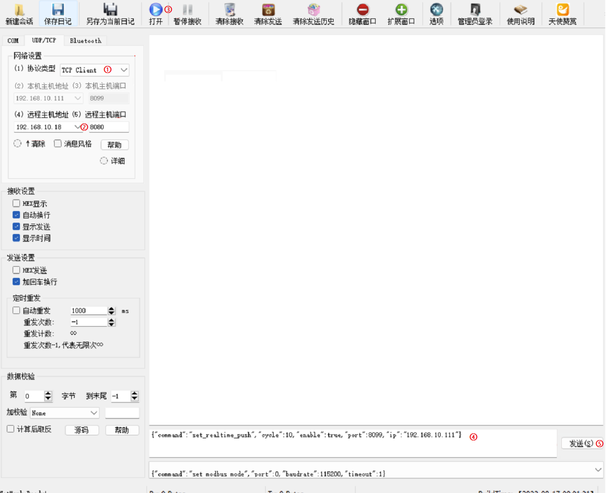

6. 出现 `{"command":"set_realtime_push","state":true}`，即为发送成功。如下图所示：

    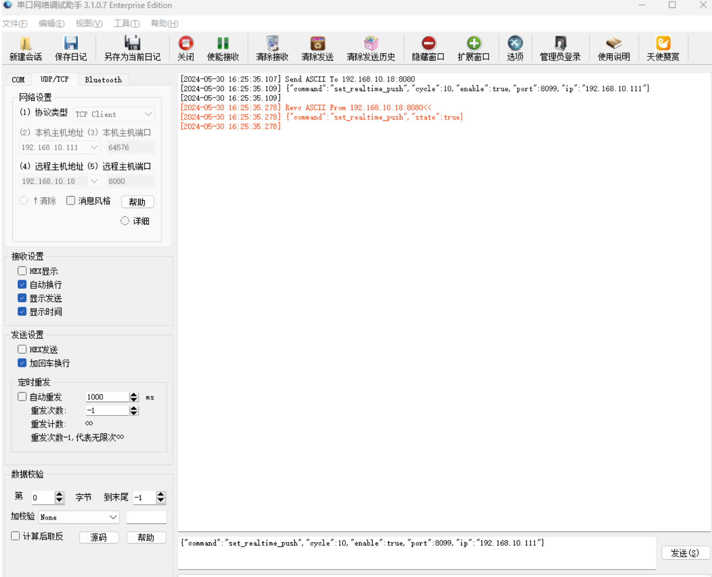

7. 点击`关闭`，退出TCP模式。

    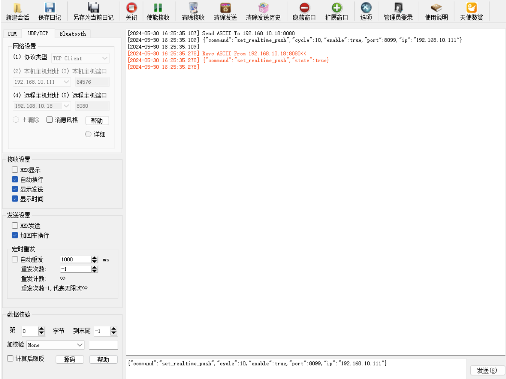

8. 选择协议类型为`UDP`。

    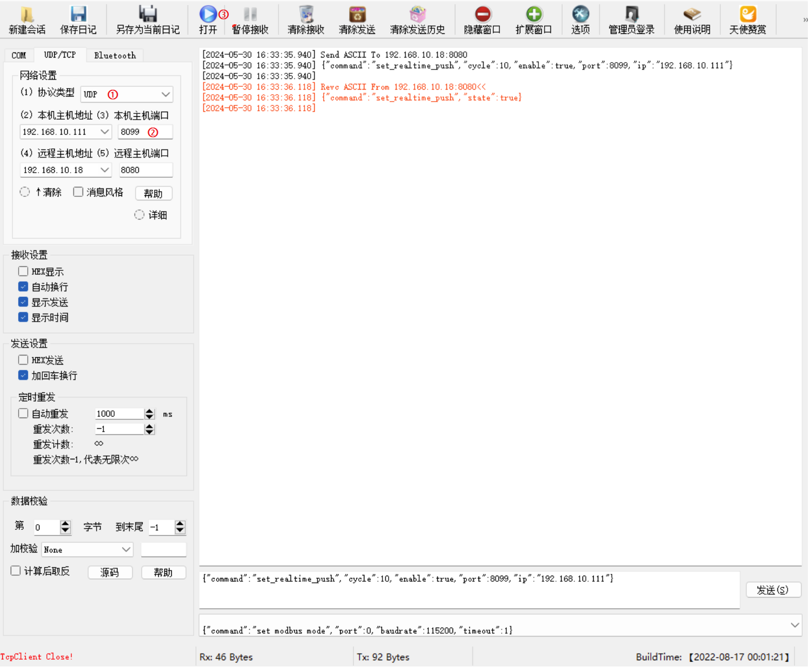

9. 设置本机主机端口为json指令中自定义的port值，本次设置的值为8099。
10. 点击`打开`，开启UDP回传模式。
11. 机械臂以所设置的周期实时回传机械臂当前状态。

    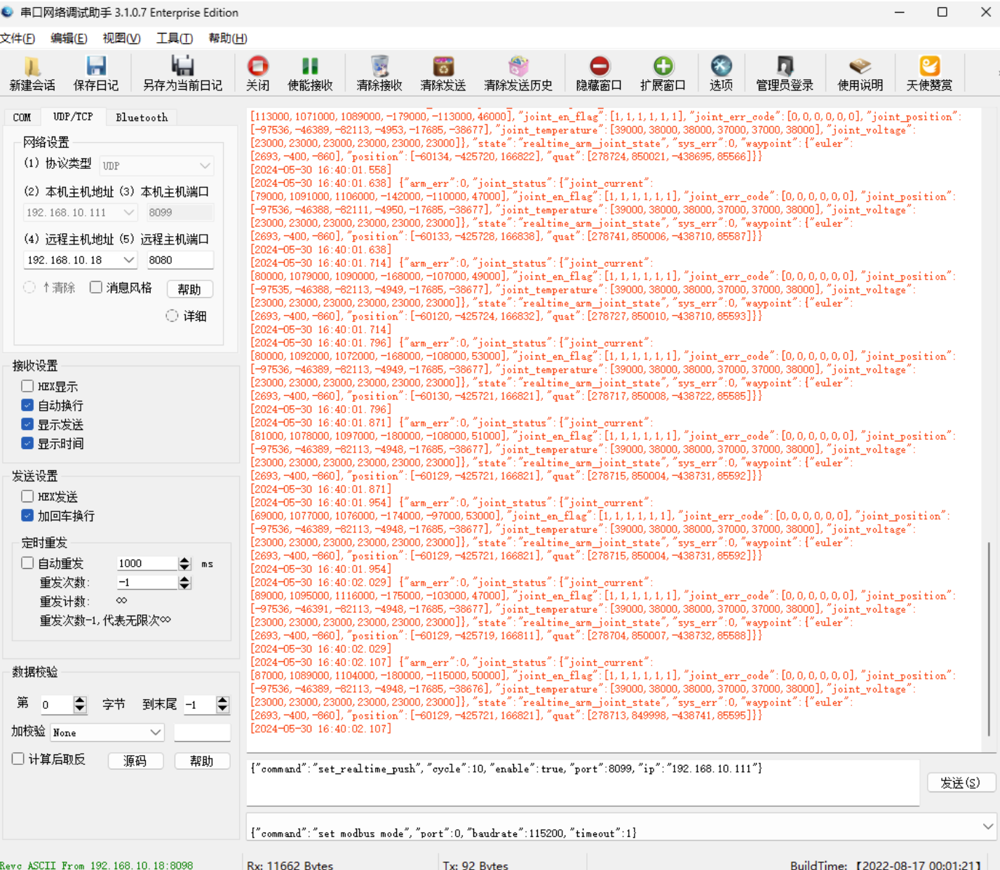
