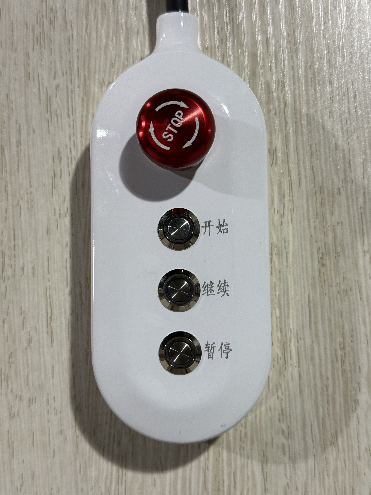
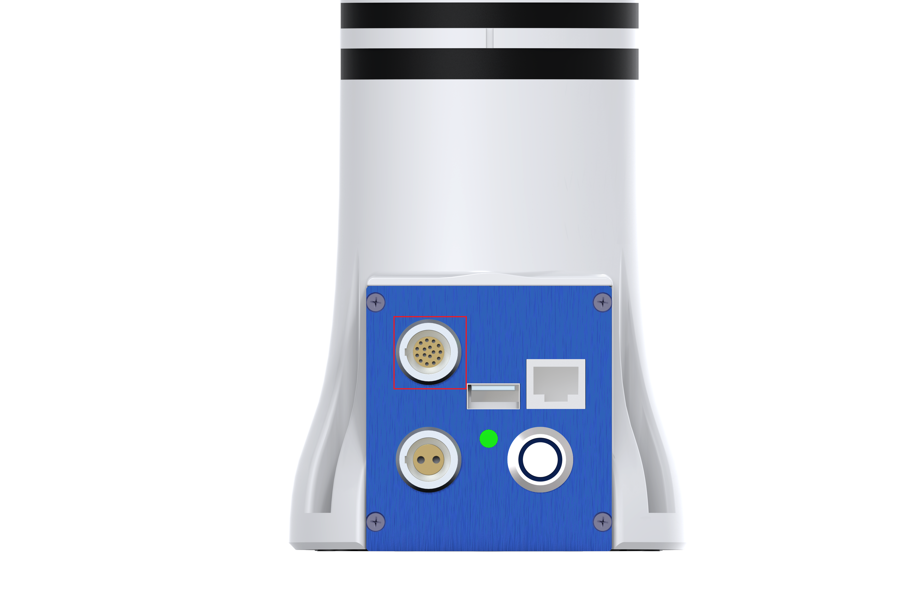
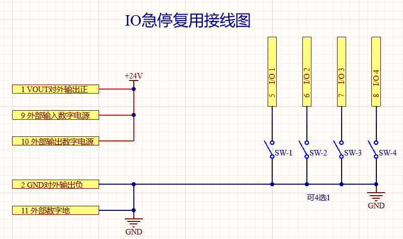
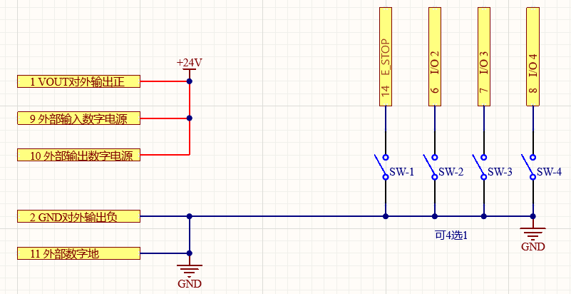
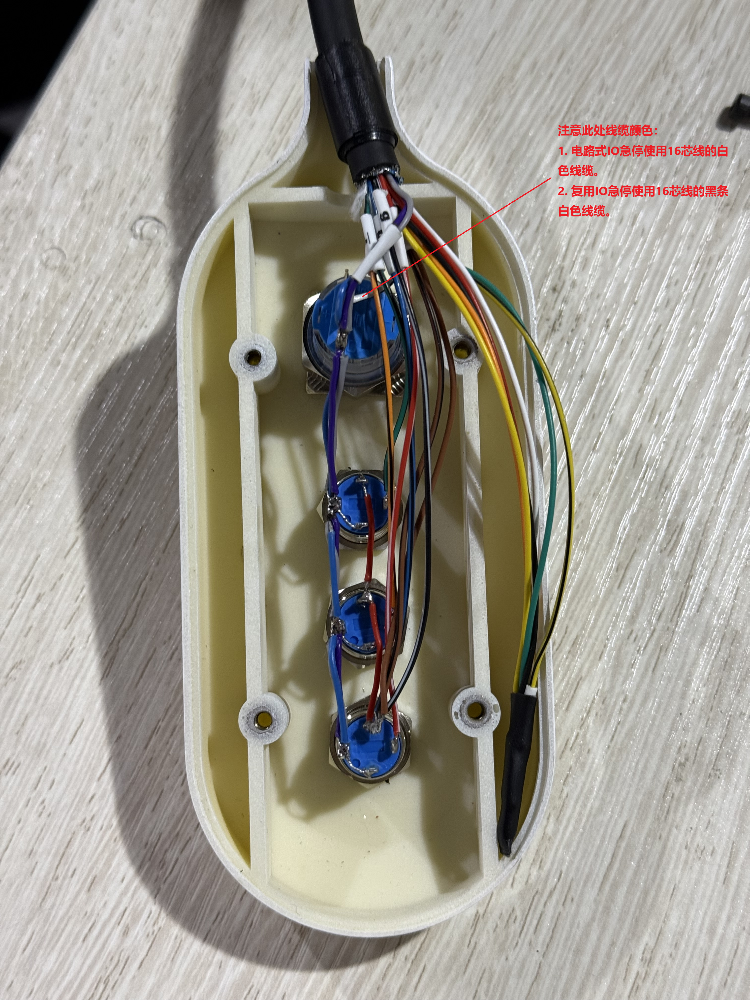
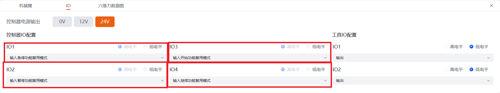
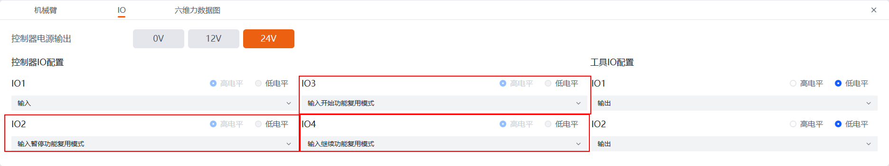

# 
博客：
外置急停按钮盒

## 按钮盒接线安装

外置急停按钮盒可以使用电路式IO急停或者IO1复用急停功能。电路式IO急停触发后，机械臂断电，需解除急停状态后再进行操作。

::: warning 注意

- 第三代控制器仅支持IO1复用急停方式进行急停。
- 本文以第四代控制器为例，第三代控制器亦可参考本文进行操作。

:::

### 简介

急停按钮盒外观如下图所示，包括：急停、开始、继续、暂停四个功能按钮来实现对机械臂运动程序的控制。

按钮盒与机械臂之间通过16芯线连接，基于IO复用进行通信。机械臂上的16芯线接口位于基座后方，如下图所示：

::: warning 注意

- 线缆分为初代线缆和二代线缆，接线时需要留意，详细信息请参考[第四代控制器16芯航插线缆](../../../robot4th/quickUseManual/interfaceDescriptionArm/index.md#433111)或[第三代控制器16芯航插线缆](../../../robot/quickUseManual/interfaceDescriptionArm/index.md#33111)。 
- 在进行线路连接时，禁止带电插拔航插插头。插入航插时请用户务必检查插针是否正常，并保证插针与孔位对齐。 

:::

### 接线

1. 将十六芯航插线缆一端剥开，按照如下方案接线(本文均采用二代线缆线序)：

   - **急停**根据急停方式不同分为：
     - **电路式IO急停**:一端接白，另一端接灰色/紫色和蓝色。
     - **急停**按钮复用IO1:一端接黑条白，另一端接灰色/紫色和蓝色。
   - **暂停**按钮复用IO2:一端接白条红，另一端接灰色/紫色和蓝色。
   - **开始**按钮复用IO3:一端接黑条绿，另一端接灰色/紫色和蓝色。
   - **继续**按钮复用IO4:一端接白条黑，另一端接灰色/紫色和蓝色。（**编号为8和9有少量颜色是交换的，需要按编号进行区分**）

2. 再参照电路图接入+24V、GND，如下图所示。

    

    
复用IO急停接线图

    

    
电路式IO急停接线图

    ::: tip 说明
    接线时需按照线序编号接线，例如复用IO急停接线图中线序编号5为IO1，电路式IO急停接线图中线序编号14为E_STOP。
    :::

3. 接线完成后，如下图所示：

    

## 按钮盒IO配置

按钮盒接线完成后，需要连接机械臂，打开示教器界面，对其进行配置。

1. 访问示教器页面。
2. 在右侧菜单栏选择`状态`，并在弹出的状态页面中选择`IO`，进入IO设置页面。
3. 将控制器电源输出设置为24V，并分别将IO1（使用复用IO急停时配置）、IO2、IO3、IO4设置为输入急停功能复用、输入暂停功能复用、输入开始功能复用、输入继续功能复用，如下图所示，设置完成后即可使用。
   ::: tip 说明
   可根据实际急停盒接线进行配置。
   :::

    

    
复用IO急停配置图

    

    
电路式IO急停配置图

