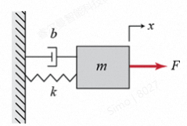
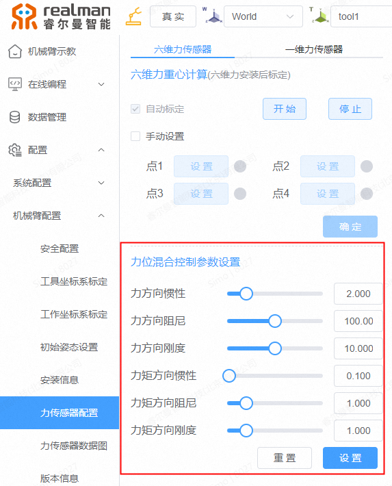
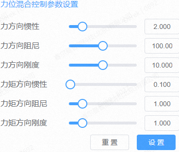
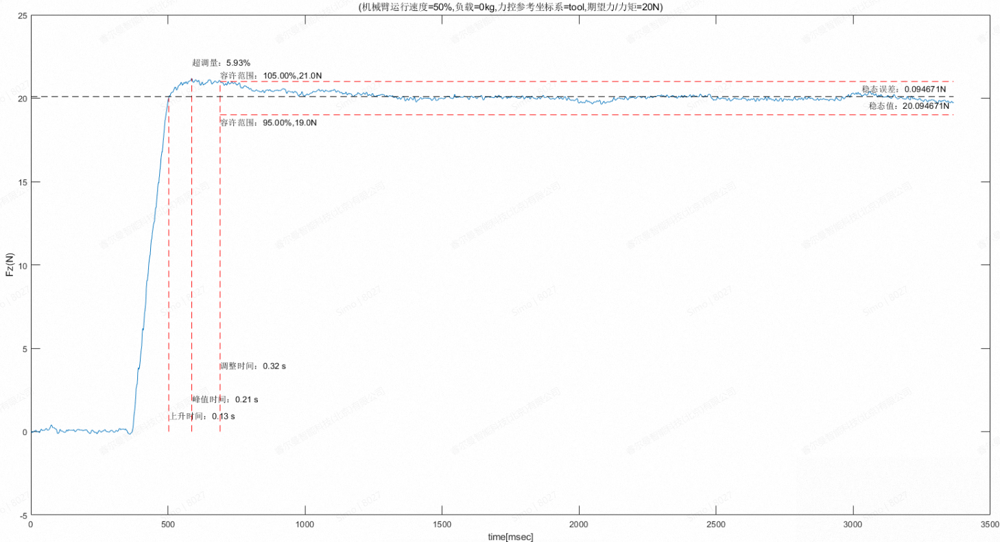

# 
博客：
 力位混合控制参数调试方法

## 技术背景

**力位混合控制**：当机械臂的任务是在空间中跟踪轨迹运动时，可以采用**位置控制**；当机械臂的任务是需要向环境施加力和力矩时，则可以采用**力控制**；当指定力控参考坐标系的一些方向为力控制，而剩下的方向为位置控制时，则将这种控制方法称为**力位混合控制**。 
力控制过程中，将机械臂末端与接触环境之间的相互作用描述为一个“质量-弹簧-阻尼”系统，当弹簧、质量和阻尼参数与接触环境不匹配时，机械臂末端与环境接触过程中会发生跳动等不稳定现象，无法正常开展相应的力控任务。此时，可以通过设置合适的惯性参数M、阻尼参数B和刚度参数K，使机械臂末端与不同刚度的接触环境进行接触后，都能稳定的进行作业。

线性“质量-弹簧-阻尼”系统

根据机械臂的使用场景，可以把常见的环境划分为低刚度环境、中等刚度环境和高刚度环境三种：

- **低刚度环境**：例如柔软的沙发、床垫等，这些环境对外部作用力的抵抗能力较弱，机械臂在其中运动时感受到的反作用力较小。
- **中等刚度环境**：例如木质桌子、地板等，这些环境对外部作用力的抵抗能力适中，机械臂在其中运动时感受到的反作用力适中。
- **高刚度环境**：例如金属结构、石头等，这些环境对外部作用力的抵抗能力较强，机械臂在其中运动时感受到的反作用力较大。

## 调试分析方法

采用控制系统时域响应性能指标进行分析，定义如下：

- **稳态误差ess**：输出响应的期望值与实际值之差。反应系统的跟踪精度，稳态误差越小，控制精度越高。通常要求稳态误差在期望值的5%范围以内，并将5%称为稳态值允许误差带∆。
- **上升时间tr**：从零时刻首次到达稳态值的时间。衡量系统响应速度，上升时间越短，系统响应越快。
- **峰值时间tp**：从零时刻到达峰值的时间。反应系统响应的快速性，峰值时间越短，响应速度越快。
- **最大超调量Mp**：响应曲线的最大峰值与稳态值的差与稳态值之比。衡量系统稳定性和阻尼程度，超调量越大，系统振荡越剧烈，稳定性越差。
- **调整时间ts**：响应曲线进入稳态值允许误差带∆范围内所对应的时间。综合反应系统的快速性和稳定性，调整时间越短，系统恢复稳态越快。
- **触达误差tm**：机械臂末端与接触环境之间有位置差，机械臂末端需要运行一段时间tm才能接触环境，因此性能分析时需要减去时间tm。

## 调试方法简介

力位混合控制参数分为力方向控制参数和力矩方向控制参数。

- **力方向控制参数**：力方向是指力控参考坐标系的X、Y和Z三个方向，即三个平移方向。力方向控制参数包含力方向惯性、力方向阻尼和力方向刚度三个参数。
- **力矩方向控制参数**：力矩方向是指力控参考坐标系的Rx、Ry和Rz三个方向，即三个旋转方向。力矩方向控制参数包含力矩方向惯性、力矩方向阻尼和力矩方向刚度三个参数。

在示教器中可以对力控参考坐标系的三个力方向和三个力矩方向的刚度、惯性和阻尼参数分别设置。

::: tip 说明
睿尔曼机械臂的默认力位混合控制参数适配大健康机械臂（中等刚度环境），可以以此作为参考值进行调试。
:::

## 力位混合控制参数调试目标

设置合适的力位混合控制参数（惯性参数M、阻尼参数B和刚度参数K），使得机械臂末端与接触环境接触时，力控制过程力数据变化曲线满足“快、准、稳”的要求，即控制系统响应速度快、超调小、振荡次数少和稳态误差小等。

**力位混合控制参数调试参考步骤**：

1. 点击“重置”，将力位混合控制参数重置为默认值，设计任务生成力控制过程力数据变化曲线，并根据曲面调整力位混合控制参数，直到满足力位混合控制参数调试目标。
    
2. 力位混合控制参数调试方法：
    - 当控制系统的响应滞后时，可以尝试降低惯性参数M；
    - 当机械臂末端与接触环境接触有较大的反弹时（超调大），可以尝试降低刚度参数K；
    - 当控制系统的振荡次数多，系统很难收敛时，可以尝试增加阻尼参数B；
    ::: warning 注意
    不要一次性对多个力位混合控制参数进行大幅调整，而应该逐个参数进行调试，并且每次需要小的幅度范围的调整，然后进行充分的性能测试。如果一次性大幅度调整惯性参数M、刚度参数K和阻尼参数B等多个参数，可能会使机械臂运动完全失控或产生非常差的性能表现，难以判断每个参数调整到底起到了什么作用。
    :::

**力位混合控制参数调试实例**：

设计一个机械臂只在力控参考坐标系的Z方向做力控制（其他方向不做运动）的任务，运行任务并采集数据生成力控制过程力数据变化曲线，采用控制系统时域响应性能指标进行分析。

任务脚本

  <video controls width="300px" height="300px" autoplay loop muted>
    <source src="https://ik.imagekit.io/Realman/Video/Derek%E5%88%86%E4%BA%AB%E7%9A%84%E8%A7%86%E9%A2%91.mp4?updatedAt=1740041644347" type="video/mp4">
  </video>

任务运行情况

通过收集任务脚本、任务运行情况和力控制过程力数据，整理分析变化曲线如下：

力控制过程力数据变化曲线

## 参考文献

经典文献：Ott C, Mukherjee R, Nakamura Y. Unified Impedance and Admittance Control[C]// IEEE International Conference on Robotics & Automation. IEEE, 2010:554-561.
