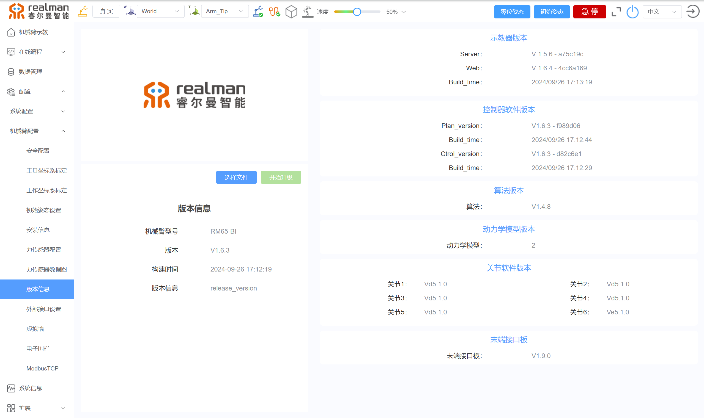
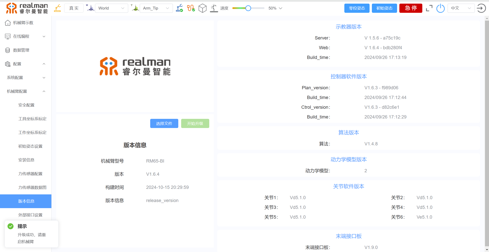
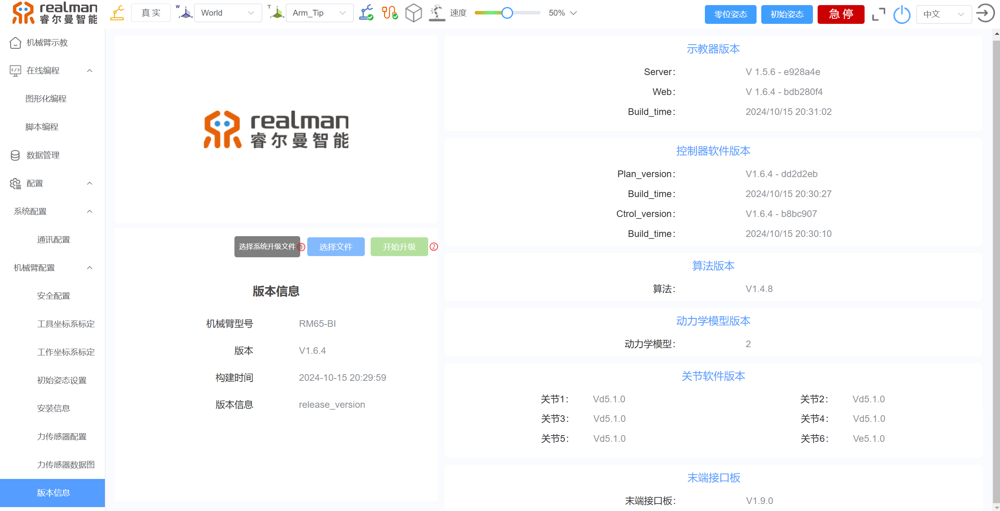

# 
博客：
机械臂控制器及末端接口板升级

## 注意事项

- 升级过程中，请确保机械臂供电持续正常。 
- 升级过程中，机械臂不允许进行关机操作。 
- 升级过程中，请根据升级步骤要求进行重启操作。

## 升级步骤

本文以控制器版本V1.6.4，末端接口板版本V1.9.2为例。如需最新控制器版本、末端接口板版本，请联系睿尔曼技术支持。

### 控制器升级

1. 下载RM机械臂最新控制器版本。

2. 登录机械臂的示教器，点击左侧机械臂配置选项，再点击版本信息，可以查看到机械臂型号为RM65-B，控制器版本为V1.6.3，末端接口板版本为V1.9.0。

3. 现在将控制器版本升级到V1.6.4，末端接口板版本升级到V1.9.2，首先点击选择文件，选择对应机械臂型号的控制器版本。选择好以后，再点击开始升级。等待几分钟，升级好以后，机械臂会发出“嘀嘀嘀”的声音，重启机械臂即可。

4. 再进入示教器查看升级后的控制器版本，可以看到现在控制器的版本为V1.6.4。

### 末端板升级

1. 选择最新末端接口板版本的bin文件，再点击开始升级，等待机械臂发出“嘀嘀嘀”的声音，重启机械臂，进入示教器，便可查看到升级后的末端接口。

