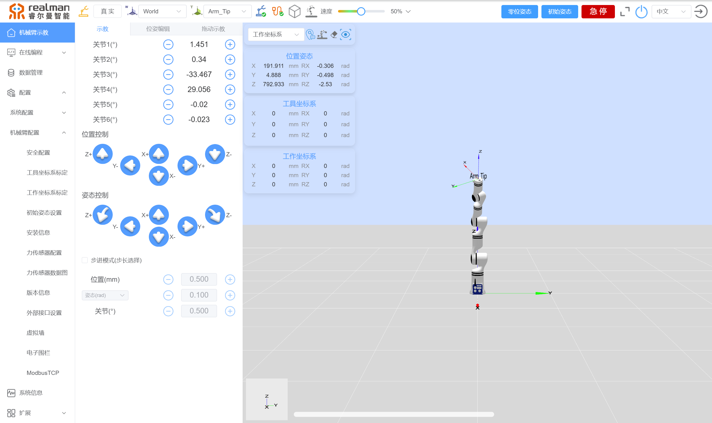
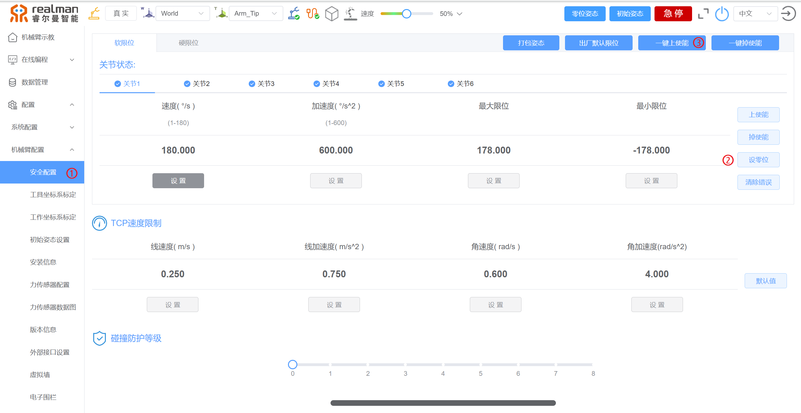

# 
博客： 
RM机械臂零位的影响及其设置

## 一、机械臂零位是什么

机械臂的零位是指机械臂各个关节和运动轴的参考初始位置。这是机械臂在执行任何操作之前预先定义的一个标准位置，所有的运动和位置计算都基于这个零位。所以，保证机械臂处于零位状态十分重要。

零位一般在机械臂出厂时就已经设置好了，一般情况下不需要重新设置零位。

遇到下面几种情况必须重新设置零位：

1. 更换机械臂本体内码盘电池，驱动器因码盘圈数丢失而报警，此时需要重新校零。
2. 拆装更换电机、减速机、机械传动部件后。
3. 机械臂在操作过程中受到外部的冲击或振动，导致零位偏移。

## 二、零位丢失对机械臂有什么影响

机械臂丢失零位会带来多种严重影响，具体如下：

1. **定位精度降低：** 机械臂无法准确定位到预定位置，导致误差。例如，在装配线上，零位丢失可能导致零件无法精确安装，影响产品质量。
2. **重复精度降低：** 每次执行同一任务时的位置可能会有所不同，影响生产一致性。比如，在点焊操作中，每次焊点的位置都可能不同，导致焊接质量不稳定。
3. **路径偏移：** 预设的运动路径会因为零位的丢失而偏移，导致机械臂可能碰撞到其他设备或障碍物。在复杂的生产线上，这可能引发严重的设备损坏或生产停滞。
4. **工艺流程中断：** 路径规划错误会导致机械臂无法完成预定的操作步骤，进而中断工艺流程。例如，在喷涂操作中，路径错误会导致喷涂不均匀，需要重新进行。
5. **机械臂磨损增加：** 由于误操作或路径错误，机械臂可能与其他设备或工件发生碰撞，导致机械臂或其他设备损坏。例如，机械臂在搬运重物时偏离轨道，可能撞击到货架或其他机械设备。
6. **安全隐患：** 机械臂误动作可能对周围的操作人员造成伤害，存在安全隐患。例如，在人机协作的工作环境中，零位丢失可能导致机械臂意外移动，危及操作人员的安全。

## 三、哪些情况可能导致零位丢失

机械臂丢失零位可能由多种行为或因素引起，下面列举一些常见的原因：

1. **机械冲击：** 机械臂在操作过程中受到外部的冲击或振动，可能导致零位偏移。
2. **传感器故障：** 位置传感器（如编码器、限位开关等）出现故障或老化，无法准确测量机械臂位置。
3. **关节和轴承磨损：** 机械臂关节和轴承长期使用后出现磨损，导致运动精度下降，影响零位。
4. **电源波动：** 电源电压波动或瞬间断电可能导致控制系统重启，丢失零位信息。
5. **软件设置错误：** 控制软件中的设置错误或程序错误可能导致机械臂的零位信息丢失或被覆盖。

## 四、如何设置零位

如果零位丢失，需要及时对机械臂重新设置零位，以免影响机械臂后续的使用。以RM65-B为例，下面是重新设置零位的步骤：

1. 登入机械臂示教器，点击右上角的零位姿态，让机械臂恢复到零位。

2. 机械臂回到零位姿态后，观察每一个关节的凹槽是否对齐，如果没有对齐，说明零位丢失。则需要按住绿色的按钮手动将每个凹槽对齐，或者使用步进将凹槽对齐。

3. 凹槽对齐后，点击示教器左侧的安全配置，每个关节依次点击设置零位，点击完后，可以听见机械臂发出“嘀嘀嘀”的声音，最后再点击一键上使能即可，机械臂控制器绿灯闪烁。

## 五、如何检查零位

设置完零位以后，将机械臂手动拖拽到其他任意位置，点击示教器右上角的零位姿态，机械臂回到零位，检查机械臂的每个关节的凹槽是否对齐，凹槽对齐，则零位设置成功。

## 六、预防措施

1. **定期校准：** 根据机械臂的使用频率和工作环境，制定定期校准计划，通常每月或每季度进行一次。
2. **传感器维护：** 定期检查位置传感器（如编码器、限位开关）的工作状态，确保其正常工作。同时定期清洁传感器，防止灰尘和污垢影响其性能，并进行必要的校准。
3. **使用稳压器：** 安装稳压器，确保电源电压稳定，避免电压波动影响机械臂的控制系统。
4. **不间断电源（UPS）：** 配置不间断电源，防止瞬间断电或电源波动导致控制系统重启。
