# 
博客： 
RM机械臂奇异点分析及规避办法

## 一、奇异点概述

在我们使用机械臂的过程中，经常会遭遇奇异点(区)，导致机械臂运动轨迹发生异常，甚至导致关节速度无法控制，要想机械臂顺利完成任务，就必须了解奇异点(区)是如何产生的，以及如何避免它们的影响。

### 什么是奇异点

 大部分六轴机械臂由于机械限位或软限位的限制，在其运动空间中会出现逆运动学无解的情况，也就是基于坐标的规划运动无法明确的逆向转化为机械臂各个关节轴的旋转角度，在机械臂工作空间中这些逆运动学无解的点就被称为“奇异点”。在 数学上意味着雅可比矩阵不在满秩。可以用雅可比矩阵来判断机械臂是否处于奇异状态。奇异点是机械臂工作空间中的一个特定点，它会导致机械臂失去一个或多个自由度(自由度)。当机械臂的工具中心点(TCP)进入或接近奇异点时，机械臂将停止移动或以意想不到的方式移动。

### 奇异点分类

奇异点可分为四类:肩部奇异、肘部奇异、腕部奇异、边界奇异。

### 发现奇异点的简单方法

一般来说，奇异点很容易被发现，沿着轨迹以恒定、平稳的速度移动……然后它做了一些“奇怪”的事情。它的运动发生了计划外的变化，而原因不明。比如以下迹象表明机械臂已经进入或者在奇异区附近：

1. 机械臂猛地移动或者突然停止。
2. 当机械臂靠近它的工具中心点（TCP）时，整个机械臂的移动速度会慢下来甚至停下来。但是，在这个过程中，机械臂上的一些关节却会突然加速，达到它们能达到的最快速度。这种整体速度和部分关节速度不协调的情况，就可能意味着机械臂进入了或者靠近了奇异区。
3. 机械臂产生不正常的抖动。

### 雅可比矩阵

雅可比矩阵`J`是描述机械臂末端执行器速度和关节速度之间关系的矩阵，对于六自由度机械臂，雅可比矩阵通常是一个`6×6`矩阵，表示如下：

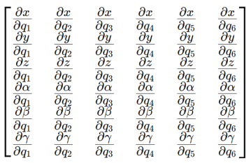

其中，x,y,z 是末端执行器的位置，α,β,γ是末端执行器的姿态角，q1,q2,…,q6是关节角。雅可比矩阵可用于以下计算：

1. 可以用于在机械臂关节的角速度和机器人机械臂末端执行器的速度之间进行转换。
2. 可以用于将极坐标或球面坐标转换为笛卡尔坐标。
3. 可以用来确定机械臂是否有奇异点以及这些奇异点在机械臂的工作空间中的位置。

当机械臂进入奇异点时，处于当前配置的雅可比矩阵的行列式变为零，表明矩阵表示的线性方程组没有解，换句话说，行列式为零的雅可比矩阵没有解，机械臂处于奇异点。

## 二、奇异点的三种基本类型

### 肩部奇异

当机械臂腕部中心与关节1的轴线对齐时，或者当关节6的轴线与关节1轴线重合时，就会出现肩部奇异。

以RM65为例，腕部中心点C(关节5、6轴线交点)与1轴共线，示意点位\[0, 43.4 -105.7,0,-30,0]，如图所示：

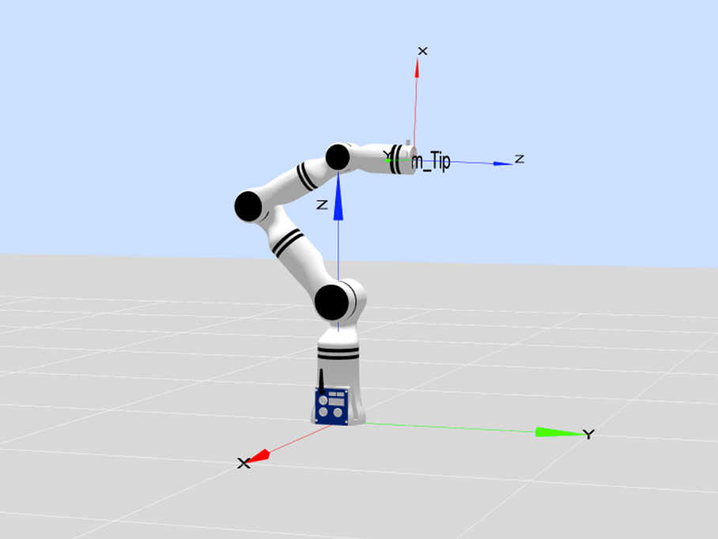

肩部奇异(1)

此类奇异点将带来3个不好的影响：

1. 关节1有无穷多组解。关节1不管怎么转动，都不会引起末端位置的变化，因此，关节1有无穷多组解。
2. 末端失去y方向移动的能力。当关节2和3转动时，只能产生沿轴和轴的速度，不产生沿着轴的速度。
3. 末端位姿的微小运动需要剧烈的关节角度转动才能实现，由于在进行逆运动学计算时数值的不稳定性，因此算法可能会尝试使关节1和关节4瞬间旋转180°。

位置雅可比矩阵部分：假设机械臂的第1关节与末端执行器的旋转中心共线，那么第5和第6关节的运动不会对位置部分产生影响。位置部分的雅可比矩阵将会退化。

姿态雅可比矩阵部分：由于关节5和关节6的轴线与关节1的轴线重合，姿态部分的雅可比矩阵也会出现退化，即关节5和关节6对姿态的影响无法区分。

我们结合RM65B的DH参数，使用MATLAB分析奇异性，运行结果如下：

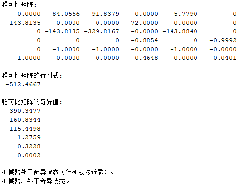

从中可知，尽管行列式的绝对值很大，但我们更关注奇异值，最小奇异值0.0002，基本上接近于0，所以可以断定机械臂在此处处于奇异状态。

关节1、6共轴，C与1轴共线的特殊情况，示意点位\[0, 43.4 -105.7,0,62.3,0]，如图所示：

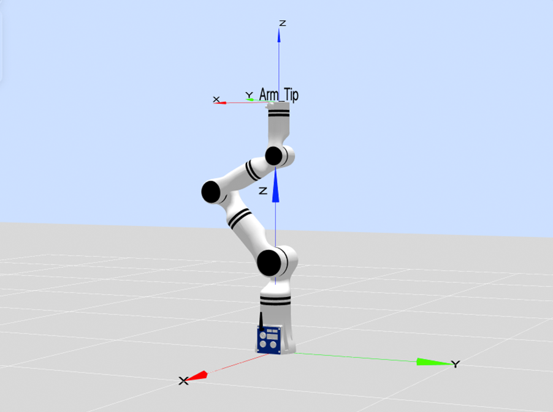

肩部奇异(2)

### 肘部奇异

肘部奇异点很好判断，它看起来像机械臂“伸展得太远”，当肘部关节(关节3)处于0°时，就会出现奇异点，这也取决于机械臂的初始位置是如何定义的。当机械臂腕部的中心（即所有3个手腕轴会聚的点）与关节2和关节3位于同一平面上时，就会出现肘部奇异点。

例如，q3=0，即点位格式为\[x,x,0,x,x,x]，示意点位\[-90,60,0,0,90,0]，如图所示：

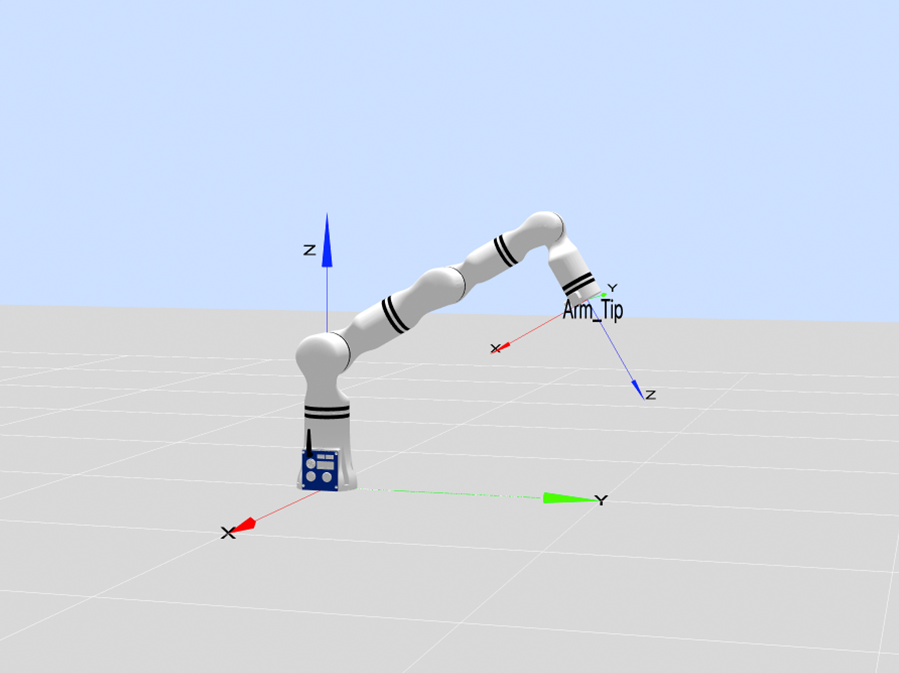

肘部奇异（1）

使用MATLAB进行分析，运行结果如下：

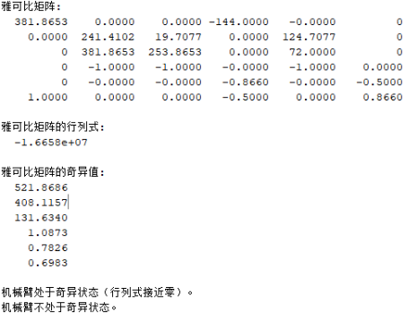

从中可知，尽管行列式的绝对值很大，但我们更关注奇异值，最小奇异值 0.6983， 虽然接近零，但并不是非常接近，这意味着雅可比矩阵接近奇异但并未完全奇异。奇异值较小时，这表明机械臂的某些方向上的运动可能会变得不稳定或速度会显著降低。

当关节1、4共轴，q3=0的特殊情况，也会出现肘部奇异，即点位格式为\[x,0,0,x,x,x]，示意点位\[0,0,0,90,-60,0]，如图所示：

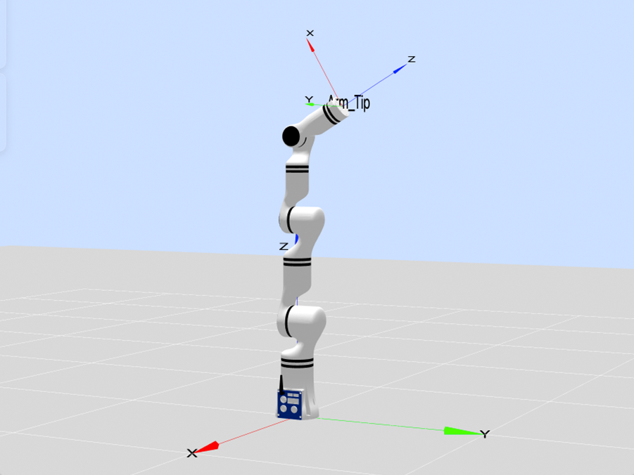

肘部奇异（2）

关节1、4、6共轴，q3=0的特殊情况，即点位格式为\[x,0,0,x,0,x]，示意点位\[0,0,0,90,0,0]，如图所示：

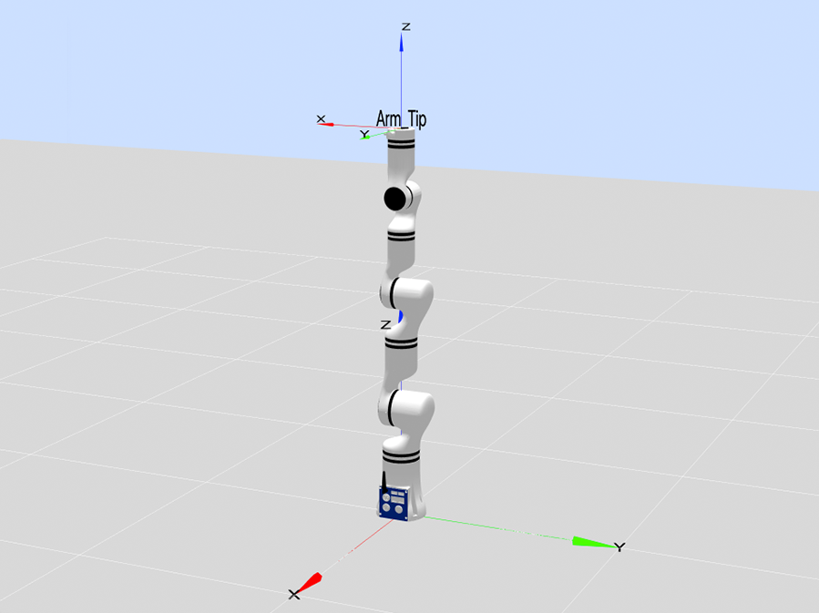

肘部奇异（3）

### 腕部奇异

关节4、6共轴,q5=0,即点位格式为\[x,x,x,x,0,x]，示意点位\[0,60,30,0,0,0]，如图所示：

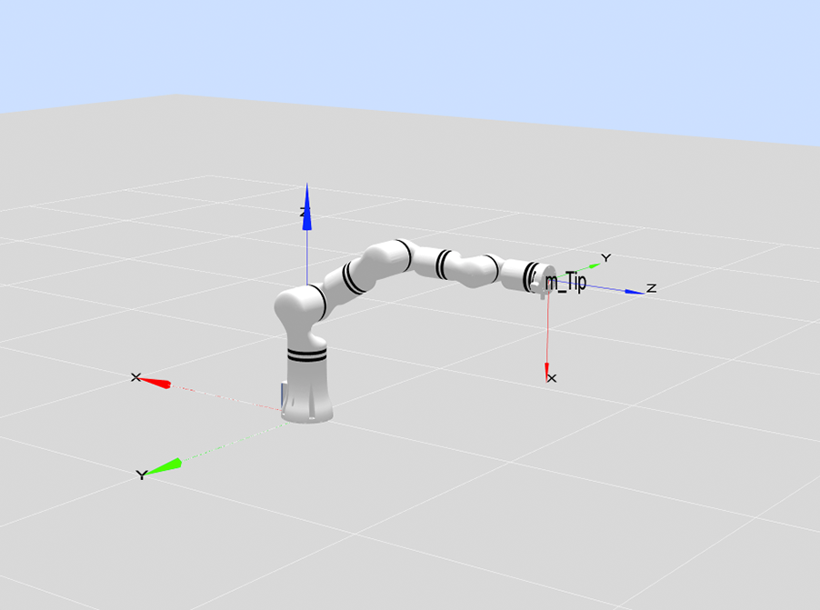

腕部奇异

使用MATLAB进行验证，运行结果如图：

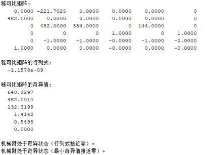

行列式为 −1.1578×10−9，非常接近零，这表明雅可比矩阵在某些方向上失去秩。最小奇异值为 0.00000，表明系统在某些方向上完全失去运动自由度。此时机机械臂完全处于奇异状态。

### 边界奇异

还有一种奇异点发生在机械臂工作空间的边界。每当机械臂的TCP接近边界时，它就有可能进入奇异点，肘部奇异点是工作空间边界奇异点的一个例子。

机械臂末端到达最远端，q3=0的特殊情况,即点位格式为\[x,x,0,x,0,x]。示意点位\[0,0,0,0,0,0]、\[-90,90,0,0,0,0]、\[-90,45,0,0,0,0]如下图所示。

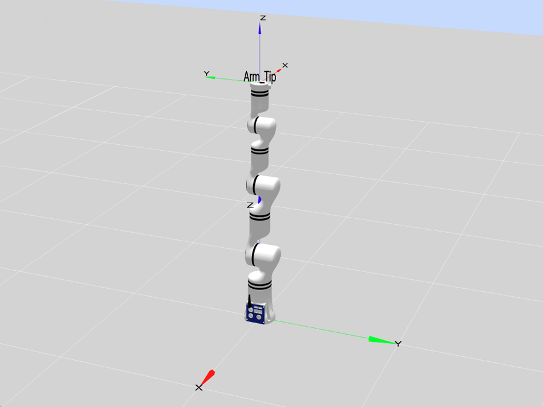

边界奇异(1)

示意点位为\[0,0,0,0,0,0]时，MATLAB运行结果如下：

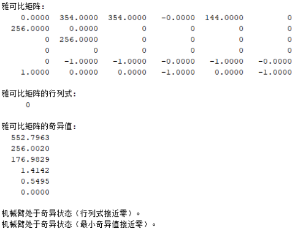

可知，雅可比矩阵的行列式为0，最小奇异值为0，机械臂处于奇异状态。

以下示意点位\[-90,90,0,0,0,0]、\[-90,45,0,0,0,0]分析同理。

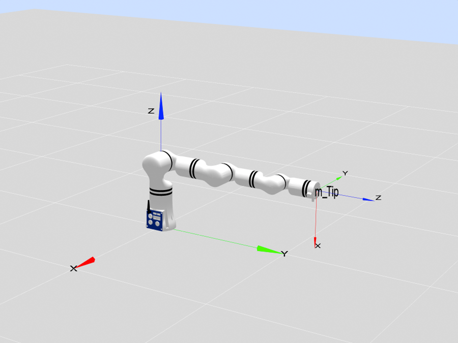

边界奇异(2)

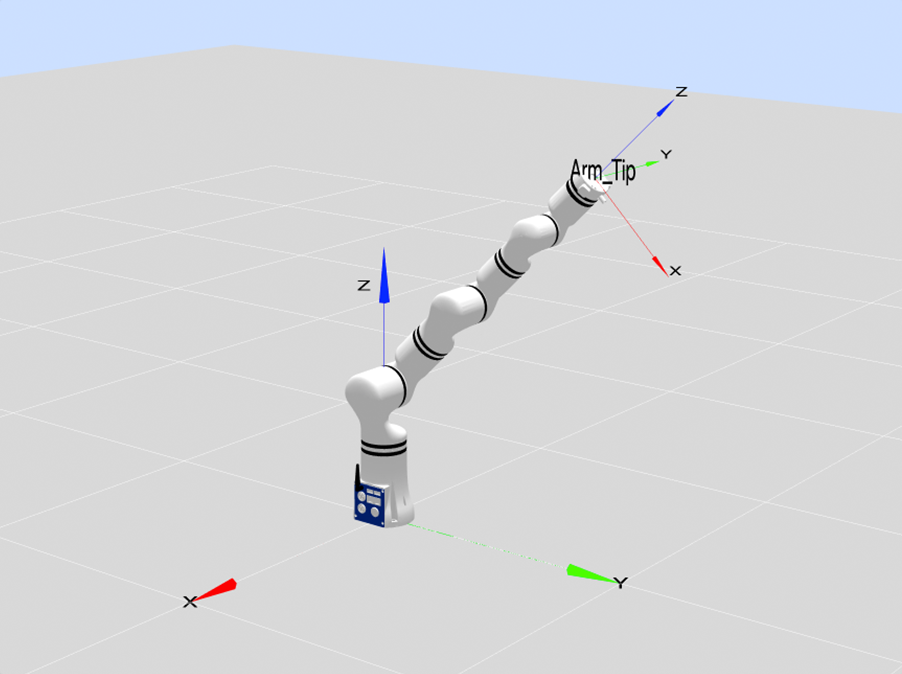

边界奇异(3)

## 三、如何规避奇异点

机械臂奇异点的规避主要有两种思路：一种是在路径规划中尽可能避免机械臂经过奇异点，二是利用Jacobian矩阵的伪逆 ，保证奇异点附近逆运动学算法的稳定性。

对于第一种方法，避免机械臂通过奇异点的同时，也需要避开奇异点附近的区域。因为这个区域的所有点都会带来数值不稳定的情况。而第二种方法在数学上更加更简单通用，但是需要牺牲机械臂末端的运动精度，以保证机械臂能够通过奇异区域。

在实际应用中，我们需要根据不同的作业需求来选择合适的方法。例如，对于抓取物品的任务 ，即使中间的路径点存在奇异区域，但我们并不关心机械臂末端是以何种方式、何种精度运动到目标点的，只需要它顺利通过奇异区域即可，所以这个时候我们就可以选择第二种方法。而对于焊接任务，若焊接点恰好在机械臂运动的路径点上，如果牺牲精度的话，必然会影响焊接效果。所以此时我们最好使用第一种方法：我们可以识别出末端路径为奇异点的区域，把焊接板放置在没有奇异点的路径点上，从而避免机械臂经过奇异区域。
