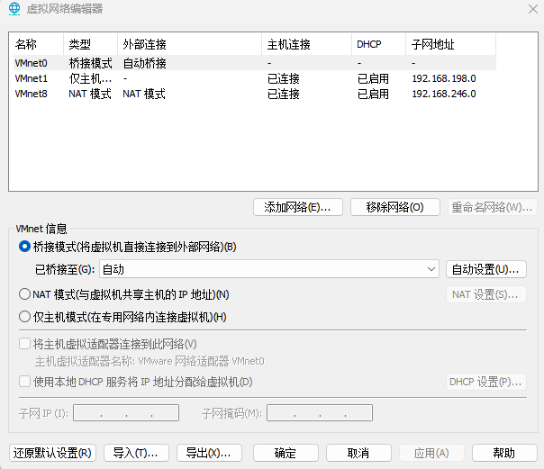
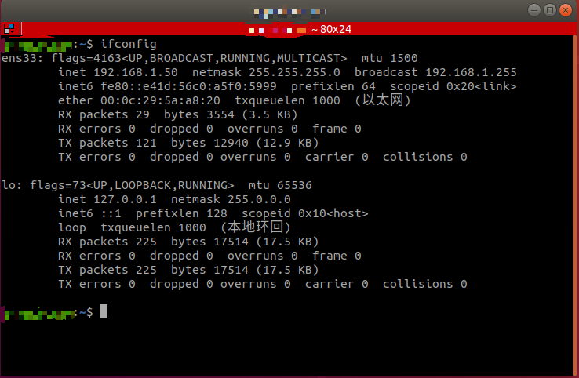
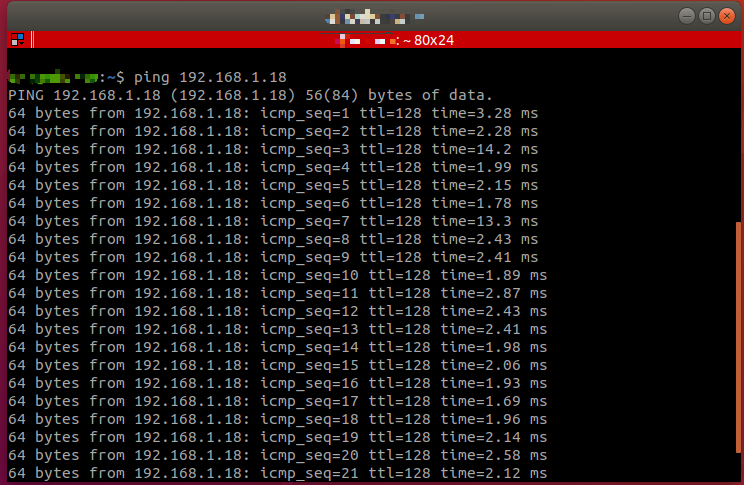

# <p class="hidden">博客： </p>虚拟机连接机械臂ping不通的问题解决（以RM65为例）

## 解决方法

对于RM65机械臂连接虚拟机时，发现ping机械臂ip不通，可进行如下操作：

1. 用网线将机械臂与主机连接，关闭电脑的防火墙。
2. 在VMware Workstation进行如下配置，虚拟机-设置-网络适配器-桥接模式，将虚拟机的主网络桥接到宿主机的物理连接上。



3. 通过如下语句安装net-tools网络工具，再通过ifconfig命令查看当前的ip地址。输入以下指令：

```bash
sudo apt install net-tools

ifconfig
```

4. 通过下列语句将虚拟机主网络ip地址改为192.168.1.50（虚拟机跟机械臂在同一网段，不能与机械臂IP地址相同，机械臂地址为192.168.1.18）。

```bash
sudo ifconfig ens33 192.168.1.50
```

5. 通过ifconfig指令查看IP是否更改成功，可见虚拟机IP已经更改为192.168.1.50。



6. ping 192.168.1.18，能ping通，说明连接正常。


