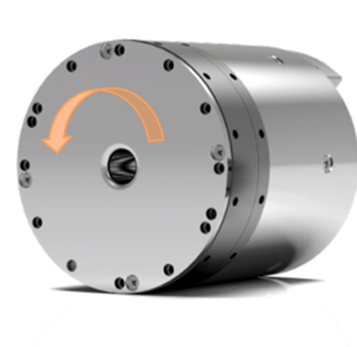
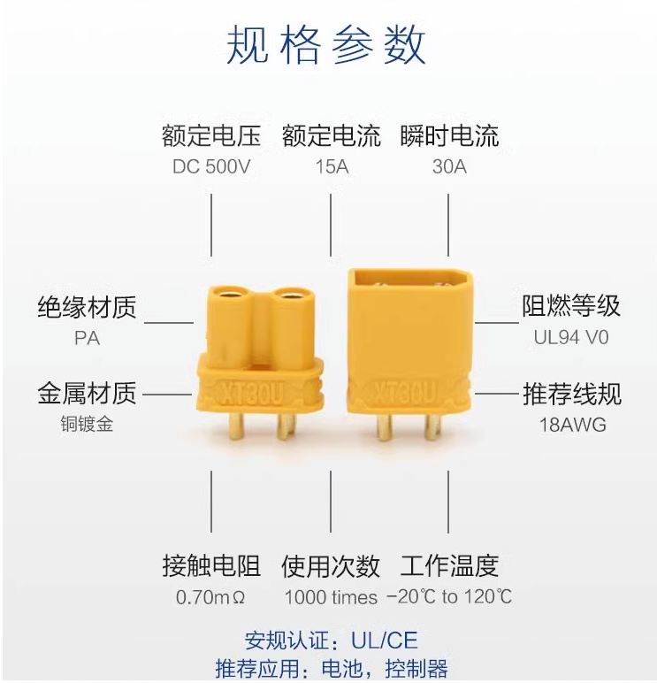
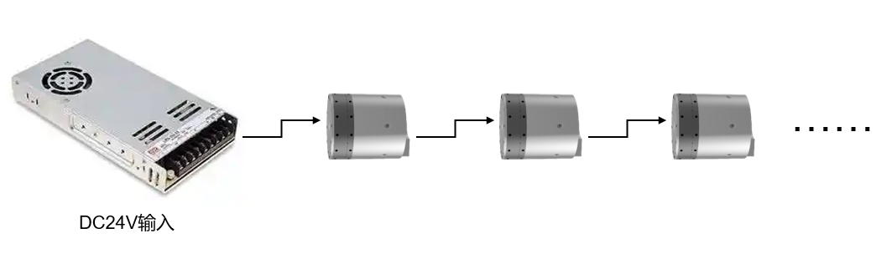
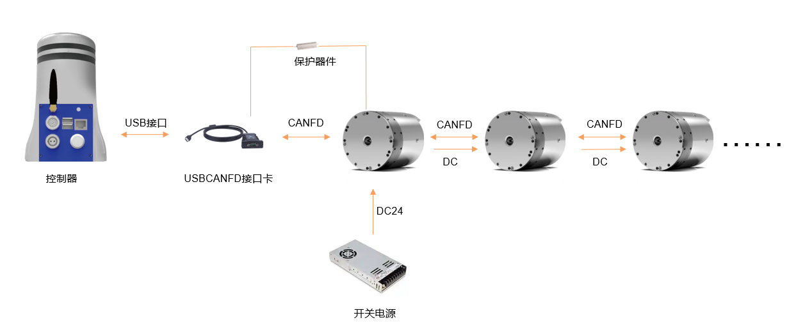
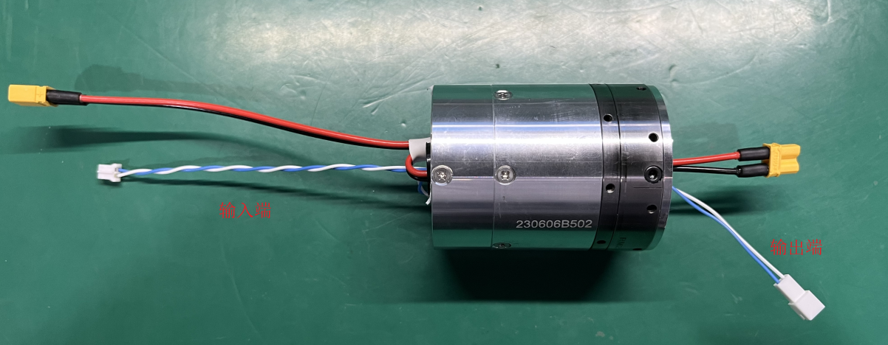
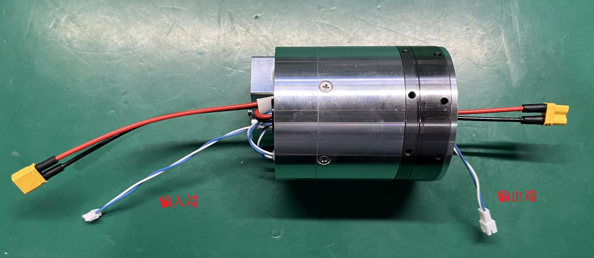
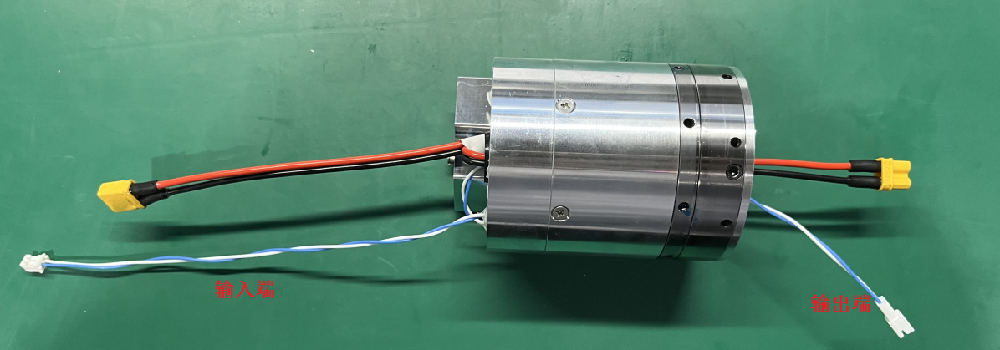
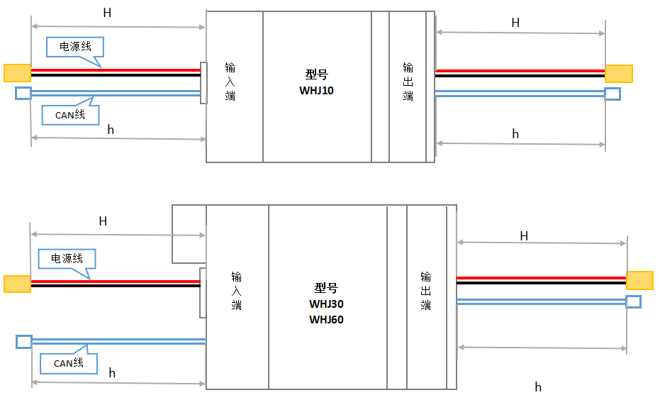

# 
入门指南：
 关节电气说明

## 关节输入电源说明

### 电源电压和额定功率

电源使用24VDC供电（出厂设定最小允许母线电压为20V，推荐最大母线电压为30V），驱动器在检测到超过35V时会触发过电压故障，在检测到低于20V时出现电压过低报警。

|型号|电压|功率|
|:-:|:-:|:-:|
|WHJ10-80|24V|63W|
|WHJ30-80|24V|188W|
|WHJ60-100|24V|292W|

### 关节电压的极限值

关节电源接口最大承受电压为DC38V，输入电压超过38V易导致驱动器故障。当使用开关控制关节供电时，上电瞬间可能存在过压冲击（＞38V的情况），此种供电方式需在开关后、关节电源输入前并联一个电解电容（参考规格：820uF，50V），以抑制上电瞬间输入电压的过冲现象。

使用24V开关电源供电时，需要接我司提供的保护器件，用于保护开关电源和吸收反电动势。

使用电池供电时不需要考虑反电动势的影响，因为关节的反电动势直接会对电池进行充电；若电池功率较小，也可以连接我司提供的保护器件，使系统更加可靠。

## 关节正转方向

面对减速机输出端，关节正转方向为逆时针旋转，此方向不可修改，关节旋转方向由目标指令的方向决定，目标指令由控制器端发出。

  

正转方向

## 电气接口说明

### CAN 通信接口

端子型号为PH2.0-2A，端子如下图所示：

  

CAN 通信接口

### 多圈供电电池接口

端子型号为PH2.0-2A，接口正负极如下图所示（红正黑负）：

  

多圈供电电池接口

### 24V供电电源接口

电源线接口正负极如下图所示（红正黑负）：

  

24V供电电源接口

规格参数

## 多关节模组间线缆连接

### 电源接线方式说明

链型拓扑连接；若单关节功率较大，也可单独直连。

链型拓扑

### CANFD通信接线图

（1）CANFD 通信线采用双绞线，5Mbps的数据传输速率，链型拓扑连接；
（2）控制器端和末端伺服的CAN 接口各需并联一个120Ω终端电阻（非常重要）；
（3）确保每个关节模组的 CAN ID设定唯一 ；

CANFD通信接线图

### CANFD线及电源线长度说明

**WHJ10：**

**WHJ30：**

**WHJ60：**

### 线缆和端子规格说明

<table>
  <tr>
    <th colspan="2" rowspan="2"> </th>
    <th rowspan="2">接口数</th>
    <th colspan="2">关节输入端线型</th>
    <th colspan="2">关节输出端线型</th>
    <th colspan="2">线材</th>
    <th rowspan="2">过电流（A）</th>
  </tr>
  <tr>
    <th>端子</th>
    <th>线长（mm）</th>
    <th>端子</th>
    <th>线长（mm）</th>
    <th>截面积（mm²）</th>
    <th>AWG</th>
  </tr>
  <tr>
    <th rowspan="3">电源</th>
    <td>WHJ60单关节电源接口</td>
    <td>2P*2</td>
    <td>XT30U-M</td>
    <td>140-150</td>
    <td>XT30U-F</td>
    <td>35-45</td>
    <td>0.75（芯数150/0.08）</td>
    <td>按电流约16~18</td>
    <td>额定15/最大30</td>
  </tr>
  <tr>
    <td>WHJ30单关节电源接口</td>
    <td>2P*2</td>
    <td>XT30U-M</td>
    <td>110-120</td>
    <td>XT30U-F</td>
    <td>40-50</td>
    <td>0.75（芯数150/0.08）</td>
    <td>按电流约16~18</td>
    <td>额定15/最大30</td>
  </tr>
  <tr>
    <td>WHJ10单关节电源接口</td>
    <td>2P*2</td>
    <td>XT30U-M</td>
    <td>110-120</td>
    <td>XT30U-F</td>
    <td>45-55</td>
    <td>0.75（芯数150/0.08）</td>
    <td>按电流约16~18</td>
    <td>额定15/最大30</td>
  </tr>
  <tr>
    <th rowspan="6">信号CAN</th>
    <td rowspan="2">WHJ60单关节电源接口</td>
    <td rowspan="2">2P*2</td>
    <td>BX-PH2.0-2PJK外壳</td>
    <td rowspan="2">155-165</td>
    <td>A2001HM-2P空中对接</td>
    <td rowspan="2">50-60</td>
    <td rowspan="2">0.5（芯数30/0.08）</td>
    <td rowspan="2">26</td>
    <td rowspan="2">额定3/最大6</td>
  </tr>
  <tr>
    <td>压线端子：A2001-TP/BX-PH2.0-DZ</td>
    <td>压线端子：A2001M-TP</td>
  </tr>
  <tr>
    <td rowspan="2">WHJ30单关节电源接口</td>
    <td rowspan="2">2P*2</td>
    <td>BX-PH2.0-2PJK外壳</td>
    <td rowspan="2">155-165</td>
    <td>A2001HM-2P空中对接</td>
    <td rowspan="2">55-65</td>
    <td rowspan="2">0.5（芯数30/0.08）</td>
    <td rowspan="2">26</td>
    <td rowspan="2">额定3/最大6</td>
  </tr>
  <tr>
    <td>压线端子：A2001-TP/BX-PH2.0-DZ</td>
    <td>压线端子：A2001M-TP</td>
  </tr>
  <tr>
    <td rowspan="2">WHJ10单关节电源接口</td>
    <td rowspan="2">2P*2</td>
    <td>BX-PH2.0-2PJK外壳</td>
    <td rowspan="2">125-135</td>
    <td>A2001HM-2P空中对接</td>
    <td rowspan="2">40-50</td>
    <td rowspan="2">0.5（芯数30/0.08）</td>
    <td rowspan="2">26</td>
    <td rowspan="2">额定3/最大6</td>
  </tr>
  <tr>
    <td>压线端子：A2001-TP/BX-PH2.0-DZ</td>
    <td>压线端子：A2001M-TP</td>
  </tr>
</table>

 线缆和端子规格说明 

因产品不同构型不同关节位置对CAN线及电源线的长度要求不同，CAN线及电源线均为默认长度，如有特殊长度需求，可联系我们对产品订单进行备注。

## 多圈供电电池说明

### 电池作用

为多圈编码器供电，保存关节的多圈计数，避免设备零位丢失。

### 电池相关报错处理

重新设置零位，可以进行软复位。
