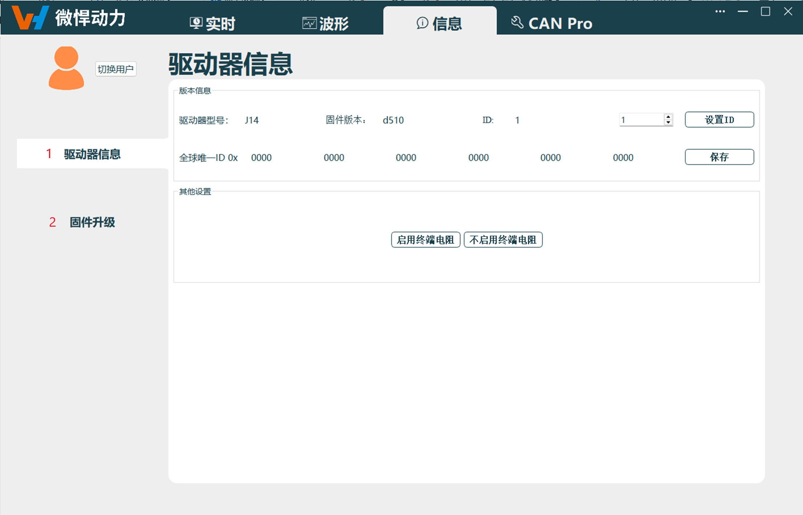
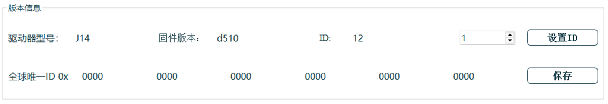
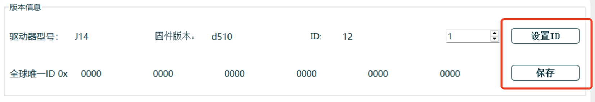
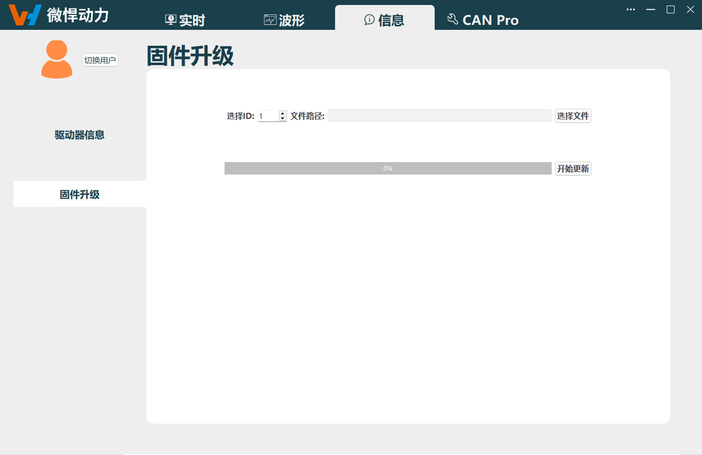
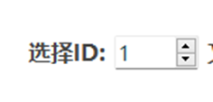
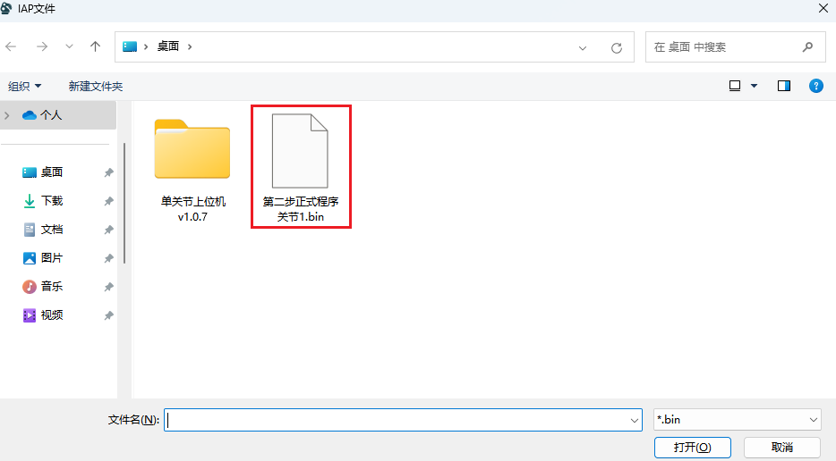
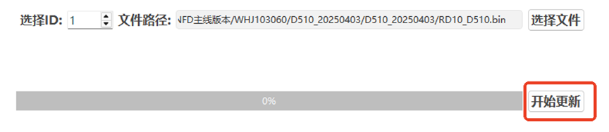

# 
入门指南：
 信息导航

**信息导航包含：** 驱动器信息、固件升级，如下图所示。

驱动器信息导航页面
 

## 驱动器信息

### 驱动器信息显示

**驱动器信息显示：** 驱动器型号、固件版本、关节ID、全球唯一ID。 

驱动器信息
 

### 功能按钮

- **ID设置：**
    针对关节进行ID设置，设置完成后需点击`保存`，并重启关节生效。
    
    
关节ID设置
 
- **启动/不启用终端电阻：**
    针对CAN盒设置终端电阻开启或关闭。
    
    
设置终端电阻
 

## 固件升级

针对关节进行固件版本升级，升级后需重启关节才能生效。

固件升级页面
 

::: warning 注意
CANOpen关节暂不支持在该页面进行升级，如需升级CANOpen关节，请联系我司技术支持。
:::

1. 输入待升级的关节ID。
     
    
关节选择
 
2. 点击`选择文件`，打开存放固件文件路径，选择准确的固件文件，并点击`打开`，完成选择固件文件。 
    固件文件后缀为bin文件。
     
    
文件选择
 
3. 点击`开始更新`，开始固件升级更新。
    
    
开始更新
 
4. 升级完成后，请重启关节，使关节固件版本升级生效。
