# 
入门指南：
 实时导航

## 设备连接类

当硬件状态正常后，才可进行设备连接。  
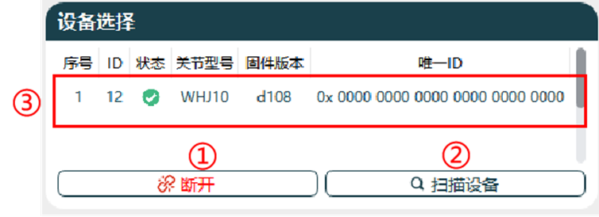 

连接页面
 

设备选择按钮功能，如下表所示。

|序号|名称|
|-|-|
|1|Can卡连接|
|2|关节设备扫描|
|3|关节基本信息|

### CAN卡连接

- **连接**：

    1. 当硬件设备连接状态正常时，请点击功能按钮`Can卡连接`，弹出参数设置页面。
    2. 支持设置`协议`、`通道`、`仲裁域`和`数据域`。 
        不同协议配置方案如下：

        |协议|通道|仲裁域|数据域|
        |:-:|:-:|:-:|:-:|
        |CANFD_ZLG/CANFD_HK|0|1Mbps|5Mbps|
        |CANOPEN_ZLG/CANOPEN_HK|0|1Mbps|默认1Mbps，支持500HZ、250HZ可调整|

        对应协议说明如下，不同协议需对应关节不同版本，具体版本情况请联系我司技术支持。

        |协议|说明|
        |:-:|:-:|
        |CANFD_ZLG|对接周立功品牌的CANFD协议|
        |CANOPEN_ZLG|对接周立功品牌的CANOPEN协议|
        |CANFD_HK|对接虹科品牌的CANFD协议|
        |CANOPEN_HK|对接虹科品牌的CANOPEN协议|

    3. CAN卡通讯配置完成后，点击`确认`连接CAN卡设备，在上位机提示“连接成功”，功能按钮变更为`断开`。 
- **断开：** 点击功能按钮`断开`，此时上位机提示“提示设备已断开”，功能按钮变更为`Can卡连接`。

    |连接|断开|
    |:-:|:-:|
    |||

### 扫描设备

设备连接成功后，点击`扫描设备`开始扫描关节，实时扫描已通讯关节，当扫描完成后，关节设备相关信息将展示在设备对话框中。  

 

设备信息显示

设备信息显示说明如下：

|序号|名称|
|-|-|
|1|连接设备序号|
|2|关节ID|
|3|使能状态|
|4|驱动器型号|
|5|固件版本|
|6|全球唯一ID|

**相关参数说明：**

- **设备序号：** 当存在多关节连接时，序号根据关节数量进行递增。
- **关节ID：** 根据实时扫描，显示已设置的关节ID号。
- **使能状态：** 根据实时扫描，显示当前关节使能状态，并根据关节状态使用不同颜色进行显示。

    |掉使能|上使能|
    |:-:|:-:|
    |||

- **驱动器型号：** 根据实时扫描，显示当前关节型号。
- **固件版本号**：根据实时扫描，显示当前关节固件版本型号。
- **全球唯一ID：** 根据实时扫描，显示当前关节唯一ID，此ID出厂后不可进行更改。

## 数据显示

当上位机连接正常时，可查看当前选中关节基础信息。  

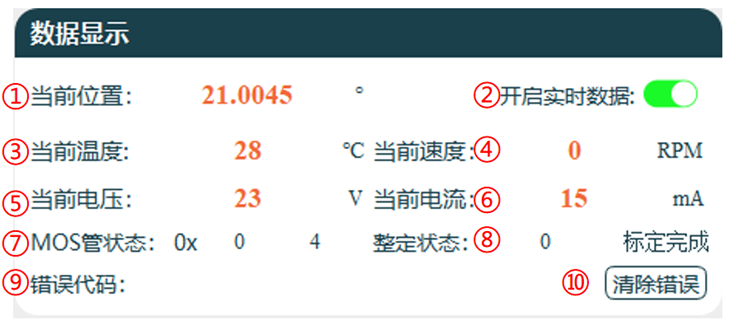 

数据显示页面
 

**数据显示各区域说明如下：**

|序号|名称|
|-|-|
|1|当前关节所在角度位置|
|2|关节实时数据显示的开启与关闭|
|3|关节内部当前温度|
|4|关节当前速度|
|5|关节当前检测电压|
|6|关节当前损耗电流|
|7|关节当前MOS管状态|
|8|关节当前整定标定状态|
|9|关节当前错误状态显示|
|10|清除当前错误状态|

### 开启实时数据

实时数据默认处于关闭状态。如需查看关节实时信息，请点击`开启实时数据`，开启实时上传当前关节数据信息功能，如下图所示。

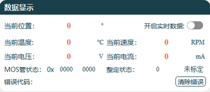

默认状态

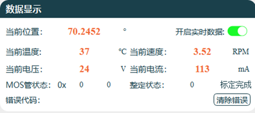

开启状态

### 清除错误

当关节出现异常时，错误代码打印当前错误问题描述，同时关节状态栏掉使能。

1. 排查关节错误原因，并完成解决。
2. 点击`清除错误`清除错误信息。
3. 点击`上使能`使关节状态上使能。

    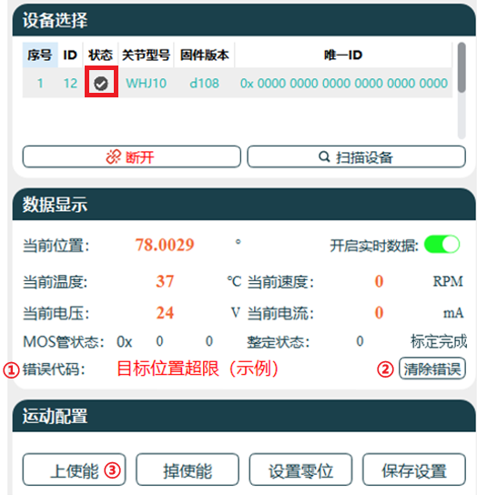
    
消除错误流程

## 运动配置

关节控制操作，可进行控制关节状态以及控制关节运动等相关设置。

### 关节状态设置

关节状态设置功能按钮，可对关节进行相应操作。  

 

关节状态设置
 

**各功能说明如下：**

|序号|名称|
|-|-|
|1|关节上使能|
|2|关节掉使能|
|3|关节设置零位|
|4|保存参数设置|

**各功能按钮详细说明如下：**

- **上使能：**
    连接设备后，关节默认为上使能状态，此时才可对关节进行运动控制，掉使能时上位机对关节无法进行运动控制。
- **掉使能：**
    当设备处于上使能状态，只能通过软件控制关节。如需手动控制关节，请先进行掉使能操作，当处于掉使能状态时，才能人为正常转动关节，此时设备栏状态为灰色。
- **零位设置：**
    点击`设置零位`按钮后，关节当前位置设置为零位，角度为0度，设置完成后需保存设置才能生效。
- **保存设置：**
    关节内部一切参数的设置，均需要点击`保存设置`按钮。若不保存设置，关节断电重启后，关节参数将恢复之前的数据。

### 运动控制

可通过多种模式控制关节运动，支持对关节进行限位设置。  

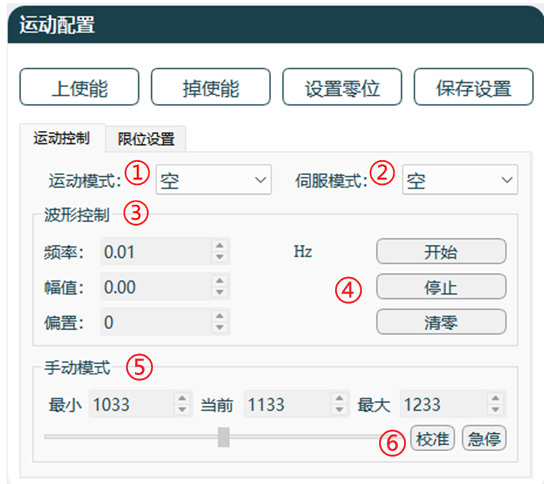 

运动控制
 

**各区域功能说明：**

|序号|名称|
|-|-|
|1|运动模式|
|2|伺服模式|
|3|波形控制|
|4|开始结束清零设置|
|5|手动控制|
|6|校准和急停|

**各区域/按键说明如下：**

- **运动模式：**
    运动模式支持方波、正弦波、手动，可根据需求进行设置。

    |波形模式选项|方波|正弦波|
    |:-:|:-:|:-:|
    |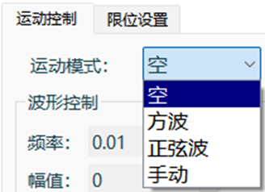|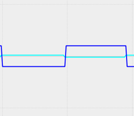||

- **伺服模式：**
    伺服模式支持目标电流、目标速度、目标位置和测试模式，可根据需求进行设置。

    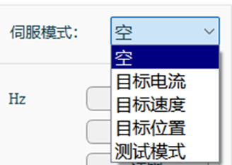
    
伺服模式选择
 

    ::: warning 注意
    测试模式仅限于在空载的情况下测试使用（如果带负载，到达限位时惯性较大，长时间使用有损坏关节的风险），在该模式下，仅支持使用手动运动模式，支持转速手动调整。在使用该模式时，建议将关节限位调整为最大（-214748～214748），关节可以在设定的最大位置限位、最小位置限位之间循环往复运动。
    :::

- **波形控制：**
    支持设置波形频率及波形幅值，控制关节速度、角度大小等参数。可通过频率、幅值、偏置参数进行配置。 
    下图以位置伺服、正弦波运动模式为例：
  - 频率设置为0.1HZ，则运动1个正弦波周期为10S；
  - 幅值设置为90，对应正弦波幅值；
  - 偏置设置为100，则正弦波平衡位置角度与y=0°偏差为100°。

    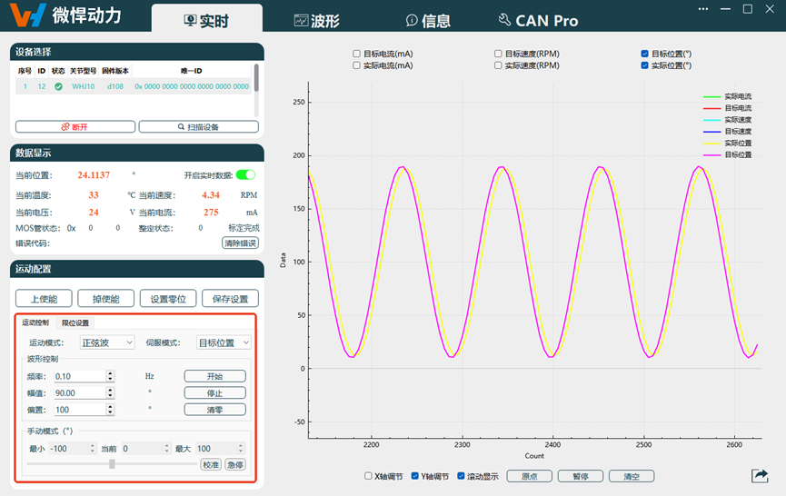
    
波形控制选择
 

- **手动控制：**
    手动控制为单独关节控制，根据伺服模式进行状态选择。

  - 运动控制通过鼠标调整参数大小。
  - 切换到手动模式后，需要先进行校准，运动自动调整至正常可控范围。
  - 目标位置模式下，校准可将调整范围校准为±100°可调。
  - 在目标速度或者目标电流模式下，正常操作情况下建议手动调整滑块至速度为0。
  - 如果发生异常危险情况，可点击`急停`按钮让关节停止运动。

    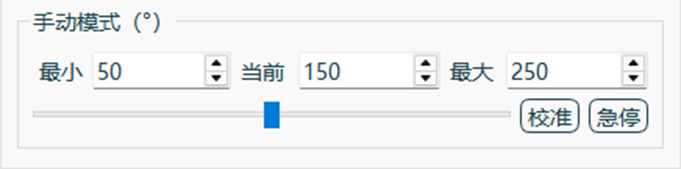
    
手动运动控制
 

### 限位设置

**限位设置：** 可设置关节最大限位角度与最小限位角度。设置完成后，点击`保存设置`保存至关节内部，并重启关节后生效。最小限位最小可设置为-214748°，最大限位最大可设置为214748°。

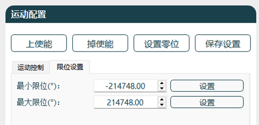

限位设置
 

## 实时波形

当前关节数据通过波形显示，包括实际电流、目标电流、实时速度、目标速度、实时位置、目标位置，并支持数据导出功能。  

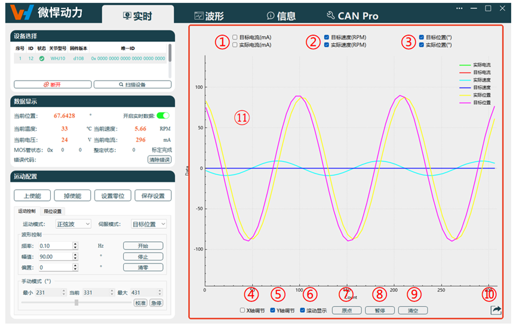 

波形显示
 

**各功能区域说明如下：**

|序号|名称|
|-|-|
|1|电流波形显示选择框|
|2|速度波形显示选择框|
|3|位置波形显示选择框|
|4|X轴单独调节|
|5|Y轴单独调节|
|6|滚动显示|
|7|波形原点|
|8|波形开始/暂停|
|9|波形清空|
|10|数据导出|
|11|波形显示|

**各区域/按键说明如下：**

- **波形显示选项：**
    当需要查看相关电流、速度、位置波形时，勾选对应选项，并点击`开始`后，波形输出在图框中。
    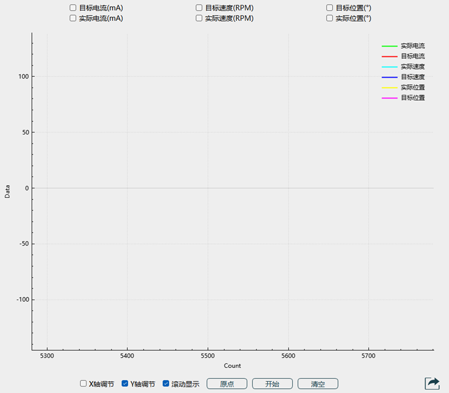
    
勾选前
 

    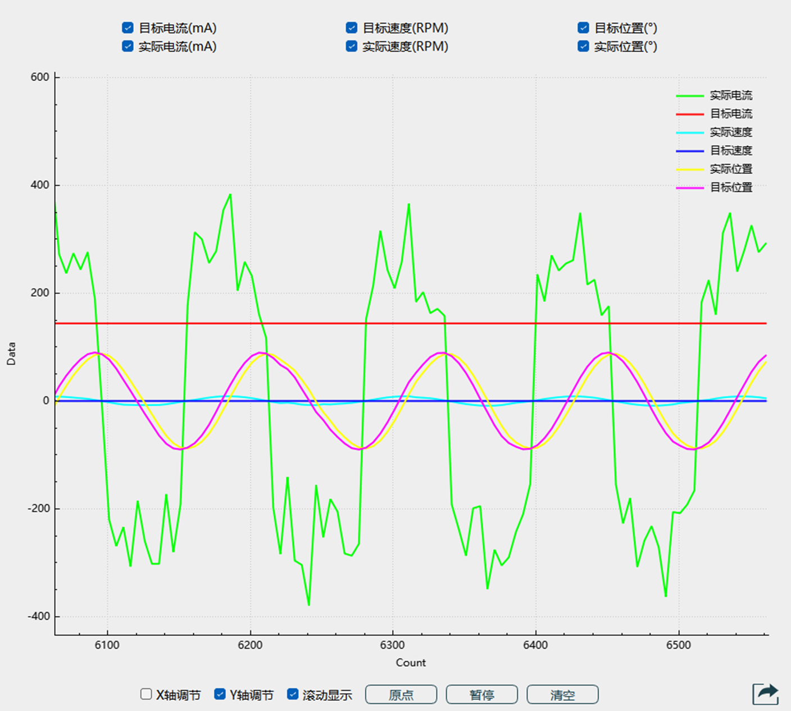
    
勾选后
 

- **功能按钮：**
    针对波形进行对应控制及查看。
  - **X轴调节：**
      当勾选时，可通过调整鼠标滚轮调节波形x轴比例。去除勾选后，无法调节波形比例。
  - **Y轴调节：**
      当勾选时，可通过调整鼠标滚轮调节波形y轴比例。去除勾选后，无法调节波形比例。
  - **滚动显示：**
      当勾选时，波形实时滚动，当去除勾选时，波形固定在此页面，可以拉动两轴查看数据。
  - **原点：**
      当停止滚动显示时，点击功能按钮`原点`后，波形显示从x轴0位开始。
  - **开始：**
      当点击`开始`后，根据勾选的波形开始显示，按钮变为`暂停`。如需停止，可点击`暂停`停止波形打印。

      |开始按钮|暂停按钮|
      |:-:|:-:|
      |||

  - **清空：**
      点击功能按钮`清空`后，清空打印在上位机上的波形。

  - **数据导出：**

    - 导出类型：图片导出、文档导出。
    - 导出目标：实时波形图、电流波形图、位置波形图、速度波形图、力矩波形图。
    - 图片导出可选择文件存储地址及文件名称，图片格式默认png，如下图所示。

      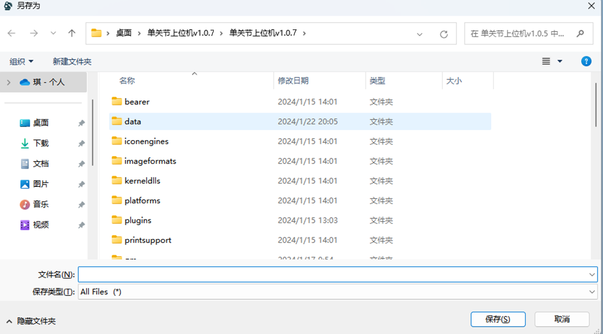 
      
图片保存路径
 

    - 文档导出文件名称及文件地址无法选择，导出时提示`写入文件成功`。文件格式默认固定为txt格式，文件路径为上位机data文件内，如下图所示。

      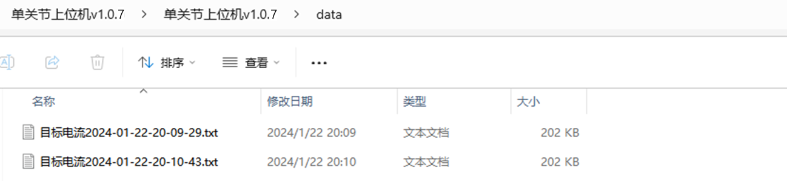 
      
文档导出路径
 
