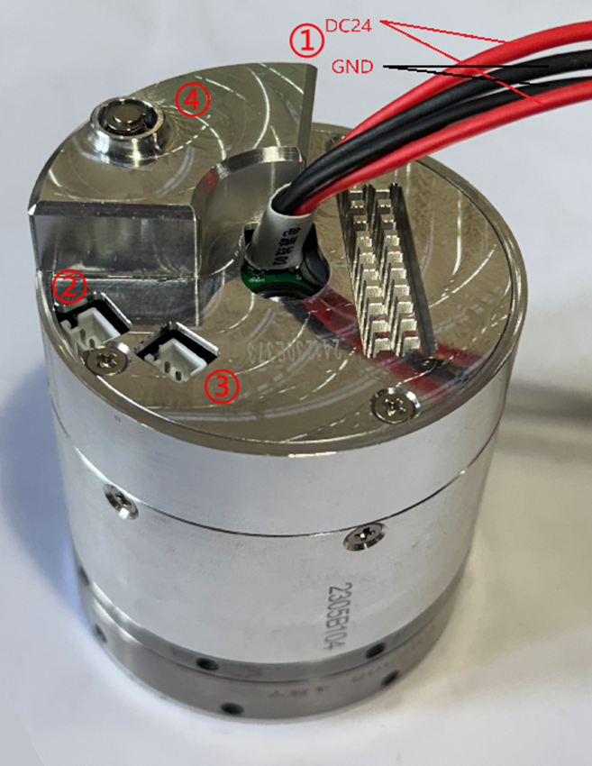
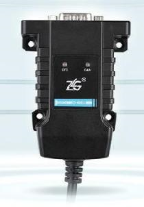
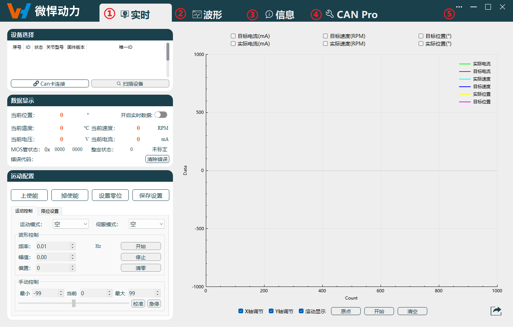
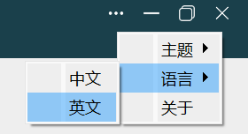

# 
入门指南：
 环境准备

## 硬件环境配置

### 接线说明

本关节外部接口三个接线端子，一个电磁锁头。

关节硬件示意图

关节硬件说明，如下表所示。

|序号|名称|
|--|--|
|1|输入 24V 直流电源|
|2|CAN0 通讯接口|
|3|CAN1 通讯接口|
|4|电磁锁（硬限位模块）|

#### 输入电源

红&黑色线束为电源输入，红色为电源正极，黑色为电源 GND，关节外部电源输入为 24V 电源。

#### 关节通讯

通信接口端子共有两对，分别为CAN0&CAN1，其中，蓝色线束为CANH，白色线束为CANL。

### CAN 通讯设备配置

1. CAN转USB工具使用ZLG USBCANFD-100U-mini（选配），如下图所示。

    
    
CAN盒

2. 点击[驱动工具](https://ik.imagekit.io/Realman/Files/USBCANFD-100(200)-U.rar?updatedAt=1745407278687)下载CAN转USB驱动工具。
3. 将驱动工具软件包解压至本地，双击`USBCANFD_AllInOne_x86_x64_1.0.0.2.exe`运行并完成安装驱动工具。
4. 确认测试用电脑是否已安装VC++环境，如果未安装，请联系技术支持获取驱动包并安装，否则无法通讯成功。

::: warning 注意

- 为满足接口卡接入集成系统的需要，睿尔曼推出了统一的编程接口，同时支持CAN和CANFD。
- 除了简单易用的接口，还配以接口使用例程和接口使用说明。
- 依赖Microsoft Visual C++运行库版本（必须具备）：2005、2008、2010、2012、2013。
- 连接运动前确认关节已固定牢靠。
- 如果发现打开设备失效，请根据软件结构，检查电脑里面的运行环境是否缺失。

:::

## 单关节上位机简介

1. 点击[单关节上位机](https://ik.imagekit.io/Realman/ik-archive-4dbd7303a796afcf88ac95dd6a6382af/ik-download-a43d1f3b-ee87-4f0d-aad8-d996caed1c1a.zip)下载单关节上位机软件。
2. 将软件包解压至本地，双击`WHJoint.exe`运行单关节上位机工具。
3. 单关节上位机用于关节的设置和观测，用户可根据需要调整关节参数、查询关节驱动信息、设置和升级固件以及实时观测关节数据等操作。 

      
    
导航页面
 

**各功能区域名称**：

|序号|名称|
|-|-|
|1|实时导航|
|2|波形导航|
|3|信息导航|
|4|CAN信息导航|
|5|功能菜单|

 下面将按照上表的顺序，依次对各区域/按键进行说明：

- **实时导航：** 内部功能分类，设备连接类、数据实时显示类、运动配置类及实时波形类。
- **波形导航：** 当前电流、速度、位置生成波形以便查看。
- **信息导航：** 内部功能分类，驱动信息查询与设置、固件升级功能。
- **CAN信息导航**：CAN指令收发实时显示。
- **功能菜单**：支持进行中英文切换，如下图所示，在下拉菜单中选择`语言` > `中文/英文`，切换至中文/英文界面。

    
