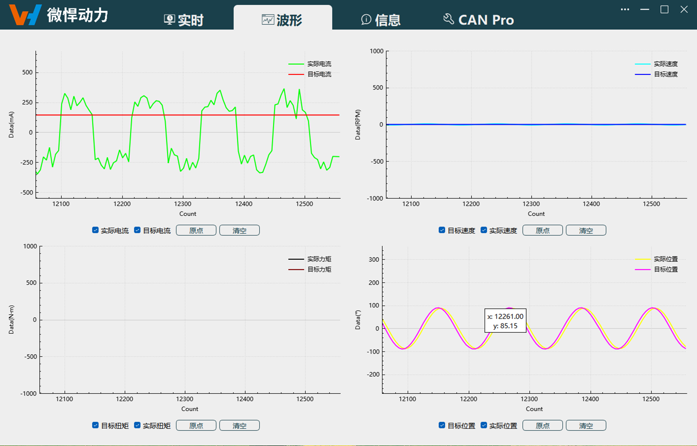
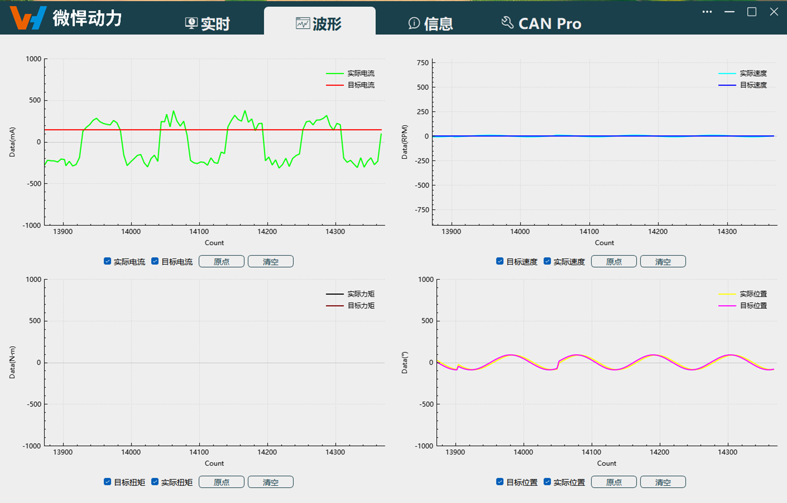

# 
入门指南：
 波形导航

可独立展示不同类型波形，目前支持电流波形、速度波形、位置波形，暂不支持力矩波形输出，鼠标悬停在曲线上可实时查看该点坐标位置。

波形导航

## 波形显示

实时页面中波形显示开始后，此导航内波形正常显示，如下图所示。

波形显示
 

## 功能按钮

**页面功能按钮：** 显示波形类型、原点、清空。

- **波形显示：**
    实时页面中波形显示开始后，勾选显示波形类型后正常显示。

    
    
波形显示

- **原点：**
    当停止滚动显示时，切换至波形导航，点击功能按钮`原点`后，波形显示从x轴0位开始。
- **清空：**
    点击功能按钮`清空`后，打印在上位机上的波形清空。
