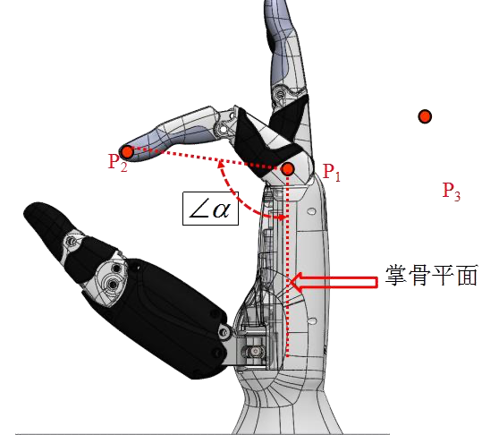
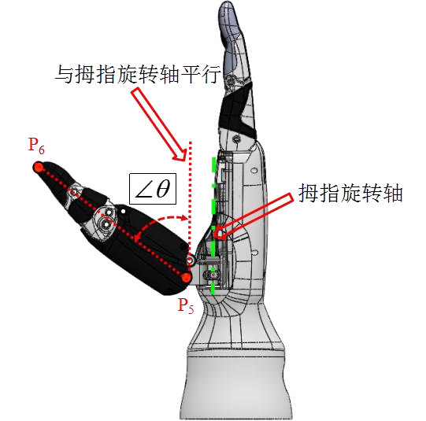
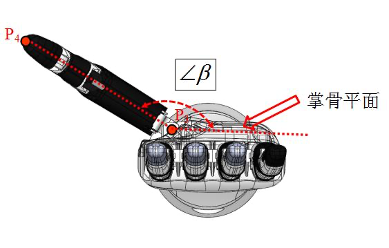
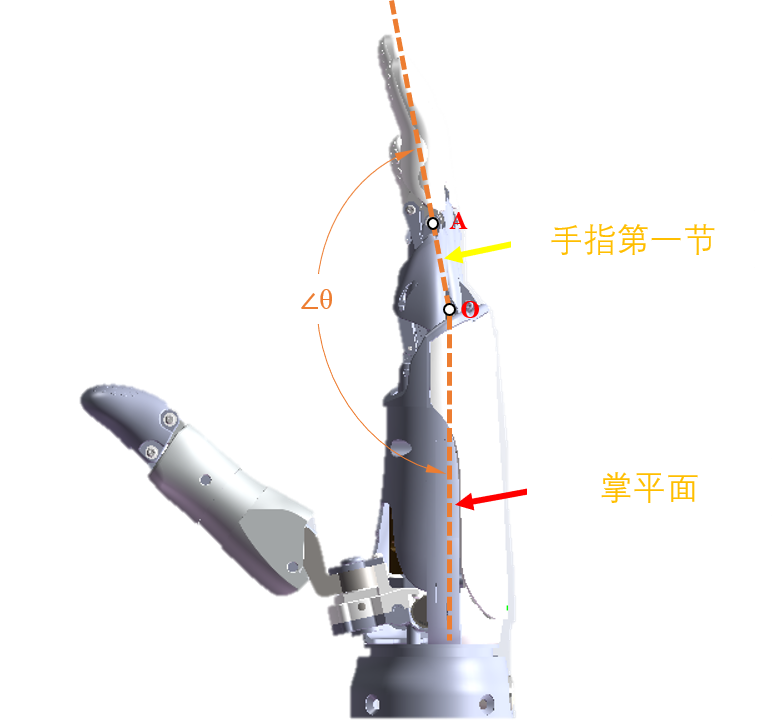
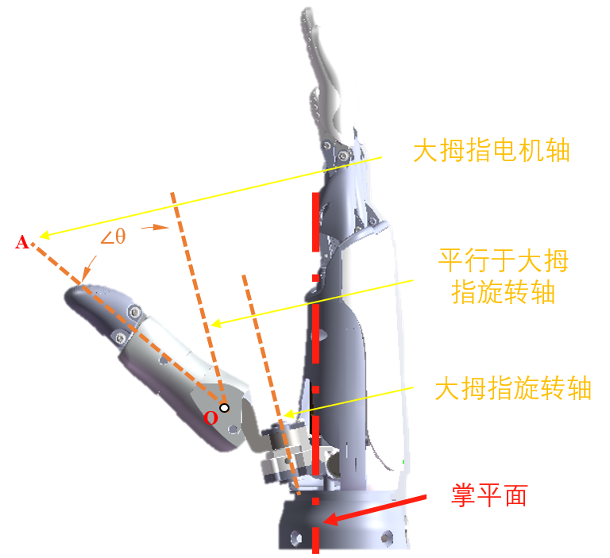

# <p class="hidden">JSON协议：</p>末端工具指令集（选配）

## 夹爪控制

睿尔曼机械臂末端配备了因时的EG2-4C2夹爪，为了便于用户操作夹爪，机械臂控制器对用户开放了夹爪的控制协议（夹爪控制协议与末端modbus功能互斥）。

### 设置夹爪行程`set_gripper_route`

设置夹爪行程，即夹爪开口的最大值和最小值，设置成功后会自动保存，夹爪断电不丢失。

- **输入参数**  

| 功能描述 | 类型 |说明|
| :--- | :------------------------- |:---|
| `set_gripper_route` | `string` |设置夹爪行程。|
| `min` | `int` |夹爪开口最小值，范围：0~1000，无单位量纲。|
| `max` | `int` |夹爪开口最大值，范围：0~1000，无单位量纲。|

- **代码示例**

**输入**  

```json
{"command":"set_gripper_route","min":70,"max":500}
```

**输出**  

配置成功:

```json
{
    "command": "set_gripper_route",
    "state": true
}
```

配置失败:

```json
{
    "command": "set_gripper_route",
    "state": false
}
```

### 松开夹爪`set_gripper_release`

- **输入参数**

| 功能描述 | 类型 |说明|
| :--- | :------------------------- |:---|
| `set_gripper_release` | `string` |设置夹爪松开。|
| `speed` | `int` |夹爪松开速度，范围1~1000，无单位量纲。|
| `block` | `int` |true 表示阻塞模式，false 表示非阻塞模式。|

- **输出参数**

| 功能描述 | 类型 |说明|
| :--- | :------------------------- |:---|
| `state` | `bool` |`true`：设置成功；`false`：设置失败。|

可以跳转[current_trajectory_state](../motionConfig/index.md#5438)查阅运动到位返回结果输出参数。

- **代码示例**

**输入**  

设置松开夹爪。

```json
{"command":"set_gripper_release","speed":500,"block":true}
```

**输出**  

夹爪松开成功：<br>
该指令不论是否为阻塞模式均会返回。

```json
{
    "command": "set_gripper",
    "state": true
}
```

夹爪松开失败：<br>
该指令不论是否为阻塞模式均会返回。

```json
{
    "command": "set_gripper",
    "state": false
}
```

该指令为阻塞模式下，运动到指定位置的上报信息。

```json
{"state":"current_trajectory_state","trajectory_state":true,"device":1,"trajectory_connect": 1}
```

### 夹爪力控夹取`set_gripper_pick`

夹爪力控夹取，夹爪以设定的速度和力夹取，当夹持力超过设定的力阈值后，停止夹取。

- **输入参数**

| 功能描述 | 类型 |说明|
| :--- | :------------------------- |:---|
| `set_gripper_pick` | `string` |设置夹爪力矩夹取。|
| `speed` | `int` |夹爪松开速度，范围1~1000，无单位量纲。|
| `force` | `int` |力控阈值，范围：50~1000，无单位量纲。|
| `block` | `int` |true 表示阻塞模式，false 表示非阻塞模式。|

- **输出参数**

| 功能描述 | 类型 |说明|
| :--- | :------------------------- |:---|
| `state` | `bool` |`true`：设置成功；`false`：设置失败。|

可以跳转[current_trajectory_state](../motionConfig/index.md#5438)查阅运动到位返回结果输出参数。

- **代码示例**

**输入**
设置夹爪力矩夹取。

```json
{"command":"set_gripper_pick","speed":500,"force":200,"block":true}
```

**输出**  

夹爪松开成功：<br>
该指令不论是否为阻塞模式均会返回。

```json
{
    "command": "set_gripper",
    "state": true
}
```

夹爪松开失败：<br>
该指令不论是否为阻塞模式均会返回。

```json
{
    "command": "set_gripper",
    "state": false
}
```

该指令为阻塞模式下，运动到指定位置的上报信息。

```json
{
    "state": "current_trajectory_state",
    "trajectory_state": true,
    "device": 1,
    "trajectory_connect": 1
}
```

### 夹爪持续力控夹取`set_gripper_pick_on`

夹爪力控夹取，夹爪以设定的速度和力夹取，当夹持力超过设定的力阈值后，停止夹取；当夹持力再次小于力矩阈值时，夹爪再次夹取，直至夹持力超过力控阈值。

- **输入参数**

| 功能描述 | 类型 |说明|
| :--- | :------------------------- |:---|
| `set_gripper_pick_on` | `string` |设置夹爪力控夹取。|
| `speed` | `int` |夹爪松开速度，范围1~1000，无单位量纲。|
| `force` | `int` |力控阈值，范围：50~1000，无单位量纲。|
| `block` | `int` |true 表示阻塞模式，false 表示非阻塞模式。|

- **输出参数**

| 功能描述 | 类型 |说明|
| :--- | :------------------------- |:---|
| `state` | `bool` |`true`：设置成功；`false`：设置失败。|

可以跳转[current_trajectory_state](../motionConfig/index.md#5438)查阅运动到位返回结果输出参数。

- **代码示例**

**输入**
设置夹爪持续力控夹取。

```json
{"command":"set_gripper_pick_on","speed":500,"force":200,"block":true}
```

**输出**  

夹爪松开成功：<br>
该指令不论是否为阻塞模式均会返回。

```json
{
    "command": "set_gripper",
    "state": false
}
```

夹爪松开失败：<br>
该指令不论是否为阻塞模式均会返回。

```json
{
    "command": "set_gripper",
    "state": false
}
```

该指令为阻塞模式下，运动到指定位置的上报信息。

```json
{
    "state": "current_trajectory_state",
    "trajectory_state": true,
    "device": 1,
    "trajectory_connect": 1
}
```

### 夹爪到达指定位置`set_gripper_position`

夹爪到达指定位置，当当前开口小于指定开口时，夹爪以指定速度松开到指定开口位置；当当前开口大于指定开口时，夹爪以指定速度和力矩闭合往指定开口处闭合，当夹持力超过力矩阈值或者达到指定位置后，夹爪停止。

- **输入参数**

| 功能描述 | 类型 |说明|
| :--- | :--- |:---|
| `set_gripper_position` | `string` |设置夹爪达到指定位置。|
| `position` | `int` |夹爪开口位置，范围：1~1000，无单位量纲。|
| `block` | `int` |true 表示阻塞模式，false 表示非阻塞模式。|

- **输出参数**

| 功能描述 | 类型 |说明|
| :--- | :------------------------- |:---|
| `state` | `bool` |`true`：设置成功；`false`：设置失败。|

可以跳转[current_trajectory_state](../motionConfig/index.md#5438)查阅运动到位返回结果输出参数。

- **代码示例**

**输入**
设置夹爪到达指定位置。

```json
{"command":"set_gripper_position","position":500,"block":true}
```

**输出**  

夹爪松开成功。<br>
该指令不论是否为阻塞模式均会返回。

```json
{
    "command": "set_gripper",
    "state": true
}
```

夹爪松开失败。<br>
该指令不论是否为阻塞模式均会返回。

```json
{
    "command": "set_gripper",
    "state": false
}
```

该指令为阻塞模式下，运动到指定位置的上报信息。

```json
{
    "state": "current_trajectory_state",
    "trajectory_state": true,
    "device": 1,
    "trajectory_connect": 1
}
```

### 查询夹爪状态`get_gripper_state`

- **输入参数**

| 功能描述 | 类型 |说明|
| :--- | :--- |:---|
| `get_gripper_state` | `string` |查询夹爪状态。|

- **输出参数**

| 功能描述 | 类型 |说明|
| :--- | :--- |:---|
| `enable` | `int` |夹爪使能标志，0 表示未使能，1 表示使能。|
| `status` | `int` |夹爪在线状态，0 表示离线， 1表示在线。|
| `error` | `int` |夹爪错误信息，<br>低8位表示夹爪内部的故障信息<br>bit5-7 保留 bit4 内部通信 <br>bit3 驱动器 bit2 过流 bit1 过温bit0 堵转。|
| `mode` | `int` |当前工作状态：1 夹爪张开到最大且空闲，2 夹爪闭合到最小且空闲，3 夹爪停止且空闲，4 夹爪正在闭合，5 夹爪正在张开，6 夹爪闭合过程中遇到力控停止。|
| `current_force` | `int` |夹爪当前的压力，单位g。|
| `temperature` | `int` |当前温度单位℃。|
| `actpos` | `int` |夹爪开口度。|

- **代码示例**

**输入**  

```json
{"command":"get_gripper_state"}
```

**输出**  

```json
{
    "command": "get_gripper_state",
    "enable": 1,
    "status": 1,
    "error": 0,
    "mode": 1,
    "current_force": 100,
    "temperature": 40,
    "actpos": 150
}
```

## 五指灵巧手

睿尔曼机械臂末端配置因时的五指灵巧手，可通过协议对灵巧手进行设置。

### 设置灵巧手手势`set_hand_posture`

- **输入参数**

| 功能描述 | 类型 |说明|
| :--- | :--- |:---|
| `set_hand_posture` | `string` |设置手势。|
| `posture_num` | `int` |预先保存在灵巧手内的手势序号，范围：1~40。|
| `block` | `bool` |true 表示阻塞模式，false 表示非阻塞模式。|

- **输出参数**

| 功能描述 | 类型 |说明|
| :--- | :------------------------- |:---|
| `set_state` | `bool` |`true`：设置成功；`false`：设置失败。|

可以跳转[current_trajectory_state](../motionConfig/index.md#5438)查阅运动到位返回结果输出参数。

- **代码示例**

**输入**  

```json
{"command":"set_hand_posture","posture_num":1,"block":true}
```

**输出**  

设置成功:

```json
{
    "command": "set_hand_posture",
    "set_state": true
}
```

设置失败:

```json
{
    "command": "set_hand_posture",
    "set_state": false
}
```

该指令为阻塞模式下，运动到指定位置的上报信息。

```json
{
    "state": "current_trajectory_state",
    "trajectory_state": true,
    "device": 2,
    "trajectory_connect": 1
}
```

### 设置灵巧手动作序列`set_hand_seq`

- **输入参数**

| 功能描述 | 类型 |说明|
| :--- | :--- |:---|
| `set_hand_seq` | `string` |设置动作。|
| `seq_num` | `int` |预先保存在灵巧手内的动作序号，范围：1~40。|
| `block` | `bool` |true 表示阻塞模式，false 表示非阻塞模式。|

- **输出参数**

| 功能描述 | 类型 |说明|
| :--- | :------------------------- |:---|
| `set_state` | `bool` |`true`：设置成功；`false`：设置失败。|

可以跳转[current_trajectory_state](../motionConfig/index.md#5438)查阅运动到位返回结果输出参数。

- **代码示例**

**输入**  

```json
{"command":"set_hand_seq","seq_num":1,"block":true}
```

**输出**  

设置成功：

```json
{
    "command": "set_hand_seq",
    "set_state": true
}
```

设置失败：

```json
{
    "command": "set_hand_seq",
    "set_state": false
}
```

该指令为阻塞模式下，运动到指定位置的上报信息。

```json
{
    "state": "current_trajectory_state",
    "trajectory_state": true,
    "device": 2,
    "trajectory_connect": 1
}
```

### 设置灵巧手各自由度角度`set_hand_angle`

设置灵巧手角度，灵巧手有6个自由度，从1\~6分别为小拇指，无名指，中指，食指，大拇指弯曲，大拇指旋转。

- **输入参数**

| 功能描述 | 类型 |说明|
| :--- | :--- |:---|
| `set_hand_angle` | `string` |设置手指角度。|
| `hand_angle` | `int` |手指角度数组，范围：0~1000.另外，-1代表该自由度不执行任何操作，保持当前状态。|
| `block` | `bool` |true 表示阻塞模式，false 表示非阻塞模式。|

- **输出参数**

| 功能描述 | 类型 |说明|
| :--- | :------------------------- |:---|
| `set_state` | `bool` |`true`：设置成功；`false`：设置失败。|

可以跳转[current_trajectory_state](../motionConfig/index.md#5438)查阅运动到位返回结果输出参数。

- **代码示例**

**输入**  

```json
{"command":"set_hand_angle","hand_angle":[-1,100,200,300,400,500],"block":true}
```

**输出**  

设置成功：

```json
{
    "command": "set_hand_angle",
    "set_state": true
}
```

设置失败：

```json
{
    "command": "set_hand_angle",
    "set_state": false
}
```

该指令为阻塞模式下，运动到指定位置的上报信息。

```json
{
    "state": "current_trajectory_state",
    "trajectory_state": true,
    "device": 2,
    "trajectory_connect": 1
}
```

### 设置灵巧手速度`set_hand_speed`

- **输入参数**

| 功能描述 | 类型 |说明|
| :--- | :--- |:---|
| `set_hand_speed` | `string` |设置手指速度。|
| `hand_speed` | `int` |手指速度，范围：1~1000。|

- **代码示例**

**输入**  

```json
{"command":"set_hand_speed","hand_speed":500}
```

**输出**  

设置成功

```json
{
    "command": "set_hand_speed",
    "set_state": true
}
```

设置失败

```json
{
    "command": "set_hand_speed",
    "set_state": false
}
```

### 设置灵巧手力阈值`set_hand_force`

- **输入参数**

| 功能描述 | 类型 |说明|
| :--- | :--- |:---|
| `set_hand_force` | `string` |设置手指力阈值。|
| `hand_force` | `int` |手指力，范围：1~1000。|

- **代码示例**

**输入**  

```json
{"command":"set_hand_force","hand_force":500}
```

**输出**  

设置成功

```json
{
    "command": "set_hand_force",
    "set_state": true
}
```

设置失败

```json
{
    "command": "set_hand_force",
    "set_state": false
}
```

### 灵巧手角度跟随控制`hand_follow_angle`

设置灵巧手跟随角度，灵巧手有6个自由度，从1~6分别为大拇指弯曲，食指、中指、无名指、小拇指、大拇指旋转，最高50Hz的控制频率。

::: warning 注意
如果要使用此功能，需要联系技术支持发送定制的灵巧手固件升级包（傲意或者因时）。
:::

- **输入参数**

| 功能描述 | 类型 |说明|
| :--- | :--- |:---|
| `hand_follow_angle` | `string` |设置手指角度。|

- **因时各自由度的角度定义和运动范围说明如下。**

| 角度 | 图例说明 |范围|
| :--- | :--- |:---|
| 小拇指<br>无名指<br>中指<br>食指 |  |19°~176.7°|
| 大拇指弯曲角度 |  |-130~53.6°|
| 大拇旋转曲角度 |  |90°~165°|

- **傲意各自由度的角度定义和运动范围说明如下。**

| 角度 | 图例说明 |范围|
| :--- | :--- |:---|
| 食指<br>中指<br>无名指<br>小拇指 |  |100.22°~178.37°<br> 97.81° ~ 176.06°<br>101.38°~176.54°<br>98.84°~174.86°|
| 大拇指弯曲角度 |  |2.26° ~ 36.76°|
| 大拇旋转曲角度 |  |0° ~ 90°|

- **代码示例**

**输入**  

说明：设置灵巧手各手指动作，hand_angle表示手指角度数组，按照灵巧手厂商定义的角度做控制，例如：<br>

1. 傲意的角度范围为-32768到+32767。
2. 因时的角度范围为0到+2000；

灵巧手角度的定义（int16）：<br>

1. 傲意：第一指关节1的角度*100。
2. 因时：0-2000，通过联系技术支持得到驱动器行程与角度关系表。

```json
{"command":"hand_follow_angle","hand_angle":[100,100,200,300,400,500]}
```

**输出**  

设置成功

```json
{
    "command": "hand_follow_angle",
    "set_state": true
}
```

设置失败

```json
{
    "command": "hand_follow_angle",
    "set_state": false
}
```

### 灵巧手位置跟随控制`hand_follow_pos`

设置灵巧手跟随角度，灵巧手有6个自由度，从1~6分别为大拇指弯曲，食指、中指、无名指、小拇指、大拇指旋转，最高50Hz的控制频率。

::: warning 注意
如果要使用此功能，需要联系技术支持发送定制的灵巧手固件升级包（傲意或者因时）。
:::

- **输入参数**

| 功能描述 | 类型 |说明|
| :--- | :--- |:---|
| `hand_follow_pos` | `string` |设置手指角度。|

- **代码示例**

**输入**  

说明：设置灵巧手各手指动作，hand_pos表示手指位置数组，按照灵巧手厂商定义的角度做控制，例如：<br>

1. 因时的位置范围为0-1000；
2. 傲意的位置范围为0-65535。

```json
{"command":"hand_follow_pos","hand_pos":[100,100,200,300,400,500]}
```

**输出**  

设置成功

```json
{
    "command": "hand_follow_pos",
    "set_state": true
}
```

设置失败

```json
{
    "command": "hand_follow_pos",
    "set_state": false
}
```
