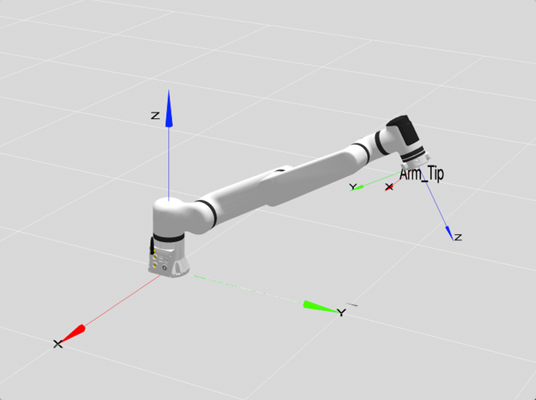
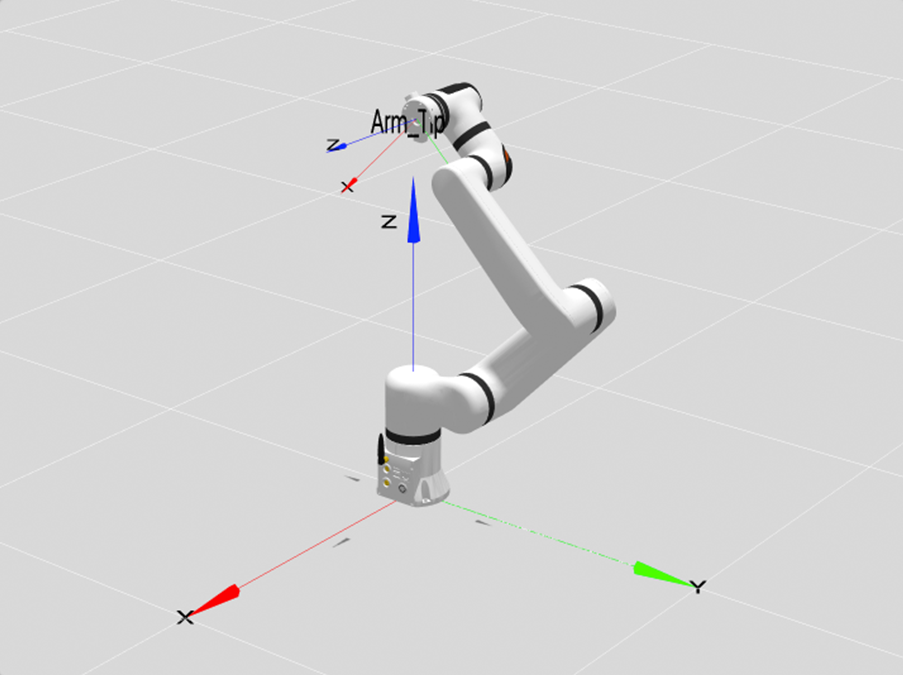

# 
本体参数：
ECO65系列参数及D-H模型

## 基础参数

<table>
    <tr>
        <th colspan="2">参数名</th>
        <th>参数值</th>
    </tr>
    <tr>
        <th rowspan="13">基础参数</th>
        <th>自由度</th>
        <td>6</td>
    </tr>
    <tr>
        <th>构型</th>
        <td>协作臂构型</td>
    </tr>
    <tr>
        <th>关节制动器形式</th>
        <td>1~6关节硬抱闸</td>
    </tr>
    <tr>
        <th>工作半径/mm</th>
        <td>610</td>
    </tr>
    <tr>
        <th>有效负载/kg</th>
        <td>5</td>
    </tr>
    <tr>
        <th>自重/kg</th>
        <td>标准版：7.8 六维力版：7.9</td>
    </tr>
    <tr>
        <th>重复定位精度/mm</th>
        <td>±0.05</td>
    </tr>
    <tr>
        <th>TCP线速度/m/s</th>
        <td>≤1.8</td>
    </tr>
    <tr>
        <th>典型功率/W</th>
        <td>≤100</td>
    </tr>
    <tr>
        <th>峰值功率/W</th>
        <td>≤200</td>
    </tr>
    <tr>
        <th>安装角度</th>
        <td>任意角度</td>
    </tr>
    <tr>
        <th>底座尺寸/mm</th>
        <td>φ107</td>
    </tr>
    <tr>
        <th>材质</th>
        <td>铝合金/ABS</td>
    </tr>
    <tr>
        <th rowspan="3">环境适应性</th>
        <th>工作温度/℃</th>
        <td>0-45</td>
    </tr>
    <tr>
        <th>工作湿度</th>
        <td>25~85%无结露</td>
    </tr>
    <tr>
        <th>防护等级</th>
        <td>本体IP54</td>
    </tr>
    <tr>
        <th rowspan="6">运动角度范围/°</th>
        <th>J1</th>
        <td>-178~+178</td>
    </tr>
    <tr>
        <th>J2</th>
        <td>-178~+135</td>
    </tr>
    <tr>
        <th>J3</th>
        <td>-160~+145</td>
    </tr>
    <tr>
        <th>J4</th>
        <td>-178~+178</td>
    </tr>
    <tr>
        <th>J5</th>
        <td>-178~+178</td>
    </tr>
    <tr>
        <th>J6</th>
        <td>-360~+360</td>
    </tr>
    <tr>
        <th rowspan="6">最大角速度/ °/s</th>
        <th>J1</th>
        <td>180</td>
    </tr>
    <tr>
        <th>J2</th>
        <td>180</td>
    </tr>
    <tr>
        <th>J3</th>
        <td>225</td>
    </tr>
    <tr>
        <th>J4</th>
        <td>225</td>
    </tr>
    <tr>
        <th>J5</th>
        <td>225</td>
    </tr>
    <tr>
        <th>J6</th>
        <td>225</td>
    </tr>
    <tr>
        <th rowspan="2">力控指标（仅六维力支持）</th>
        <th>六维力量程</th>
        <td>200N/7N·m</td>
    </tr>
    <tr>
        <th>六维力精度</th>
        <td>±0.5%FS</td>
    </tr>
</table>

## 本体参数

**MDH模型坐标系：**

  

**ECO65系列MDH参数(改进D-H参数)：**

|关节编号(i)|$a_{i-1}$(mm)|$\alpha_{i -1}$(°)|$d_i$(mm)|$θ_i$ / $offset_i$(°)|
|:--|:--|:--|:--|:--|
|   1   |   0  |   0  | 162.5  |    0  |
|   2   | -86  | -90  |   0    |  -90  |
|   3   | 260  |   0  |   0    |    0  |
|   4   | 240  |   0  | -58.88 |   90  |
|   5   |   0  |  90  |  110   |    0  |
|   6   |   0  | -90  |  $d_6$ |    0  |

- ECO65-B &nbsp;&nbsp;&nbsp;&nbsp;: $d_6=79.5$ mm
- ECO65-6FB: $d_6=96.7$ mm
- ECO65-6F &nbsp;&nbsp;: $d_6=108$ mm

说明: offset为机械零位与建模零位的偏差, 即`模型角度 = 关节角度 + offset`.

### ECO65系列连杆动力学参数

|   joint_id(i) |  1     |  2    |  3    |  4    |  5    |  6    |  -    |-|
|:--   |:--    |:--    |:--    |:--    |:--    |:--    |:--    |:--|
| **$m$**       | 1.508  | 2.023  | 1.886  | 0.570  | 0.641  | 0.107  | 0.248  |0.189|
| **$x$**       | -11.055| 58.186 | 92.768 | -0.040 | -0.040 | -0.506 | -0.426 |-0.352|
| **$y$**       | 0.027  | -0.012 | -0.094 | -34.960| 22.647 | 0.255  | 0.237  |-0.067|
| **$z$**       | -33.473| -52.364| 1.811  | 3.802  | -7.366 | -10.801| -27.223|-18.302|
| **$L_{xx}$**  |3648.222|7820.980| 1922.701 | 1202.616 | 987.154 | 50.918 | 308.844 |133.613|
| **$L_{xy}$**  | -22.882 | -4.845  | 13.151| -0.267  | 0.046 | -3.136 | -3.781 |0.522|
| **$L_{xz}$**  | -25.494 |7604.590| -2010.953 | 0.705 | -0.749  | -0.699 | -1.468 |1.623|
| **$L_{yy}$**  |4975.281| 29709.375 | 38718.526 | 324.974 | 428.173 | 47.420 | 304.616 |130.260|
| **$L_{yz}$**  | 10.516| -4.192  | 4.827 | 0.000  | -6.408  | 0.388  | 0.888  |0.531|
| **$L_{zz}$**  |2611.768| 24073.795 | 38122.090 | 1163.421 | 886.381 | 60.350 | 122.620 |89.503|
| **备注**      |        |         |         |         |         | B       | 6F     |6FB|

说明:

- $m$为连杆质量, 单位为$kg$
- $x$为连杆质心x坐标, 单位为$mm$
- $y$为连杆质心y坐标, 单位为$mm$
- $z$为连杆质心z坐标, 单位为$mm$
- $L_{xx}$,$L_{xy}$,$L_{xz}$,$L_{yy}$,$L_{yz}$,$L_{zz}$ 为连杆坐标系下描述的主惯量, 单位为$kg·mm²$
- B: 标准版，6FB：六维力L版，6F: 六维力K版

备注:

- 以上数据来源为CAD设计值
- 如需质心坐标系下的惯性参数, 使用平行移轴定理即可, 计算方法如下所述.

---

假设有一输出坐标系为坐标系$\{i\}$，对齐坐标系$\{i\}$的质心坐标系为 $\{c\}$，质心在坐标系$\{i\}$中的坐标为 $P_c = [x_c  ，y_c， z_c]^T$，则由平行移轴定理可得：

$$I_c = L_i - m (P_{c}^{T}P_cI_{3×3} - P_cP_{c}^{T})$$

式中:
$$
L_i = \begin{bmatrix}L_{xx} & L_{xy} & L_{xz} \\ L_{xy} & L_{yy} & L_{yz} \\ L_{xz} & L_{yz} & L_{zz}\end{bmatrix}
$$

### 关节分布和尺寸说明

ECO65-B机器人本体模仿人的手臂，共有6个旋转关节，每个关节表示1个自由度。如下图所示，机器人关节包括肩部（关节1），肩部（关节2），肘部（关节3），腕部（关节4），腕部（关节5）和腕部（关节6）。

#### 工作空间

ECO65-B运动范围，除去基座正上方和正下方的圆柱空间，工作范围为半径610mm的球体。选择机器人安装位置时，务必考虑机器人正上方和正下方的圆柱体空间，尽可能避免将工具移向圆柱体空间。另外，在实际应用中，关节1转动范围：±178°，关节2转动范围：-178°~ +135°，关节3转动范围：-160°~ +145°，关节4转动范围：±178°，关节5转动范围：±178°，关节6转动范围：±360°。  

机器人可达空间示意图
  

#### 运动奇异点  

##### 肩部奇异

该机械臂的构型避免了肩部奇异的产生，但5、6轴交点靠近1轴轴线时，接近肩部奇异，机械臂会产生较大的动作，示意点位[0，-45，120，-45，-90， 0]，如下图所示：

肩部奇异

##### 肘部奇异

q3=0，2、3、4轴线共面，即点位格式为[x,x,0,x,x,x]，示意点位[-90,-60,0,0,90,0]，如下图所示：

肘部奇异

##### 腕部奇异

关节4、6轴线平行,q5=0,即点位格式为[x,x,x,x,0,x]，示意点位[-90,-45,90,0,0,0]，如下图所示：

腕部奇异

##### 边界奇异

机械臂末端到达最远端，q3=0，2、3、4、6轴线共面的特殊情况,即点位格式为[x,x,0,x,0,x]。示意点位[0,40,0,0,0,0]，如下图所示：

边界奇异1

#### 负载曲线图

下图分别表示ECO65-B、ECO65-6F和ECO65-6FB机械臂末端负载曲线图。其中L是末端负载的质心相对于末端法兰平面的径向距离，Z是相对于末端法兰平面的法向距离。

ECO65-B机械臂末端负载曲线图

ECO65-6F机械臂末端负载曲线图

ECO65-6FB机械臂末端负载曲线图

