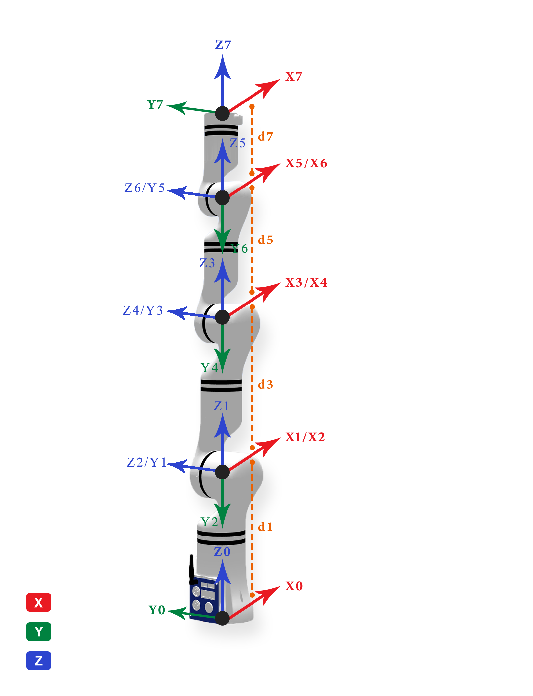
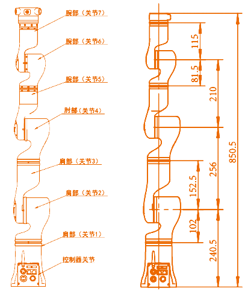
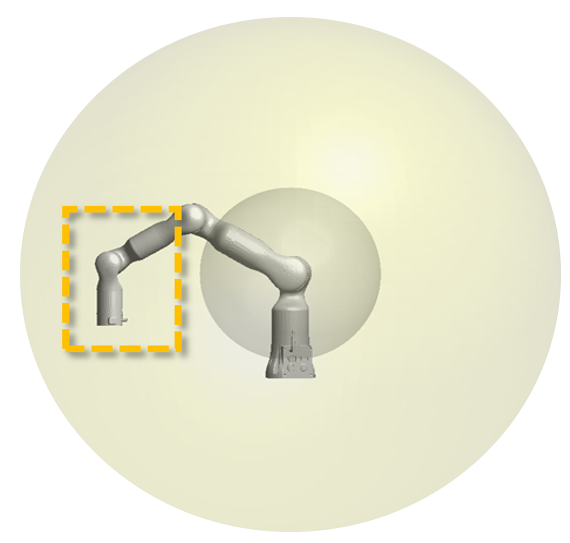
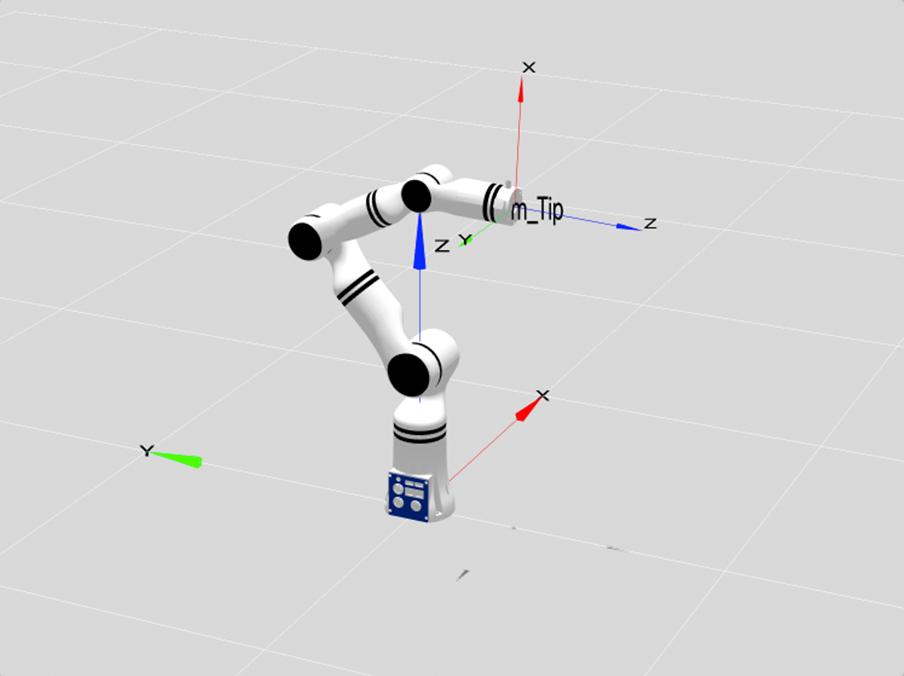
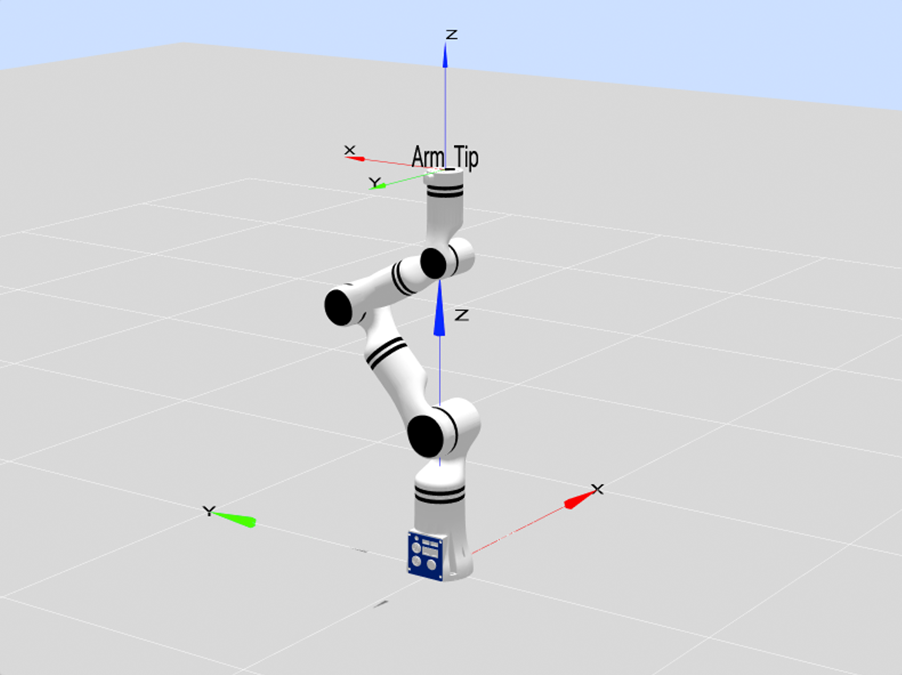
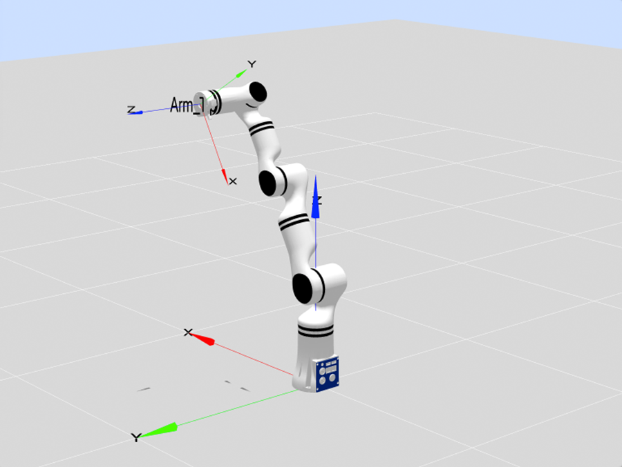
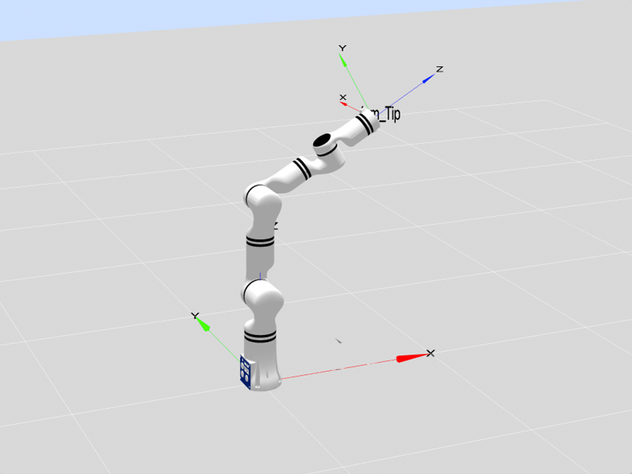
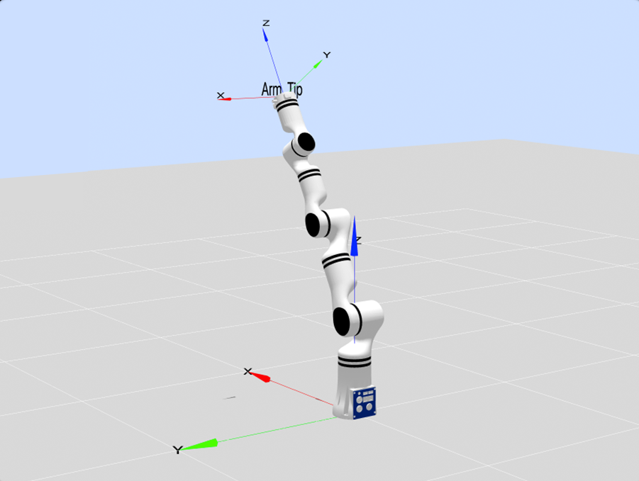
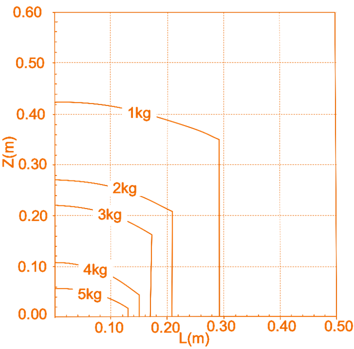
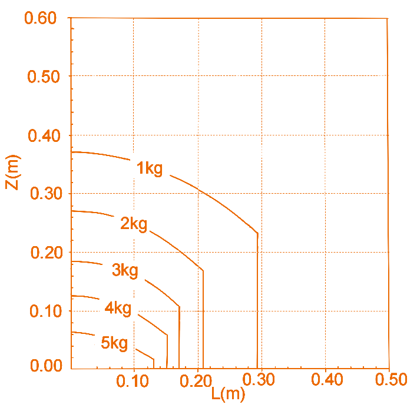

# 
本体参数：
RM75系列参数及D-H模型

## 基础参数

<table>
    <tr>
        <th colspan="2">参数名</th>
        <th>参数值</th>
    </tr>
    <tr>
        <th rowspan="13">基础参数</th>
        <th>自由度</th>
        <td>7</td>
    </tr>
    <tr>
        <th>构型</th>
        <td>仿人构型</td>
    </tr>
    <tr>
        <th>关节制动器形式</th>
        <td>1~4关节硬抱闸 5~7关节软抱闸</td>
    </tr>
    <tr>
        <th>工作半径/mm</th>
        <td>标准版：610  六维力L版：627 六维力K版：638.5</td>
    </tr>
    <tr>
        <th>有效负载/kg</th>
        <td>5</td>
    </tr>
    <tr>
        <th>自重/kg</th>
        <td>标准版：7.8 六维力版：7.9</td>
    </tr>
    <tr>
        <th>重复定位精度/mm</th>
        <td>±0.05</td>
    </tr>
    <tr>
        <th>TCP线速度/m/s</th>
        <td>≤1.8</td>
    </tr>
    <tr>
        <th>典型功率/W</th>
        <td>≤100</td>
    </tr>
    <tr>
        <th>峰值功率/W</th>
        <td>≤200</td>
    </tr>
    <tr>
        <th>安装角度</th>
        <td>任意角度</td>
    </tr>
    <tr>
        <th>底座尺寸/mm</th>
        <td>φ107</td>
    </tr>
    <tr>
        <th>材质</th>
        <td>铝合金/ABS</td>
    </tr>
    <tr>
        <th rowspan="3">环境适应性</th>
        <th>工作温度/℃</th>
        <td>0-45</td>
    </tr>
    <tr>
        <th>工作湿度</th>
        <td>25~85%无结露</td>
    </tr>
    <tr>
        <th>防护等级</th>
        <td>本体IP54</td>
    </tr>
    <tr>
        <th rowspan="7">运动角度范围/°</th>
        <th>J1</th>
        <td>-178~+178</td>
    </tr>
    <tr>
        <th>J2</th>
        <td>-130~+130</td>
    </tr>
    <tr>
        <th>J3</th>
        <td>-178~+178</td>
    </tr>
    <tr>
        <th>J4</th>
        <td>-135~+135</td>
    </tr>
    <tr>
        <th>J5</th>
        <td>-178~+178</td>
    </tr>
    <tr>
        <th>J6</th>
        <td>-128~+128</td>
    </tr>
    <tr>
        <th>J7</th>
        <td>-360~+360</td>
    </tr>
    <tr>
        <th rowspan="7">最大角速度/ °/s</th>
        <th>J1</th>
        <td>180</td>
    </tr>
    <tr>
        <th>J2</th>
        <td>180</td>
    </tr>
    <tr>
        <th>J3</th>
        <td>225</td>
    </tr>
    <tr>
        <th>J4</th>
        <td>225</td>
    </tr>
    <tr>
        <th>J5</th>
        <td>225</td>
    </tr>
    <tr>
        <th>J6</th>
        <td>225</td>
    </tr>
    <tr>
        <th>J7</th>
        <td>225</td>
    </tr>
    <tr>
        <th rowspan="2">力控指标（仅六维力支持）</th>
        <th>六维力量程</th>
        <td>200N/7N·m</td>
    </tr>
    <tr>
        <th>六维力精度</th>
        <td>±0.5%FS</td>
    </tr>
</table>

## 本体参数

**MDH模型坐标系：**

  

**RM75系列MDH参数(改进D-H参数)：**

|joint_id(i) |$a_{i-1}$(mm)|$\alpha_{i -1}$(°)|$d_i$(mm)|$θ_i$ / $offset_i$(°)|
|:--|:--|:--|:--|:--|
|   1   |   0   |   0    |  240.5 |  0  |
|   2   |   0   |   -90  |   0    |  0  |
|   3   |   0   |   90   |   256  |  0  |
|   4   |   0   |   -90  |   0    |  0  |
|   5   |   0   |   90   |   210  |  0  |
|   6   |   0   |   -90  |   0    |  0  |
|   7   |   0   |   90   | $d_7$  |  0  |

- RM75-B &nbsp;&nbsp;&nbsp;: $d_7=144$ mm
- RM75-6FB: $d_7=161.2$ mm
- RM75-6F &nbsp;: $d_7=172.5$ mm

说明: offset为机械零位与建模零位的偏差, 即`模型角度 = 关节角度 + offset`。

### RM75系列连杆动力学参数

|    joint_id(i)   |  1     |  2      |  3     |  4     |  5     |  6     |  7     |  -     |-|
|:--    |:--     |:--      |:--     |:--     |:--     |:--     |:--     |:--     |:--|
| **$m$**       | 1.574  | 1.217   | 1.11   | 0.685  | 0.619  | 0.602  | 0.107  | 0.248  |0.189|
| **$x$**       | 0.241  | -0.357  | 0.003  | -0.005 | 0.078  | -0.014 | -0.506 | -0.426 |-0.352|
| **$y$**       | -13.273 | -106.798 | -10.398 | -84.658 | -12.937 | -78.524 | 0.255  | 0.237  |-0.067|
| **$z$**       | -9.95  | 5.329   | -11.324 | 4.747  | -8.781 | 2.819  | -10.801 | -27.223 |-18.302|
| **$L_{xx}$**  | 2920.666 | 17404.207 | 2099.034 | 6204.576 | 778.615 | 4499.867 | 50.918 | 308.844 |133.613|
| **$L_{xy}$**  | 14.703 | -43.488 | 2.292  | -0.819 | 2.261  | -0.802 | -3.136 | -3.781 |0.522|
| **$L_{xz}$**  | -4.131 | -3.297  | -4.181 | -0.615 | -0.921 | -0.444 | -0.699 | -1.468 |1.623|
| **$L_{yy}$**  | 2476.942 | 927.428  | 1641.235 | 388.441 | 590.169 | 294.76 | 47.42  | 304.616 |130.260|
| **$L_{yz}$**  | -28.462 | 108.523 | -93.542 | 43.054 | -35.324 | 12.831 | 0.388  | 0.888  |0.531|
| **$L_{zz}$**  | 1727.926 | 17319.77 | 1182.557 | 6162.881 | 473.863 | 4478.261 | 60.35  | 122.62 |89.503|
| **备注**       |         |         |         |         |         |         | B      | 6F    |6FB|

说明:

- $m$为连杆质量, 单位为$kg$
- $x$为连杆质心x坐标, 单位为$mm$
- $y$为连杆质心y坐标, 单位为$mm$
- $z$为连杆质心z坐标, 单位为$mm$
- $L_{xx}$,$L_{xy}$,$L_{xz}$,$L_{yy}$,$L_{yz}$,$L_{zz}$ 为连杆坐标系下描述的主惯量, 单位为$kg·mm²$
- B: 标准版，6FB: 六维力L版，6F: 六维力K版

备注:

- 以上数据来源为CAD设计值
- 如需质心坐标系下的惯性参数, 使用平行移轴定理即可, 计算方法如下所述.

---

假设有一输出坐标系为坐标系$\{i\}$，对齐坐标系$\{i\}$的质心坐标系为 $\{c\}$，质心在坐标系$\{i\}$中的坐标为 $P_c = [x_c  ，y_c， z_c]^T$，则由平行移轴定理可得：

$$I_c = L_i - m (P_{c}^{T}P_cI_{3×3} - P_cP_{c}^{T})$$

式中:
$$
L_i = \begin{bmatrix}L_{xx} & L_{xy} & L_{xz} \\ L_{xy} & L_{yy} & L_{yz} \\ L_{xz} & L_{yz} & L_{zz}\end{bmatrix}
$$

### 关节分布和尺寸说明

RM75-B机器人本体模仿人的手臂，共有7个旋转关节，每个关节表示1个自由度。如下图所示，机器人关节包括肩部（关节1），肩部（关节2），肩部（关节3），肘部（关节4），腕部（关节5），腕部（关节6）和腕部（关节7）。

#### 工作空间

RM75-B运动范围，除去基座正上方和正下方的圆柱空间，工作范围为半径610mm的球体。选择机器人安装位置时，务必考虑机器人正上方和正下方的圆柱体空间，尽可能避免将工具移向圆柱体空间。另外，在实际应用中，关节1转动范围：±178°，关节2转动范围：±130°，关节3转动范围：±178°，关节4转动范围：±135°，关节5转动范围：±178°，关节6转动范围：±128°，关节7转动范围：±360°。  

机器人可达空间示意图

从工作空间截面上看，7轴机器人可操作度较好的区域如下图黄色框线示意，在工作空间中整体呈现一个环状区域。

可操作度较好的区域示意图
  

#### 运动奇异点  

##### 肩部奇异

腕部中心点C(关节6、7轴线交点)与1轴共线，示意点位[0,43.4,0,-105.7,0,-30,0]，如下图所示：

肩部奇异

关节1、7共轴，C与1轴共线的特殊情况，示意点位[0,43.4,0,-105.7,0,62.3,0]，如下图所示：

肩部奇异

##### 肘部奇异

Q4=0，即点位格式为[x,x, x,0,x,x,x]，示意点位[0,30,0,0,90,90,0]，如下图所示：

肘部奇异

q2=0,q4=0（q4=0的特殊情况），即点位格式为[x,0, x,0,x,x,x]，示意点位[0,0,0,0,90,90,0]，如下图所示：

肘部奇异

##### 腕部奇异

关节5、7共轴,q6=0,即点位格式为[x,x,x,x,x,0,x]，示意点位[0,30,0,60,90,0,0]，如下图所示：

腕部奇异

q2=0,q6=0（q6=0的特殊情况），即点位格式为[x,0,x,x,x,0,x]，示意点位[0,0,0,60,90,0,0]，如下图所示：

腕部奇异

q4=0,q6=0（q6=0的特殊情况），即点位格式为[x,x,x,0,x,0,x]，示意点位[0,30,0,0,90,0,0]，如下图所示：

腕部奇异

##### 边界奇异

机械臂末端到达最远端，此时q4=0,q6=0（q4=0的特殊情况）,即点位格式为[x,x,x,0,x,0,x]。示意点位[0,0,0,0,0,0]、[0,45,45,0,45,0,45]，如下图所示：

边界奇异1

边界奇异2

#### 负载曲线图

下图分别表示RM75-B、RM75-6F和RM75-6FB机械臂末端负载曲线图。其中L是末端负载的质心相对于末端法兰平面的径向距离，Z是相对于末端法兰平面的法向距离。

RM75-B机械臂末端负载曲线图

RM75-6F机械臂末端负载曲线图

RM75-6FB机械臂末端负载曲线图

