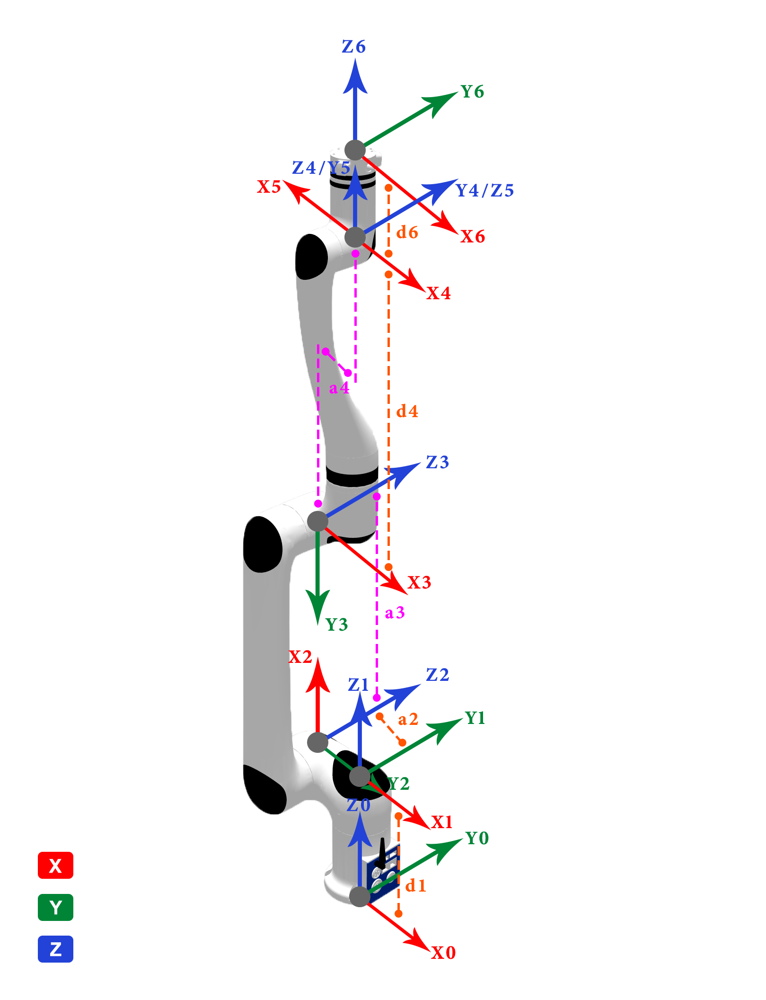
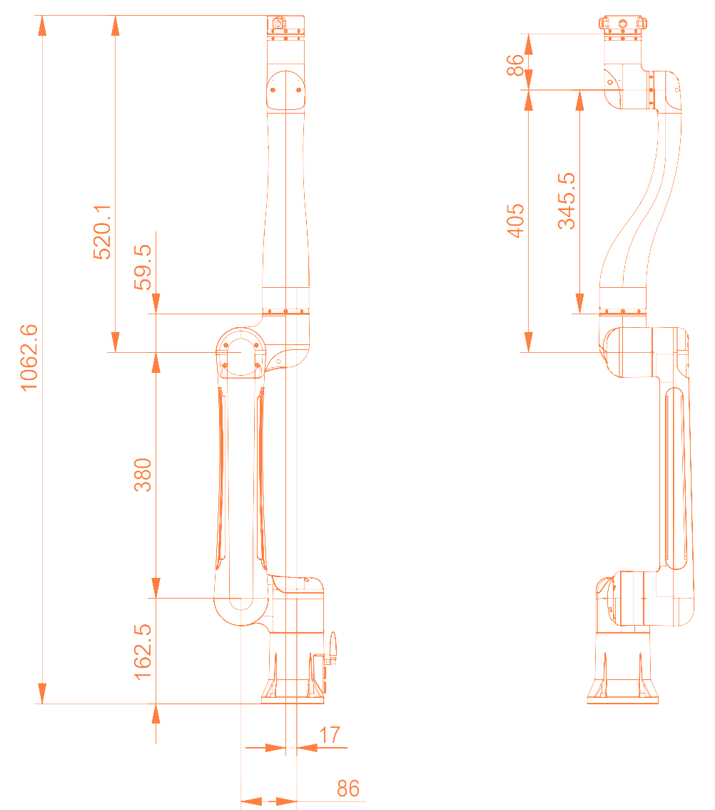
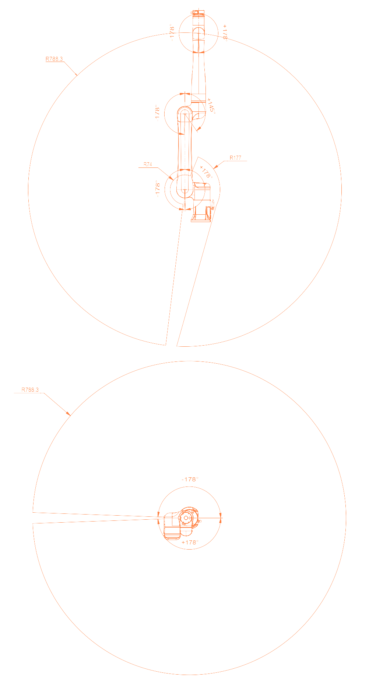
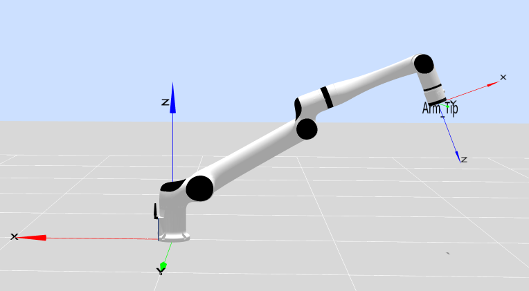
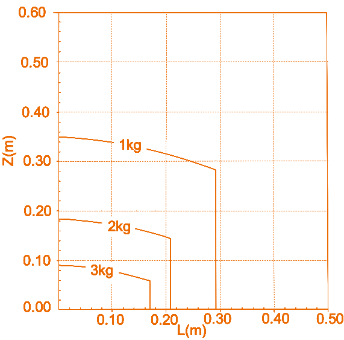

# 
本体参数：
RML63系列参数及D-H模型

## 基础参数

<table>
    <tr>
        <th colspan="2">参数名</th>
        <th>参数值</th>
    </tr>
    <tr>
        <th rowspan="13">基础参数</th>
        <th>自由度</th>
        <td>6</td>
    </tr>
    <tr>
        <th>构型</th>
        <td>仿人构型</td>
    </tr>
    <tr>
        <th>关节制动器形式</th>
        <td>1~4关节硬抱闸 5~6关节软抱闸</td>
    </tr>
    <tr>
        <th>工作半径/mm</th>
        <td>标准版：900 六维力L版：917 六维力K版：928.5</td>
    </tr>
    <tr>
        <th>有效负载/kg</th>
        <td>3</td>
    </tr>
    <tr>
        <th>自重/kg</th>
        <td>标准版：10 六维力版：10.1</td>
    </tr>
    <tr>
        <th>重复定位精度/mm</th>
        <td>±0.05</td>
    </tr>
    <tr>
        <th>TCP线速度/m/s</th>
        <td>≤2.8</td>
    </tr>
    <tr>
        <th>典型功率/W</th>
        <td>≤100</td>
    </tr>
    <tr>
        <th>峰值功率/W</th>
        <td>≤200</td>
    </tr>
    <tr>
        <th>安装角度</th>
        <td>任意角度</td>
    </tr>
    <tr>
        <th>底座尺寸/mm</th>
        <td>φ107</td>
    </tr>
    <tr>
        <th>材质</th>
        <td>铝合金/ABS</td>
    </tr>
    <tr>
        <th rowspan="3">环境适应性</th>
        <th>工作温度/℃</th>
        <td>0-45</td>
    </tr>
    <tr>
        <th>工作湿度</th>
        <td>25~85%无结露</td>
    </tr>
    <tr>
        <th>防护等级</th>
        <td>本体IP54</td>
    </tr>
    <tr>
        <th rowspan="6">运动角度范围/°</th>
        <th>J1</th>
        <td>-178~+178</td>
    </tr>
    <tr>
        <th>J2</th>
        <td>-178~+178</td>
    </tr>
    <tr>
        <th>J3</th>
        <td>-178~+145</td>
    </tr>
    <tr>
        <th>J4</th>
        <td>-178~+178</td>
    </tr>
    <tr>
        <th>J5</th>
        <td>-178~+178</td>
    </tr>
    <tr>
        <th>J6</th>
        <td>-360~+360</td>
    </tr>
    <tr>
        <th rowspan="6">最大角速度/ °/s</th>
        <th>J1</th>
        <td>180</td>
    </tr>
    <tr>
        <th>J2</th>
        <td>180</td>
    </tr>
    <tr>
        <th>J3</th>
        <td>225</td>
    </tr>
    <tr>
        <th>J4</th>
        <td>225</td>
    </tr>
    <tr>
        <th>J5</th>
        <td>225</td>
    </tr>
    <tr>
        <th>J6</th>
        <td>225</td>
    </tr>
    <tr>
        <th rowspan="2">力控指标（仅六维力支持）</th>
        <th>六维力量程</th>
        <td>200N/7N·m</td>
    </tr>
    <tr>
        <th>六维力精度</th>
        <td>±0.5%FS</td>
    </tr>
</table>

## 本体参数

**MDH模型坐标系：**

  

**RML63系列MDH参数(改进D-H参数)：**

|关节编号(i)|$a_{i-1}$(mm)|$\alpha_{i -1}$(°)|$d_i$(mm)|$θ_i$ / $offset_i$(°)|
|:--|:--|:--|:--|:--|
|   1   |   0     |   0    |  $d_1$|  0   |
|   2   |   -86   |   -90  |   0   |  -90 |
|   3   |   380   |   0    |   0   |  90  |
|   4   |   69    |   90   |   405 |  0   |
|   5   |   0     |   -90  |   0   |  180 |
|   6   |   0     |   -90  | $d_6$ |  180 |

- RML63II &nbsp;&nbsp;&nbsp;&nbsp;&nbsp;&nbsp;: $d_1=172$ mm
- RML63III &nbsp;&nbsp;&nbsp;&nbsp;&nbsp;: $d_1=162.5$ mm
- RML63-B &nbsp;&nbsp;&nbsp;&nbsp;: $d_6=115.1$ mm
- RML63-6FB : $d_6=132.3$ mm
- RML63-6F &nbsp;&nbsp;: $d_6=143.6$ mm

说明:

- offset为机械零位与建模零位的偏差, 即`模型角度 = 关节角度 + offset`。
- RML63系列机械臂分为II型和III型两个版本，主要区别点在于关节1的长度不同。

### RML63系列连杆动力学参数

**RML63II**：

|   joint_id(i)     |  1      |  2      |  3      |  4       |  5      |  6      |  -      |-|
|:--        |:--      |:--      |:--      |:--       |:--      |:--      |:--      |:--|
| **$m$**       | 1.837   | 2.006   | 1.961   | 1.201    | 1.026   | 0.107   | 0.248   |0.189|
| **$x$**       | -68.442 | 166.7   | 33.399  | 0        | -0.031  | -0.506  | -0.426  |-0.352|
| **$y$**       | -23.913 | -0.002  | -29.498 | -35.177  | 30.146  | 0.255   | 0.237   |-0.067|
| **$z$**       | -6.938  | -92.59  | -17.697 | -184.4   | -12.341 | -10.801 | -27.223 |-18.302|
| **$L_{xx}$**  | 3462.129 | 18664.833 | 6432.819 | 53007.563 | 2732.466 | 50.918 | 308.844 |133.613|
| **$L_{xy}$**  | -3765.305 | -0.587  | 3869.875 | -0.04    | -2.123  | -3.136  | -3.781  |0.522|
| **$L_{xz}$**  | -46.206  | 30804.14 | 17.607  | 0.087    | 0.374   | -0.699  | -1.468  |1.623|
| **$L_{yy}$**  | 12643.164 | 103568.483 | 7094.216 | 50754.293 | 829.793 | 47.42 | 304.616 |130.260|
| **$L_{yz}$**  | -50.044  | -0.287  | -17.611 | -5089.754 | -2.288  | 0.388   | 0.888   |0.531|
| **$L_{zz}$**  | 13576.758 | 86722.559 | 9257.063 | 2874.631 | 2384.323 | 60.35  | 122.62  |89.503|
| **备注**       |         |         |         |         |         | B       | 6F      |6FB|

**RML63III**：

|   joint_id(i)     |  1      |  2      |  3      |  4       |  5      |  6      |  -      |-|
|:--        |:--      |:--      |:--      |:--       |:--      |:--      |:--      |:--|
| **$m$**       | 1.598   | 2.990   | 1.357   | 1.864    | 1.023   | 0.107   | 0.248   |0.189|
| **$x$**       | -12.900 | 109.800   | 14.400  | -0.100    | 0.100  | -0.506  | -0.426  |-0.352|
| **$y$**       | 0.100 | 0.100  | -5.600 | -23.000  | 32.600  | 0.255   | 0.237   |-0.067|
| **$z$**       | -29.800  | -67.200  | -29.400 | -236.200   | -15.200 | -10.801 | -27.223 |-18.302|
| **$L_{xx}$**  | 3150.724 | 16728.188 | 3116.708 | 128352.380 | 3299.439 | 50.918 | 308.844 |133.613|
| **$L_{xy}$**  | -18.047 | -17.784  | 508.850 | -4.255    | -1.019  | -3.136  | -3.781  |0.522|
| **$L_{xz}$**  | -13.564  | 26077.237 | -1.031  | -52.273   | 0.0317   | -0.699  | -1.468  |1.623|
| **$L_{yy}$**  | 4867.960 | 102753.087 | 4083.881 | 125960.777 | 1008.186 | 47.42 | 304.616 |130.260|
| **$L_{yz}$**  | 6.612  | 12.608  | 3.755 | -4630.083 | 0.336  | 0.388   | 0.888   |0.531|
| **$L_{zz}$**  | 2833.691 | 88450.085 | 2455.232 | 3681.884 | 2745.436 | 60.35  | 122.62  |89.503|
| **备注**       |         |         |         |         |         | B       | 6F      |6FB|

说明:

- $m$为连杆质量, 单位为$kg$
- $x$为连杆质心x坐标, 单位为$mm$
- $y$为连杆质心y坐标, 单位为$mm$
- $z$为连杆质心z坐标, 单位为$mm$
- $L_{xx}$,$L_{xy}$,$L_{xz}$,$L_{yy}$,$L_{yz}$,$L_{zz}$ 为连杆坐标系下描述的主惯量, 单位为$kg·mm²$
- B: 标准版，6FB：六维力L版，6F: 六维力K版

备注:

- 以上数据来源为CAD设计值
- 如需质心坐标系下的惯性参数, 使用平行移轴定理即可, 计算方法如下所述.

---

假设有一输出坐标系为坐标系$\{i\}$，对齐坐标系$\{i\}$的质心坐标系为 $\{c\}$，质心在坐标系$\{i\}$中的坐标为 $P_c = [x_c  ，y_c， z_c]^T$，则由平行移轴定理可得：

$$I_c = L_i - m (P_{c}^{T}P_cI_{3×3} - P_cP_{c}^{T})$$

式中:
$$
L_i = \begin{bmatrix}L_{xx} & L_{xy} & L_{xz} \\ L_{xy} & L_{yy} & L_{yz} \\ L_{xz} & L_{yz} & L_{zz}\end{bmatrix}
$$

### 关节分布和尺寸说明

RML63-B机器人本体模仿人的手臂，共有6个旋转关节，每个关节表示1个自由度。如下图所示，机器人关节包括肩部（关节1），肩部（关节2），肘部（关节3），腕部（关节4），腕部（关节5）和腕部（关节6）。

RML63II-B

RML63III-B

#### 工作空间

RML63-B运动范围，除去基座正上方和正下方的圆柱空间，工作范围为半径900mm的球体。选择机器人安装位置时，务必考虑机器人正上方和正下方的圆柱体空间，尽可能避免将工具移向圆柱体空间。另外，在实际应用中，关节1转动范围：±178°，关节2转动范围：±178°，关节3转动范围：-178°~+145°，关节4转动范围：±178°，关节5转动范围：±178°，关节6转动范围：±360°。

机器人可达空间示意图
  

#### 运动奇异点  

##### 肩部奇异

腕部中心点在通过1轴轴线且平行2轴轴线的平面上，示意点位[0,-34.85,72.738,0,-35,0]，如下图所示：

肩部奇异

##### 肘部奇异

腕部中心点在关节2、3轴组成的平面上，示意点位[0,-60,-9.684,0,-90,0]，如下图所示：

肘部奇异

##### 腕部奇异

关节4、6共轴,q5=0,即点位格式为[x,x,x,x,0,x]，示意点位[0,60,30,0,0,0]，如下图所示：

腕部奇异

##### 边界奇异

机械臂末端到达最远端，q3=-9.683的特殊情况,即点位格式为[x,x,-9.683,x,0,x]。示意点位[0,0,-9.683,0,0,0]、[-90,-45,-9.683,0,0,0]、[-90,-90,-9.683,0,0,0]，如下图所示：

边界奇异1

边界奇异2

边界奇异3

#### 负载曲线图

下图分别表示RML63-B、RML63-6F和RML63-6FB机械臂末端负载曲线图。其中L是末端负载的质心相对于末端法兰平面的径向距离，Z是相对于末端法兰平面的法向距离。

RML63-B机械臂末端负载曲线图

RML63-6F机械臂末端负载曲线图

RML63-6FB机械臂末端负载曲线图

