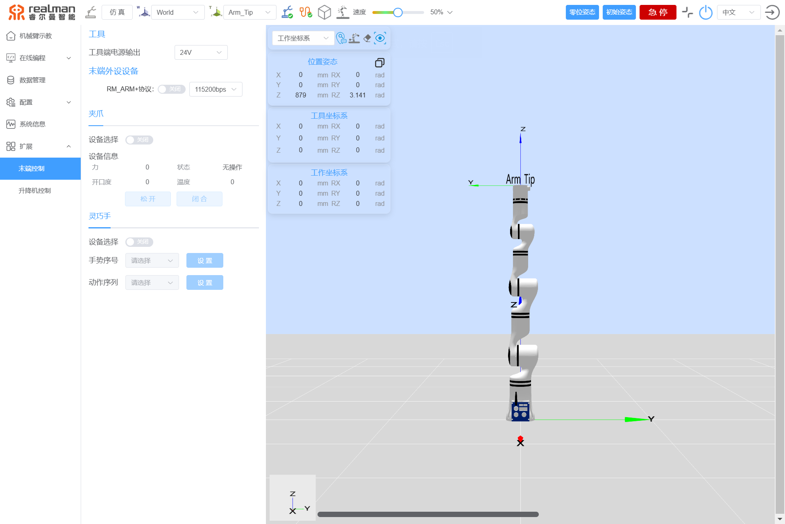
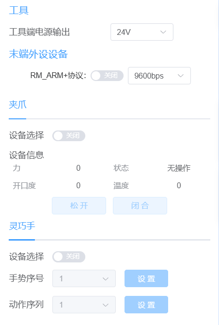
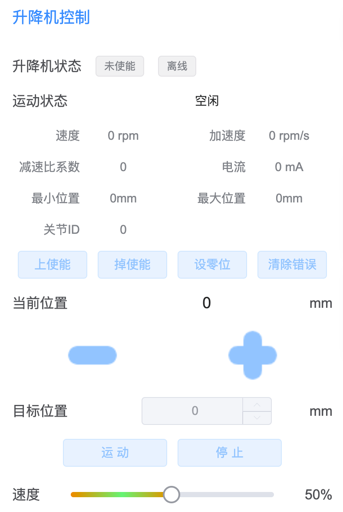

# 
入门指南：
机械臂扩展

在示教器的扩展界面可对末端工具进行配置如下图所示：

扩展界面示意图

## 末端控制

在示教器的扩展界面可对末端工具进行管理，支持切换工具端对外的输出电压，通过RM_ARM+协议自动识别末端工具，以及对末端手爪进行简单的控制，如下图所示：

  

末端工具控制界面

电源输出：该部分可配置末端接口板对外的输出电源，可配置为0V，12V和24V，当电源输出为0V时，页面置灰不可设置。 

末端外设设备：目前支持通过RM_ARM+协议自动识别外设设备或工具端默认添加的夹爪和灵巧手控制外设设备。

- **RM_ARM+协议未开启时**：用户可以设置夹爪或者灵巧手，旧协议无法获取末端接入的设备信息。
  - **夹爪控制**：安装夹爪并勾选夹爪，且当夹爪状态为使能和在线时，支持查看夹爪当前状态参数，以及进行`松开`和`闭合`控制；
  - **灵巧手控制**：安装灵巧手并勾选灵巧手后，可通过设置灵巧手的`手势序号`和`动作序列`，来设置手势和动作。此处手势序号和动作序列为灵巧手内定义的手势和动作。
- **当开启RM_ARM+协议时**：自主适配当前接入的末端并显示对应操作界面，末端生态协议支持列表正在测试验收中，待后续补充。
  - **末端生态**：当安装生态末端并开启RM_ARM+协议时，系统自动识别并呈现生态设备状态、设备信息，并支持通过滑杆设置目标位置、目标角度、目标力、目标速度等参数。

## 升降机控制、拓展关节控制

在示教器的扩展界面可对升降机控制进行参数配置如下图所示。可对当前位置进行上升或下降，也可以设置目标位置后点击“运动”按钮使升降机到达目标高度。

  

升降机控制

在示教器的扩展界面可对拓展关节进行控制，参数配置如下图所示：

升降机参数设置

在连接拓展关节后会显示当前速度、加速度、电流、最大最小限位、减速比系数。为了防止关节在连接上后有错误，请在连接后先清除关节错误，再点击上使能。拓展关节可向正向运动或者反向运动。可设置目标角度运动，在下方可调节拓展关节运动速度。
