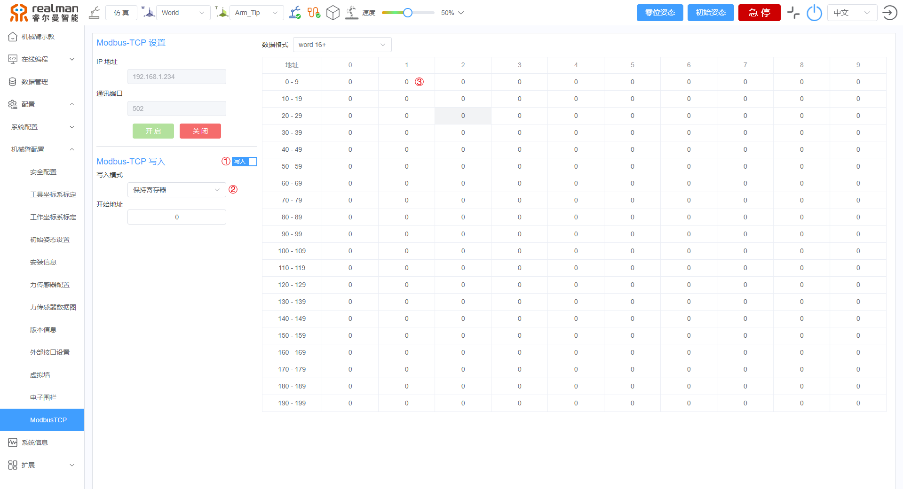
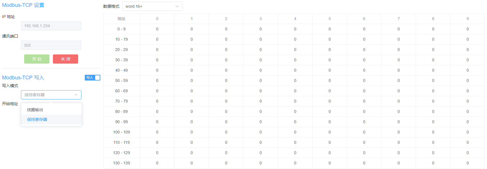
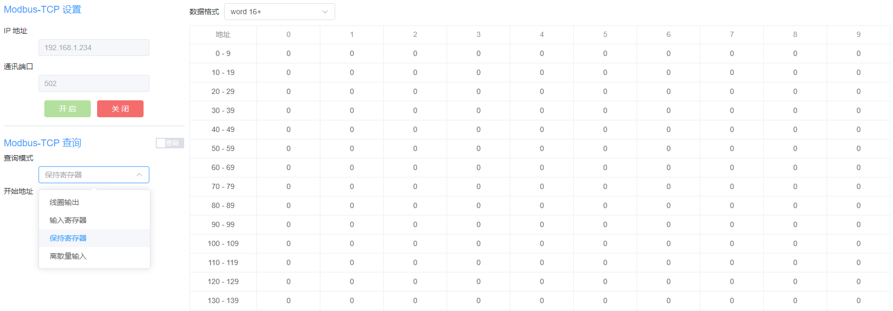
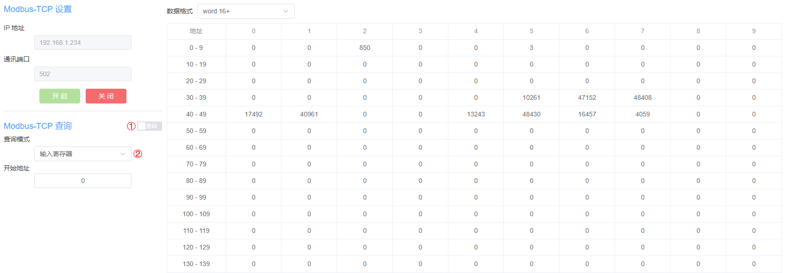
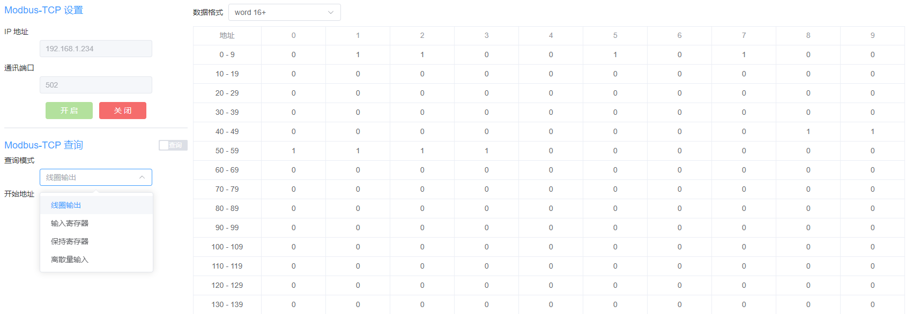
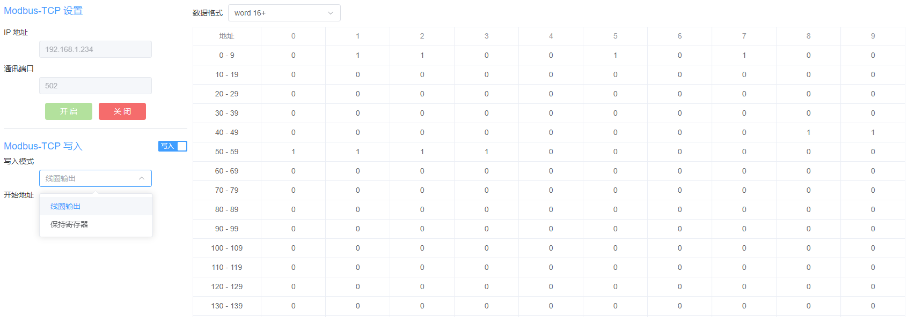
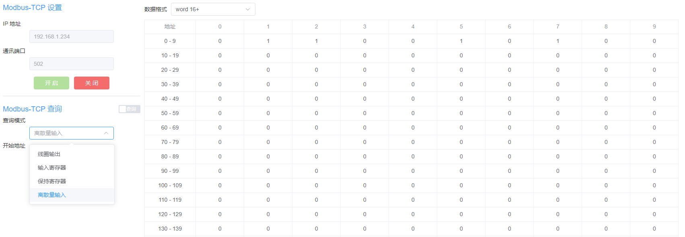

# 
入门指南：
MODBUS-TCP功能

RM65 第三代控制器机械臂可以通过MODBUS-TCP协议直接调用WEB示教器保存的编程文件，也可直接控制或者查询机械臂状态。
 

- **Modbus-TCP设置：** 显示连接设备的默认地址和通信接口，当需要使用MODBUS-TCP功能时，请点击`开启`完成MODBUS-TCP功能开启；当使用完毕后，请点击`关闭`完成MODBUS-TCP功能关闭。
- **Modbus-TCP查询/写入：** 可根据需要点击切换按钮，切换查询模式和写入模式，同时支持根据需要选择寄存器开始地址。
  - **查询模式：** 可根据需要查询机械臂当前数据，包括线圈输出、输入寄存器、保持寄存器和离散量输入。
  - **写入模式：** 可根据需要写入寄存器，包括线圈输出和保持寄存器。
  - **开始地址：** 设置查询寄存器的起始地址，可仅显示起始地址之后的寄存器数据，不设置时，显示全部的寄存器地址的数据。
- **数据显示格式切换：** 在寄存器查询结果中，可根据需要切换数据的显示格式，目前支持word16+、deline+/-和hex三种。

## 调用在线编程文件

使用Modbus-TCP协议，可以调用数据管理中保存的图形化编程文件。

**调用步骤：**

1. 在Modbus-TCP设置页面，点击`开启`开启MODBUS-TCP功能。
2. 选择`写入模式`中`保持寄存器`，并点击寄存器地址为1的值，如下图所示。
    
3. 在弹出的`写入`对话框中填写调用的图形化编程文件编号，并点击`写入`完成调用。
    

## 控制机械臂

- 当用户选择`写入模式`中的`保持寄存器`，可使用modbus-TCP协议在对应寄存器内写入角度、位置、姿态，控制机械臂移动。
    
- 当用户选择`查询模式`中的`保持寄存器`，可查询机械臂当前数据。
    
- 具体地址参数值说明，请参考[保持寄存器指令集](../../modbus/index.md#13保持寄存器)。

## 获取机械臂当前状态

用户选择`查询模式`中的`输入寄存器`可查询机械臂当前数据。具体地址参数值说明，请参考[输入寄存器指令集](../../modbus/index.md#14输入寄存器)。

## IO线圈输出

- 当用户选择`查询模式`中的`线圈输出`，可根据在地址栏中的参数值，获取IO模式的输入或者输出状态。
    
- 当用户选择`写入模式`中的`线圈输出`，可根据需要修改地址栏中的参数值，修改IO模式的输入或者输出状态。
    
- 具体地址参数值说明，请参考[线圈输出寄存器指令集](../../modbus/index.md#11线圈)。

## IO离散量输入

当用户选择`查询模式`中的`离散量输入`，可以通过参数值来读取当前机械臂状态。具体地址参数值说明，请参考[离散量输入寄存器指令集](../../modbus/index.md#12离散输入)。

