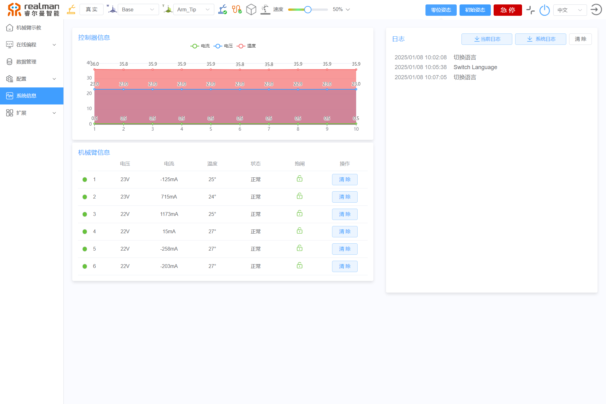

# 
入门指南：
机械臂系统信息

系统信息包括控制器状态和关节状态，以及系统日志，报错信息等。

1. 系统信息：包括控制器的输入电压、输出电流、温度、位姿和错误代码。
2. 机器人信息：包括6个关节的电压、电流、温度、使能状态和错误代码。当关节错误排除后，需要点击清除按钮清除错误代码后，才可给关节上使能控制关节运动。
3. 系统日志：包含示教器的所有操作指令和机器人、控制器的错误类型，并带有时间戳在文本框内显示。点击`下载当前日志`可将当前日志信息保存到本地。点击`下载系统日志`可下载机械臂全部日志到本地，支持所有程序的完整日志下载。点击`清除`会清空所有显示的系统日志。

系统信息示意图

