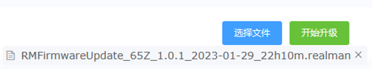
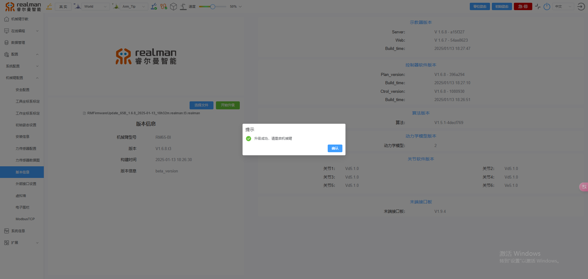

# 
入门指南：
机械臂系统升级

机器人控制器的系统程序可在示教器中 **“配置-->机械臂配置-->版本信息”** 页面进行升级（升级前请确认是否可以升级对应版本，否则可能发生严重问题）。 
具体操作步骤如下：

1. 将厂家提供的 **.realman** 后缀的文件下载到本地；
2. 点击`选择文件`按钮，在弹出的窗口中找到并选择上一步保存的文件。选择成功后文件名会显示在按钮下方，如下图所示；

选择文件

3. 点击`开始升级`按钮，页面弹出升级进度条提示，等待升级成功（文件较大时升级时间可能需要4-5min，请耐心等待）；

升级进度

4. 升级成功后，示教器页面会弹窗提示，控制器会发出连续提示音，此时重启控制器，机器人即可正常工作。

升级成功提示

::: warning 注意
更新控制器程序注意事项：机器人更新程序结束之后，需重启机械臂并且打开WEB示教器，进入到示教器首页之后按下Ctrl+F5进行浏览器强制刷新，清理缓存。此时更新完毕的机械臂及WEB示教器即可正常使用。
:::
