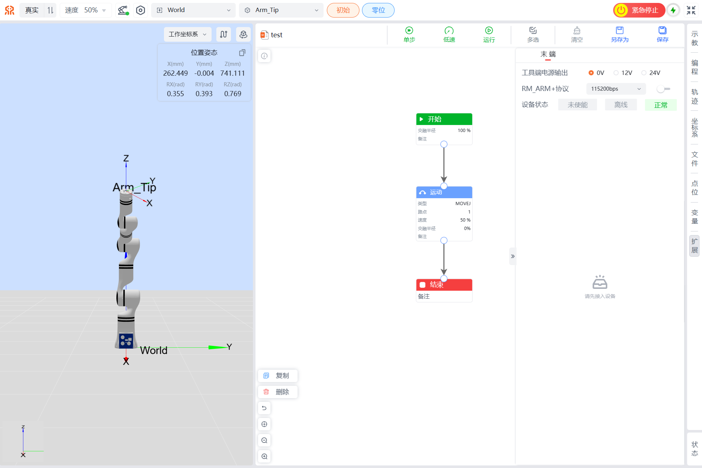
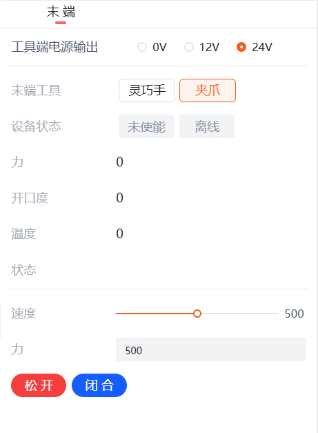
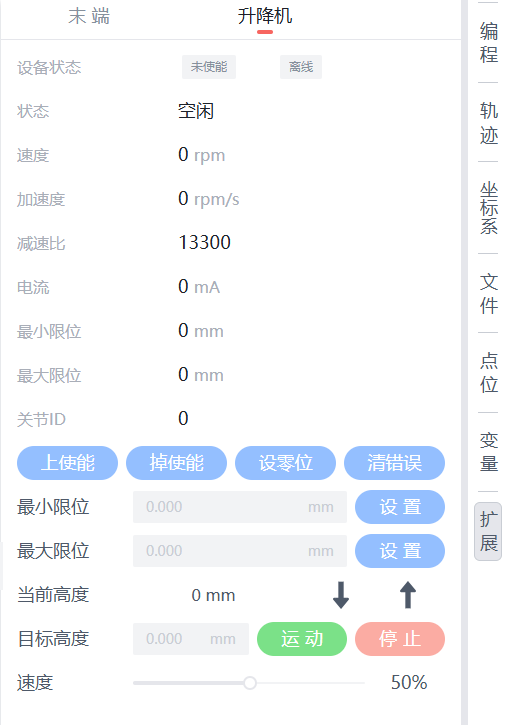
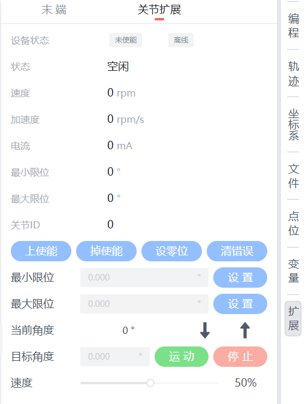

# 
入门指南：
机械臂扩展

在示教器的扩展界面可对末端工具进行配置如下图所示：

扩展界面示意图

## 末端控制

在示教器的扩展界面可对末端工具进行管理，支持切换工具端对外的输出电压，以及对末端手爪进行简单的控制，如下图所示：

末端工具控制界面

- **工具端电源输出**：该部分可配置末端接口板对外的输出电源，可配置为0V，12V和24V。
- **末端外设设备**：目前支持工具端默认添加的夹爪和灵巧手控制外设设备。
  - **夹爪控制**：安装夹爪并勾选夹爪，且当夹爪状态为使能和在线时，支持查看夹爪当前状态参数，以及进行`松开`和`闭合`控制；
  - **灵巧手控制**：安装灵巧手并勾选灵巧手后，可通过设置灵巧手的`手势序号`和`动作序列`，来设置手势和动作。此处手势序号和动作序列为灵巧手内定义的手势和动作。

    

    
末端工具灵巧手控制界面

    

    
末端工具夹爪控制界面

## 升降机控制、扩展关节控制

在示教器的扩展界面可对升降机控制进行参数配置如下图所示。可对当前位置进行上升或下降，也可以设置目标位置后点击`运动`按钮使升降机到达目标高度。

升降机控制

在示教器的扩展界面可对扩展关节进行控制，参数配置如下图所示：

扩展关节参数设置

在连接扩展关节后会显示当前设备状态、状态、速度、加速度、电流、最大最小限位、关节ID。为了防止关节在连接上后有错误，请在连接后先清除关节错误，再点击上使能。扩展关节可向正向运动或者反向运动。可设置目标角度运动，在下方可调节扩展关节运动速度。
