# <p class="hidden">应用集成案例: </p> 自主打磨工作站

## 一、 项目概述

<div align="center"> 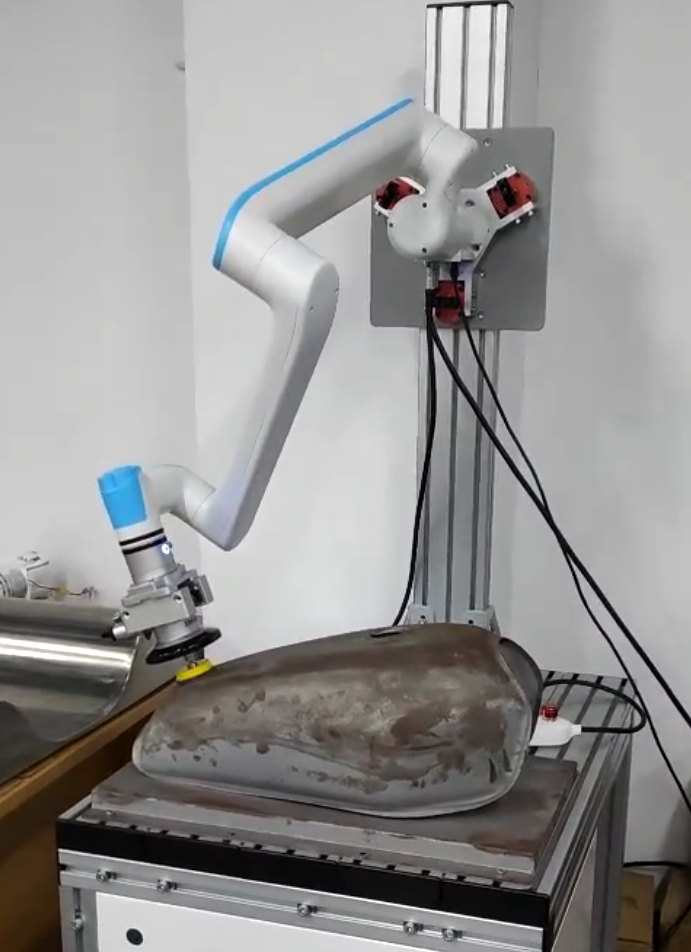 </div>

### 1.1 项目背景与目标

随着工业自动化的快速发展，对高精度和高效率的制造工艺需求日益增长。特别是在金属加工和制造业中，打磨是提高产品质量和外观的关键步骤。传统的人工打磨方式存在效率低下、成本高、质量不稳定以及对工人健康构成威胁等问题。为了解决这些问题，我们提出了自主打磨工作站v1.0项目，旨在通过集成先进的机器人技术、智能控制算法和机器视觉系统，实现打磨作业的自动化和智能化。

**项目目标：**

* **自动化打磨：** 实现打磨作业的完全自动化，减少人工干预，提高生产效率和一致性。

* **质量提升：** 通过精确控制打磨力度和路径，提升打磨质量，减少产品缺陷率。

* **成本节约：** 降低人工成本和材料消耗，提高企业的经济效益。

* **健康安全：** 减少工人接触有害粉尘和噪音的风险，改善工作环境。

* **灵活性和适应性：** 使工作站能够适应不同形状和材料的工件，提高生产线的灵活性。

* **环境友好：** 通过优化打磨过程，减少能源消耗和废弃物产生，实现绿色制造。

* **技术领先：** 引入力位混合控制和姿态混合控制技术，保持技术领先，提升市场竞争力。

通过实现这些目标，自主打磨工作站v1.0项目将为企业带来革命性的生产方式，推动制造业向更高效、更智能的方向发展。

### 1.2 核心功能

自主打磨工作站v1.0的核心功能是实现工业制造过程中的自动化打磨任务，提高生产效率和产品质量。以下是工作站的主要核心功能：

* **自动化打磨**：

  1. **快速设定打磨轨迹**：工作站能够通过预先设定打磨轨迹的起点与终点自动识别待打磨工件的轨迹和曲度特征。

  2. **连续作业**：在无人干预的情况下，连续完成多个工件的打磨任务。

* **精确定位**：
  1. **高精度传感器**：利用高精度力传感器，实现工件的精确定位。

* **力位混合控制**：

  1. **力控制**：通过力传感器实时监测打磨力度，确保均匀且适度的打磨。

  2. **位置控制**：精确控制机器人末端执行器的位置，以实现精确的打磨轨迹。

* **姿态混合控制**：

  1. **多自由度调整**：机器人具备多个自由度，能够根据工件的形状和位置调整姿态。

  2. **复杂曲面适应**：能够适应复杂曲面的打磨需求，实现全方位、无死角的打磨。

* **模块化编程**：

  1. **易于编程**：采用模块化编程方法，使得程序易于编写和修改。

  2. **快速部署**：模块化设计使得新任务的部署和调整更加快速和灵活。

* **安全监控**：

  1. **紧急停止**：在检测到异常情况时，能够通过按钮进行立即停止打磨作业，确保人员和设备安全。

  2. **状态监控**：通过示教器进行实时监控设备状态，包括温度、磨损和能耗等，以预防故障和事故。

这些核心功能共同构成了自主打磨工作站的技术基础，使其能够在各种工业应用中提供高效、精确的打磨服务。

### 1.3 技术亮点

* **力位混合控制技术**：<br>
    这项技术结合了力控制和位置控制，使得机器人在执行打磨任务时能够同时考虑力度和位置的精确控制，提高打磨的精度和效率。

* **姿态混合控制**：<br>
    结合机器人的姿态调整，使得工作站能够适应不同形状和角度的工件表面，实现全方位、无死角的打磨。

* **模块化编程**：<br>
    采用模块化编程方法，使得程序易于编写、修改和维护，同时能够快速适应不同的打磨需求和任务。

这些技术亮点体现了自主打磨工作站v1.0在自动化、精确性和灵活性方面的优势，旨在提高工业制造过程中的打磨效率和质量，同时降低人工成本和操作风险。通过这些技术的应用，工作站能够更好地适应多变的生产环境，满足不同客户的需求。

### 1.4  更新日志

|  更新日期  |            更新内容            | 版本号 |
| :--------: | :----------------------------: | :----: |
| 2024/12/19 | 自主打磨工作站项目初始版本发布 | v1.0.0 |

## 二、 硬件环境

本项目必须使用六维力类型机械臂为基础才能实现，请确保机械臂为六维力类型。

### 2.1 硬件基础功能

* **末端打磨工具**：用于打磨曲面工件等，该设备通过机械臂末端的控制板进行信号控制。结合机械臂末端的力传感设备，通过感受曲面特征，自主调整该工具的姿态。
* **睿尔曼机械臂**：通过由RM控制器的控制信号控制各个电机运动，最终得到机械臂整体运动效果。
* **24V电源模块**：为整个控制系统提供电源。
* **RM控制器**：通过网口有线连接，之后通过示教器、C++程序接口、Python程序接口等控制机械臂执行相应动作。与此同时也将获取机械臂各个模块状态信息实现机械臂状态监控功能。

### 2.2 硬件通讯框架

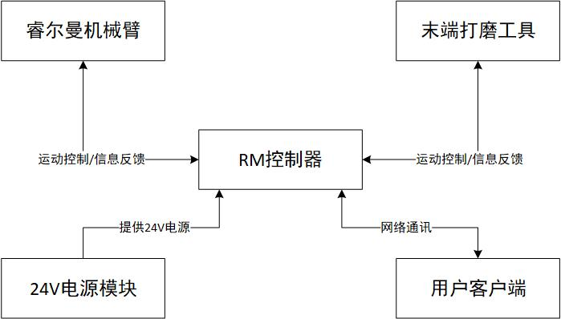

## 三、 软件环境

* **示教器控制方式**
  1. **系统版本**：所有
  2. **系统架构**：X86/ARM64
* **程序接口控制方式**
  1. **接口工具**：Python/C++
  2. **版本要求**：Python3.9+

## 四、 准备阶段

通过外接PC设备访问RM控制器。

1. 根据需要配置外接PC设备`IP`；
2. 通过`PING 机械臂IP`即：`ping 192.168.xxx.xxx`测试是否与机械臂连接成功（`机械臂IP`出场默认值为`192.168.1.18`）；
3. 如果是示教器控制则在浏览器搜索框中输入机械臂控制器IP，如果是通过接口控制则需编写Python/C++源代码。

### 4.1 配置用户IP

* **示教器连接**

可通过网口或WIFI连接机械臂，具体连接方式可参考[示教器连接](../../../robot/quickUseManual/index.md#4.示教器连接)。

* **连接测试**

  1. 通过Win+R快捷方式打开运行窗口，输入cmd命令后回车打开终端。

     <div align="center"> 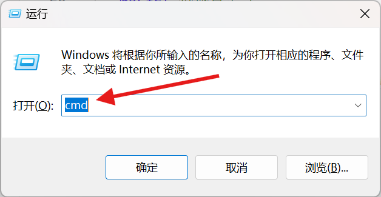 </div>

  2. 通过ping机械臂IP（默认）测试网络相互访问是否成功。

     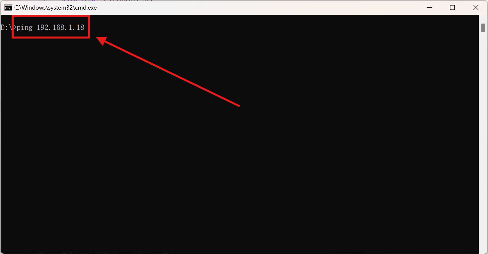

### 4.2 六维力标定

由于案例中要采用六维力传感器感知周围环境数据，所以不可避免地需要对机械臂末端六维力传感器进行标定，从而避免末端打磨工具对六维力传感器感知的影响，具体标定过程如下。

1. 进入示教器主页面，点击**配置** > **机械臂配置** > **力传感器配置**进入力传感器配置页面。
2. 请参考[力传感器标定](../../../robot/teachingPendant/setting/index.md#力传感器标定)中的`六维力标定`进行标定操作。<br>
    **注**：<br>

    - 标定时为防止机械臂发生碰撞，尽量将机械臂或工作站移动至相对空旷位置。
    - 使用用户根据机械臂实际安装状态和机械臂末端工作范围自定义点位进行标定，自定义标定点位在设计时需要满足姿态差异明显的要求（机械臂末端在4个自定义标定点位的Z轴不共面），自定义标定点位可以参考机械臂末端Z轴朝上、X轴朝上、X轴朝下和Z轴朝下进行设计。

    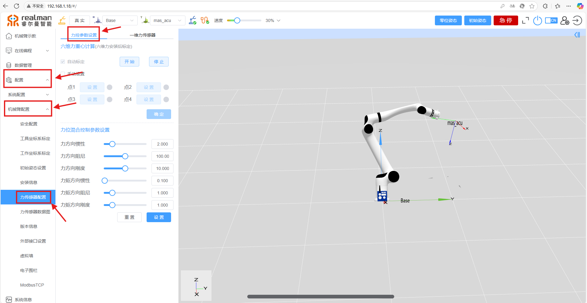
    <center>自动标定</center>

    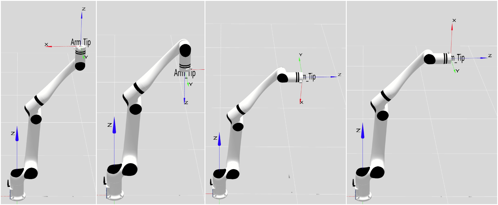
    <center>自动标定</center>

### 4.3 全局路点设置

**注**：本案例共需设置四个全局路点，分别为Initial点（打磨之前的初始点位）、Point_1点（某次循环打磨中的开始点位）、Point_2点（某次循环打磨中的结束点位）和Point_3点（本次打磨的结束点位）。由于算法基于工具坐标系z轴作为力跟踪+姿态自适应基准线，所以需将末端工具坐标系配置成打磨接触面的法向方向，同时z轴方向指向接触面，如下图所示。

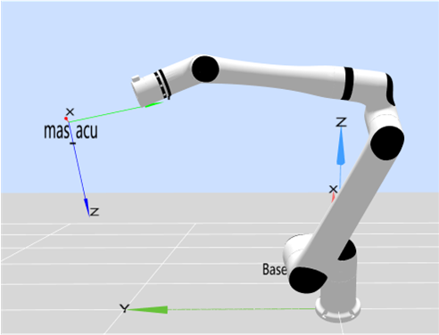

全局路点具体设置过程如下所示：

1. 进入示教器主页，点击**数据管理**进入数据管理页面，并点击**全局点位**进入全局点位页签，然后点击右上方绿色加号。

    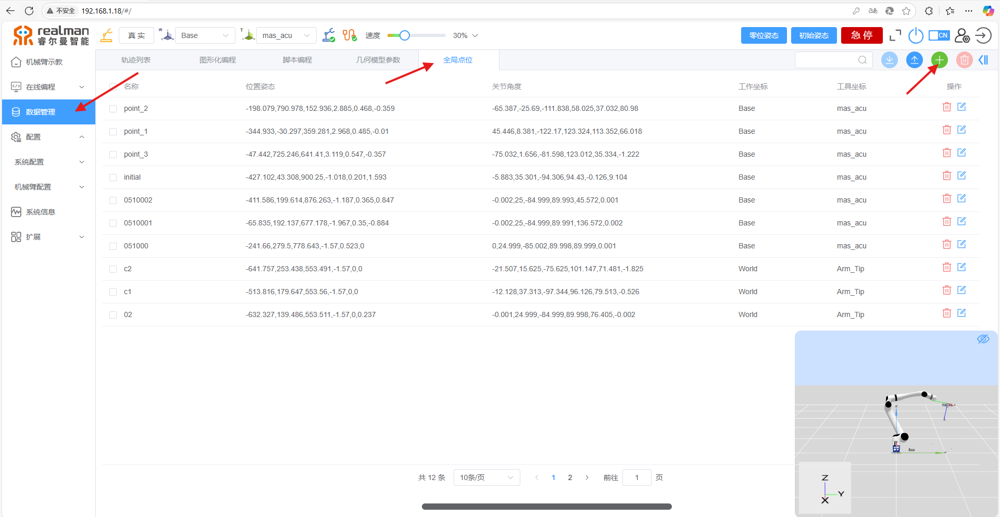

2. 点击右下方蓝色眼睛图标，打开三维仿真空间便于观察设置的全局路点状态，红色的为目标状态，保存前需点击应用将机械臂移动至相应位置。

    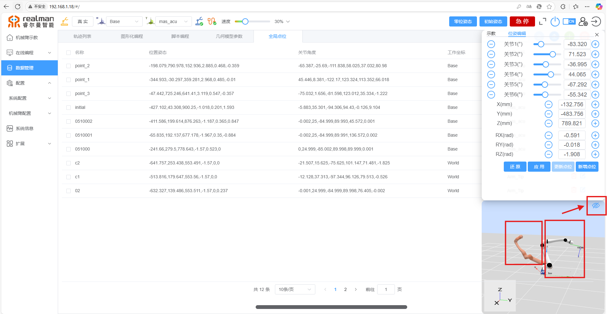

3. 点击**新增点位**按钮，完成全局路点命名并保存。

### 4.4 工具坐标系设置

机械臂自动标定功能因多数打磨头的非标准结构无法适配，需手动标定工具坐标系。

**手动标定流程**：

1. 进入示教器主页，在左侧菜单栏选择**配置**>**机械臂配置**>**工具坐标系标定**，进入工具坐标系标定页面。
2. 点击**手动设置**进入手动标定页面。
3. 填写工具坐标系名称，并根据当前打磨头的实际物理尺寸（长度、直径、安装偏移量等）填写参数，点击**下一步**完成标定。

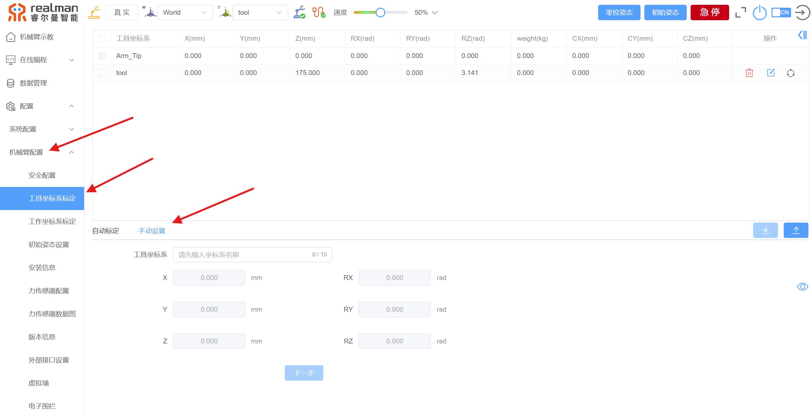

### 4.5 编程控制

用户通过C++/Python程序对于该案例进行二次开发时，请参考[附录相关资源获取](#4443)完成API2接口库下载并根据控制方法选择下载对应的案例源文件。

然后根据控制方法参照如下描述应用案例源文件：

* 图形化编程实例：将下载的文件通过**在线编程** > **图形化编程** > **文件导入**（左上角）步骤，上传至示教器使用。

     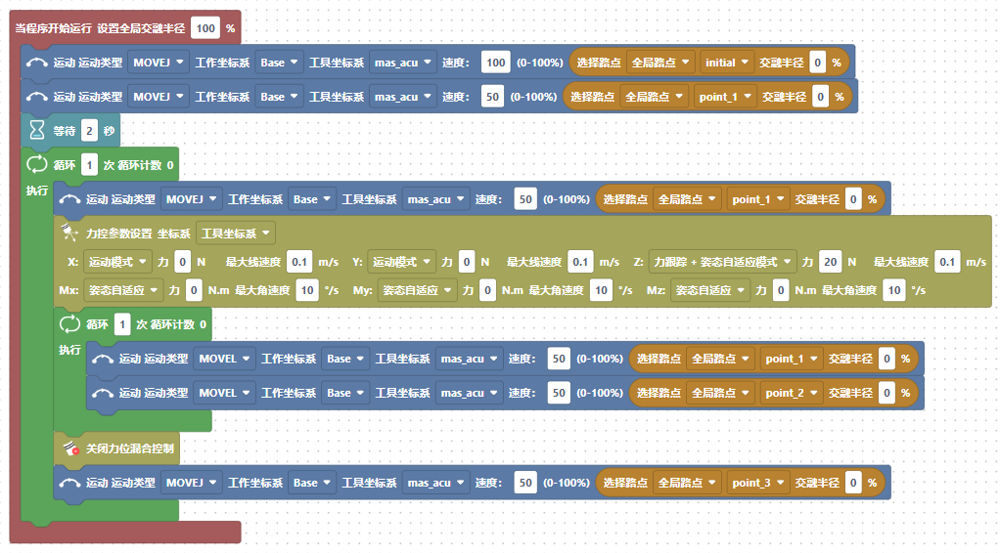

* Python编程案例：请将案例源文件存放在将要编写的Python源码目录下，并进行编译配置。编译成功之后直接启动生成的可执行文件即可（案例文件结构如下所示）：

```tree
文件结构
  ├─Python_Sandling
  │   └─Sanding_Demo.py  <- Python案例脚本
  └─Robotic_Arm
      ├─libs
      │  ├─linux_arm
      │  ├─linux_x86
      │  ├─win_32
      │  └─win_64
      └─__pycache__
```

Python案例分析：

```python
# Sanding_Demo.py

import sys
import os
import time

sys.path.append(os.path.abspath(os.path.join(os.path.dirname(__file__), '..')))

from Robotic_Arm.rm_robot_interface import *


class Sanding_Demo:

    def __init__(self, mode: rm_thread_mode_e=None, speed: float=0.3):
        # 实例化机械臂控制线程个数
        self._arm = RoboticArm(mode)

        # 连接机械臂, 打印连接id
        self._arm.rm_create_robot_arm("192.168.1.18", 8080)

        print("Algorithm library version:", self._arm.rm_algo_version())
        print("*******Algorithm version: v1.0.0*******")

        # 设置执行次数
        self.times = 0
        self.speed = speed

        # 控制机械臂到局部路径点
        self._arm.rm_movej(self._arm.rm_get_given_global_waypoint("initial")[1]["joint"], int(100 * self.speed), 0, 0, True)
        self._arm.rm_movej(self._arm.rm_get_given_global_waypoint("point_1")[1]["joint"], int(50 * self.speed), 0, 0, True)
    
    def run(self, times: int=10):
        # 机械臂规划到路径点
        self._arm.rm_movej(self._arm.rm_get_given_global_waypoint("point_1")[1]["joint"], int(50 * self.speed), 0, 0, True)
        
        # 配置力位混合控制形参，在力跟踪＋姿态自适应的情况下，Rx、Ry、Rz需设置成固定模式，由此，API自动将其识别成姿态自适应模式。
        param = rm_force_position_t(1, 1, (3, 3, 8, 0, 0, 0), (0, 0, 20, 0, 0, 0), (0.1, 0.1, 0.1, 10, 10, 10))
        
        # 开启力位混合控制
        if self._arm.rm_set_force_position_new(param):
            return False
        
        _times = 0
        # 循环打磨
        while _times < times:
            self._arm.rm_movel(self._arm.rm_get_given_global_waypoint("point_1")[1]["pose"], int(50 * self.speed), 0, 0, True)
            self._arm.rm_movel(self._arm.rm_get_given_global_waypoint("point_2")[1]["pose"], int(50 * self.speed), 0, 0, True)
            _times += 1

        # 关闭力位混合控制
        if not self._arm.rm_stop_force_position():
            self._arm.rm_movej(self._arm.rm_get_given_global_waypoint("point_3")[1]["joint"], int(50 * self.speed), 0, 0, True)
            self.times += 1
            return True
        else:
            return False

    def __del__(self):
        # 删除机械臂实例
        self._arm.rm_delete_robot_arm()
        # 撤销所有线程
        self._arm.rm_destory()

if __name__=='__main__':
    # 初始化设备
    robot = Sanding_Demo(rm_thread_mode_e.RM_TRIPLE_MODE_E)

    # 设置延时
    time.sleep(2)

    # 循环控制打磨工件数
    while robot.times < 1:
        # 设置内部循环打磨同一工件次数
        if not robot.run(1):
            break
```

* C++编程案例：请将案例源文件存放在指定位置，并建立C++源文件对其进行引用与编译配置。编译成功之后直接启动生成的可执行文件即可（案例文件结构如下所示）：

```tree
文件结构
  ├─CPP_Sanding
  │  ├─Sanding_Demo.cpp  <- C++案例源文件
  │  └─output
  ├─include
  │  ├─rm_define.h
  │  ├─rm_interface_global.h
  │  ├─rm_interface.h
  │  └─rm_service.h
  ├─linux
  │  ├─linux_arm64_c++_v1.0.4
  │  └─linux_x86_c++_v1.0.4
  └─windows
     ├─win_mingw64_c++_v1.0.4
     ├─win_x64_c++_v1.0.4
     └─win_x86_c++_v1.0.4
```

C++案例分析：

```C++
// Sanding_Demo.cpp

#include <iostream>
#include <unistd.h>
#include <vector>
#include "rm_interface.h"

using namespace std;

class Sanding_Demo
{
private:
    rm_robot_handle *arm_handle;
    // rm_waypoint_t *pose[4];
    vector<rm_waypoint_t*> pose;
    float speed;
public:
    int times;

    bool Run(int times);
    Sanding_Demo(rm_thread_mode_e mode);
    Sanding_Demo(rm_thread_mode_e mode, float speed);
    ~Sanding_Demo();
};

Sanding_Demo::Sanding_Demo(rm_thread_mode_e mode): times(0), speed(0.3)
{
    // 输出api版本号
    char *version = rm_api_version();
    printf("api version: %s\n", version);

    // 初始化线程模式
    if (rm_init(mode)) {
        printf("Thread mode initialization failed!");
        return;
    }

    // 初始化点位
    for (int index = 0; index < 4; index++) {
        pose.push_back(new rm_waypoint_t());
    }

    // 连接机械臂
    arm_handle = rm_create_robot_arm("192.168.1.18", 8080);
    if(arm_handle->id == -1) {
        rm_delete_robot_arm(arm_handle);
        printf("Arm connect err...\n");
    }
    else if(arm_handle != NULL) {
        printf("Connect success,arm id %d\n",arm_handle->id);
    }

    /* 控制机械臂到局部路径点 */ 
    //得到局部点位
    if (rm_get_given_global_waypoint(arm_handle, "initial", pose[0]) || 
        rm_get_given_global_waypoint(arm_handle, "point_1", pose[1]) ||
        rm_get_given_global_waypoint(arm_handle, "point_2", pose[2]) ||
        rm_get_given_global_waypoint(arm_handle, "point_3", pose[3])) {
        return;
    }
    else if (rm_movej(arm_handle, pose[0]->joint, int(100 * this->speed), 0, 0, true) || 
        rm_movej(arm_handle, pose[1]->joint, int(50 * this->speed), 0, 0, true)) {
        printf("Movej actions execution failed!");
    }
    else {
        printf("Action initialization succeessful!");
    }
}

// 重构构造函数
Sanding_Demo::Sanding_Demo(rm_thread_mode_e mode, float speed): times(0), speed(speed)
{
    // 输出api版本号
    char *version = rm_api_version();
    printf("api version: %s\n", version);

    // 初始化线程模式0
    if (rm_init(mode)) {
        printf("Thread mode initialization failed!");
        return;
    }

    // 连接机械臂
    arm_handle = rm_create_robot_arm("192.168.1.18", 8080);
    if(arm_handle->id == -1) {
        rm_delete_robot_arm(arm_handle);
        printf("Arm connect err...\n");
    }
    else if(arm_handle != NULL) {
        printf("Connect success,arm id %d\n",arm_handle->id);
    }

    /* 控制机械臂到局部路径点 */ 
    //得到局部点位
    if (rm_get_given_global_waypoint(arm_handle, "initial", pose[0]) || 
        rm_get_given_global_waypoint(arm_handle, "point_1", pose[1]) ||
        rm_get_given_global_waypoint(arm_handle, "point_2", pose[2]) ||
        rm_get_given_global_waypoint(arm_handle, "point_3", pose[3])) {
        return;
    }
    else if (rm_movej(arm_handle, pose[0]->joint, int(100 * this->speed), 0, 0, true) || 
        rm_movej(arm_handle, pose[1]->joint, int(50 * this->speed), 0, 0, true)) {
        printf("Movej actions execution failed!");
    }
    else {
        printf("Action initialization succeessful!");
    }
}

Sanding_Demo::~Sanding_Demo()
{
    // 删除机械臂实例
    rm_delete_robot_arm(arm_handle);
    // 撤销所有线程
    rm_destory();
}

bool Sanding_Demo::Run(int times)
{
    // 机械臂规划到路径点
    rm_movej(arm_handle, pose[1]->joint, int(50 * this->speed), 0, 0, true);

    /* 开启力位混合控制模式，在力跟踪＋姿态自适应的情况下，Rx、Ry、Rz需设置成固定模式，由此，API自动将其识别成姿态自适应模式。*/ 
    // 参数配置
    rm_force_position_t param = {
        1,  // 传感器：一维力（0），六维力（1）
        1,  // 力坐标系：基坐标系（0），工具坐标系（1）
        {3, 3, 8, 0, 0, 0},  // 各轴力矩模式数组
        {0, 0, 20, 0, 0, 0},  // 各轴的期望力/力矩数组
        {0.1, 0.1, 0.1, 10, 10, 10}  // 各轴的最大线速度/最大角速度限制数组
    };
    // 开启模式
    if (rm_set_force_position_new(arm_handle, param)) {
        return false;
    }

    // 循环打磨
    int _times = 0;
    while (_times < times) {
        rm_movel(arm_handle, pose[1]->pose, int(50 * this->speed), 0, 0, true);
        rm_movel(arm_handle, pose[2]->pose, int(50 * this->speed), 0, 0, true);
        _times++;
    }
    
    // 关闭力位混合控制
    if (!rm_stop_force_position(arm_handle)) {
        rm_movej(arm_handle, pose[3]->joint, int(50 * this->speed), 0, 0, true);
        this->times++;
        return true;
    } else {
        return false;
    }
}


int main() {
    // 初始化设备
    Sanding_Demo robot(RM_TRIPLE_MODE_E);
    
    // 设置延迟
    sleep(2);

    // 循环控制打磨工件数
    while (robot.times < 1) {
        // 设置内部循环打磨同一工件次数
        if (!robot.Run(1)) {
            break;
        }
    }
    
    system("pause");
    return 0;
}
```

## 五、 算法功能介绍

自主打磨工作站，其主要工作场景是针对于曲面工件。曲面力跟踪场景中，假如没有姿态自适应将会导致末端工件与曲面接触不贴合。而传统的工作方法为解决此问题需要采用很多点去拟合曲面，这将会导致调试工作量极大，打磨效率极低的问题发生。

对此基于我司各系列机械臂推出恒力跟踪姿态自适应算法，将会完美解决此问题的发生。只需给定A到B两个点，机械臂将自适应曲面变化，自主调整姿态并保持末端工具对接触面进行恒力跟踪。

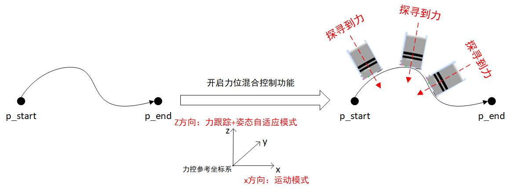

此模式下，只能在力控参考坐标系的Z方向开启，并且力控参考坐标系必须为工具坐标系。开启该模式之后，力控参考坐标系的Rx、Ry、Rz方向设置的任何模式都将不生效。该模式对坐标轴维持给定的期望力/力矩，并且力控参考坐标系的Rx、Ry和Rz方向的姿态可以根据接触环境的变化进行自动调整。

该模式主要应用于末端工具接触的环境为复杂曲面或未知形状的恒力跟踪场景中。当机械臂末端工具接触的曲面有变化时，机械臂末端会根据曲面形状的变化主动调整姿态，从而与接触环境紧密贴合。姿态自适应技术允许用户使用少量的示教点位，且不需要太关注示教点位的姿态就能实现与复杂曲面紧密贴合的恒力跟踪作业。

## 六、 算法接口说明

### 6.1 Python接口说明

* **设置力位混合控制函数**
  * **函数原型**

  ```python
  rm_set_force_position_new(self, param: rm_force_position_t) -> int
  ```

  * **参数说明**

  | 名称    | 类型                  | 说明               |
  | :------ | :-------------------- | :----------------- |
  | `param` | `rm_force_position_t` | 力位混合控制参数。 |

  **rm_force_position_t：**

  | 属性名          | 类型  | 说明                                                         |
  | :-------------- | :---- | :----------------------------------------------------------- |
  | `mode`          | `int` | 0-工作坐标系力控，1-工具坐标系力控。                         |
  | `sensor`        | `int` | 传感器：0-一维力，1-六维力。                                 |
  | `control_mode`  | `int` | 6个方向（Fx Fy Fz Mx My Mz）的模式 0-固定模式 1-浮动模式 2-弹簧模式 3-运动模式 4-力跟踪模式 8-力跟踪+姿态自适应模式（模式8只对工具坐标系的Fz方向有效）。 |
  | `desired_force` | `int` | 力控轴维持的期望力/力矩，力控轴的力控模式为力跟踪模式时，期望力/力矩设置才会生效 ，单位N。 |
  | `limit_vel`     | `int` | 力控轴的最大线速度和最大角速度限制，只对开启力控方向生效。（x、y、z）轴的最大线速度，单位为m/s，（rx、ry、rz）轴的最大角速度单位为°/s。 |

  * **返回值: 函数执行的状态码**

  | 值   | 类型  | 说明                                                     |
  | :--- | :---- | :------------------------------------------------------- |
  | 0    | `int` | 成功。                                                   |
  | 1    | `int` | 控制器返回false，参数错误或机械臂状态发生错误。          |
  | -1   | `int` | 数据发送失败，通信过程中出现问题。                       |
  | -2   | `int` | 数据接收失败，通信过程中出现问题或者控制器长久没有返回。 |
  | -3   | `int` | 返回值解析失败，接收到的数据格式不正确或不完整。         |

  * **使用示例**

  ```python
  from Robotic_Arm.rm_robot_interface import *

  # 实例化RoboticArm类
  arm = RoboticArm(rm_thread_mode_e.RM_TRIPLE_MODE_E)

  # 创建机械臂连接，打印连接id
  handle = arm.rm_create_robot_arm("192.168.1.18", 8080)
  print(handle.id)

  arm.rm_movej_p([0.2, 0, 0.3, 3.142, 0, 0], 20, 0, 0, 1)
  param = rm_force_position_t(1, 1, (3, 3, 8, 0, 0, 0), (0, 0, 20, 0, 0, 0), (0.1, 0.1, 0.1, 10, 10, 10))
  for i in range(3):
      result1 = arm.rm_movel([0.2, 0, 0.3, 3.142, 0, 0], 20, 0, 0, 1)
      result2 = arm.rm_set_force_position_new(param)
      result3 = arm.rm_movel([0.3, 0, 0.3, 3.142, 0, 0], 20, 0, 0, 1)

  arm.rm_stop_force_position()
  arm.rm_delete_robot_arm()
  ```

* **结束力位混合控制函数**

  * **方法原型**

  ```python
  rm_stop_force_position(self) -> int
  ```

  * **返回值:** 函数执行的状态码

  | 值   | 类型  | 说明                                                     |
  | :--- | :---- | :------------------------------------------------------- |
  | 0    | `int` | 成功。                                                   |
  | 1    | `int` | 控制器返回false，参数错误或机械臂状态发生错误。          |
  | -1   | `int` | 数据发送失败，通信过程中出现问题。                       |
  | -2   | `int` | 数据接收失败，通信过程中出现问题或者控制器长久没有返回。 |
  | -3   | `int` | 返回值解析失败，接收到的数据格式不正确或不完整。         |

### 6.2 C++接口说明

* **设置力位混合控制函数**
  * **方法原型**

  ```c++
  int rm_set_force_position_new(rm_robot_handle * handle, rm_force_position_t param)
  ```

  * **参数说明**

  | 参数     | 类型                  | 说明               |
  | :------- | :-------------------- | :----------------- |
  | `handle` | `rm_robot_handle`     | 机械臂句柄。       |
  | `param`  | `rm_force_position_t` | 力位混合控制参数。 |

  **rm_robot_handle：**

  | 属性名 | 类型  | 说明                              |
  | :----- | :---- | :-------------------------------- |
  | `id`   | `int` | 连接成功id大于0，连接失败返回-1。 |

  **rm_force_position_t：**

  | 属性名          | 类型  | 说明                                                         |
  | :-------------- | :---- | :----------------------------------------------------------- |
  | `mode`          | `int` | 0-工作坐标系力控，1-工具坐标系力控。                         |
  | `sensor`        | `int` | 传感器：0-一维力，1-六维力。                                 |
  | `control_mode`  | `int` | 6个方向（Fx Fy Fz Mx My Mz）的模式 0-固定模式 1-浮动模式 2-弹簧模式 3-运动模式 4-力跟踪模式 8-力跟踪+姿态自适应模式（模式8只对工具坐标系的Fz方向有效）。 |
  | `desired_force` | `int` | 力控轴维持的期望力/力矩，力控轴的力控模式为力跟踪模式时，期望力/力矩设置才会生效 ，单位N。 |
  | `limit_vel`     | `int` | 力控轴的最大线速度和最大角速度限制，只对开启力控方向生效。（x、y、z）轴的最大线速度，单位为m/s，（rx、ry、rz）轴的最大角速度单位为°/s。 |

  * **返回值: 函数执行的状态码**

  | 值   | 类型  | 说明                                                     |
  | :--- | :---- | :------------------------------------------------------- |
  | 0    | `int` | 成功。                                                   |
  | 1    | `int` | 控制器返回false，参数错误或机械臂状态发生错误。          |
  | -1   | `int` | 数据发送失败，通信过程中出现问题。                       |
  | -2   | `int` | 数据接收失败，通信过程中出现问题或者控制器长久没有返回。 |
  | -3   | `int` | 返回值解析失败，接收到的数据格式不正确或不完整。         |

  * **使用实例**

  ```c++
  rm_force_position_t param = {
      1, // 传感器：一维力（0），六维力（1）
      1, // 力坐标系：基坐标系（0），工具坐标系（1）
      {3, 3, 8, 0, 0, 0}, // 各轴力矩模式数组
      {0, 0, 20, 0, 0, 0}, // 各轴的期望力/力矩数组
      {0.1, 0.1, 0.1, 10, 10, 10} // 各轴的最大线速度/最大角速度限制数组
  };

  rm_set_force_position_new(robot_handle, param);
  ```

* **结束力位混合控制函数**

  * **方法原型**

  ```c++
  int rm_stop_force_position(rm_robot_handle * handle)
  ```

  * **返回值:** 函数执行的状态码

  | 值   | 类型  | 说明                                                     |
  | :--- | :---- | :------------------------------------------------------- |
  | 0    | `int` | 成功。                                                   |
  | 1    | `int` | 控制器返回false，参数错误或机械臂状态发生错误。          |
  | -1   | `int` | 数据发送失败，通信过程中出现问题。                       |
  | -2   | `int` | 数据接收失败，通信过程中出现问题或者控制器长久没有返回。 |
  | -3   | `int` | 返回值解析失败，接收到的数据格式不正确或不完整。         |

## 七、 视频演示

<video controls width="480" height="640"> 
    <source src="https://ik.imagekit.io/Realman/Video/%E4%BE%A7%E6%96%B9%E5%90%91.mp4?updatedAt=1737339200306">
</video>

## <div id = '4443'>附录：相关资源获取</div>

* [API2接口库](../../../robot/download/redevelopment/index.md)
* [图形化编程实例下载](https://github.com/RealManRobot/Autonomous_Grinding_Workstation/tree/master/files/resource)
* [Python二次开发API+实例下载](https://github.com/RealManRobot/Autonomous_Grinding_Workstation/tree/master/files/resource)
* [Python二次开发接口说明](../../../robot/apipython/classes/roboticArm/index.md)
* [C++二次开发API+实例下载](https://github.com/RealManRobot/Autonomous_Grinding_Workstation/tree/master/files/resource)
* [C++二次开发接口说明](../../../robot/apic/classes/roboticArm/index.md)
* [用户手册](../../../robot/download/userManual/index.md)
